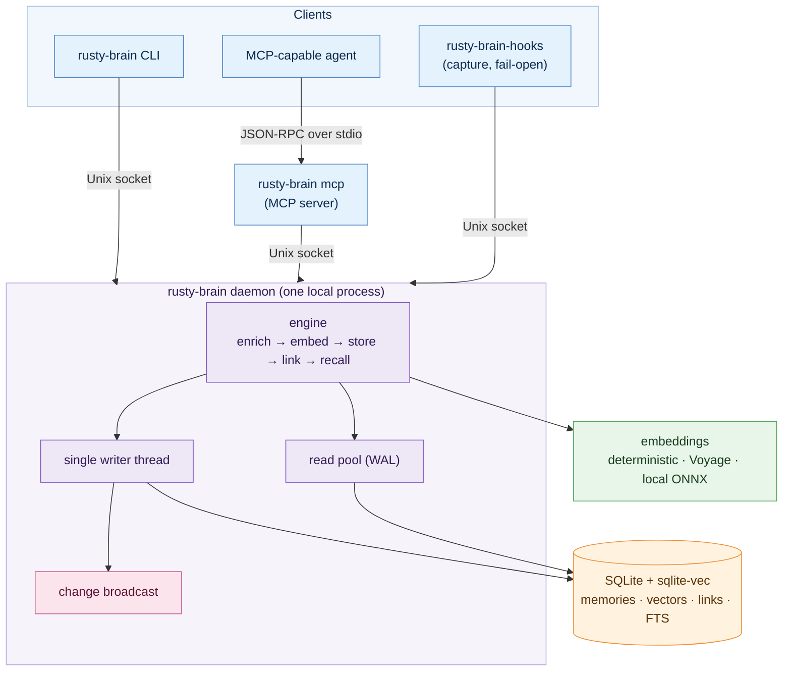

# rusty-brain

> Local-first, persistent memory for AI coding agents — a Rust daemon with hybrid
> (vector + keyword + graph) retrieval over SQLite, exposed via MCP and a CLI.
>
> **Status: early development.** The pieces described below are implemented and
> covered by unit and integration tests, but the project has only had **basic
> correctness testing**. It has **not** been performance-, scale-, or
> capability-tested, and retrieval quality has not been measured against real
> embedding models at any meaningful corpus size. Treat it as a work in progress,
> not a finished product. Interfaces and on-disk format may change.

## What it is

`rusty-brain` is a small memory substrate that an AI coding agent (or several,
concurrently) can write notes to and recall from. It runs as a single local
daemon backed by one SQLite database, and is reachable two ways:

- a **command-line interface** (`rusty-brain`), and
- an **MCP server** (`rusty-brain mcp`) that exposes memory operations as tools
  to any MCP-capable agent.

Memories are scoped to a **namespace** (global, per-project, or per-session),
carry lightweight enrichment (summary, keywords, tags, type, importance), and can
be linked to one another. Recall fuses full-text search, vector similarity, and
graph proximity into a single ranked result set.

It is deliberately a *substrate*, not an orchestrator: it stores and retrieves
memory for agents but has no notion of tasks, scheduling, or agent lifecycles.

## Background

Before building this, we surveyed a number of existing agentic-memory systems.
They informed the design — our recency/importance/relevance ranking and our
treatment of consolidation and forgetting are well-trodden ideas — but their
**architectures did not align with our design criteria**. We wanted something
local-first, built from small purpose-built crates with compiler-enforced
boundaries, with a single source of truth on disk and a lean default dependency
footprint, rather than a large general-purpose system. `rusty-brain` is that
focused rebuild. The principles we settled on:

- **A workspace of focused crates, never a monolith** — boundaries enforced by the
  compiler, heavy/optional pieces behind feature flags or separate crates.
- **One database, one transaction, one source of truth** — memories, full-text
  index, and vectors live in a single SQLite file; writes serialize through one
  thread, reads run concurrently over WAL.
- **Fail-closed where it matters, fail-open where it shouldn't** — namespace
  isolation and the embedding-dimension contract refuse to run on doubt; best-effort
  capture hooks never block or break an agent session.
- **Reproducible from git** — file-discovered, checksummed migrations; CI rebuilds a
  fresh database from committed SQL and exercises every query path.

## Architecture (high level)



A deeper walkthrough — component boundaries, the write and recall data flows, and
the namespace model — lives in [`docs/ARCHITECTURE.md`](docs/ARCHITECTURE.md).

## What works today

Implemented and test-covered (correctness only — see [Testing](#testing)):

- **Store and recall** memories scoped by namespace, with enrichment and graph links.
- **Hybrid retrieval** fusing FTS5 keyword search, `sqlite-vec` vector similarity, and
  1-hop graph expansion. Ranking is a weighted linear blend of vector/keyword/graph/
  importance/recency signals by default, with an opt-in Reciprocal Rank Fusion (RRF)
  mode and a confidence dampener.
- **Contradiction surfacing** — results carry a `contested` flag when a memory has an
  active `contradicts` link (best-effort, never fails recall).
- **A single-writer daemon** over SQLite WAL with a concurrent read pool, change
  notifications via an in-process broadcast, and auto-start from any client command.
- **An MCP server** exposing nine tools over stdio.
- **A CLI** for direct use and scripting.
- **Pluggable embeddings** — an offline deterministic provider (default), a Voyage API
  provider, and an optional local ONNX provider behind a feature flag.
- **Best-effort capture hooks** (`rusty-brain-hooks`) and an installer
  (`rusty-brain-install`) for wiring memory capture into agent CLIs.

Planned / deferred (designed but not built): LLM-assisted memory evolution
(reconciliation, reflection), a networked multi-host surface with real auth, and an
ANN vector index for larger corpora. See [Roadmap](#roadmap).

## Quickstart

### Prerequisites

- Rust **stable** (pinned via `rust-toolchain.toml`). SQLite is bundled (no system
  dependency).

### Build

```bash
cargo build --release
# binaries: target/release/rusty-brain  (+ rusty-brain-hooks, rusty-brain-install)
```

### Use the CLI

Client commands auto-start the daemon on first use (and connect to it thereafter),
so you can go straight to storing and recalling:

```bash
# store a memory (namespace is detected from the current project / git root)
rusty-brain remember "We use a single-writer daemon over SQLite WAL" \
  --type architecture_decision --importance 8 --tags storage --tags concurrency

# recall by free-text query (hybrid keyword + vector + graph)
rusty-brain recall "how is writing serialized?" --limit 5

# fetch, list, traverse links, see project context
rusty-brain get <id>
rusty-brain list --min-importance 6
rusty-brain graph <id> --depth 1
rusty-brain context

# add --json to any command for machine-readable output
rusty-brain recall "sqlite" --json
```

You can also run the daemon explicitly in the foreground:

```bash
rusty-brain serve            # runs until Ctrl-C
```

### Embedding providers

By default the daemon uses an **offline deterministic** provider. It is reproducible
and requires no network or API key, but its vectors are **not semantic** — they exist
so the system runs and so ranking is deterministic in tests, not to give
good real-world recall. For meaningful semantic recall, configure a real provider:

| Provider | How to select | Notes |
|---|---|---|
| Deterministic (default) | (none) | Offline, non-semantic. Fallback when nothing else is configured. |
| Voyage API | set `VOYAGE_API_KEY` | Remote HTTP embeddings (`voyage-3-lite`, dim 512). |
| Local ONNX | build `--features local`, then set `RB_EMBED_BACKEND=local` | Downloads `all-MiniLM-L6-v2` (dim 384) on first use via `fastembed`. |

The embedding dimension is fixed at first daemon init and checked fail-closed on
every startup and read; switching providers to a different dimension against an
existing database will refuse to run rather than silently corrupt vectors.

### Wire the MCP server into an agent

`rusty-brain mcp` speaks newline-delimited JSON-RPC (MCP) over stdin/stdout. Point an
MCP-capable agent at it as a stdio server, for example:

```json
{
  "mcpServers": {
    "rusty-brain": { "command": "rusty-brain", "args": ["mcp"] }
  }
}
```

It exposes nine tools: `remember`, `recall`, `get`, `list`, `graph`, `update`,
`delete`, `context`, and `poll_changes` (drains buffered change notifications).

### Capture hooks (optional)

`rusty-brain-install` wires the `rusty-brain-hooks` binary into a supported agent
CLI's hook configuration so that file edits, session starts/stops, and similar events
are captured into memory automatically. The hooks are **fail-open**: any error
degrades silently and never blocks the agent. Adapters exist for several agent CLIs;
coverage is still being expanded.

## Configuration

All configuration is via environment variables (there is no config file for the core
service today):

| Variable | Purpose |
|---|---|
| `RUSTY_BRAIN_DB` | SQLite database path (default under the user cache dir). |
| `RUSTY_BRAIN_SOCKET` | Unix socket path for the daemon. |
| `VOYAGE_API_KEY` | Selects the Voyage embedding provider when set. |
| `RB_EMBED_BACKEND` | `local` forces the local ONNX provider (requires `--features local`). |
| `RB_LOCAL_MODEL` | Local model name (implies local backend); defaults to `all-MiniLM-L6-v2`. |
| `RB_ENRICH_BASE_URL`, `RB_ENRICH_MODEL` | Optional LLM enrichment endpoint (off by default; heuristic enrichment is used otherwise). |
| `RB_JOBS_CONFIG` | Path to an evolution-jobs TOML config for `serve` (jobs are disabled if absent). |
| `RUST_LOG` | Log verbosity (logs go to stderr; stdout is reserved for results). |

## Workspace layout

Thirteen crates, plus a dev-only evaluation harness. Each crate is small and
single-purpose; dependencies form a compiler-enforced DAG.

| Crate | Responsibility |
|---|---|
| `rb-types` | Domain vocabulary: `MemoryId`, `Namespace`, `MemoryNote`, errors, enums. |
| `rb-store` | SQLite + `sqlite-vec` engine: schema, migrations, FTS, vector KNN, graph queries. |
| `rb-proto` | Daemon wire protocol: request/response types, length-delimited JSON framing, socket client. |
| `rb-embed` | `EmbeddingProvider` trait + deterministic / Voyage / local (feature-gated) providers. |
| `rb-search` | Pure hybrid ranking functions (Linear and RRF). |
| `rb-engine` | Per-request orchestration: enrich → embed → store → link → recall. |
| `rb-enrich` | Opt-in LLM enrichment and semantic linking (heuristic offline by default). |
| `rb-daemon` | Single-writer service: writer thread, read pool, socket listener, change broadcast, namespace isolation. |
| `rb-mcp` | MCP stdio adapter (the nine tools). |
| `rusty-brain` | The `rusty-brain` binary: `serve`, `mcp`, and client subcommands. |
| `rb-agents` | CLI-agnostic agent hook spine: event model and per-CLI adapters. |
| `rb-hooks` | The `rusty-brain-hooks` capture binary (fail-open). |
| `rb-install` | The `rusty-brain-install` binary: wire/unwire hooks into agent CLIs. |
| `rb-eval` *(dev-only)* | Offline deterministic regression harness; excluded from the shipped binary. |

## Development

```bash
cargo build                                                   # default (lean) build
cargo build -p rusty-brain --features local                   # with local ONNX embeddings
cargo test --workspace                                        # all tests
cargo test -p rb-eval                                         # ranking regression harness
cargo clippy --workspace --all-targets --all-features -- -D warnings
cargo fmt --all --check
cargo deny check                                              # supply-chain / license policy
```

Conventions:

- Workspace lints **deny** `unwrap`, `expect`, and `panic` by default, with a few
  narrow, explicit per-module exceptions (e.g. panic-recovery and test-support seams);
  `unsafe` is warned. Shipped request paths return errors, they don't panic.
- Migrations are append-only and checksummed; a CI gate rebuilds a fresh database from
  committed SQL and exercises every query path.
- Commits follow Conventional Commits.

## Testing

The current test suite is about **correctness, not performance or quality**:

- **Unit and integration tests** across the workspace cover type invariants, ranking
  determinism, protocol round-trips, the FTS/vector/graph query paths, migration
  reproducibility, concurrency and namespace isolation, and the MCP contract.
- **`rb-eval`** is an offline regression harness over a committed fixture corpus with
  deterministic (non-semantic) vectors. It guards **ranking determinism and
  relative-ordering regressions** — "did this change reorder results?" — and explicitly
  does **not** measure absolute semantic quality.

**Not yet tested:** performance and latency, behavior at scale (large corpora, many
concurrent clients), real-world semantic recall quality with a production embedding
model, and failure modes under resource exhaustion or partial outages. A real-model
evaluation mode exists but is run manually and is not part of CI.

## Roadmap

Implemented through the retrieval-quality phase (store/recall, the daemon, MCP and CLI
surfaces, agent capture hooks, composite embeddings, RRF, confidence, and contradiction
surfacing). Designed but not yet built:

- LLM-assisted memory **evolution** (reconciliation, reflection, importance
  recalibration) as opt-in background jobs.
- A **networked / multi-host** surface with real authentication (today it is
  single-machine and per-user).
- An **ANN vector index** for larger corpora (`sqlite-vec` brute-force KNN is the
  documented current limit).

## License

Released under the [MIT License](LICENSE).
