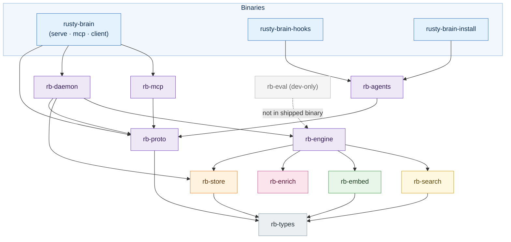
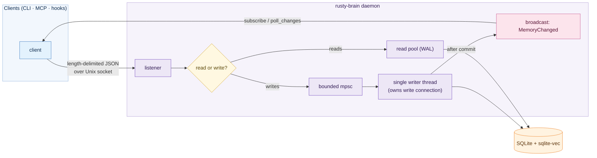
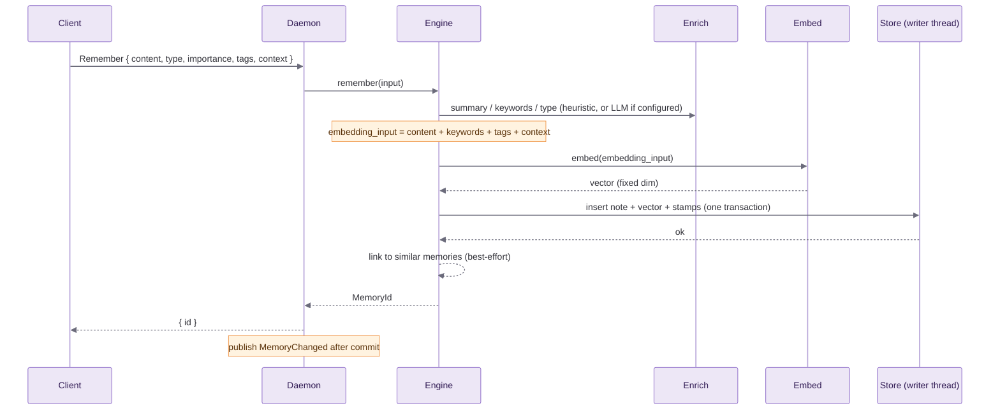
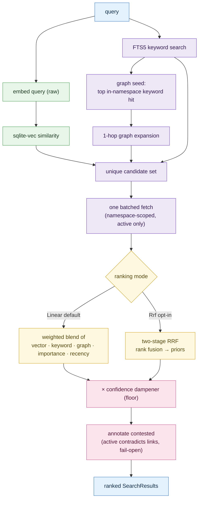
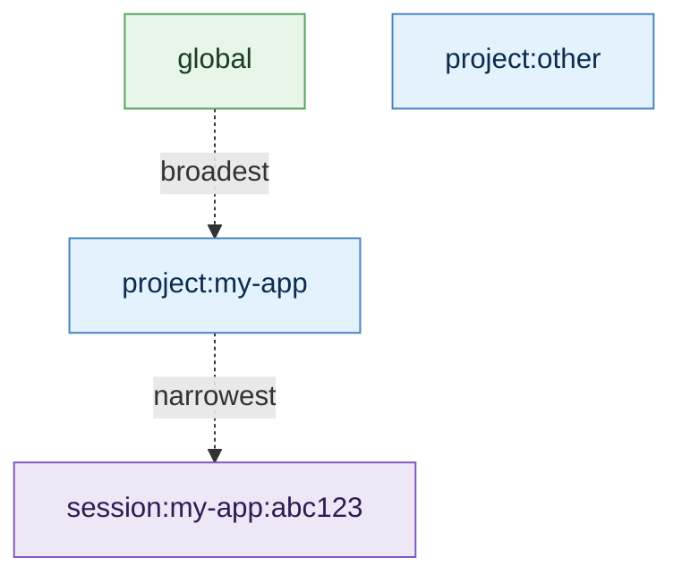

# Architecture

This document describes how `rusty-brain` is put together: the crate boundaries,
the single-writer daemon, the write and recall data flows, the namespace model, and
the storage layout. It reflects what is **implemented today**. Like the rest of the
project, it is early-stage and has had basic correctness testing only — no
performance, scale, or capability testing. For the user-facing overview and
quickstart, see the [README](../README.md).

## Design background

We surveyed existing agentic-memory systems before building this. They shaped the
ideas — ranking by a blend of recency, importance, and relevance, and treating
consolidation/forgetting as first-class — but their **architectures did not align
with our design criteria**: we wanted a local-first system assembled from small,
purpose-built crates with a single on-disk source of truth and a lean dependency
footprint, rather than a large general-purpose platform. The principles below are
the result, and they are enforced structurally (by the crate DAG and CI) rather than
left as guidelines.

| Principle | How it shows up |
|---|---|
| Focused crates, never a monolith | A workspace of 13 focused crates plus a dev-only harness (14 members), with a compiler-enforced dependency DAG; heavy/optional pieces (ONNX) behind a feature flag; supply-chain policy checked in CI. |
| One database, one transaction, one truth | Memories, FTS, and vectors in a single SQLite file; all writes serialize through one thread; reads run concurrently over WAL. |
| Fail-closed boundaries | Namespace isolation and the embedding-dimension contract refuse to run on doubt. |
| Fail-open capture | Best-effort capture hooks degrade silently and never block an agent session. |
| Reproducible from git | File-discovered, checksummed migrations; a CI gate rebuilds a fresh DB from committed SQL and exercises every query path. |
| Substrate, not orchestrator | Stores and retrieves memory; has no agent lifecycle and no LLM-driven evolution. The in-process job scheduler (consolidation, link-decay) is in-scope maintenance on the substrate itself, not agent orchestration. |

## Crate boundaries

Dependencies flow downward; no cycles.

`rb-eval` depends on the engine/store/search/embed crates for its offline harness but
is excluded from the shipped binary's dependency closure (enforced by a CI check).

## The single-writer daemon

All persistence goes through one daemon process. Exactly one OS thread owns the write
connection; every mutation is sent to it over a bounded channel and applied serially.
Reads are served from a pool of separate connections over SQLite WAL, so they never
block the writer or each other. After each committed write, the daemon publishes a
small change event on an in-process broadcast channel, which is how the CLI's
`subscribe` command and the MCP `poll_changes` tool learn about cross-agent activity.

This replaces an earlier single-file, exclusive-lock approach that serialized agents
with no read concurrency and no change propagation; the WAL + single-writer model
allows concurrent multi-agent access while keeping writes consistent.

## Write path (`remember`)

A write resolves the namespace, enriches the note, builds the embedding input,
generates the vector, persists everything in one transaction, and (best-effort) links
the new memory to similar existing ones.

Notes on the embedding input: enrichment runs *before* embedding, so the composite
input (content plus enrichment fields) is fully populated. Each row is stamped with
the embedding model and a composition version; the `reembed` command re-embeds rows
whose stamp is stale, bounded and idempotently, so the corpus can migrate to a new
representation without a flag day.

## Recall path

Recall gathers candidates from three independent paths, fetches their notes in one
batch, ranks them with pure functions, and annotates contradictions before returning.

Ranking lives in `rb-search` as pure, deterministic functions:

- **Linear (default):** a weighted sum of normalized signals — vector similarity,
  keyword reciprocal rank, graph proximity, importance, and a 30-day-half-life recency
  term.
- **RRF (opt-in):** Reciprocal Rank Fusion of the three paths' rank lists, followed by
  importance/recency/confidence priors. Scale-free; the default flips only if/when the
  offline harness shows it wins.
- **Confidence dampener:** the final score is multiplied by `floor + (1 - floor) *
  confidence` (default floor 0.5), so a low-confidence memory is suppressed but never
  zeroed. Applies in both modes.
- **Contradiction surfacing:** a result is flagged `contested` when the memory has an
  active `contradicts` link (inbound or outbound) within its namespace. This is a
  read-side annotation computed after ranking and is **fail-open** — a lookup failure
  returns unflagged results rather than failing recall.

The query itself is embedded raw (only the stored *document* representation is
composite). Vector search currently uses `sqlite-vec` brute-force KNN, which is
appropriate at small/medium scale; an approximate index is a documented future option,
not a hidden assumption.

## Namespace model

Every memory belongs to exactly one namespace, and all reads and writes are scoped to
it. Namespaces are isolated by the daemon (fail-closed): a query in one namespace
cannot see or be influenced by memories in another — including, for example, the
`contested` flag, which requires both ends of a `contradicts` link to be active and in
the same namespace.

The CLI and hooks resolve the current namespace off the async runtime before any work
begins, through one shared implementation (`rb-config`), first hit wins:

1. an explicit `--namespace` flag or `RUSTY_BRAIN_NAMESPACE` env override;
2. a repo-committed `.rusty-brain.toml` (`namespace = "..."`), read from the blob
   committed at `HEAD` (`git show HEAD:.rusty-brain.toml`) — identity survives cloning
   under any directory name, and only the committed content counts: an untracked or
   locally-modified worktree file cannot redirect the namespace and is ignored with a
   warning (commit it to take effect);
3. a `CLAUDE.md` front-matter `project:` key, walking from the working directory up to
   and *including* the git toplevel, never past it (there is no first-H1 fallback). A
   `project:` that differs from the toplevel name is never silently trusted: the CLI
   warns and uses it only once pinned via `--accept-namespace-override` (known-hosts
   style); hooks never honor an unpinned override — they log it and fall back — so a
   malicious repo's own `CLAUDE.md` cannot claim another project's namespace;
4. the git top-level directory name;
5. the working directory name; else `global`.

Detection shells out to git and reads files, so it runs synchronously off the runtime
to respect the "no blocking I/O on async workers" rule.

## Storage layout

A single SQLite file holds everything, opened in WAL mode:

- **`memories`** — the note rows (content, enrichment, type, importance, confidence,
  timestamps, archive/supersede state, the embedding model + composition-version
  stamps, and provenance: `origin_user`, `origin_host`, `origin_agent`,
  `origin_source`, `session_id` — nullable, never backfilled, so pre-provenance rows
  keep `NULL`).
- **`memory_vectors`** — a `sqlite-vec` virtual table of embeddings, one per memory.
- **`memory_links`** — directed edges between memories (e.g. `references`,
  `contradicts`) with a decaying strength.
- **`memory_oplog`** — a durable operation log: one row per mutation (insert, update,
  archive, supersede, link/unlink, confidence and link-strength changes), appended in
  the same transaction as the mutation itself, ordered by a site-local monotonic `seq`
  and stamped with this database's `site_id`.
- **full-text index** — an FTS5 index over content for keyword search.
- **`meta`** — invariants seeded at init: the embedding dimension, the embedding model
  identity, the current embedding composition version, and the `site_id` (uuid v4)
  stamped onto oplog rows.

Migrations are individual `NNN_*.sql` files discovered at build time, checksummed, and
applied transactionally. A CI test builds a brand-new database from the committed SQL
and runs every query path against it, so the schema the code expects and the schema the
migrations produce cannot silently diverge.

Two open-time invariants are load-bearing and fail closed. The embedding dimension is
seeded on first init and verified on every startup, and every vector read is
length-checked: a provider whose dimension disagrees with the stored value makes the
daemon refuse to start rather than write mismatched vectors. The embedding model
identity (`meta.embedding_model`) is the second: a same-dimension provider swap also
refuses to start — mixed vector spaces must be impossible — unless explicitly accepted
via `serve --accept-model-change` (or `RB_ACCEPT_MODEL_CHANGE=1` for auto-started
daemons) followed by a corpus `reembed`. A legacy database with no global model marker
is reconciled from `SELECT DISTINCT memories.embedding_model`: an empty corpus or one
model matching the configured provider may seed the marker; a conflicting or mixed
corpus fails closed and requires that explicit accept-and-re-embed flow.

The database file holds captured memory text, so it gets the same posture as the
daemon socket: the file is created `0600` and tightened fail-closed on every open
(including leftover `-wal`/`-shm` siblings from an unclean shutdown), and the daemon
creates the data directory `0700` when it creates it.

## What is intentionally out of scope (for now)

These are designed-but-not-built seams, called out so they read as boundaries rather
than gaps:

- **LLM-assisted evolution** — reconciliation, reflection, and importance recalibration
  as opt-in background jobs.
- **Networked / multi-host operation** — today the daemon is single-machine and
  per-user; a networked surface with real authentication is a separate future crate.
- **Approximate vector search (ANN)** — the current brute-force KNN has a documented
  scale ceiling.
- **A portable export/snapshot format.**

## Honesty note

Everything above is implemented and exercised by unit and integration tests, but the
system has not been performance-, scale-, or capability-tested, and retrieval quality
has not been measured with a real embedding model at a meaningful corpus size. The
offline evaluation harness guards ranking *determinism and regressions*, not absolute
semantic quality. Read the architecture as a description of intent and current
structure, not as a benchmarked, production-hardened system.
