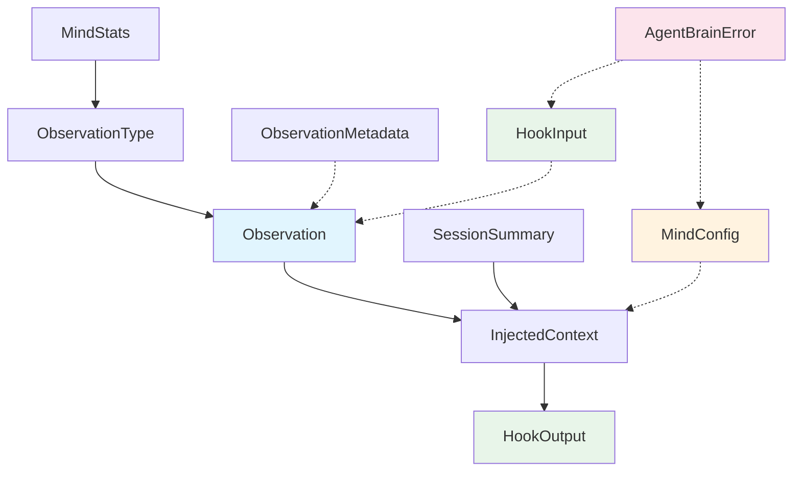

# Data Model: Type System & Configuration

**Branch**: `002-type-system-config` | **Date**: 2026-03-01

## Entity Catalog

### 1. ObservationType

A non-exhaustive enum classifying what kind of event an observation represents.

| Variant | JSON Value | Description |
|---------|------------|-------------|
| Discovery | `"discovery"` | New information discovered during work |
| Decision | `"decision"` | A decision was made |
| Problem | `"problem"` | A problem was identified |
| Solution | `"solution"` | A solution was implemented |
| Pattern | `"pattern"` | A recurring pattern was recognized |
| Warning | `"warning"` | A warning or concern was noted |
| Success | `"success"` | A successful outcome was achieved |
| Refactor | `"refactor"` | Code was refactored |
| Bugfix | `"bugfix"` | A bug was fixed |
| Feature | `"feature"` | A feature was added |

**Serialization**: Lowercase string via `#[serde(rename_all = "lowercase")]`.
**Extensibility**: `#[non_exhaustive]` to allow future variants without breaking downstream code.

---

### 2. Observation

A single memory entry recorded during an agent work session.

| Field | Rust Type | JSON Key | Required | Validation |
|-------|-----------|----------|----------|------------|
| `id` | `Uuid` | `"id"` | yes | Auto-generated v4 UUID |
| `timestamp` | `DateTime<Utc>` | `"timestamp"` | yes | Valid UTC datetime |
| `obs_type` | `ObservationType` | `"type"` | yes | One of 10 variants |
| `tool_name` | `String` | `"toolName"` | yes | Non-empty |
| `summary` | `String` | `"summary"` | yes | Non-empty, non-whitespace-only |
| `content` | `String` | `"content"` | yes | Non-empty, non-whitespace-only |
| `metadata` | `Option<ObservationMetadata>` | `"metadata"` | no | Valid if present |

**JSON casing**: `camelCase` (matches TypeScript implementation).
**Serde**: `#[serde(rename_all = "camelCase")]` on struct, `#[serde(rename = "type")]` on `obs_type` field.

---

### 3. ObservationMetadata

Extensible metadata attached to an observation.

| Field | Rust Type | JSON Key | Required | Validation |
|-------|-----------|----------|----------|------------|
| `files` | `Vec<String>` | `"files"` | yes (default empty) | — |
| `platform` | `String` | `"platform"` | yes (default empty) | — |
| `project_key` | `String` | `"projectKey"` | yes (default empty) | — |
| `compressed` | `bool` | `"compressed"` | yes (default false) | — |
| `session_id` | `Option<String>` | `"sessionId"` | no | Non-empty if present |
| `extra` | `HashMap<String, serde_json::Value>` | *(flattened)* | no | Arbitrary JSON values |

**JSON casing**: `camelCase`.
**Serde**: `#[serde(rename_all = "camelCase")]`, `#[serde(flatten)]` on `extra`, `#[serde(default)]` on all defaultable fields.

**Note**: This departs from the TypeScript `ObservationMetadata` which uses `functions`, `error`, `confidence`, `tags` instead of `platform`, `project_key`, `compressed`. The spec intentionally redesigns this struct for the Rust port (see research.md R-2).

---

### 4. SessionSummary

Aggregated summary of an entire agent work session.

| Field | Rust Type | JSON Key | Required | Validation |
|-------|-----------|----------|----------|------------|
| `id` | `String` | `"id"` | yes | Non-empty |
| `start_time` | `DateTime<Utc>` | `"startTime"` | yes | Valid UTC datetime |
| `end_time` | `DateTime<Utc>` | `"endTime"` | yes | Must be >= start_time |
| `observation_count` | `u64` | `"observationCount"` | yes | — |
| `key_decisions` | `Vec<String>` | `"keyDecisions"` | yes (default empty) | — |
| `modified_files` | `Vec<String>` | `"filesModified"` | yes (default empty) | — |
| `summary` | `String` | `"summary"` | yes | Non-empty |

**JSON casing**: `camelCase`.
**Note**: `modified_files` maps to TS JSON key `"filesModified"` (not `"modifiedFiles"`) to match TypeScript naming. Use explicit `#[serde(rename = "filesModified")]`.

---

### 5. InjectedContext

Bundle of recent memories and session context for agent conversation injection.

| Field | Rust Type | JSON Key | Required | Validation |
|-------|-----------|----------|----------|------------|
| `recent_observations` | `Vec<Observation>` | `"recentObservations"` | yes (default empty) | — |
| `relevant_memories` | `Vec<Observation>` | `"relevantMemories"` | yes (default empty) | — |
| `session_summaries` | `Vec<SessionSummary>` | `"sessionSummaries"` | yes (default empty) | — |
| `token_count` | `u64` | `"tokenCount"` | yes (default 0) | — |

**JSON casing**: `camelCase`.
**Note**: Field is `token_count` (matching TS `tokenCount`), not `token_count_estimate` as in the spec. Aligned with TypeScript for compatibility.

---

### 6. MindConfig

Configuration controlling memory engine behavior. Supports defaults and environment variable resolution.

| Field | Rust Type | JSON Key | Default | Env Var |
|-------|-----------|----------|---------|---------|
| `memory_path` | `PathBuf` | `"memoryPath"` | `.agent-brain/mind.mv2` | `MEMVID_PLATFORM_MEMORY_PATH` |
| `max_context_observations` | `u32` | `"maxContextObservations"` | `20` | — |
| `max_context_tokens` | `u32` | `"maxContextTokens"` | `2000` | — |
| `auto_compress` | `bool` | `"autoCompress"` | `true` | — |
| `min_confidence` | `f64` | `"minConfidence"` | `0.6` | — |
| `debug` | `bool` | `"debug"` | `false` | `MEMVID_MIND_DEBUG` |

**Additional env vars** (not mapped to MindConfig fields, but used in resolution):
- `MEMVID_PLATFORM` → platform detection
- `MEMVID_PLATFORM_PATH_OPT_IN` → path resolution mode
- `CLAUDE_PROJECT_DIR` → project root fallback
- `OPENCODE_PROJECT_DIR` → secondary project root fallback

**JSON casing**: `camelCase`.
**Serde**: `#[serde(default)]` on struct for partial deserialization.
**Construction**: `Default::default()` for programmatic defaults, `MindConfig::from_env()` for environment-aware resolution.

**Precedence**: env var > JSON file value > programmatic default.

**`from_env()` resolution algorithm summary:**

1. Start with `Default::default()`
2. `MEMVID_MIND_DEBUG`: accept `"1"` or `"true"` (case-insensitive) → `debug = true`; reject other non-empty values with `AgentBrainError::Configuration`
3. `MEMVID_PLATFORM_MEMORY_PATH`: if set → overrides `memory_path` directly
4. `MEMVID_PLATFORM_PATH_OPT_IN` = `"1"` AND `MEMVID_PLATFORM_MEMORY_PATH` not set → detect platform from `MEMVID_PLATFORM` (trim+lowercase), else `CLAUDE_PROJECT_DIR` presence → `"claude"`, else `OPENCODE_PROJECT_DIR` presence → `"opencode"`, then set `memory_path = .agent-brain/mind-{platform}.mv2`
5. Validate result (`min_confidence` in 0.0..=1.0, `max_context_observations` > 0, `max_context_tokens` > 0) and return

**Note**: The 4 env vars that don't map directly to MindConfig fields (`MEMVID_PLATFORM`, `MEMVID_PLATFORM_PATH_OPT_IN`, `CLAUDE_PROJECT_DIR`, `OPENCODE_PROJECT_DIR`) are consumed by the `from_env()` resolution algorithm to derive `memory_path`. They are not stored as config fields.

---

### 7. MindStats

Statistical snapshot of the memory store.

| Field | Rust Type | JSON Key | Required | Validation |
|-------|-----------|----------|----------|------------|
| `total_observations` | `u64` | `"totalObservations"` | yes | — |
| `total_sessions` | `u64` | `"totalSessions"` | yes | — |
| `oldest_memory` | `Option<DateTime<Utc>>` | `"oldestMemory"` | no | None when store is empty |
| `newest_memory` | `Option<DateTime<Utc>>` | `"newestMemory"` | no | None when store is empty |
| `file_size_bytes` | `u64` | `"fileSize"` | yes | — |
| `type_counts` | `HashMap<ObservationType, u64>` | `"topTypes"` | yes (default empty) | — |

**JSON casing**: `camelCase`.
**Note**: `file_size_bytes` maps to TS `"fileSize"`, `type_counts` maps to TS `"topTypes"`. Explicit serde rename attributes required.

---

### 8. HookInput

Structured input received from the host AI agent (Claude Code) via stdin.

**Design**: A base struct with common fields. Event-specific data is carried in a `serde_json::Value` for the fields that vary per event type, since rusty-brain only needs to deeply parse the events it handles (SessionStart, PostToolUse, Stop).

| Field | Rust Type | JSON Key | Required |
|-------|-----------|----------|----------|
| `session_id` | `String` | `"session_id"` | yes |
| `transcript_path` | `String` | `"transcript_path"` | yes |
| `cwd` | `String` | `"cwd"` | yes |
| `permission_mode` | `String` | `"permission_mode"` | yes |
| `hook_event_name` | `String` | `"hook_event_name"` | yes |
| `tool_name` | `Option<String>` | `"tool_name"` | no |
| `tool_input` | `Option<serde_json::Value>` | `"tool_input"` | no |
| `tool_response` | `Option<serde_json::Value>` | `"tool_response"` | no |
| `tool_use_id` | `Option<String>` | `"tool_use_id"` | no |
| `stop_hook_active` | `Option<bool>` | `"stop_hook_active"` | no |
| `last_assistant_message` | `Option<String>` | `"last_assistant_message"` | no |
| `source` | `Option<String>` | `"source"` | no |
| `model` | `Option<String>` | `"model"` | no |
| `prompt` | `Option<String>` | `"prompt"` | no |
| `platform` | `Option<String>` | `"platform"` | no |

**JSON casing**: `snake_case` (Claude Code protocol uses snake_case, unlike the app types which use camelCase).
**Serde**: NO `deny_unknown_fields` — must tolerate unknown fields for forward compatibility (S-3).

---

### 9. HookOutput

Structured output sent back to the host AI agent via stdout.

| Field | Rust Type | JSON Key | Required |
|-------|-----------|----------|----------|
| `continue_execution` | `Option<bool>` | `"continue"` | no (default true) |
| `stop_reason` | `Option<String>` | `"stopReason"` | no |
| `suppress_output` | `Option<bool>` | `"suppressOutput"` | no |
| `system_message` | `Option<String>` | `"systemMessage"` | no |
| `decision` | `Option<String>` | `"decision"` | no |
| `reason` | `Option<String>` | `"reason"` | no |
| `hook_specific_output` | `Option<serde_json::Value>` | `"hookSpecificOutput"` | no |

**JSON casing**: Mixed (protocol-defined). Use explicit `#[serde(rename)]` per field.
**Note**: `continue_execution` maps to JSON `"continue"` (reserved keyword in Rust; renamed).

---

### 10. AgentBrainError

Unified error hierarchy with stable error codes.

| Variant | Error Code | Source Error | Description |
|---------|------------|-------------|-------------|
| FileSystem | `E_FS_*` | `std::io::Error` | File operations failed |
| Configuration | `E_CONFIG_*` | — | Invalid or missing config |
| Serialization | `E_SER_*` | `serde_json::Error` | JSON serialize/deserialize failed |
| Lock | `E_LOCK_*` | — | Lock acquisition failed |
| MemoryCorruption | `E_MEM_*` | — | Data integrity violation |
| InvalidInput | `E_INPUT_*` | — | Validation failure |

**Design**: Each variant carries a `code: &'static str`, `message: String`, and optional `source` error for cause chaining.
**Extensibility**: `#[non_exhaustive]` to allow future variants.
**Trait impls**: `std::fmt::Display`, `std::error::Error` (via thiserror derive).

---

## Relationship Diagram

