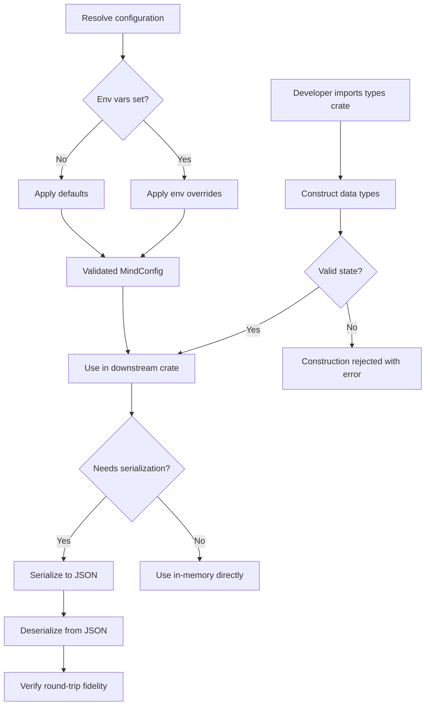
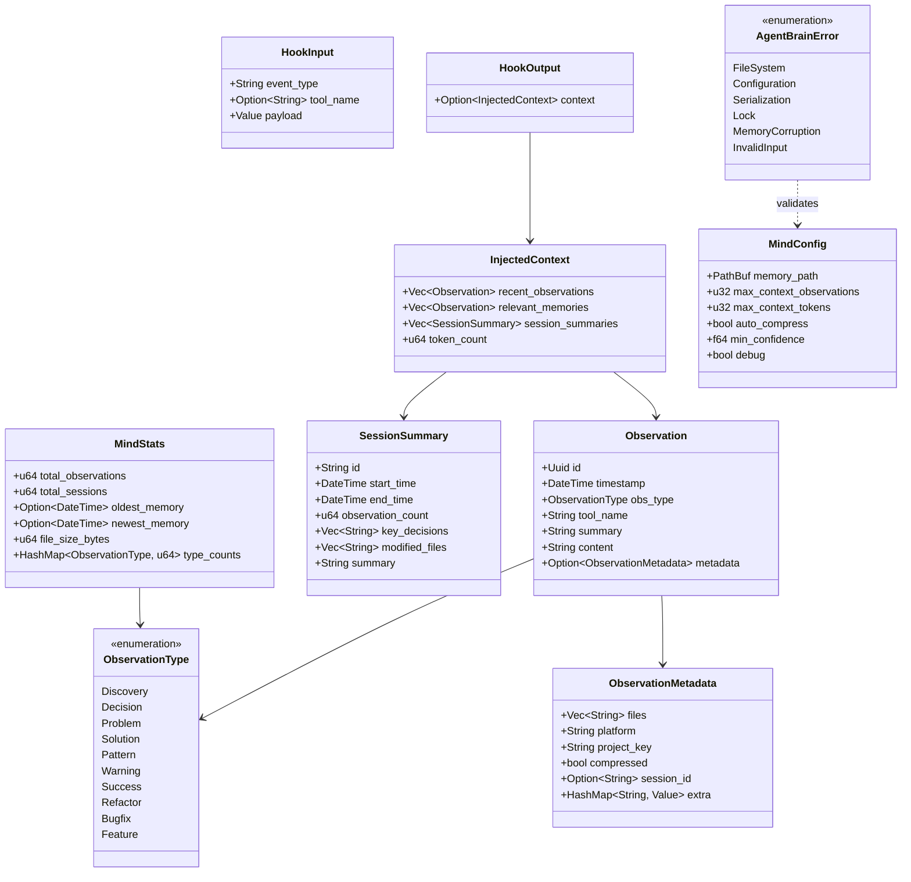
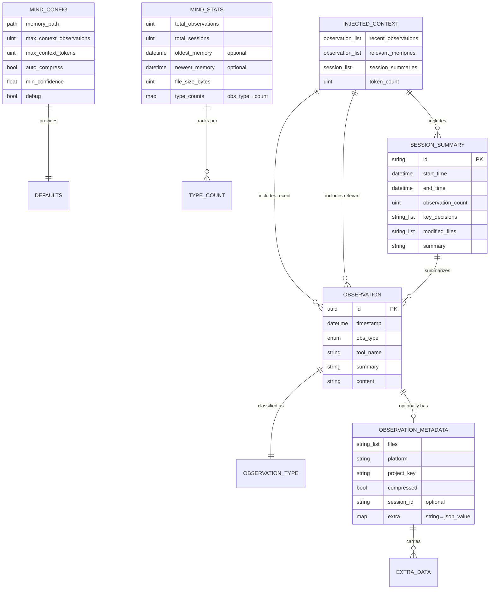
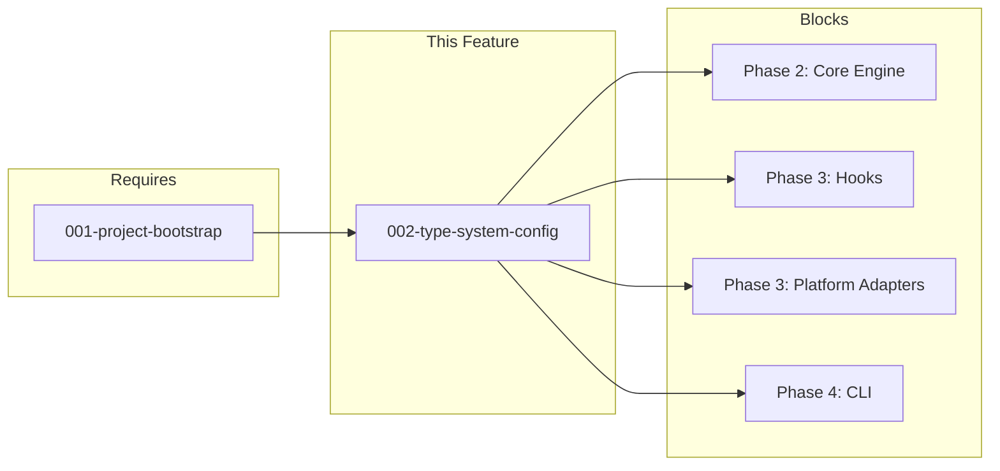

# 002-prd-type-system-config

> **Document Type:** Product Requirements Document
> **Audience:** LLM agents, human reviewers
> **Status:** Draft
> **Last Updated:** 2026-03-01 <!-- @auto -->
> **Owner:** Brian Luby <!-- @human-required -->

**Feature Branch**: `002-type-system-config`
**Created**: 2026-03-01
**Status**: Draft
**Input**: User description: "Port Phase 1 type system and configuration from RUST_ROADMAP.md"

---

## Review Tier Legend

| Marker | Tier | Speckit Behavior |
|--------|------|------------------|
| 🔴 `@human-required` | Human Generated | Prompt human to author; blocks until complete |
| 🟡 `@human-review` | LLM + Human Review | LLM drafts → prompt human to confirm/edit; blocks until confirmed |
| 🟢 `@llm-autonomous` | LLM Autonomous | LLM completes; no prompt; logged for audit |
| ⚪ `@auto` | Auto-generated | System fills (timestamps, links); no prompt |

---

## Document Completion Order

> ⚠️ **For LLM Agents:** Complete sections in this order. Do not fill downstream sections until upstream human-required inputs exist.

1. **Context** (Background, Scope) → requires human input first
2. **Problem Statement & User Scenarios** → requires human input
3. **Requirements** (Must/Should/Could/Won't) → requires human input
4. **Technical Constraints** → human review
5. **Diagrams, Data Model, Interface** → LLM can draft after above exist
6. **Acceptance Criteria** → derived from requirements
7. **Everything else** → can proceed

---

## Context

### Background 🔴 `@human-required`

rusty-brain is a Rust rewrite of [agent-brain](https://github.com/brianluby/agent-brain/) — a memory system for AI coding agents. Before any runtime behavior can be built (memory engine, hooks, CLI), the project needs a shared type system that every downstream crate depends on. This is Phase 1 of the Rust roadmap: define all core data structures, error types, and configuration with defaults and environment-variable resolution. Without this foundation, no other crate can compile against shared contracts.

### Scope Boundaries 🟡 `@human-review`

**In Scope:**
- Observation types and all 10 classification variants
- Observation metadata with extensible extra-data map
- Session summary structure
- Injected context structure for agent conversation injection
- MindConfig with defaults and environment variable resolution
- MindStats statistics structure
- Hook input/output protocol types (Claude Code hook JSON protocol)
- Unified error type hierarchy with stable error codes
- JSON serialization/deserialization round-trip fidelity for all types
- Compile-time and construction-time validity enforcement
- Unit tests covering all of the above

**Out of Scope:**
- Runtime memory engine behavior — belongs to Phase 2 (core crate)
- File I/O and persistence — belongs to Phase 2 (core crate)
- Hook binary implementation — belongs to Phase 3 (hooks crate)
- CLI commands — belongs to Phase 4 (cli crate)
- Platform adapter logic — belongs to Phase 3 (platforms crate)
- Compression algorithms — belongs to Phase 2 (compression crate)
- Network/remote sync capability — explicitly deferred, opt-in only
- Real tokenizer integration — character-based heuristic (chars/4) is sufficient for this phase

### Glossary 🟡 `@human-review`

| Term | Definition |
|------|------------|
| Observation | A single memory entry recorded during an agent work session, classified by type and carrying structured metadata |
| ObservationType | One of 10 classification variants describing what kind of event an observation represents |
| ObservationMetadata | Extensible metadata attached to an observation — files touched, platform, session association, and arbitrary extra data |
| SessionSummary | Aggregated summary of an entire agent work session — decisions, modified files, narrative |
| InjectedContext | A bundle of recent memories and session context prepared for injection into an agent's conversation at session start |
| MindConfig | Configuration controlling the memory engine's behavior — file locations, context limits, compression, debug settings |
| MindStats | Statistical snapshot of the memory store — counts, timestamps, sizes, type distributions |
| HookInput / HookOutput | Structured JSON messages exchanged between hook binaries and the host AI agent (Claude Code) |
| AgentBrainError | Unified error hierarchy for all failure modes in the system |
| Round-trip fidelity | The property that serializing a value to JSON and deserializing it back produces an identical value |
| Types crate | The `crates/types` workspace member where all shared data structures live |

### Related Documents ⚪ `@auto`

| Document | Link | Relationship |
|----------|------|--------------|
| Feature Spec | [spec.md](spec.md) | Source requirements |
| Architecture Review | ar.md | Defines technical approach |
| Security Review | sec.md | Risk assessment |
| Requirements Checklist | [checklists/requirements.md](checklists/requirements.md) | Spec validation |

---

## Problem Statement 🔴 `@human-required`

The rusty-brain workspace has 7 crates (types, core, hooks, cli, compression, platforms, opencode) but no shared data structures yet. Every crate beyond `types` needs common types for observations, sessions, configuration, errors, and hook protocols to compile and function. Without a well-defined, tested type foundation:

1. **No downstream development is possible** — core, hooks, CLI, and platform crates cannot define their APIs without importing shared types.
2. **Data integrity is at risk** — if serialization is lossy or inconsistent, agent memories become corrupted silently.
3. **Agent integration is blocked** — AI agents need structured errors with stable codes to diagnose and recover from failures programmatically; unstructured errors lead to blind retries or abandonment.
4. **Configuration is fragile** — without environment variable resolution and sensible defaults, deploying rusty-brain across CI, local dev, and container environments requires manual file editing.

---

## User Scenarios & Testing 🔴 `@human-required`

### User Story 1 — Downstream Crate Consumes Shared Types (Priority: P1)

A developer working on any downstream crate (core engine, hooks, CLI, platform adapters) imports shared data types from the types crate to model observations, sessions, configuration, and errors. Every type they need is available, well-documented, and enforces valid states at compile time.

> As a **crate developer**, I want **a complete set of shared types available from the types crate** so that **I can build downstream features against stable, well-documented contracts without ambiguity**.

**Why this priority**: Every other crate in the workspace depends on these shared types. Without them, no further development can proceed. This is the foundational building block for all of Phase 2+.

**Independent Test**: Import each public type from the types crate, construct valid instances, and verify they compile and behave correctly. Attempt to construct invalid states and confirm they are rejected at compile time or at construction.

**Acceptance Scenarios**:
1. **Given** a developer adds the types crate as a dependency, **When** they import observation, session, configuration, and error types, **Then** all types are available and well-documented with module-level documentation.
2. **Given** a developer constructs an observation with all required fields, **When** they inspect the resulting value, **Then** all 10 observation type variants are available and each observation carries an ID, timestamp, type, summary, content, and optional metadata.
3. **Given** a developer constructs a configuration without specifying optional fields, **When** they use the configuration, **Then** sensible defaults are applied (memory path: `.agent-brain/mind.mv2`, max context observations: 20, max context tokens: 2000, auto-compress: enabled, minimum confidence: 0.6, debug: disabled).

---

### User Story 2 — Data Round-Trips Through Serialization (Priority: P1)

An AI agent or CLI tool serializes observations, session summaries, and configuration to JSON for storage or inter-process communication, then deserializes them back. The round-trip preserves all data exactly, with no information loss or corruption.

> As an **AI agent**, I want **all data types to serialize and deserialize to/from JSON without data loss** so that **memories are never corrupted during storage or inter-process communication**.

**Why this priority**: The memory system stores and retrieves structured data constantly. If serialization is lossy or inconsistent, memories become corrupted. This is a data-integrity prerequisite.

**Independent Test**: Construct each type, serialize to JSON, deserialize back, and verify equality with the original. Include edge cases like empty strings, maximum-length fields, special characters, and missing optional fields.

**Acceptance Scenarios**:
1. **Given** an observation with all fields populated (including metadata with files, platform, and extra key-value data), **When** it is serialized to JSON and deserialized back, **Then** the result is identical to the original.
2. **Given** a session summary with all aggregation fields, **When** round-tripped through JSON, **Then** all fields including lists of decisions and modified files are preserved exactly.
3. **Given** a configuration with only default values, **When** serialized to JSON, **Then** all default values appear in the output. **When** deserialized from an empty or partial JSON object, **Then** defaults are applied for missing fields.
4. **Given** observation metadata with an extensible extra data map containing nested values, **When** round-tripped, **Then** the nested structure is preserved without flattening or loss.

---

### User Story 3 — Error Handling Provides Actionable Diagnostics (Priority: P2)

When an operation fails (file not found, invalid configuration, corrupted data, lock contention), the system produces a structured error with a stable error code, a human-readable message, and enough context for an AI agent to diagnose and recover without manual intervention.

> As an **AI agent**, I want **structured errors with stable codes and cause chains** so that **I can diagnose failures programmatically and choose appropriate recovery strategies**.

**Why this priority**: AI agents consume errors programmatically. Unstructured or vague errors cause agents to retry blindly or give up. Structured errors enable smart recovery strategies.

**Independent Test**: Trigger each error variant and verify it produces a stable error code, a descriptive message, and retains the original cause chain. Verify errors serialize to a structured format suitable for machine parsing.

**Acceptance Scenarios**:
1. **Given** an operation encounters a file-system error, **When** the error is reported, **Then** it includes a stable category code, a human-readable description, and the underlying OS error details.
2. **Given** an invalid configuration value is provided, **When** the configuration is validated, **Then** the error identifies which field is invalid, what value was provided, and what values are acceptable.
3. **Given** a chain of errors (e.g., file read fails causing memory load to fail), **When** the top-level error is inspected, **Then** the full cause chain is accessible for diagnostic purposes.

---

### User Story 4 — Configuration Resolves from Environment (Priority: P2)

An operator or AI agent configures rusty-brain behavior through environment variables without modifying any files. Environment variables override file-based or default configuration values, following a clear precedence order.

> As an **operator**, I want **environment variables to override default configuration** so that **I can customize behavior in CI, containers, and local dev without modifying project files**.

**Why this priority**: AI coding agents run in diverse environments (CI, local dev, containers) and need to configure behavior without touching project files. Environment-based configuration is the standard mechanism for this.

**Independent Test**: Set specific environment variables, construct a configuration, and verify the environment values take precedence over defaults. Unset them and verify defaults are restored.

**Acceptance Scenarios**:
1. **Given** the environment variable for platform is set, **When** configuration is resolved, **Then** the platform value from the environment is used instead of the default.
2. **Given** the environment variable for debug mode is set to a truthy value, **When** configuration is resolved, **Then** debug mode is enabled regardless of the default.
3. **Given** the environment variable for memory path is set, **When** configuration is resolved, **Then** the specified path is used for the memory file.
4. **Given** no environment variables are set, **When** configuration is resolved, **Then** all default values are applied.

---

### User Story 5 — Hook Protocol Types Enable Agent Communication (Priority: P3)

The hook binaries (session-start, post-tool-use, stop) exchange structured JSON messages with the host agent (Claude Code, OpenCode). The types crate provides the input and output message types that match the host agent's hook protocol, ensuring correct communication.

> As a **hooks developer**, I want **typed input and output message structures matching the host agent hook protocol** so that **I can build hook binaries against a stable, validated contract**.

**Why this priority**: Hook communication is critical for agent integration, but the hooks themselves are built in a later phase. Defining the protocol types early ensures the hooks crate can be developed against a stable contract.

**Independent Test**: Construct hook input and output messages, serialize them, and verify they match the expected JSON structure. Deserialize sample messages from the host agent and verify they parse correctly.

**Acceptance Scenarios**:
1. **Given** a hook input JSON message from Claude Code, **When** deserialized, **Then** it parses into a typed structure with event type, tool name, and payload.
2. **Given** a hook output with injected context, **When** serialized to JSON, **Then** it matches the structure the host agent expects.
3. **Given** an unknown or future field in a hook input message, **When** deserialized, **Then** the unknown fields are ignored without error (forward-compatible parsing).

---

### Edge Cases 🟢 `@llm-autonomous`

- What happens when a timestamp field contains a value in seconds instead of milliseconds (or vice versa)?
- How does the system handle observation metadata with extremely large extra data maps (e.g., thousands of key-value pairs)?
- What happens when a configuration file contains unknown fields (forward compatibility)?
- How does the system handle empty or whitespace-only strings for required text fields like observation summary?
- What happens when environment variables contain invalid values (e.g., non-numeric string for a numeric config)?

---

## Assumptions & Risks 🟡 `@human-review`

### Assumptions
- [A-1] The 10 observation type variants listed in the roadmap are complete and final for this phase. New variants may be added in future phases.
- [A-2] The hook JSON protocol follows the Claude Code hooks specification. If the protocol changes upstream, the types will need updating.
- [A-3] Environment variable names match those used by the existing TypeScript implementation for backwards compatibility (`MEMVID_PLATFORM`, `MEMVID_MIND_DEBUG`, `MEMVID_PLATFORM_MEMORY_PATH`, `MEMVID_PLATFORM_PATH_OPT_IN`, `CLAUDE_PROJECT_DIR`, `OPENCODE_PROJECT_DIR`).
- [A-4] "Token count" in InjectedContext uses the same character-based heuristic as the TypeScript version (characters / 4), not a real tokenizer.
- [A-5] Configuration defaults match the TypeScript implementation's defaults exactly to ensure behavioral compatibility.
- [A-6] The extensible extra data map in ObservationMetadata uses a string-to-JSON-value mapping, matching the TypeScript `Record<string, unknown>` pattern.

### Risks

| ID | Risk | Likelihood | Impact | Mitigation |
|----|------|------------|--------|------------|
| R-1 | Claude Code hook protocol changes break HookInput/HookOutput types | Medium | Medium | Forward-compatible deserialization (ignore unknown fields); pin to known protocol version |
| R-2 | TypeScript-to-Rust type mapping introduces subtle semantic differences | Low | High | Comprehensive round-trip tests against TypeScript test fixtures; property-based testing |
| R-3 | Observation type variants need expansion before Phase 2 | Low | Low | Enum is non-exhaustive by design; adding variants is additive and backwards-compatible |
| R-4 | Environment variable parsing edge cases cause config corruption | Medium | Medium | Validate all env var values at parse time; reject invalid values with actionable error messages |

---

## Feature Overview

### Flow Diagram 🟡 `@human-review`



### Type Hierarchy Diagram 🟡 `@human-review`



---

## Requirements

### Must Have (M) — MVP, launch blockers 🔴 `@human-required`

- [ ] **M-1:** System shall define an `ObservationType` enum with exactly 10 variants: Discovery, Decision, Problem, Solution, Pattern, Warning, Success, Refactor, Bugfix, Feature. *(FR-001)*
- [ ] **M-2:** System shall define an `Observation` structure carrying: unique ID (UUID), timestamp, observation type, tool name, summary, content, and optional metadata. *(FR-002)*
- [ ] **M-3:** System shall define `ObservationMetadata` carrying: list of affected files, platform identifier, project identity key, compression flag, session ID, and an extensible map for arbitrary additional data. *(FR-003)*
- [ ] **M-4:** System shall define a `SessionSummary` structure carrying: session ID, start time, end time, observation count, list of key decisions, list of modified files, and narrative summary. *(FR-004)*
- [ ] **M-5:** System shall define an `InjectedContext` structure carrying: recent observations, relevant memories, session summaries, and token count. *(FR-005)*
- [ ] **M-6:** System shall define a `MindConfig` structure with defaults: memory path `.agent-brain/mind.mv2`, max context observations 20, max context tokens 2000, auto-compress enabled, minimum confidence 0.6, debug disabled. *(FR-006)*
- [ ] **M-7:** System shall define a `MindStats` structure carrying: total observation count, total session count, oldest/newest memory timestamps, file size, and observation type frequency breakdown. *(FR-007)*
- [ ] **M-8:** System shall define `HookInput` and `HookOutput` structures matching the JSON protocol used by Claude Code hooks. *(FR-008)*
- [ ] **M-9:** System shall define a unified `AgentBrainError` type hierarchy with stable, machine-parseable error codes for: file-system errors, configuration errors, serialization errors, lock errors, memory corruption, and invalid input. *(FR-009)*
- [ ] **M-10:** All public types shall serialize to JSON and deserialize from JSON without data loss (round-trip fidelity). *(FR-011)*
- [ ] **M-11:** All public types shall enforce valid states — invalid combinations of field values shall be rejected at construction time, not discovered at runtime. *(FR-012)*

### Should Have (S) — High value, not blocking 🔴 `@human-required`

- [ ] **S-1:** System shall resolve configuration from environment variables, with environment values taking precedence over defaults. Supported variables: `MEMVID_PLATFORM`, `MEMVID_MIND_DEBUG`, `MEMVID_PLATFORM_MEMORY_PATH`, `MEMVID_PLATFORM_PATH_OPT_IN`, `CLAUDE_PROJECT_DIR`, `OPENCODE_PROJECT_DIR`. *(FR-010)*
- [ ] **S-2:** Configuration deserialization shall apply default values for any missing fields, allowing partial configuration input. *(FR-013)*
- [ ] **S-3:** Hook input deserialization shall tolerate unknown fields without error to support forward compatibility with future host agent versions. *(FR-014)*
- [ ] **S-4:** Every error variant shall include a stable error code that does not change across versions, enabling agents to match on error codes programmatically. *(SC-006)*
- [ ] **S-5:** All type definitions shall include documentation sufficient for a developer to understand purpose, constraints, and usage without reading source code of other crates. *(SC-009)*

### Could Have (C) — Nice to have, if time permits 🟡 `@human-review`

- [ ] **C-1:** Builder pattern for `Observation` and `MindConfig` to provide ergonomic construction with compile-time field validation.
- [ ] **C-2:** `Display` implementations for all public types producing human-readable summaries suitable for debug logging.
- [ ] **C-3:** Property-based tests (using `proptest` or `quickcheck`) for serialization round-trip fidelity across random inputs.

### Won't Have (W) — Explicitly deferred 🟡 `@human-review`

- [ ] **W-1:** Runtime memory engine behavior (store, retrieve, search) — *Reason: belongs to Phase 2 (core crate)*
- [ ] **W-2:** File I/O and persistence — *Reason: belongs to Phase 2 (core crate)*
- [ ] **W-3:** Real tokenizer integration — *Reason: character heuristic (chars/4) sufficient; real tokenizer adds dependency complexity without Phase 1 value*
- [ ] **W-4:** Network/remote sync — *Reason: local-only by default per constitution; network is opt-in and deferred*
- [ ] **W-5:** Hook binary implementation — *Reason: types only; hook logic belongs to Phase 3 (hooks crate)*

---

## Technical Constraints 🟡 `@human-review`

- **Language/Framework:** Stable Rust (edition 2024, MSRV 1.85.0); `unsafe` code is forbidden per workspace lints.
- **Target Crate:** All types live in `crates/types`; downstream crates import from this single source.
- **Workspace Dependencies:** Must use pinned workspace dependencies: `serde` 1.0 (derive), `serde_json` 1.0, `thiserror` 2.0, `chrono` 0.4 (serde), `uuid` 1 (v4, serde). No new dependencies without plan-level approval.
- **Serialization:** JSON via `serde`/`serde_json`. All public types must derive `Serialize` and `Deserialize`.
- **Error Handling:** Unified error hierarchy via `thiserror`. Stable error codes must be string constants, not derived from variant names.
- **Compatibility:** Environment variable names and configuration defaults must match the existing TypeScript agent-brain implementation.
- **Quality Gates:** `cargo test` all green, `cargo clippy -- -D warnings` no warnings, `cargo fmt --check` formatted, before merge.

---

## Data Model 🟡 `@human-review`



---

## Interface Contract 🟡 `@human-review`

```rust
// ---- Core Types (crates/types/src/lib.rs) ----

/// 10-variant observation classification
pub enum ObservationType {
    Discovery, Decision, Problem, Solution, Pattern,
    Warning, Success, Refactor, Bugfix, Feature,
}

/// A single memory entry
pub struct Observation {
    pub id: Uuid,
    pub timestamp: DateTime<Utc>,
    pub obs_type: ObservationType,
    pub tool_name: String,
    pub summary: String,
    pub content: String,
    pub metadata: Option<ObservationMetadata>,
}

/// Extensible metadata
pub struct ObservationMetadata {
    pub files: Vec<String>,
    pub platform: String,
    pub project_key: String,
    pub compressed: bool,
    pub session_id: Option<String>,
    pub extra: HashMap<String, serde_json::Value>,
}

/// Session aggregate
pub struct SessionSummary { /* fields as per data model */ }

/// Agent injection payload
pub struct InjectedContext { /* fields as per data model */ }

/// Configuration with defaults and env resolution
pub struct MindConfig { /* fields as per data model */ }
impl MindConfig {
    pub fn from_env() -> Result<Self, AgentBrainError>;
}
impl Default for MindConfig { /* documented defaults */ }

/// Memory statistics
pub struct MindStats { /* fields as per data model */ }

/// Hook protocol messages
pub struct HookInput { /* event_type, tool_name, payload */ }
pub struct HookOutput { /* optional InjectedContext */ }

/// Unified error hierarchy
pub enum AgentBrainError {
    FileSystem { code: &'static str, /* ... */ },
    Configuration { code: &'static str, /* ... */ },
    Serialization { code: &'static str, /* ... */ },
    Lock { code: &'static str, /* ... */ },
    MemoryCorruption { code: &'static str, /* ... */ },
    InvalidInput { code: &'static str, /* ... */ },
}
```

---

## Evaluation Criteria 🟡 `@human-review`

| Criterion | Weight | Metric | Target | Notes |
|-----------|--------|--------|--------|-------|
| Round-trip fidelity | Critical | % of types passing serialize→deserialize equality | 100% | Zero tolerance for data loss |
| Type coverage | Critical | All spec'd types implemented | 10/10 entity types | All data model entities |
| Error code stability | High | Error codes match spec across versions | 100% | Codes must not change |
| Default accuracy | High | Config defaults match TypeScript impl | 6/6 fields | Behavioral compatibility |
| Env var resolution | High | Env overrides for all 6 variables | 6/6 variables | Precedence: env > default |
| Documentation | Medium | All public items have doc comments | 100% | rustdoc coverage |
| Test coverage | High | Line coverage of types crate | >90% | `cargo tarpaulin` or similar |

---

## Tool/Approach Candidates 🟡 `@human-review`

| Option | License | Pros | Cons | Spike Result |
|--------|---------|------|------|--------------|
| serde + serde_json (already in workspace) | MIT/Apache-2.0 | Industry standard, derive macros, zero-copy where possible | Compile time cost (acceptable) | Already pinned in workspace |
| thiserror 2.0 (already in workspace) | MIT/Apache-2.0 | Derive macro for std::error::Error, stable Rust | Minor version differences from 1.x | Already pinned in workspace |
| chrono 0.4 + uuid 1 (already in workspace) | MIT/Apache-2.0 | Full datetime and UUID support with serde integration | chrono is large; acceptable for this use case | Already pinned in workspace |

### Selected Approach 🔴 `@human-required`

> **Decision:** Use all workspace-pinned dependencies (serde, serde_json, thiserror, chrono, uuid) as they are already approved and configured.
> **Rationale:** These dependencies are pinned in the workspace `Cargo.toml`, satisfy all requirements, and introduce no new dependency risk. No spike needed — they are industry-standard Rust crates with proven stability.

---

## Acceptance Criteria 🟡 `@human-review`

| AC ID | Requirement | User Story | Given | When | Then |
|-------|-------------|------------|-------|------|------|
| AC-1 | M-1 | US-1 | A developer imports the types crate | They reference `ObservationType` | All 10 variants are available and documented |
| AC-2 | M-2 | US-1 | A developer constructs an `Observation` with all required fields | They inspect the value | ID, timestamp, type, tool_name, summary, content, and optional metadata are present |
| AC-3 | M-3 | US-1 | A developer constructs `ObservationMetadata` with extra data | They inspect the value | files, platform, project_key, compressed, session_id, and extra map are present |
| AC-4 | M-4 | US-1 | A developer constructs a `SessionSummary` | They inspect the value | All 7 fields are present and correctly typed |
| AC-5 | M-5 | US-1 | A developer constructs `InjectedContext` | They inspect the value | recent_observations, relevant_memories, session_summaries, and token_count are present |
| AC-6 | M-6 | US-1, US-4 | A developer constructs `MindConfig` with `Default::default()` | They inspect the values | memory_path=`.agent-brain/mind.mv2`, max_context_observations=20, max_context_tokens=2000, auto_compress=true, min_confidence=0.6, debug=false |
| AC-7 | M-7 | US-1 | A developer constructs `MindStats` | They inspect the value | All 6 fields are present including type_counts map |
| AC-8 | M-8 | US-5 | A Claude Code hook JSON message is received | It is deserialized into `HookInput` | event_type, tool_name, and payload are parsed correctly |
| AC-9 | M-9 | US-3 | An error occurs during any operation | The error is inspected | It has a stable code, human-readable message, and cause chain |
| AC-10 | M-10 | US-2 | Any public type instance is serialized to JSON | It is deserialized back | The result is identical to the original |
| AC-11 | M-11 | US-1 | An invalid field combination is provided at construction | The constructor is called | The construction is rejected with an actionable error |
| AC-12 | S-1 | US-4 | Environment variable `MEMVID_PLATFORM` is set | `MindConfig::from_env()` is called | The platform value from env is used |
| AC-13 | S-2 | US-4 | A partial JSON config with missing fields is deserialized | `MindConfig` is constructed | Missing fields receive documented default values |
| AC-14 | S-3 | US-5 | A hook input JSON has unknown future fields | It is deserialized into `HookInput` | Unknown fields are silently ignored; known fields parse correctly |
| AC-15 | S-4 | US-3 | An error is created | Its error code is inspected | The code is a stable string constant that will not change across versions |
| AC-16 | S-5 | US-1 | A developer reads type documentation | They run `cargo doc` | Every public type and field has a doc comment explaining purpose and constraints |

### Edge Cases 🟢 `@llm-autonomous`

- [ ] **EC-1:** (M-10) When an observation summary contains Unicode characters (emoji, CJK, RTL text), then JSON round-trip preserves the exact string.
- [ ] **EC-2:** (M-10) When observation metadata extra map contains deeply nested JSON values (5+ levels), then round-trip preserves the full structure.
- [ ] **EC-3:** (M-11) When a required string field (summary, content) is empty or whitespace-only, then construction is rejected with an `InvalidInput` error.
- [ ] **EC-4:** (S-1) When an environment variable contains an invalid value (e.g., `MEMVID_MIND_DEBUG=banana`), then `from_env()` returns a `Configuration` error identifying the field and invalid value.
- [ ] **EC-5:** (M-6) When `MindConfig` defaults are compared to TypeScript implementation defaults, then all 6 fields match exactly.
- [ ] **EC-6:** (S-3) When a hook input message contains 10+ unknown fields alongside known fields, then deserialization succeeds and all known fields are correct.
- [ ] **EC-7:** (M-9) When errors are nested 3+ levels deep, then the full cause chain is traversable via `std::error::Error::source()`.

---

## Dependencies 🟡 `@human-review`



- **Requires:** 001-project-bootstrap (workspace structure — complete)
- **Blocks:** All Phase 2+ features (core, hooks, platforms, cli, compression, opencode)
- **External:** None — this phase is entirely local data structure definitions

---

## Security Considerations 🟡 `@human-review`

| Aspect | Assessment | Notes |
|--------|------------|-------|
| Internet Exposure | No | Types crate has no network capability |
| Sensitive Data | Yes (Low) | Observation content may contain code snippets; memory contents treated as potentially sensitive per constitution |
| Authentication Required | No | No authentication in scope — local library |
| Secret Handling | N/A | Types must not store or transmit secrets; no API keys in observation data |
| Logging Sensitivity | Yes | Memory contents must not be logged at INFO or above without explicit opt-in (constitution IX) |
| Security Review Required | No | Minimal attack surface — pure data structures with no I/O; full SEC review deferred to Phase 2 when I/O is introduced |

---

## Implementation Guidance 🟢 `@llm-autonomous`

### Suggested Approach

1. Start with `ObservationType` enum — simplest type, validates crate structure.
2. Build `Observation` and `ObservationMetadata` next — these are the core data model.
3. Add `SessionSummary`, `InjectedContext`, `MindStats` — straightforward data containers.
4. Implement `MindConfig` with `Default` and `from_env()` — configuration layer.
5. Implement `HookInput`/`HookOutput` — protocol types with forward-compatible deserialization.
6. Implement `AgentBrainError` — unified error hierarchy with stable codes.
7. Write tests throughout (test-first per constitution V).

### Anti-patterns to Avoid

- **Leaking implementation details**: Types should not depend on storage format or memvid internals.
- **Mutable configuration**: `MindConfig` should be immutable after construction. Use builder or constructor pattern, not setter methods.
- **Stringly-typed errors**: Error codes must be stable constants, not generated from variant names via `Display`.
- **Over-validation**: Don't validate business logic in the types crate (e.g., "does this file path exist?"). Only validate data shape (e.g., "is this string non-empty?").
- **Feature-gating types**: All types should be available without feature flags. Types are the shared contract.

### Reference Examples

- The TypeScript agent-brain implementation provides the source-of-truth for field names, defaults, and environment variable mapping.
- Claude Code hooks documentation defines the JSON protocol for `HookInput`/`HookOutput`.

---

## Spike Tasks 🟡 `@human-review`

- [x] **Spike-1:** Verify Claude Code hook JSON protocol structure matches the `HookInput`/`HookOutput` fields defined in this PRD. *Completion criteria: sample JSON fixtures from Claude Code hook documentation.*
- [ ] **Spike-2:** Confirm TypeScript agent-brain configuration defaults and environment variable names match the values specified in M-6 and S-1. *Completion criteria: side-by-side comparison table of TS defaults vs. PRD defaults.*

---

## Success Metrics 🔴 `@human-required`

| Metric | Baseline | Target | Measurement Method |
|--------|----------|--------|-------------------|
| Type coverage | 0 types defined | All 10 entity types implemented | Compilation of downstream crate imports |
| Round-trip fidelity | N/A | 100% of types pass serialize→deserialize equality | `cargo test` with dedicated round-trip test suite |
| Config default accuracy | N/A | 6/6 fields match TypeScript defaults | Assertion tests comparing defaults |
| Env var resolution | N/A | 6/6 variables override defaults correctly | Unit tests with env var injection |
| Error code stability | N/A | All error codes are string constants | Code review + assertion tests |
| Documentation | N/A | 100% public item doc coverage | `cargo doc --no-deps` with no warnings |

### Technical Verification 🟢 `@llm-autonomous`

| Metric | Target | Verification Method |
|--------|--------|---------------------|
| Test coverage for Must Have ACs | >90% | `cargo tarpaulin` or line-count heuristic |
| No Critical/High security findings | 0 | No I/O in types crate; minimal attack surface |
| Clippy clean | 0 warnings | `cargo clippy -- -D warnings` |
| Formatted | Pass | `cargo fmt --check` |
| All quality gates | Green | CI pipeline (test + clippy + fmt) |

---

## Definition of Ready 🔴 `@human-required`

### Readiness Checklist

- [x] Problem statement reviewed and validated by stakeholder
- [x] All Must Have requirements have acceptance criteria
- [x] Technical constraints are explicit and agreed
- [x] Dependencies identified and owners confirmed
- [ ] Security review completed (or N/A documented with justification)
- [x] No open questions blocking implementation (Q1 and Q2 resolved)

### Sign-off

| Role | Name | Date | Decision |
|------|------|------|----------|
| Product Owner | Brian Luby | YYYY-MM-DD | [Ready / Not Ready] |

---

## Changelog ⚪ `@auto`

| Version | Date | Author | Changes |
|---------|------|--------|---------|
| 0.1 | 2026-03-01 | LLM (Claude) | Initial draft from spec.md |

---

## Decision Log 🟡 `@human-review`

| Date | Decision | Rationale | Alternatives Considered |
|------|----------|-----------|------------------------|
| 2026-03-01 | Use workspace-pinned dependencies only | Already approved, configured, and sufficient for all requirements | Adding new deps (e.g., `config` crate for env resolution) — rejected as over-engineering for 6 variables |
| 2026-03-01 | Character-based token heuristic (chars/4) | Matches TypeScript implementation; real tokenizer adds dependency without Phase 1 value | tiktoken-rs — deferred to future phase if precision needed |
| 2026-03-01 | Stable string error codes over numeric codes | String codes are more readable for agents and humans; easier to extend | Numeric codes — harder to remember, no meaningful advantage |

---

## Open Questions 🟡 `@human-review`

- [x] **Q1:** Should `ObservationType` be `#[non_exhaustive]` to allow future variants without breaking downstream match statements? **Resolved**: Yes, `#[non_exhaustive]` applied per research.md R-5.
- [x] **Q2:** Should `MindConfig::from_env()` also support loading from a TOML/JSON config file (with env vars overriding file values), or is env-only sufficient for Phase 1? **Resolved**: Env-only for Phase 1. File-based config deferred to future phase.

---

## Review Checklist 🟢 `@llm-autonomous`

Before marking as Approved:
- [x] All requirements have unique IDs (M-1 through M-11, S-1 through S-5, C-1 through C-3, W-1 through W-5)
- [x] All Must Have requirements have linked acceptance criteria (AC-1 through AC-11)
- [x] User stories are prioritized and independently testable (US-1 P1, US-2 P1, US-3 P2, US-4 P2, US-5 P3)
- [x] Acceptance criteria reference both requirement IDs and user stories
- [x] Glossary terms are used consistently throughout
- [x] Diagrams use terminology from Glossary
- [x] Security considerations documented
- [ ] Definition of Ready checklist is complete (pending sign-off)
- [x] No open questions blocking implementation (Q1 and Q2 resolved)

---

## Human Review Required

The following sections need human review or input:

- [ ] Background (@human-required) - Verify business context
- [ ] Problem Statement (@human-required) - Validate problem framing
- [ ] User Stories (@human-required) - Confirm priorities and acceptance scenarios
- [ ] Must Have Requirements (@human-required) - Validate MVP scope
- [ ] Should Have Requirements (@human-required) - Confirm priority
- [ ] Selected Approach (@human-required) - Decision needed
- [ ] Success Metrics (@human-required) - Define targets
- [ ] Definition of Ready (@human-required) - Complete readiness checklist
- [ ] Open Questions (Q1, Q2) - Decisions needed before implementation
- [ ] All @human-review sections - Review LLM-drafted content
