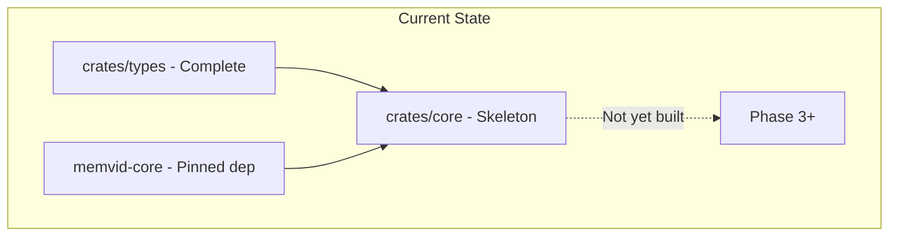
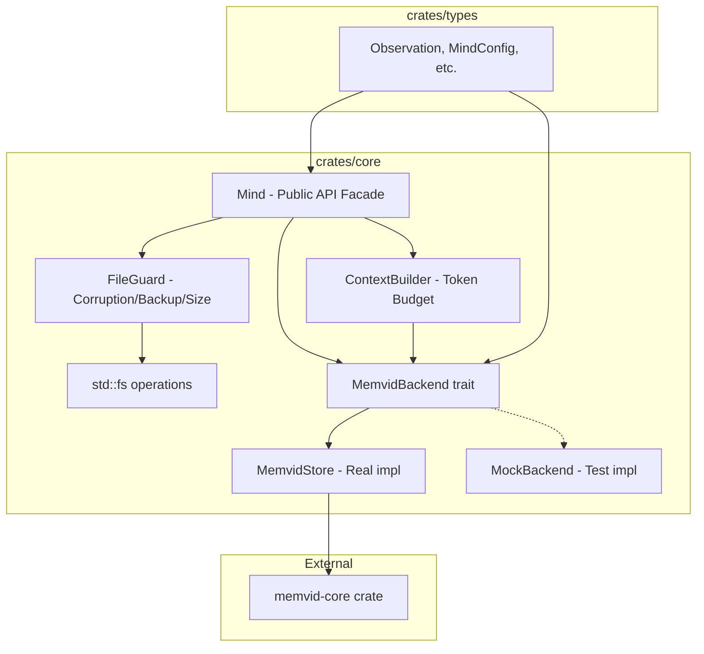
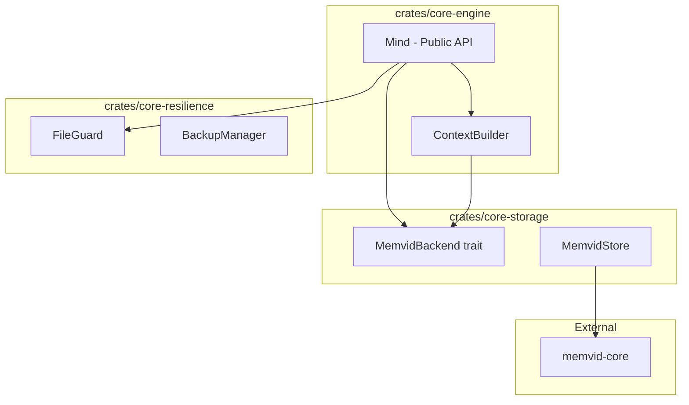
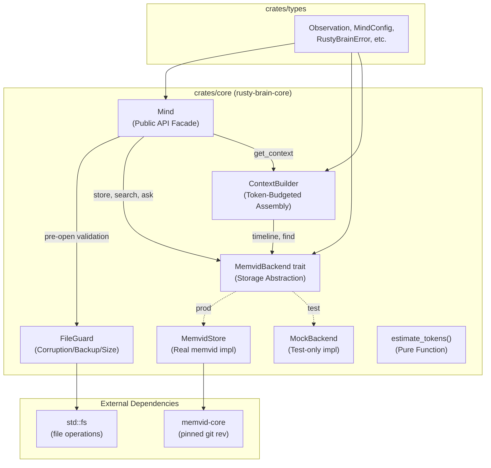
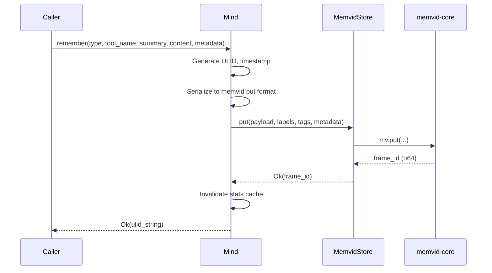
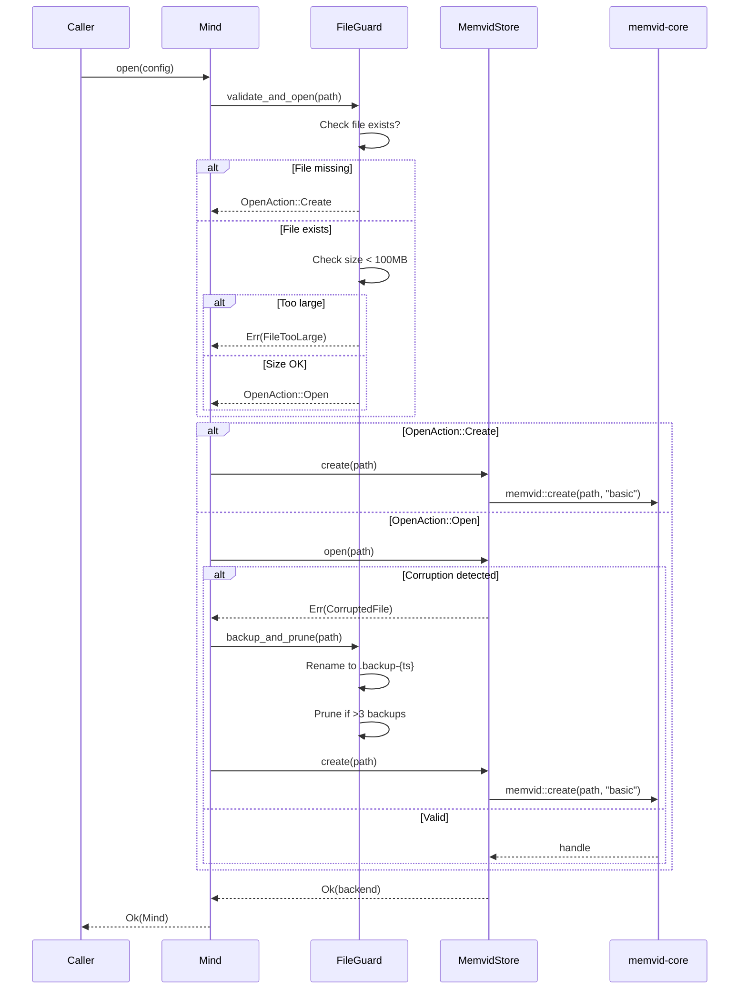
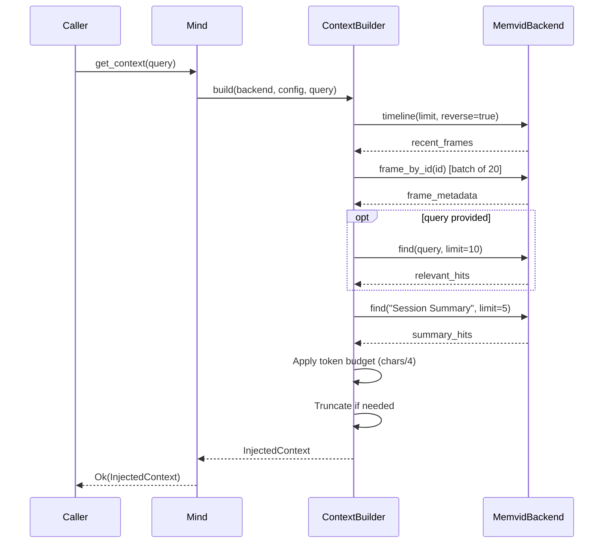
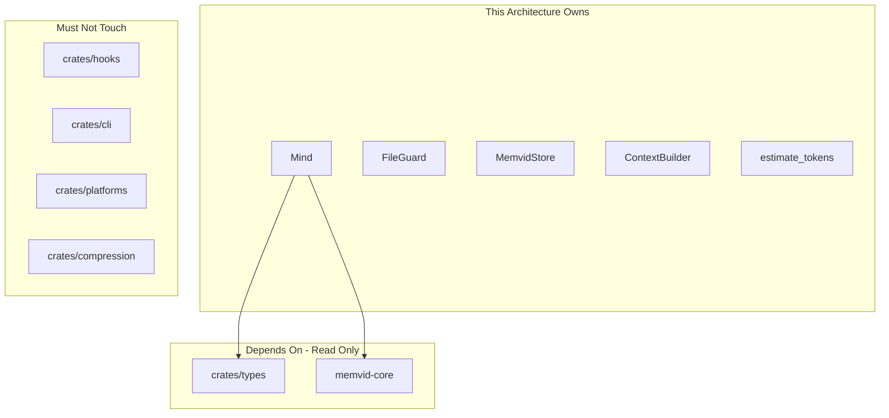

# 003-ar-core-memory-engine

> **Document Type:** Architecture Review
> **Audience:** LLM agents, human reviewers
> **Status:** Proposed
> **Last Updated:** 2026-03-01 <!-- @auto -->
> **Owner:** <!-- @human-required -->
> **Deciders:** <!-- @human-required -->

---

## Review Tier Legend

| Marker | Tier | Speckit Behavior |
|--------|------|------------------|
| 🔴 `@human-required` | Human Generated | Prompt human to author; blocks until complete |
| 🟡 `@human-review` | LLM + Human Review | LLM drafts → prompt human to confirm/edit; blocks until confirmed |
| 🟢 `@llm-autonomous` | LLM Autonomous | LLM completes; no prompt; logged for audit |
| ⚪ `@auto` | Auto-generated | System fills (timestamps, links); no prompt |

---

## Document Completion Order

> ⚠️ **For LLM Agents:** Complete sections in this order. Do not fill downstream sections until upstream human-required inputs exist.

1. **Summary (Decision)** → requires human input first
2. **Context (Problem Space)** → requires human input
3. **Decision Drivers** → requires human input (prioritized)
4. **Driving Requirements** → extract from PRD, human confirms
5. **Options Considered** → LLM drafts after drivers exist, human reviews
6. **Decision (Selected + Rationale)** → requires human decision
7. **Implementation Guardrails** → LLM drafts, human reviews
8. **Everything else** → can proceed after decision is made

---

## Linkage ⚪ `@auto`

| Document | ID | Relationship |
|----------|-----|--------------|
| Parent PRD | 003-prd-core-memory-engine.md | Requirements this architecture satisfies |
| Feature Spec | spec.md | User scenarios and functional requirements |
| Security Review | 003-sec-core-memory-engine.md | Security implications (pending) |
| Constitution | .specify/memory/constitution.md | Governing principles |
| Supersedes | — | N/A (greenfield) |
| Superseded By | — | — |

---

## Summary

### Decision 🔴 `@human-required`
> Implement the Core Memory Engine as a layered architecture within `crates/core`, with a `MemvidBackend` trait abstracting memvid access, the `Mind` struct as the public API facade, and a `FileGuard` module handling corruption recovery and backup management — all within a single crate.

### TL;DR for Agents 🟡 `@human-review`
> The Mind struct is a facade over three internal layers: storage abstraction (trait-based memvid wrapper), file management (corruption detection, backups, size guards), and context assembly (token-budgeted context building). All memvid types must stay behind the trait boundary — never exposed in the public API. All errors are `RustyBrainError` variants. The crate is `Send + Sync` safe but does NOT manage its own locking; locking is a separate concern layered on top.

---

## Context

### Problem Space 🔴 `@human-required`

The PRD requires a memory engine that stores, searches, and assembles context from AI agent observations backed by the memvid `.mv2` format. The architectural challenge is threefold:

1. **Memvid isolation**: The engine depends on `memvid-core` — an external crate whose API may evolve. Constitution II mandates that memvid be isolated behind clean Rust abstractions so upstream changes don't ripple. How do we structure this boundary?

2. **Resilience layering**: The engine must handle corrupted files (S-4), size guards (S-6), and backup management (S-5) before the memvid handle is even opened. This creates a multi-step initialization flow that must be separated from the core memory operations.

3. **Composability for downstream phases**: Phases 3 (Compression), 5 (Hooks), and 6 (CLI) all consume the engine. The public API surface must be clean enough that these consumers don't need to understand memvid internals, file recovery logic, or token budgeting implementation details.

### Decision Scope 🟡 `@human-review`

**This AR decides:**
- Internal module structure of `crates/core`
- How memvid is abstracted behind a trait boundary
- How file resilience (corruption, backups, size guard) is layered
- How the `Mind` public API delegates to internal components
- Concurrency model (`Send + Sync` constraints, locking strategy)

**This AR does NOT decide:**
- Types crate structure (Phase 1 — already decided)
- How downstream phases consume the engine (their own ARs)
- memvid crate selection or pinning strategy (already in Cargo.toml)
- CLI argument structure or hook binary design (Phases 5-6)

### Current State 🟢 `@llm-autonomous`

The `crates/core` crate exists as a skeleton with a placeholder test. The workspace is configured with `memvid-core` pinned at git revision `fbddef4`. The types crate (`crates/types`) is complete with `Observation`, `ObservationType`, `ObservationMetadata`, `SessionSummary`, `InjectedContext`, `MindConfig`, `MindStats`, and `RustyBrainError`.



### Driving Requirements 🟡 `@human-review`

| PRD Req ID | Requirement Summary | Architectural Implication |
|------------|---------------------|---------------------------|
| M-1 | Create new `.mv2` file with parent dirs | File management layer must handle path creation before delegating to memvid |
| M-2 | Store observations with ULID + metadata | Serialization layer between types crate structs and memvid `put` format |
| M-3 | Search via memvid `find` | Thin delegation through trait; result parsing from memvid format to `MemorySearchResult` |
| M-4 | Question-answering via memvid `ask` | Thin delegation through trait; answer extraction |
| M-5 | Context assembly with token budget | Dedicated context builder composing timeline, find, and summary queries |
| M-6 | Open existing `.mv2` file | File validation pipeline before memvid `open` |
| M-7 | All errors as `RustyBrainError` | Error conversion layer at trait boundary; no memvid errors leak |
| M-8 | Expose session ID, path, init status | Mind struct state accessors (no architectural complexity) |
| M-9 | Token estimation utility | Pure function, no architectural impact |
| S-1 | Session summaries as tagged observations | Specialization of M-2; summary-specific serialization |
| S-2 | Memory statistics | Stats computation from memvid timeline + frame info |
| S-3 | Stats caching with invalidation | Cache layer inside Mind; invalidated on `put` |
| S-4 | Corrupted file detection and recovery | Pre-open validation pipeline: detect → backup → recreate |
| S-5 | Backup retention (max 3) | File management layer: prune old backups on recovery |
| S-6 | 100MB size guard | Pre-open check before memvid attempt |
| C-1 | Cross-process file locking | Locking wrapper around Mind operations |
| C-2 | Singleton access pattern | Module-level `Mutex<Option<Arc<Mind>>>` |
| C-3 | Singleton reset for testing | `Mutex` clear with test-only API |

**PRD Constraints inherited:**
- Stable Rust only; `unsafe_code = "forbid"` (workspace lint)
- memvid pinned at specific git revision; upgrades require round-trip tests
- No memory contents logged at INFO or above
- All public output must be structured/machine-parseable
- Performance: Store/Search <500ms, Context/Stats <2s at 10K observations
- `Mind` must be `Send + Sync`

---

## Decision Drivers 🔴 `@human-required`

1. **Memvid isolation** — Upstream memvid API changes must not require changes to consumers of `crates/core` *(traces to PRD M-7, Constitution II)*
2. **Testability** — Every component must be testable in isolation, including without a real `.mv2` file *(traces to Constitution V)*
3. **Performance** — Store/Search <500ms, Context <2s at 10K observations *(traces to PRD SC-008, SC-009, SC-010)*
4. **Resilience** — Corrupted files never block the agent *(traces to PRD S-4, S-5, S-6)*
5. **Simplicity** — Minimum layers needed; single crate; well-understood Rust patterns *(traces to Constitution XII)*
6. **Downstream composability** — Clean API surface for Phases 3, 5, 6 *(traces to PRD scope boundaries)*

---

## Options Considered 🟡 `@human-review`

### Option 0: Status Quo / Do Nothing

**Description:** Leave `crates/core` as a skeleton. Downstream phases would need to call memvid directly or build their own wrappers.

| Driver | Rating | Notes |
|--------|--------|-------|
| Memvid isolation | ❌ Poor | Every consumer must understand memvid API directly |
| Testability | ❌ Poor | No abstraction means no mock-ability |
| Performance | ⚠️ Medium | Raw memvid calls are fast but no caching/optimization layer |
| Resilience | ❌ Poor | No corruption handling; consumers would each need to implement their own |
| Simplicity | ✅ Good | Zero code = zero complexity |
| Downstream composability | ❌ Poor | Duplicate logic across phases |

**Why not viable:** The entire purpose of Phase 2 is to build this engine. Every downstream phase depends on it. Doing nothing violates PRD M-1 through M-9 entirely.

---

### Option 1: Trait-Layered Architecture (Single Crate, Internal Modules)

**Description:** Implement `Mind` as a facade within `crates/core` using internal modules: a `MemvidBackend` trait for storage abstraction, a `FileGuard` module for corruption/backup/size-guard logic, and a `ContextBuilder` for token-budgeted context assembly. All modules are `pub(crate)` — only `Mind` and its methods are public.



| Driver | Rating | Notes |
|--------|--------|-------|
| Memvid isolation | ✅ Good | Trait boundary; memvid types never cross into public API |
| Testability | ✅ Good | Mock backend for unit tests; real backend for integration tests |
| Performance | ✅ Good | Thin trait dispatch (monomorphized or dynamic); caching at Mind level |
| Resilience | ✅ Good | FileGuard runs pre-open validation; Mind delegates after guard passes |
| Simplicity | ✅ Good | Single crate, 5-6 modules, well-understood patterns |
| Downstream composability | ✅ Good | Clean `Mind` API; consumers see no internals |

**Pros:**
- Single crate keeps compilation fast and avoids inter-crate dependency complexity
- Trait boundary enables mock testing without touching filesystem
- FileGuard is a pure pre-processing step — no entanglement with memvid operations
- ContextBuilder isolates the most complex logic (multi-query + token budgeting)
- `pub(crate)` visibility keeps internal modules private

**Cons:**
- Trait dispatch has marginal overhead (negligible for I/O-bound operations)
- Single crate means all code compiles together (not parallelizable across crates)

---

### Option 2: Multi-Crate Split (core-storage, core-engine, core-resilience)

**Description:** Split the core functionality across three sub-crates: `core-storage` (memvid abstraction), `core-resilience` (corruption/backup handling), and `core-engine` (Mind facade + context assembly). Each crate has its own Cargo.toml and test suite.



| Driver | Rating | Notes |
|--------|--------|-------|
| Memvid isolation | ✅ Good | Crate boundary enforces isolation at compile time |
| Testability | ✅ Good | Each crate testable independently |
| Performance | ✅ Good | Same runtime characteristics as Option 1 |
| Resilience | ✅ Good | Dedicated crate for resilience logic |
| Simplicity | ⚠️ Medium | 3 crates = 3 Cargo.tomls, inter-crate dependency management, version coordination |
| Downstream composability | ✅ Good | Same public API via core-engine |

**Pros:**
- Compile-time enforced boundaries between storage, resilience, and engine
- Parallel compilation of independent crates
- Each crate can be versioned and tested independently

**Cons:**
- Over-engineering for the current scope — module boundaries within one crate achieve the same isolation in practice
- More Cargo.toml files to maintain
- Inter-crate refactoring is harder than intra-crate refactoring
- Constitution XII (simplicity/pragmatism) favors single-crate approach
- Workspace already has 7 crates; adding 3 more increases cognitive overhead

---

## Decision

### Selected Option 🔴 `@human-required`
> **Option 1: Trait-Layered Architecture (Single Crate, Internal Modules)**

### Rationale 🔴 `@human-required`

Option 1 satisfies all decision drivers with the least complexity. The trait boundary provides the same memvid isolation benefits as Option 2's crate boundary, but without the overhead of managing multiple Cargo.toml files and inter-crate dependencies. Constitution XII explicitly favors extending existing patterns over introducing new structural complexity.

The single crate approach also aligns with the existing workspace structure — the workspace already has 7 crates with clear responsibility boundaries. Splitting `core` into 3 sub-crates would blur the clean phase-per-crate mapping established by the roadmap.

Module visibility (`pub(crate)`) provides sufficient encapsulation. If a future phase requires extracting a module into its own crate (e.g., if `core-storage` needs to be consumed independently), that refactoring is straightforward since the trait boundary already exists.

#### Simplest Implementation Comparison 🟡 `@human-review`

| Aspect | Simplest Possible | Selected Option | Justification for Complexity |
|--------|-------------------|-----------------|------------------------------|
| Modules | Single `mind.rs` with all logic inline | 5-6 modules (mind, backend trait, memvid_store, file_guard, context_builder, token) | FileGuard pre-processing (S-4/S-5/S-6) must not be entangled with memvid calls; context builder (M-5) is 50+ lines of multi-query + budgeting logic; a single file would exceed 800-line limit |
| Abstraction | Call memvid-core directly, no trait | `MemvidBackend` trait + `MemvidStore` impl | Constitution II mandates memvid isolation; trait enables mock testing (Constitution V); marginal complexity cost for significant testability gain |
| Error handling | `.map_err()` at each call site | Centralized conversion in `MemvidStore` impl | M-7 requires consistent `RustyBrainError` wrapping; centralizing conversion prevents forgotten wraps |
| Caching | No caching | Stats cache keyed on frame count | S-3 explicitly requires cached stats with invalidation; minimal impl (Option<MindStats> + frame_count check) |
| Dependencies | memvid-core only | memvid-core + ulid | ULID required per clarification (replaces workspace uuid for observation IDs) |

**Complexity justified by:** Every added layer traces directly to a PRD requirement or constitution mandate. The trait boundary (Constitution II, testability), FileGuard (S-4/S-5/S-6), and ContextBuilder (M-5) each address distinct requirements that cannot be simplified further without violating the spec.

### Architecture Diagram 🟡 `@human-review`



---

## Technical Specification

### Component Overview 🟡 `@human-review`

| Component | Responsibility | Interface | Dependencies |
|-----------|---------------|-----------|--------------|
| Mind | Public API facade; owns backend + config + session state; delegates all operations | `pub fn open/remember/search/ask/get_context/save_session_summary/stats` | MemvidBackend, FileGuard, ContextBuilder, crates/types |
| MemvidBackend | Trait defining storage operations abstracted from memvid | `pub(crate) trait` with `put/commit/find/ask/timeline/frame_by_id/stats` | crates/types |
| MemvidStore | Production implementation of MemvidBackend using memvid-core | Implements `MemvidBackend` | memvid-core |
| MockBackend | Test implementation of MemvidBackend using in-memory HashMap | Implements `MemvidBackend` | None (test-only) |
| FileGuard | Pre-open validation: size check, corruption detection, backup creation, backup pruning | `pub(crate) fn validate_and_open(path) -> Result<OpenAction>` | std::fs |
| ContextBuilder | Assembles InjectedContext from timeline + search + summaries within token budget | `pub(crate) fn build(backend, config, query) -> Result<InjectedContext>` | MemvidBackend, TokenUtil |
| TokenUtil | Pure function: `estimate_tokens(text) -> usize` (chars / 4) | `pub fn` | None |

### Data Flow 🟢 `@llm-autonomous`

#### Store Observation Flow



#### Open / Recovery Flow



#### Context Assembly Flow



### Interface Definitions 🟡 `@human-review`

```rust
// === Storage Abstraction (pub(crate)) ===
// NOTE: Authoritative signatures are in contracts/mind-api.rs.
// This section mirrors them for architectural context.

/// Actions FileGuard can recommend after pre-open validation
pub(crate) enum OpenAction {
    Create,           // No file exists; create new
    Open,             // File exists and passes guards
}

/// Abstraction over memvid operations. All memvid types stay behind this boundary.
/// Uses dynamic dispatch (`Box<dyn MemvidBackend>`) for simplicity — performance
/// overhead is negligible for I/O-bound operations.
pub(crate) trait MemvidBackend: Send + Sync {
    fn create(&self, path: &Path) -> Result<(), RustyBrainError>;
    fn open(&self, path: &Path) -> Result<(), RustyBrainError>;

    fn put(
        &self,
        payload: &[u8],
        labels: &[String],
        tags: &[String],
        metadata: &serde_json::Value,
    ) -> Result<u64, RustyBrainError>; // returns frame_id

    fn commit(&self) -> Result<(), RustyBrainError>;

    fn find(
        &self,
        query: &str,
        limit: usize,
    ) -> Result<Vec<SearchHit>, RustyBrainError>;

    fn ask(
        &self,
        question: &str,
        limit: usize,
    ) -> Result<String, RustyBrainError>;

    fn timeline(
        &self,
        limit: usize,
        reverse: bool,
    ) -> Result<Vec<TimelineEntry>, RustyBrainError>;

    fn frame_by_id(
        &self,
        frame_id: u64,
    ) -> Result<FrameInfo, RustyBrainError>;

    fn stats(&self) -> Result<BackendStats, RustyBrainError>;
}

/// Internal types used at the trait boundary (pub(crate))
pub(crate) struct SearchHit {
    pub text: String,
    pub score: f64,
    pub metadata: serde_json::Value,
    pub labels: Vec<String>,
    pub tags: Vec<String>,
}

pub(crate) struct TimelineEntry {
    pub frame_id: u64,
    pub preview: String,
    pub timestamp: Option<i64>,
}

pub(crate) struct FrameInfo {
    pub labels: Vec<String>,
    pub tags: Vec<String>,
    pub metadata: serde_json::Value,
    pub timestamp: Option<i64>,
}

pub(crate) struct BackendStats {
    pub frame_count: u64,
    pub file_size: u64,
}
```

### Key Algorithms/Patterns 🟡 `@human-review`

**Pattern: Pre-Open Validation Pipeline (FileGuard)**

```text
validate_and_open(path):
1. If path does not exist → return OpenAction::Create
2. Get file metadata
3. If file_size > 100MB → return Err(FileTooLarge)
4. Return OpenAction::Open

backup_and_prune(path, max_backups=3):
1. Rename path to {path}.backup-{YYYYMMDD-HHMMSS}
2. Glob for {path}.backup-*
3. Sort by timestamp descending
4. Delete entries beyond max_backups
```

**Pattern: Token-Budgeted Context Assembly (ContextBuilder)**

```text
build(backend, config, query):
1. budget_remaining = config.max_context_tokens
2. recent = backend.timeline(config.max_context_observations, reverse=true)
3. Enrich recent with frame_by_id (batches of 20)
4. Add recent observations to context, decrementing budget per observation
5. If query provided:
   a. relevant = backend.find(query, limit=config.max_relevant_memories)
   b. Add relevant hits to context, decrementing budget
6. summaries = backend.find("Session Summary", limit=5)
7. Add summaries to context, decrementing budget
8. If any single item exceeds remaining budget, truncate it
9. Return InjectedContext with token_count = total chars / 4
```

**Pattern: Stats Caching**

```text
stats():
1. If cached_stats exists AND cached_frame_count == backend.stats().frame_count:
   return cached_stats
2. Compute full stats from timeline iteration
3. Cache result with frame_count key
4. Return stats
```

---

## Constraints & Boundaries

### Technical Constraints 🟡 `@human-review`

**Inherited from PRD:**
- Stable Rust only; `unsafe_code = "forbid"` in workspace lints
- memvid-core pinned at git rev `fbddef4`; upgrades require round-trip testing
- Performance: Store/Search <500ms, Context/Stats <2s at 10K observations
- All errors as `RustyBrainError` with stable error codes
- No memory contents logged at INFO or above
- `Mind` must be `Send + Sync`

**Added by this Architecture:**
- All memvid types confined to `MemvidStore` implementation; never cross trait boundary
- Internal types (`SearchHit`, `TimelineEntry`, `FrameInfo`, `BackendStats`) use only stdlib + serde_json types
- `pub(crate)` visibility for all internal modules; only `Mind`, `estimate_tokens`, `get_mind`, `reset_mind` are `pub`
- New dependency: `ulid` crate (replaces workspace `uuid` for observation IDs per clarification)
- Stats cache invalidation on every `put` — no stale reads permitted

### Architectural Boundaries 🟡 `@human-review`



- **Owns:** All modules within `crates/core`
- **Depends on (read-only):** `crates/types` (shared types), `memvid-core` (storage)
- **Must not touch:** All other workspace crates (hooks, cli, platforms, compression, opencode)

### Implementation Guardrails 🟡 `@human-review`

> ⚠️ **Critical for LLM Agents:**

- [ ] **DO NOT** expose any `memvid-core` types in public API — all types at the boundary must be from `crates/types` or internal `pub(crate)` types *(Constitution II, PRD M-7)*
- [ ] **DO NOT** use `unwrap()`, `expect()`, or `panic!()` in library code — all fallible operations must return `Result<T, RustyBrainError>` *(PRD M-7, Constitution X)*
- [ ] **DO NOT** log observation content, summary text, or metadata values at `INFO` or above — use `DEBUG` or `TRACE` only *(Constitution IX, PRD Security)*
- [ ] **DO NOT** add network operations of any kind *(PRD W-4, Constitution IX)*
- [ ] **DO NOT** add `unsafe` code — workspace lint `unsafe_code = "forbid"` enforces this *(Constitution II)*
- [ ] **DO NOT** introduce interactive prompts — all inputs via config or method arguments *(Constitution III)*
- [ ] **MUST** use `RustyBrainError` for all error returns, wrapping memvid errors with `.map_err()` at the `MemvidStore` level *(PRD M-7)*
- [ ] **MUST** use ULID (not UUID) for observation identifiers *(Clarification session)*
- [ ] **MUST** implement `Send + Sync` for `Mind` — verify with compile-time assertions *(PRD C-1 prerequisite)*
- [ ] **MUST** invalidate stats cache on every `remember()` / `save_session_summary()` call *(PRD S-3)*
- [ ] **MUST** write tests before implementation for each component *(Constitution V)*
- [ ] **MUST** include memory round-trip tests: store → search → verify all fields *(Constitution V)*

---

## Consequences 🟡 `@human-review`

### Positive
- Trait boundary makes memvid upgrades a single-module change (MemvidStore only)
- Mock backend enables fast, deterministic unit tests without filesystem I/O
- FileGuard separation means corruption handling is testable without memvid
- Single-crate approach minimizes workspace complexity while maintaining internal modularity
- ContextBuilder isolation makes token budgeting logic independently testable and tunable
- Clean public API surface (Mind + 3 functions) gives downstream phases a stable contract

### Negative
- Trait dispatch introduces one level of indirection (negligible for I/O-bound ops but adds ~20 lines of boilerplate)
- Internal `pub(crate)` types (SearchHit, FrameInfo, etc.) must be maintained alongside the public types from `crates/types` — potential for drift
- Stats caching adds state management complexity to an otherwise stateless operation path

### Risks & Mitigations

| Risk | Likelihood | Impact | Mitigation |
|------|------------|--------|------------|
| memvid-core Rust API doesn't match assumed surface (create/open/put/commit/find/ask/timeline/frame_by_id/stats) | Med | High | Write trait + MemvidStore impl first; discover API gaps early; fall back to wrapping available methods |
| `MemvidBackend` trait becomes too fine-grained or too coarse as implementation reveals actual usage patterns | Low | Med | Start with 1:1 mapping of used memvid methods; refactor trait after first round of integration tests |
| Stats computation via full timeline iteration is too slow at 10K+ observations | Low | Med | Cache aggressively (S-3); if still slow, add incremental stats tracking in future iteration |
| Internal type drift between `pub(crate)` types and `crates/types` public types | Low | Low | Type conversion functions localized in Mind methods; review in code review |

---

## Implementation Guidance

### Suggested Implementation Order 🟢 `@llm-autonomous`

1. **MemvidBackend trait** — Define the trait with all methods; build MockBackend for testing
2. **TokenUtil** — `estimate_tokens()` pure function with unit tests
3. **FileGuard** — Validation pipeline + backup/prune logic with filesystem tests
4. **MemvidStore** — Real memvid-core implementation of the trait; integration tests
5. **Mind::open** — Wiring FileGuard → MemvidStore creation; open/create/recover flows
6. **Mind::remember** — Store observations with ULID generation
7. **Mind::search + Mind::ask** — Thin delegation with result parsing
8. **ContextBuilder + Mind::get_context** — Multi-query assembly with token budgeting
9. **Mind::save_session_summary** — Specialization of remember for session summaries
10. **Mind::stats** — Computation + caching with invalidation
11. **Singleton** — `get_mind()` / `reset_mind()` with `Mutex<Option<Arc<Mind>>>`
12. **Locking** — `with_lock()` wrapper using `fs2` or `fd-lock`

### Testing Strategy 🟢 `@llm-autonomous`

| Layer | Test Type | Coverage Target | Notes |
|-------|-----------|-----------------|-------|
| Unit | TokenUtil | 100% | Pure function; edge cases (empty string, very long string) |
| Unit | FileGuard | 90%+ | Temp dirs; corrupted file simulation; backup counting |
| Unit | ContextBuilder (with MockBackend) | 90%+ | Token budget enforcement; empty stores; single oversized observation |
| Unit | Mind methods (with MockBackend) | 90%+ | All public methods; error paths; stats caching |
| Integration | MemvidStore | 80%+ | Real .mv2 files; round-trip store→search→verify |
| Integration | Mind (with MemvidStore) | 80%+ | Full end-to-end flows; performance benchmarks at 10K |
| Integration | Concurrency | Key paths | Multi-process writes via lock; stale lock recovery |
| Performance | Benchmark | All targets | Store <500ms, Search <500ms, Context <2s, Stats <2s at 10K |

### Reference Implementations 🟡 `@human-review`

- TypeScript reference: `src/core/mind.ts` in original agent-brain (880 lines) *(internal — logic reference only; not matching format)*
- Memvid API surface table: RUST_ROADMAP.md "Memvid API Surface Used by Agent Brain"

### Anti-patterns to Avoid 🟡 `@human-review`

- **Don't:** Expose `memvid_core::Handle` or any memvid type in Mind's public API
  - **Why:** Constitution II violation; downstream consumers would need memvid knowledge
  - **Instead:** Use MemvidBackend trait methods that accept/return stdlib + crates/types types

- **Don't:** Implement locking inside Mind::remember/search/etc. directly
  - **Why:** Conflates concerns; makes single-process usage pay locking overhead
  - **Instead:** Locking is a separate `with_lock()` wrapper called by consumers who need it (hooks/CLI)

- **Don't:** Use `String` for observation IDs in internal code
  - **Why:** Loses type safety; easy to confuse with frame_ids or session_ids
  - **Instead:** Use the ULID type from the `ulid` crate; convert to String only at serialization boundary

- **Don't:** Iterate full timeline for every stats() call
  - **Why:** O(n) at 10K+ observations on every call violates performance target
  - **Instead:** Cache stats; invalidate on put; recompute only when frame count changes

---

## Compliance & Cross-cutting Concerns

### Security Considerations 🟡 `@human-review`
- **Authentication:** N/A — local file access; relies on OS file permissions
- **Authorization:** N/A — single-user local tool
- **Data handling:** Memory contents treated as potentially sensitive; no logging at INFO+; no network transmission; `.mv2` file permissions should be user-only (0600)

### Observability 🟢 `@llm-autonomous`
- **Logging:** Use `tracing` crate; `info!` for lifecycle events (open, close, backup); `debug!` for operation summaries (search query, result count); `trace!` for full content (only if `MEMVID_MIND_DEBUG=true`)
- **Metrics:** Stats computation provides built-in monitoring (total observations, sessions, file size, type distribution)
- **Tracing:** Span per public Mind method for timing; span per memvid backend call for isolating memvid latency

### Error Handling Strategy 🟢 `@llm-autonomous`

```
Error Category → Handling Approach
├── Memvid errors → Wrap in RustyBrainError::Storage with original as source
├── File I/O errors → Wrap in RustyBrainError::Io with path context
├── Corruption detected → RustyBrainError::CorruptedFile; trigger backup+recreate
├── File too large → RustyBrainError::FileTooLarge; reject before parse
├── Serialization errors → RustyBrainError::Serialization with context
├── Lock contention → Retry with exponential backoff; timeout → RustyBrainError::LockTimeout
└── Invalid config → RustyBrainError::Config at open() time
```

All error variants carry:
- Stable error code (machine-parseable)
- Human-readable message
- Source error chain (via `#[source]`)

---

## Migration Plan

N/A — greenfield implementation of `crates/core`. No existing functionality to migrate.

### Rollback Plan 🔴 `@human-required`

**Rollback Triggers:**
- memvid-core Rust API fundamentally incompatible with assumed surface (>50% methods don't exist or have incompatible signatures)
- Performance targets unachievable at the memvid layer (store or search >2x target at 10K)

**Rollback Decision Authority:** Project owner

**Rollback Time Window:** Any time before Phase 3 begins consuming the engine API

**Rollback Procedure:**
1. Revert `crates/core/src/` to skeleton
2. Evaluate memvid FFI approach (Option B from roadmap) or alternative storage backend
3. Create new AR for the revised approach

---

## Open Questions 🟡 `@human-review`

- [x] ~~Q1: Should the trait use static dispatch (generics) or dynamic dispatch (dyn)?~~ → Dynamic dispatch via `Box<dyn MemvidBackend>` for simplicity. Performance overhead is negligible for I/O-bound operations, and it avoids generic parameter propagation. Contracts and tasks already use `Box<dyn>`.
- [x] ~~Q2: Should locking be internal to Mind or external?~~ → External. Locking is a consumer concern (hooks need it, tests don't). Mind provides the operations; consumers wrap with `with_lock()` if needed.

No open questions blocking implementation.

---

## Changelog ⚪ `@auto`

| Version | Date | Author | Changes |
|---------|------|--------|---------|
| 0.1 | 2026-03-01 | Claude | Initial proposal from PRD + spec + clarifications |

---

## Decision Record ⚪ `@auto`

| Date | Event | Details |
|------|-------|---------|
| 2026-03-01 | Proposed | Initial draft created from PRD analysis |

---

## Traceability Matrix 🟢 `@llm-autonomous`

| PRD Req ID | Decision Driver | Option 1 Rating | Component | How Satisfied |
|------------|-----------------|-----------------|-----------|---------------|
| M-1 | Resilience | ✅ | FileGuard + Mind::open | FileGuard creates parent dirs; Mind delegates to MemvidStore::create |
| M-2 | Memvid isolation | ✅ | Mind::remember + MemvidStore | ULID generated in Mind; serialized through MemvidBackend::put |
| M-3 | Performance | ✅ | Mind::search + MemvidStore | Thin delegation through trait; result parsing in Mind |
| M-4 | Performance | ✅ | Mind::ask + MemvidStore | Thin delegation through trait; answer extraction in Mind |
| M-5 | Performance | ✅ | ContextBuilder | Dedicated component handles multi-query + token budgeting |
| M-6 | Resilience | ✅ | FileGuard + Mind::open | Pre-open validation ensures file is valid before memvid open |
| M-7 | Memvid isolation | ✅ | MemvidStore error wrapping | All memvid errors converted to RustyBrainError at trait impl level |
| M-8 | Simplicity | ✅ | Mind struct fields | Direct accessors on Mind state (session_id, path, initialized) |
| M-9 | Simplicity | ✅ | TokenUtil | Pure function; no component needed |
| S-1 | Memvid isolation | ✅ | Mind::save_session_summary | Specialization of put with session-specific tags/labels |
| S-2 | Performance | ✅ | Mind::stats | Computes from timeline iteration + frame info |
| S-3 | Performance | ✅ | Mind stats cache | Option<MindStats> + frame_count invalidation key |
| S-4 | Resilience | ✅ | FileGuard + Mind::open | Corruption detection → backup → recreate flow |
| S-5 | Resilience | ✅ | FileGuard::backup_and_prune | Glob + sort + delete beyond max_backups |
| S-6 | Resilience | ✅ | FileGuard::validate_and_open | Size check before any memvid attempt |
| C-1 | Testability | ✅ | with_lock wrapper | External to Mind; uses fs2/fd-lock; exponential backoff |
| C-2 | Downstream composability | ✅ | get_mind singleton | `Mutex<Option<Arc<Mind>>>` at module level |
| C-3 | Testability | ✅ | reset_mind | Clears the `Mutex<Option<...>>` for fresh instance on next call |

---

## Review Checklist 🟢 `@llm-autonomous`

Before marking as Accepted:
- [x] All PRD Must Have requirements appear in Driving Requirements
- [x] Option 0 (Status Quo) is documented
- [x] Simplest Implementation comparison is completed
- [x] Decision drivers are prioritized and addressed
- [x] At least 2 options were seriously considered (Option 1 + Option 2)
- [x] Constraints distinguish inherited vs. new
- [x] Component names are consistent across all diagrams and tables
- [x] Implementation guardrails reference specific PRD constraints
- [x] Rollback triggers and authority are defined
- [x] Security review is linked (pending creation)
- [x] No open questions blocking implementation

---

## Human Decisions Required

The following decisions need human input:

- [ ] Summary Decision (@human-required) - Select the architectural approach
- [ ] Problem Space (@human-required) - Validate the architectural challenge
- [ ] Decision Drivers (@human-required) - Confirm priority ordering
- [ ] Selected Option (@human-required) - Choose between presented options
- [ ] Rationale (@human-required) - Confirm trade-off reasoning
- [ ] Rollback Plan (@human-required) - Define rollback triggers and authority
- [ ] All @human-review sections - Review LLM-drafted technical details
