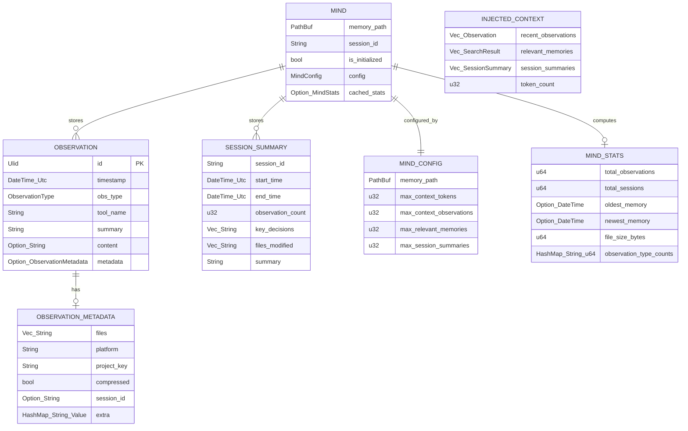

# Data Model: Core Memory Engine

**Branch**: `003-core-memory-engine` | **Date**: 2026-03-01

## Entity Overview

## Entity Details

### Mind (Runtime Engine Instance)

The central engine struct. One instance per `.mv2` file. Owns the memvid handle and provides all public operations.

| Field | Type | Description | Source | Validation |
|-------|------|-------------|--------|------------|
| `memory_path` | `PathBuf` | Resolved path to the `.mv2` file | `MindConfig.memory_path` | Must not resolve to system paths (/dev, /proc, /sys) per SEC-6 |
| `session_id` | `String` | Current session identifier | Auto-generated ULID on `open()` | Always present after initialization |
| `is_initialized` | `bool` | Whether engine is ready for operations | Set to `true` after successful `open()` | — |
| `config` | `MindConfig` | Active configuration snapshot | Caller-provided at `open()` | Validated on open |
| `cached_stats` | `Option<MindStats>` | Cached statistics, invalidated on `put` | Computed from timeline iteration | Cache key: frame count |
| `backend` | `Box<dyn MemvidBackend>` | Storage abstraction (not exposed publicly) | Created during `open()` | — |

**State transitions**: Unopened → Opening → Initialized (→ operations) → Dropped

### Observation (Core Memory Unit)

A single memory entry recorded by an agent. Immutable once created.

| Field | Type | Required | Description | Validation |
|-------|------|----------|-------------|------------|
| `id` | `Ulid` | Auto | Unique identifier, lexicographically sortable by time | Auto-generated via `ulid::Ulid::new()` |
| `timestamp` | `DateTime<Utc>` | Auto | When the observation was recorded | Auto-generated via `Utc::now()` |
| `obs_type` | `ObservationType` | Yes | Classification enum (10 variants) | Must be valid enum variant |
| `tool_name` | `String` | Yes | Tool that produced the observation | Must not be empty/whitespace |
| `summary` | `String` | Yes | Short human-readable summary | Must not be empty/whitespace (SEC-5) |
| `content` | `Option<String>` | No | Detailed content body | Optional; empty string treated as `None` |
| `metadata` | `Option<ObservationMetadata>` | No | Extensible metadata | Optional |

**Serialization format**: JSON with camelCase keys. `obs_type` serialized as `"type"`. Schema owned exclusively by Rust types crate (SC-007).

### ObservationType (Classification Enum)

10 variants, serialized as lowercase strings:

| Variant | Serialized | Description |
|---------|------------|-------------|
| Discovery | `"discovery"` | New insight or finding |
| Decision | `"decision"` | Architectural or design decision |
| Problem | `"problem"` | Issue identified |
| Solution | `"solution"` | Resolution applied |
| Pattern | `"pattern"` | Recurring pattern observed |
| Warning | `"warning"` | Risk or caveat |
| Success | `"success"` | Positive outcome |
| Refactor | `"refactor"` | Code refactoring |
| Bugfix | `"bugfix"` | Bug fix applied |
| Feature | `"feature"` | New feature implemented |

### ObservationMetadata (Extensible Context)

| Field | Type | Default | Description |
|-------|------|---------|-------------|
| `files` | `Vec<String>` | `[]` | Relevant file paths |
| `platform` | `String` | `""` | Platform identifier (darwin, linux) |
| `project_key` | `String` | `""` | Project scope key |
| `compressed` | `bool` | `false` | Whether content was compressed |
| `session_id` | `Option<String>` | `None` | Linking session identifier |
| `extra` | `HashMap<String, Value>` | `{}` | Arbitrary key-value pairs (flattened in JSON) |

### SessionSummary

A compressed record of one coding session, stored as a tagged observation.

| Field | Type | Required | Description |
|-------|------|----------|-------------|
| `session_id` | `String` | Yes | Session being summarized |
| `start_time` | `DateTime<Utc>` | Yes | Session start timestamp |
| `end_time` | `DateTime<Utc>` | Yes | Session end timestamp |
| `observation_count` | `u32` | Yes | Observations in session |
| `key_decisions` | `Vec<String>` | Yes | Decisions made |
| `files_modified` | `Vec<String>` | Yes | Files changed |
| `summary` | `String` | Yes | Human-readable summary |

**Storage**: Serialized to JSON and stored via `remember()` with `obs_type = Decision`, tagged with `session_id` and a `"session_summary"` tag for retrieval.

### MindConfig

| Field | Type | Default | Description |
|-------|------|---------|-------------|
| `memory_path` | `PathBuf` | Platform-dependent | Path to `.mv2` file |
| `max_context_tokens` | `u32` | `2000` | Token budget for context assembly |
| `max_context_observations` | `u32` | `20` | Max recent observations in context |
| `max_relevant_memories` | `u32` | `10` | Max relevant memories from `find` |
| `max_session_summaries` | `u32` | `5` | Max session summaries in context |

### MindStats

| Field | Type | Description |
|-------|------|-------------|
| `total_observations` | `u64` | Total stored observations |
| `total_sessions` | `u64` | Distinct sessions counted |
| `oldest_memory` | `Option<DateTime<Utc>>` | Earliest observation timestamp |
| `newest_memory` | `Option<DateTime<Utc>>` | Latest observation timestamp |
| `file_size_bytes` | `u64` | Size of `.mv2` file on disk |
| `observation_type_counts` | `HashMap<String, u64>` | Count per ObservationType variant |

### InjectedContext (Context Payload)

| Field | Type | Description |
|-------|------|-------------|
| `recent_observations` | `Vec<Observation>` | Most recent observations, newest first |
| `relevant_memories` | `Vec<Observation>` | Query-relevant hits from `find` |
| `session_summaries` | `Vec<SessionSummary>` | Recent session summaries |
| `token_count` | `u64` | Estimated token count of payload |

### MemorySearchResult

| Field | Type | Description |
|-------|------|-------------|
| `obs_type` | `ObservationType` | Type of matched observation |
| `summary` | `String` | Observation summary |
| `content_excerpt` | `Option<String>` | Truncated content preview |
| `timestamp` | `DateTime<Utc>` | When originally stored |
| `score` | `f64` | Relevance score from memvid |
| `tool_name` | `String` | Originating tool |

## Internal Types (pub(crate))

These types exist at the `MemvidBackend` trait boundary and are not part of the public API:

| Type | Purpose | Maps to memvid |
|------|---------|----------------|
| `SearchHit` | Raw search result from backend | `LexSearchHit` |
| `TimelineEntry` | Raw timeline entry from backend | memvid `TimelineEntry` |
| `FrameInfo` | Full frame metadata | memvid `Frame` |
| `BackendStats` | Raw statistics | memvid `Stats` |
| `OpenAction` | FileGuard validation result | N/A (internal enum) |

## Memvid Storage Mapping

How observation data maps to memvid `put_bytes` + `PutOptions`:

| Observation Field | memvid Target | Notes |
|-------------------|---------------|-------|
| `summary` + `content` | `put_bytes` payload | Concatenated as `"{summary}\n\n{content}"` UTF-8 bytes; enables lexical search |
| Full observation JSON | `PutOptions.metadata` | Complete JSON for lossless round-trip via `frame_by_id` |
| `obs_type` (as string) | `PutOptions.labels` | Enables filtering by type |
| `tool_name` | `PutOptions.tags` | Searchable tag |
| `metadata.session_id` | `PutOptions.tags` | If present, added as tag for session-scoped retrieval |
| `"session_summary"` | `PutOptions.tags` | Added for session summary observations |
