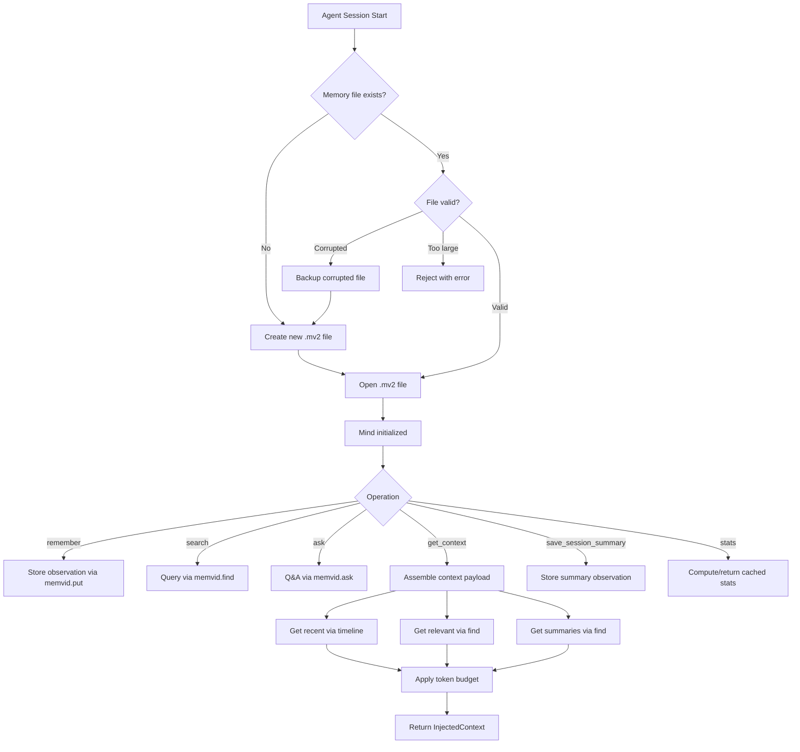
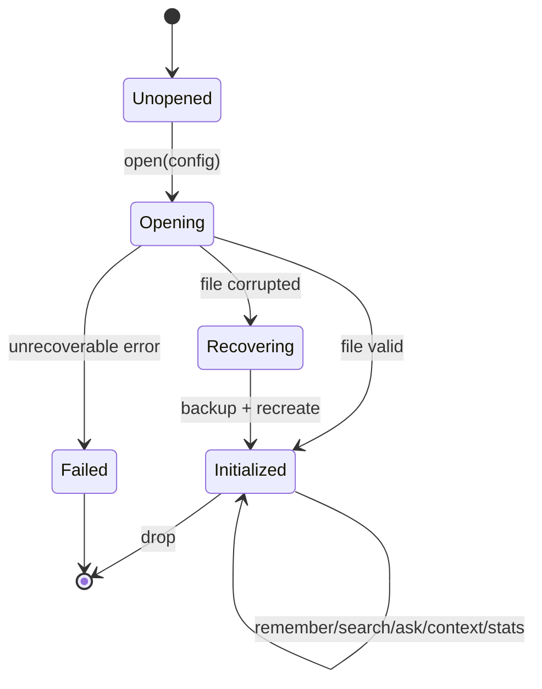
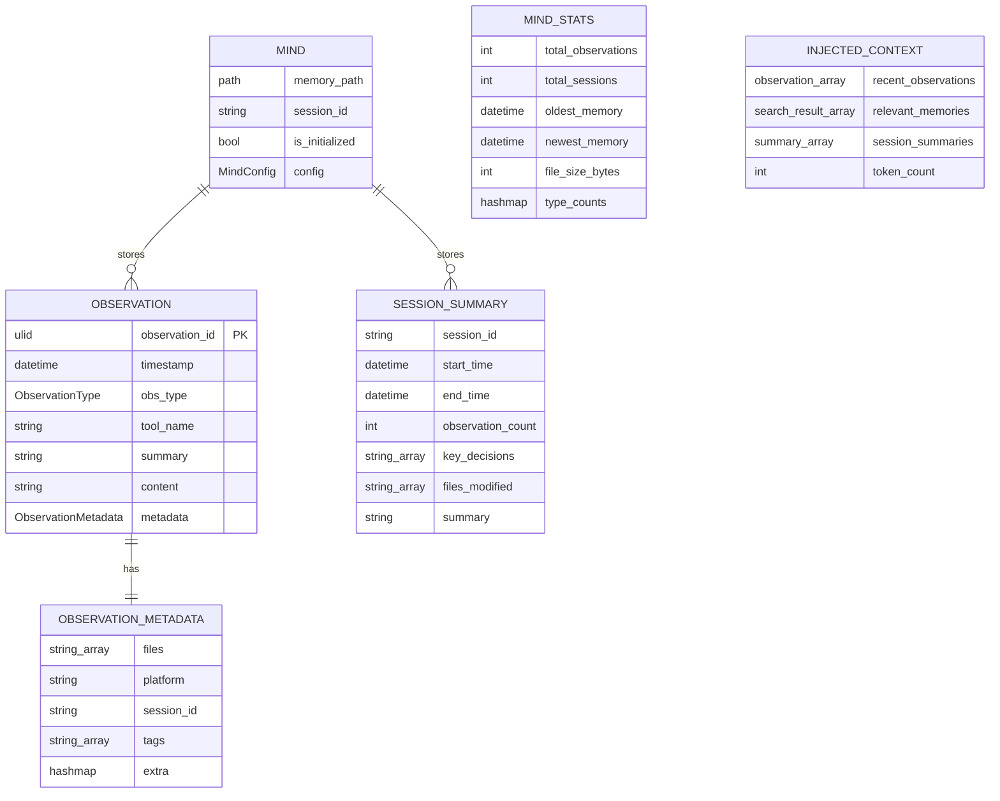
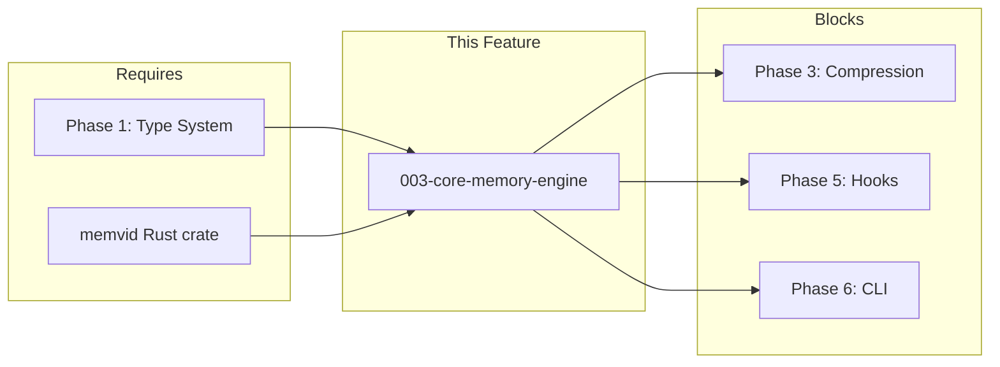

# 003-prd-core-memory-engine

> **Document Type:** Product Requirements Document
> **Audience:** LLM agents, human reviewers
> **Status:** Draft
> **Last Updated:** 2026-03-01 <!-- @auto -->
> **Owner:** <!-- @human-required -->

**Feature Branch**: `003-core-memory-engine`
**Created**: 2026-03-01
**Status**: Draft
**Input**: User description: "Review RUST_ROADMAP.md and let's create a spec for phase 2."

---

## Review Tier Legend

| Marker | Tier | Speckit Behavior |
|--------|------|------------------|
| 🔴 `@human-required` | Human Generated | Prompt human to author; blocks until complete |
| 🟡 `@human-review` | LLM + Human Review | LLM drafts → prompt human to confirm/edit; blocks until confirmed |
| 🟢 `@llm-autonomous` | LLM Autonomous | LLM completes; no prompt; logged for audit |
| ⚪ `@auto` | Auto-generated | System fills (timestamps, links); no prompt |

---

## Document Completion Order

> ⚠️ **For LLM Agents:** Complete sections in this order. Do not fill downstream sections until upstream human-required inputs exist.

1. **Context** (Background, Scope) → requires human input first
2. **Problem Statement & User Scenarios** → requires human input
3. **Requirements** (Must/Should/Could/Won't) → requires human input
4. **Technical Constraints** → human review
5. **Diagrams, Data Model, Interface** → LLM can draft after above exist
6. **Acceptance Criteria** → derived from requirements
7. **Everything else** → can proceed

---

## Context

### Background 🔴 `@human-required`

rusty-brain is a Rust rewrite of [agent-brain](https://github.com/brianluby/agent-brain/) — a memory system for AI coding agents. The Core Memory Engine is Phase 2 of the Rust roadmap, implementing the `Mind` struct that provides all memory operations (store, search, ask, context injection, session summaries, statistics) backed by the memvid Rust crate for native `.mv2` file storage. Phase 1 (Type System) established the shared types; this phase builds the operational heart of the system.

### Scope Boundaries 🟡 `@human-review`

**In Scope:**
- `Mind` struct implementation with all memory operations (remember, search, ask, get_context, save_session_summary, stats)
- Memvid Rust crate integration for native `.mv2` file I/O
- Corrupted file detection, backup, and recovery
- Cross-process file locking with retry/exponential backoff
- Singleton access pattern for multi-caller processes
- Token estimation utility (character count / 4)
- Unit and integration tests for all operations

**Out of Scope:**
- Tool-output compression — Phase 3 concern; core engine stores raw content
- Platform adapter system — Phase 4; engine is platform-agnostic
- Hook binaries that invoke the engine — Phase 5; engine provides the API, hooks consume it
- CLI commands — Phase 6; engine has no user-facing CLI
- Network operations of any kind — local-only by constitution
- Logging of memory contents at INFO level or above — per constitution IX
- TypeScript compatibility — Rust-only serialization schema per clarification session

### Glossary 🟡 `@human-review`

| Term | Definition |
|------|------------|
| Mind | The central memory engine struct that owns the memvid connection and provides all memory operations |
| Observation | A single recorded memory entry with type classification, summary, optional content, and extensible metadata |
| ObservationType | One of 10 variants: Discovery, Decision, Problem, Solution, Pattern, Warning, Success, Refactor, Bugfix, Feature |
| Session Summary | An aggregated record of one coding session including key decisions, modified files, and a human-readable summary |
| Injected Context | The payload assembled for session startup containing recent observations, relevant memories, and session summaries, bounded by a token budget |
| Memory Search Result | A search hit containing the matched observation's type, summary, content excerpt, timestamp, relevance score, and originating tool |
| Mind Statistics | A snapshot of the memory store's state including counts, timestamps, file size, and type distribution |
| ULID | Universally Unique Lexicographically Sortable Identifier — 26-char string encoding creation time; used for observation IDs |
| `.mv2` | Memvid's video-encoded memory storage file format |
| Token Budget | Maximum tokens allowed for context injection, estimated at 1 token per 4 characters |
| RustyBrainError | The unified error type with stable machine-parseable error codes wrapping all failure modes |

### Related Documents ⚪ `@auto`

| Document | Link | Relationship |
|----------|------|--------------|
| Feature Spec | spec.md | Detailed user scenarios and requirements |
| Architecture Review | ar.md | Defines technical approach |
| Security Review | sec.md | Risk assessment |
| Rust Roadmap | RUST_ROADMAP.md | Strategic context — Phase 2 |
| Constitution | .specify/memory/constitution.md | Governing principles |

---

## Problem Statement 🔴 `@human-required`

AI coding agents (Claude Code, OpenCode) lose all context between sessions. Every new session starts from zero — the agent cannot recall past decisions, discovered patterns, solved bugs, or session outcomes. This forces agents to re-explore codebases, repeat failed approaches, and lose track of long-running work.

The TypeScript agent-brain solves this, but it requires Node.js, introduces N-API overhead on every tool use, and has ~200ms cold-start latency for hook invocations. A native Rust implementation eliminates these costs: <5ms startup, direct memvid API access (no JS→N-API roundtrip), and single-binary distribution with no dependency management.

The Core Memory Engine is the foundation — without it, no other feature (compression, platform adapters, hooks, CLI) can function. It must provide reliable, performant store/search/context operations that downstream phases consume.

---

## User Scenarios & Testing 🔴 `@human-required`

### User Story 1 — Store and Retrieve Observations (Priority: P1)

An AI coding agent is working on a software project. As it uses tools (reads files, runs commands, edits code), each tool interaction generates an observation. The agent needs to store these observations persistently so they survive across sessions. In a later session, the agent needs to search past observations to recall decisions, solutions, and patterns discovered previously.

> As an AI coding agent, I want to store tool observations and retrieve them via search so that I can recall past decisions and patterns across sessions.

**Why this priority**: Without the ability to store and retrieve memories, no other feature in the system has value. This is the foundational capability that everything else builds upon.

**Independent Test**: Can be fully tested by storing a set of observations and then retrieving them via search queries, verifying that stored content is returned accurately with correct metadata.

**Acceptance Scenarios**:

1. **Given** a new project with no existing memory file, **When** the engine is initialized and an observation is stored, **Then** a new memory file is created at the configured path and the observation is persisted with its type, summary, content, metadata, and timestamp.
2. **Given** a memory file containing previously stored observations, **When** a search query is executed, **Then** matching observations are returned ranked by relevance, each including the observation type, summary, timestamp, and originating tool.
3. **Given** a memory file with observations across multiple sessions, **When** a question is asked against the memory store, **Then** a synthesized answer is returned based on relevant stored observations, or a clear "no relevant memories found" message if nothing matches.
4. **Given** an observation with all optional metadata fields populated (files, platform, session ID, tags), **When** the observation is retrieved, **Then** all metadata fields are preserved exactly as stored.

---

### User Story 2 — Provide Session Context on Startup (Priority: P1)

When an AI agent starts a new coding session, the memory engine automatically provides relevant context from past sessions. This includes recent observations, relevant memories matching the current project, and summaries of previous sessions. This context helps the agent resume work without losing track of prior decisions and discoveries.

> As an AI coding agent, I want to receive relevant context from past sessions at startup so that I can resume work without re-discovering prior decisions.

**Why this priority**: Context injection at session start is the primary consumer-facing value proposition. Without it, stored memories are useless to the agent.

**Independent Test**: Can be fully tested by populating a memory store with known observations and session summaries, then requesting context and verifying the returned payload contains the expected recent observations, relevant memories, and session summaries within the configured token budget.

**Acceptance Scenarios**:

1. **Given** a memory file with recent observations, **When** session context is requested, **Then** the most recent observations (up to the configured maximum) are included in the context payload, ordered from newest to oldest.
2. **Given** a memory file with observations and a specific query, **When** context is requested with that query, **Then** both recent observations and query-relevant memories (via memvid `find`, capped at 10 by default) are included, staying within the configured token budget.
3. **Given** a memory file containing session summaries, **When** context is requested, **Then** up to 5 of the most recent session summaries are included in the context payload.
4. **Given** a token budget of N tokens, **When** context is assembled, **Then** the total context payload does not exceed N tokens (estimated at 1 token per 4 characters).

---

### User Story 3 — Save Session Summaries (Priority: P2)

When an AI agent finishes a coding session, it generates a summary capturing the key decisions made, files modified, and overall accomplishments. This summary is stored as a special observation that can be retrieved in future sessions to provide high-level continuity.

> As an AI coding agent, I want to save a session summary at session end so that future sessions get high-level continuity.

**Why this priority**: Session summaries provide compressed, high-signal context that makes future session startups more useful. They depend on the core store/retrieve capability being in place.

**Independent Test**: Can be fully tested by saving a session summary with known decisions and file modifications, then searching for it and verifying it appears in session context.

**Acceptance Scenarios**:

1. **Given** an active session with a known session ID, **When** a session summary is saved with decisions, modified files, and a summary text, **Then** the summary is stored as a searchable observation tagged with the session ID.
2. **Given** multiple saved session summaries, **When** session context is requested, **Then** the most recent summaries are returned in reverse chronological order.

---

### User Story 4 — Report Memory Statistics (Priority: P2)

A developer or agent needs to understand the state of the memory store: how many observations are stored, how many sessions have been recorded, the time range of stored memories, file size, and the distribution of observation types.

> As a developer, I want to query memory statistics so that I can monitor growth and diagnose issues.

**Why this priority**: Statistics are essential for monitoring and debugging the memory system, but they don't block the core store/retrieve/context workflow.

**Independent Test**: Can be fully tested by populating a memory store with known observations across multiple sessions and types, then requesting stats and verifying all computed values match expectations.

**Acceptance Scenarios**:

1. **Given** a memory file with observations, **When** stats are requested, **Then** the response includes total observation count, total session count, oldest memory timestamp, newest memory timestamp, and file size.
2. **Given** observations of various types, **When** stats are requested, **Then** a breakdown of observation counts by type is included.
3. **Given** stats have been computed once, **When** stats are requested again without new observations, **Then** the cached result is returned without recomputation.

---

### User Story 5 — Handle Corrupted Memory Files Gracefully (Priority: P2)

A developer's memory file has become corrupted (disk error, interrupted write, manual tampering). When the engine attempts to open the file, it detects the corruption, creates a timestamped backup of the corrupted file, and initializes a fresh memory store so the agent can continue working without manual intervention.

> As a developer, I want the engine to recover automatically from corrupted memory files so that I am never permanently blocked.

**Why this priority**: Data resilience is critical for a system that accumulates long-term knowledge. Users must never be permanently blocked by a corrupted file.

**Independent Test**: Can be fully tested by providing a corrupted memory file, attempting to open the engine, and verifying a backup is created and a fresh store is initialized.

**Acceptance Scenarios**:

1. **Given** a corrupted memory file, **When** the engine attempts to open it, **Then** the corrupted file is renamed to `{filename}.backup-{timestamp}` and a fresh memory file is created.
2. **Given** 4 existing backup files from previous corruptions, **When** a new backup is created, **Then** only the 3 most recent backups are retained and the oldest is deleted.
3. **Given** a memory file larger than 100MB, **When** the engine attempts to open it, **Then** the file is rejected as likely corrupted before attempting to parse it.

---

### User Story 6 — Support Concurrent Access (Priority: P3)

Multiple agent processes may attempt to access the same memory file simultaneously (e.g., parallel worktrees, multiple terminal sessions). The engine must ensure data integrity through cross-process file locking with graceful retry behavior, preventing corruption from concurrent writes.

> As a power user with multiple agent sessions, I want concurrent access to be safe so that parallel work doesn't corrupt my memory file.

**Why this priority**: Concurrent access is an advanced scenario that only arises in power-user workflows. The core single-process flow must work first.

**Independent Test**: Can be fully tested by spawning multiple processes that attempt simultaneous writes and reads, verifying no data corruption occurs and all operations eventually succeed.

**Acceptance Scenarios**:

1. **Given** two processes attempting to write to the same memory file simultaneously, **When** one acquires the lock, **Then** the other retries with exponential backoff until the lock is released.
2. **Given** a lock is held by a process that has crashed, **When** another process attempts to acquire the lock, **Then** the OS releases the advisory flock on process exit and acquisition eventually succeeds (stale lock recovery is OS-provided via `flock` semantics, not application-level detection).
3. **Given** the engine is used in a multi-threaded application, **When** multiple threads access the engine concurrently, **Then** all operations are safe and no data races occur.

---

### Edge Cases 🟢 `@llm-autonomous`

- **EC-1** (M-1): When the configured memory path's parent directory does not exist, the engine creates it automatically.
- **EC-2** (M-1): When the memory file is on a read-only filesystem, the engine returns a clear error with a stable error code, not a panic.
- **EC-3** (M-3): When a search query returns no results, an empty result set is returned, not an error.
- **EC-4** (M-2): When an observation's content is empty, the engine accepts it (summary is the minimum required field).
- **EC-5** (M-5): When the token budget is exceeded by a single observation, that observation is truncated to fit within the budget.
- **EC-6** (M-1): When the memory file is deleted between operations, the engine detects the absence and recreates it on the next write operation.

---

## Assumptions & Risks 🟡 `@human-review`

### Assumptions
- [A-1] The `memvid` Rust crate (pinned in `Cargo.toml`) provides the native `.mv2` file operations: `create`, `open`, `put`, `commit`, `find`, `ask`, `timeline`, `frame_by_id`, and `stats` (verified in research.md Section 4).
- [A-2] The types crate (`crates/types`) is complete and provides all shared types: `Observation`, `ObservationType`, `ObservationMetadata`, `SessionSummary`, `InjectedContext`, `MindConfig`, `MindStats`, and `RustyBrainError`.
- [A-3] The `memvid` crate's `find` operation performs lexical search by default (no mode parameter required in the Rust API; verified in research.md Section 4).
- [A-4] File locking will use OS-level advisory locks (not mandatory locks).
- [A-5] Token estimation uses the simple heuristic of character count divided by 4, not a tokenizer model.
- [A-6] The 100MB file size guard is a heuristic for corruption detection, not a hard architectural limit.
- [A-7] Observation serialization schema is defined exclusively by the Rust types crate — no TypeScript compatibility required.

### Risks

| ID | Risk | Likelihood | Impact | Mitigation |
|----|------|------------|--------|------------|
| R-1 | memvid Rust crate API differs from TypeScript SDK API surface | Med | High | Pin memvid at specific git revision; write integration tests against actual API early |
| R-2 | Advisory file locks are not enforced on all filesystems (e.g., NFS) | Low | Med | Document supported filesystems; fail-open with warning on unsupported platforms |
| R-3 | memvid `find` lexical search quality may differ from TypeScript version | Low | Med | Benchmark search quality in integration tests; tune k parameter if needed |
| R-4 | 100MB file size guard may trigger false positives on legitimate large memory stores | Low | Low | Make threshold configurable in MindConfig; document the rationale |

---

## Feature Overview

### Flow Diagram 🟡 `@human-review`



### State Diagram 🟡 `@human-review`



---

## Requirements

### Must Have (M) — MVP, launch blockers 🔴 `@human-required`

- [ ] **M-1:** System shall create a new `.mv2` memory file when none exists at the configured path, including creating any missing parent directories (FR-001).
- [ ] **M-2:** System shall store observations with required fields (type, tool_name, summary) and optional fields (content, metadata including files, platform, session ID, and arbitrary key-value pairs), assigning a ULID and timestamp automatically (FR-003, FR-004).
- [ ] **M-3:** System shall support searching stored observations by text query via memvid `find`, returning results ranked by relevance with a configurable result limit (FR-005).
- [ ] **M-4:** System shall support question-answering against stored observations via memvid `ask`, returning a synthesized answer or a "no relevant memories found" fallback (FR-006).
- [ ] **M-5:** System shall assemble session context containing recent observations, query-relevant memories (memvid `find`, capped at configurable max defaulting to 10), and session summaries, all within a configurable token budget (FR-007).
- [ ] **M-6:** System shall open an existing memory file and make its contents available for all operations (FR-002).
- [ ] **M-7:** All errors shall carry stable, machine-parseable error codes via `RustyBrainError`, with memvid errors wrapped preserving the original as error source (FR-021).
- [ ] **M-8:** System shall expose session identifier, resolved memory file path, and initialization status for diagnostic and operational use (FR-015, FR-016, FR-017).
- [ ] **M-9:** System shall provide a token estimation utility (character count / 4) for context budget enforcement (FR-018).

### Should Have (S) — High value, not blocking 🔴 `@human-required`

- [ ] **S-1:** System shall store session summaries as tagged, searchable observations containing session ID, decisions, modified files, and summary text (FR-008).
- [ ] **S-2:** System shall compute and return memory statistics including total observations, total sessions, timestamp range, file size, and per-type observation counts (FR-009).
- [ ] **S-3:** System shall cache computed statistics and invalidate the cache when new observations are stored (FR-010).
- [ ] **S-4:** System shall detect corrupted memory files on open, create timestamped backups, and initialize fresh stores without user intervention (FR-011).
- [ ] **S-5:** System shall retain at most 3 backup files, pruning older ones automatically (FR-012).
- [ ] **S-6:** System shall reject memory files exceeding 100MB as a corruption safeguard before attempting to parse them (FR-013).

### Could Have (C) — Nice to have, if time permits 🟡 `@human-review`

- [ ] **C-1:** System shall provide cross-process file locking with retry and exponential backoff to prevent concurrent write corruption (FR-014).
- [ ] **C-2:** System shall support a singleton access pattern allowing multiple callers within the same process to share one engine instance (FR-019).
- [ ] **C-3:** System shall support resetting the singleton instance for testing purposes (FR-020).

### Won't Have (W) — Explicitly deferred 🟡 `@human-review`

- [ ] **W-1:** TypeScript agent-brain `.mv2` file compatibility — *Reason: Rust-only serialization schema per clarification; no obligation to match TS format*
- [ ] **W-2:** Tool-output compression — *Reason: Phase 3 scope*
- [ ] **W-3:** Platform adapter integration — *Reason: Phase 4 scope*
- [ ] **W-4:** Network/remote memory operations — *Reason: local-only by constitution*
- [ ] **W-5:** Semantic/vector search modes — *Reason: lexical search only for initial implementation*

---

## Technical Constraints 🟡 `@human-review`

- **Language/Framework:** Stable Rust only; `unsafe` requires architecture justification and sign-off per constitution II
- **Storage Backend:** memvid Rust crate (pinned at specific git revision in `Cargo.toml`); upgrades require round-trip correctness testing per constitution XIII
- **Performance:** Store: <500ms, Search: <500ms, Context assembly: <2s, Stats: <2s — all at 10K observations
- **Error Handling:** All errors via `RustyBrainError` with stable error codes; no panics escape to callers
- **Concurrency Safety:** `Mind` must be `Send + Sync` safe for multi-threaded consumers
- **Isolation:** memvid must be isolated behind clean Rust abstractions (traits/wrappers) per constitution II
- **Security:** No memory contents logged at INFO or above without explicit opt-in; no secrets in memory store or output
- **Output:** All public APIs must produce structured, machine-parseable output per constitution III
- **Dependencies:** New dependencies require plan-level justification per constitution XIII; expected: `ulid`, `fs2`/`fd-lock`

---

## Data Model 🟡 `@human-review`



---

## Interface Contract 🟡 `@human-review`

```rust
// Core engine interface (trait-level contract)

pub struct Mind { /* memvid handle, config, session state */ }

impl Mind {
    pub fn open(config: MindConfig) -> Result<Mind, RustyBrainError>;
    pub fn remember(
        &self,
        obs_type: ObservationType,
        tool_name: &str,
        summary: &str,
        content: Option<&str>,
        metadata: Option<&ObservationMetadata>,
    ) -> Result<String, RustyBrainError>; // returns observation ULID

    pub fn search(
        &self,
        query: &str,
        limit: Option<usize>,
    ) -> Result<Vec<MemorySearchResult>, RustyBrainError>;

    pub fn ask(
        &self,
        question: &str,
    ) -> Result<String, RustyBrainError>;

    pub fn get_context(
        &self,
        query: Option<&str>,
    ) -> Result<InjectedContext, RustyBrainError>;

    pub fn save_session_summary(
        &self,
        decisions: Vec<String>,
        files_modified: Vec<String>,
        summary: &str,
    ) -> Result<String, RustyBrainError>;

    pub fn stats(&self) -> Result<MindStats, RustyBrainError>;
    pub fn session_id(&self) -> &str;
    pub fn memory_path(&self) -> &Path;
    pub fn is_initialized(&self) -> bool;
}

// Singleton access
pub fn get_mind(config: MindConfig) -> Result<Arc<Mind>, RustyBrainError>;
pub fn reset_mind(); // for testing

// Token utility
pub fn estimate_tokens(text: &str) -> usize; // chars / 4
```

---

## Evaluation Criteria 🟡 `@human-review`

| Criterion | Weight | Metric | Target | Notes |
|-----------|--------|--------|--------|-------|
| Correctness | Critical | Store/retrieve fidelity | 100% field preservation | SC-001 |
| Performance — Store | High | Latency at 10K obs | <500ms | SC-008 |
| Performance — Search | High | Latency at 10K obs | <500ms | SC-009 |
| Performance — Context | High | Latency at 10K obs | <2s | SC-010 |
| Performance — Stats | High | Latency at 10K obs | <2s | SC-005 |
| Token Budget | High | Context size vs budget | ≤5% overshoot | SC-002 |
| Resilience | High | Corruption recovery | Automatic, zero intervention | SC-003 |
| Error Quality | High | Structured error rate | 100% stable codes | SC-006 |
| Concurrency | Med | Data integrity under contention | Zero corruption / 100 writes | SC-004 |

---

## Tool/Approach Candidates 🟡 `@human-review`

| Option | License | Pros | Cons | Spike Result |
|--------|---------|------|------|--------------|
| memvid Rust crate (direct dependency) | MIT | Best performance, type safety, compile-time checks, same `.mv2` format | Tight coupling to memvid internals | Preferred per roadmap Option A |
| libmemvid FFI (shared library) | MIT | Works if crate isn't published separately | More fragile, manual bindings, unsafe FFI | Fallback per roadmap Option B |

### Selected Approach 🔴 `@human-required`

> **Decision:** Direct memvid Rust crate dependency (Option A from roadmap)
> **Rationale:** The memvid SDK is already Rust — calling the engine directly provides best performance, full type safety, and compile-time guarantees. The crate is pinned at a specific git revision for stability per constitution XIII.

---

## Acceptance Criteria 🟡 `@human-review`

| AC ID | Requirement | User Story | Given | When | Then |
|-------|-------------|------------|-------|------|------|
| AC-1 | M-1 | US-1 | No memory file exists | Engine initialized and observation stored | New `.mv2` file created with observation persisted |
| AC-2 | M-2 | US-1 | Engine initialized | Observation stored with all fields | ULID assigned, all fields preserved on retrieval |
| AC-3 | M-3 | US-1 | Memory file with observations | Search query executed | Relevant results returned ranked by relevance |
| AC-4 | M-4 | US-1 | Memory file with observations | Question asked | Synthesized answer or "no relevant memories" returned |
| AC-5 | M-5 | US-2 | Memory file with observations | Context requested with query | Recent + relevant + summaries within token budget |
| AC-6 | M-5 | US-2 | Token budget of N | Context assembled | Payload ≤ N tokens (±5%) |
| AC-7 | M-6 | US-1 | Existing memory file | Engine opened | All operations available |
| AC-8 | M-7 | US-1 | Any operation fails | Error returned | `RustyBrainError` with stable error code |
| AC-9 | M-8 | US-1 | Engine initialized | Session ID / path / status queried | Correct values returned |
| AC-10 | S-1 | US-3 | Active session | Session summary saved | Stored as searchable observation with session tag |
| AC-11 | S-2 | US-4 | Memory file with observations | Stats requested | Correct counts, timestamps, file size, type breakdown |
| AC-12 | S-3 | US-4 | Stats computed, no new observations | Stats requested again | Cached result returned |
| AC-13 | S-4 | US-5 | Corrupted memory file | Engine attempts open | Backup created, fresh store initialized |
| AC-14 | S-5 | US-5 | 4 existing backups | New backup created | Only 3 most recent retained |
| AC-15 | S-6 | US-5 | Memory file >100MB | Engine attempts open | File rejected before parsing |
| AC-16 | C-1 | US-6 | Two processes writing simultaneously | One acquires lock | Other retries with exponential backoff |

---

## Dependencies 🟡 `@human-review`



- **Requires:** Phase 1 (Type System) — all shared types must be finalized and passing tests
- **Requires:** memvid Rust crate — pinned at specific git revision in `Cargo.toml`
- **Blocks:** Phase 3 (Compression), Phase 5 (Hooks), Phase 6 (CLI)
- **External:** Cross-platform file locking crate (`fs2` or `fd-lock`)

---

## Security Considerations 🟡 `@human-review`

| Aspect | Assessment | Notes |
|--------|------------|-------|
| Internet Exposure | No | Local-only by constitution; no network operations |
| Sensitive Data | Yes | Memory contents may contain code snippets, decisions, patterns — treated as potentially sensitive |
| Authentication Required | No | Local file access only; relies on OS file permissions |
| Security Review Required | Yes | Link to sec.md when created |

Additional considerations per constitution IX:
- No memory data logged at INFO level or above without explicit opt-in
- Secret material (API keys, tokens) must not be stored in the memory system
- File permissions on `.mv2` files should restrict access to the owning user

---

## Implementation Guidance 🟢 `@llm-autonomous`

### Suggested Approach
- Wrap memvid behind a trait abstraction so upstream API changes don't ripple (constitution II)
- Use `ulid` crate for observation ID generation (per clarification)
- Implement `Mind::open` as the primary entry point handling create/open/recover flow
- Stats caching keyed on frame count — invalidate on any `put` operation
- Token estimation as a standalone pure function, not a method on Mind

### Anti-patterns to Avoid
- Do not expose memvid types in the public API — all types must be from `crates/types`
- Do not use `unwrap()` or `expect()` in library code — always propagate via `Result`
- Do not log observation content at INFO or above
- Do not use `unsafe` without architecture review
- Do not add network capability under any circumstances

### Reference Examples
- TypeScript reference: `src/core/mind.ts` (880 lines) in the original agent-brain
- Memvid API surface: see RUST_ROADMAP.md "Memvid API Surface Used by Agent Brain" table

---

## Spike Tasks 🟡 `@human-review`

- [x] **Spike-1:** Verify memvid Rust crate API matches expected surface (`create`, `open`, `put`, `commit`, `find`, `ask`, `timeline`, `frame_by_id`, `stats`) — *Resolved: verified in research.md Section 4*
- [ ] **Spike-2:** Validate advisory file locking behavior on macOS and Linux with `fs2` or `fd-lock` — *Informs C-1 implementation*

---

## Success Metrics 🔴 `@human-required`

| Metric | Baseline | Target | Measurement Method |
|--------|----------|--------|-------------------|
| Store/retrieve fidelity | N/A | 100% field preservation | Round-trip integration tests |
| Store latency (10K obs) | N/A | <500ms p95 | Benchmark test |
| Search latency (10K obs) | N/A | <500ms p95 | Benchmark test |
| Context assembly latency (10K obs) | N/A | <2s p95 | Benchmark test |
| Token budget accuracy | N/A | ≤5% overshoot | Integration tests with measured payloads |
| Corruption recovery | N/A | 100% automatic | Fault injection tests |
| Error code coverage | N/A | 100% stable codes | Exhaustive error path tests |

### Technical Verification 🟢 `@llm-autonomous`

| Metric | Target | Verification Method |
|--------|--------|---------------------|
| Test coverage for Must Have ACs | >90% | `cargo test` + coverage tool |
| No Critical/High security findings | 0 | Security review (sec.md) |
| Zero clippy warnings | 0 | `cargo clippy -- -D warnings` |
| Format compliance | 100% | `cargo fmt --check` |
| All quality gates pass | 4/4 | CI pipeline |

---

## Definition of Ready 🔴 `@human-required`

### Readiness Checklist
- [x] Problem statement reviewed and validated by stakeholder
- [x] All Must Have requirements have acceptance criteria
- [x] Technical constraints are explicit and agreed
- [x] Dependencies identified and owners confirmed
- [ ] Security review completed (or N/A documented with justification)
- [x] No open questions blocking implementation

### Sign-off
| Role | Name | Date | Decision |
|------|------|------|----------|
| Product Owner | | YYYY-MM-DD | [Ready / Not Ready] |

---

## Changelog ⚪ `@auto`

| Version | Date | Author | Changes |
|---------|------|--------|---------|
| 0.1 | 2026-03-01 | Claude | Initial draft from spec.md + clarification session |

---

## Decision Log 🟡 `@human-review`

| Date | Decision | Rationale | Alternatives Considered |
|------|----------|-----------|------------------------|
| 2026-03-01 | Rust-only serialization schema | Clean break from TS; types crate owns format | Match TS agent-brain JSON schema |
| 2026-03-01 | ULID for observation IDs | Sortable by time, 128-bit unique, compact 26-char string | UUID v4 (not sortable), sequential u64 (not globally unique) |
| 2026-03-01 | memvid `find` directly for relevance | Simple, avoids reimplementing search; configurable max (default 10) | Score thresholding, recency-weighted re-ranking |
| 2026-03-01 | `RustyBrainError` wrapping memvid errors | Insulates callers from memvid internals; preserves original as source | Per-operation error variants, transparent passthrough |
| 2026-03-01 | Explicit latency targets at 10K | Prevents regression; informs architecture decisions | Defer to profiling (less predictable) |

---

## Open Questions 🟡 `@human-review`

- [x] ~~Q1: Observation serialization format~~ → Resolved: Rust-only schema
- [x] ~~Q2: Observation ID format~~ → Resolved: ULID
- [x] ~~Q3: Context relevance strategy~~ → Resolved: memvid `find` direct
- [x] ~~Q4: Error propagation strategy~~ → Resolved: `RustyBrainError` wrapping
- [x] ~~Q5: Performance targets~~ → Resolved: Store/Search 500ms, Context/Stats 2s

No open questions remain blocking implementation.

---

## Review Checklist 🟢 `@llm-autonomous`

Before marking as Approved:
- [x] All requirements have unique IDs (M-1..M-9, S-1..S-6, C-1..C-3, W-1..W-5)
- [x] All Must Have requirements have linked acceptance criteria
- [x] User stories are prioritized and independently testable
- [x] Acceptance criteria reference both requirement IDs and user stories
- [x] Glossary terms are used consistently throughout
- [x] Diagrams use terminology from Glossary
- [x] Security considerations documented
- [x] Definition of Ready checklist is complete (pending security review)
- [x] No open questions blocking implementation

---

## Human Review Required

The following sections need human review or input:

- [ ] Background (@human-required) — Verify business context
- [ ] Problem Statement (@human-required) — Validate problem framing
- [ ] User Stories (@human-required) — Confirm priorities and acceptance scenarios
- [ ] Must Have Requirements (@human-required) — Validate MVP scope
- [ ] Should Have Requirements (@human-required) — Confirm priority
- [ ] Selected Approach (@human-required) — Decision needed
- [ ] Success Metrics (@human-required) — Define targets
- [ ] Definition of Ready (@human-required) — Complete readiness checklist
- [ ] All @human-review sections — Review LLM-drafted content
