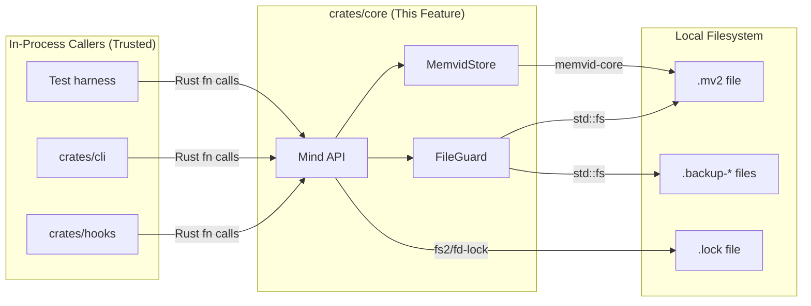
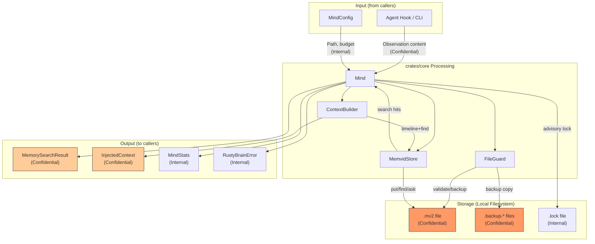
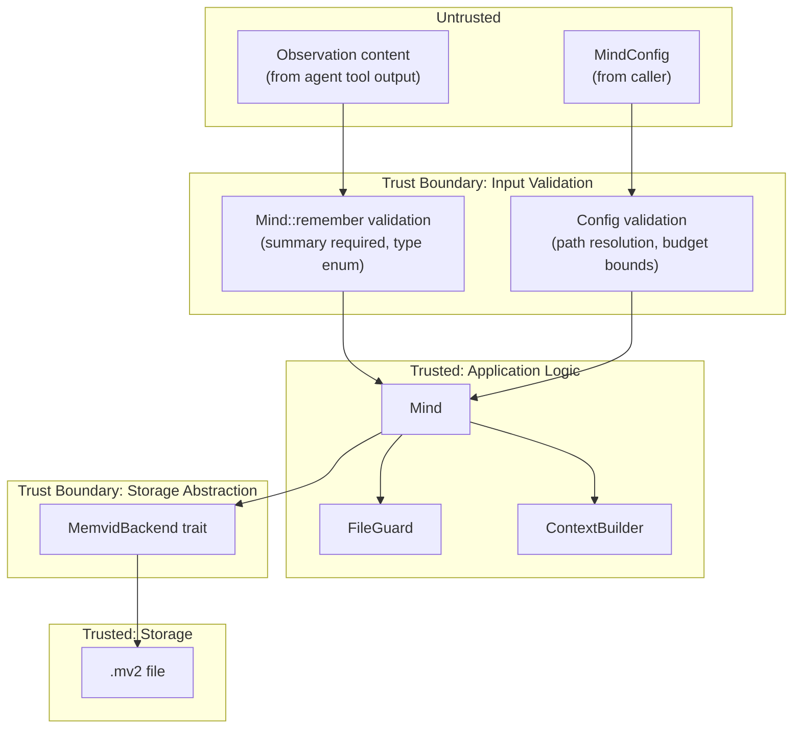

# 003-sec-core-memory-engine

> **Document Type:** Security Review (Lightweight)
> **Audience:** LLM agents, human reviewers
> **Status:** Draft
> **Last Updated:** 2026-03-01 <!-- @auto -->
> **Reviewer:** <!-- @human-required -->
> **Risk Level:** Low <!-- @human-required -->

---

## Review Tier Legend

| Marker | Tier | Speckit Behavior |
|--------|------|------------------|
| 🔴 `@human-required` | Human Generated | Prompt human to author; blocks until complete |
| 🟡 `@human-review` | LLM + Human Review | LLM drafts → prompt human to confirm/edit; blocks until confirmed |
| 🟢 `@llm-autonomous` | LLM Autonomous | LLM completes; no prompt; logged for audit |
| ⚪ `@auto` | Auto-generated | System fills (timestamps, links); no prompt |

---

## Severity Definitions

| Level | Label | Definition |
|-------|-------|------------|
| 🔴 | **Critical** | Immediate exploitation risk; data breach or system compromise likely |
| 🟠 | **High** | Significant risk; exploitation possible with moderate effort |
| 🟡 | **Medium** | Notable risk; exploitation requires specific conditions |
| 🟢 | **Low** | Minor risk; limited impact or unlikely exploitation |

---

## Linkage ⚪ `@auto`

| Document | ID | Relationship |
|----------|-----|--------------|
| Parent PRD | 003-prd-core-memory-engine.md | Feature being reviewed |
| Architecture Review | 003-ar-core-memory-engine.md | Technical implementation (Option 1: Trait-Layered Architecture) |

---

## Purpose

This is a **lightweight security review** intended to catch obvious security concerns early in the product lifecycle. It is NOT a comprehensive threat model. Full threat modeling should occur during implementation when infrastructure-as-code and concrete implementations exist.

**This review answers three questions:**
1. What does this feature expose to attackers?
2. What data does it touch, and how sensitive is that data?
3. What's the impact if something goes wrong?

**Scope of this review:**
- ✅ Attack surface identification
- ✅ Data classification
- ✅ High-level CIA assessment
- ❌ Detailed threat enumeration (deferred to implementation)
- ❌ Penetration testing (deferred to implementation)
- ❌ Compliance audit (separate process)

---

## Feature Security Summary

### One-line Summary 🔴 `@human-required`
> A local-only Rust library that stores and retrieves AI agent observations in `.mv2` files on the local filesystem, with no network exposure, no authentication system, and no user-facing endpoints.

### Risk Assessment 🔴 `@human-required`
> **Risk Level:** Low
> **Justification:** Entirely local file operations with no network surface, no external service calls, and no user-facing interface. Security relies on OS-level file permissions. The primary concern is that stored observations may inadvertently contain sensitive data (API keys in tool output), but this is a data-handling concern, not an exploitation vector.

---

## Attack Surface Analysis

### Exposure Points 🟡 `@human-review`

| Exposure Type | Details | Authentication | Authorization | Notes |
|---------------|---------|----------------|---------------|-------|
| **None** | **Feature has no external exposure** | — | — | Library crate consumed by other Rust crates; no network, no CLI, no HTTP endpoints |
| Local File I/O | `.mv2` file reads/writes at configured path | N/A — OS file permissions | N/A — OS file permissions | Path provided via `MindConfig`; engine creates parent dirs |
| Local File I/O | `.backup-{timestamp}` files during corruption recovery | N/A — OS file permissions | N/A — OS file permissions | Backup files inherit parent directory permissions |
| Local File I/O | `.lock` file for cross-process locking | N/A — OS file permissions | N/A — OS file permissions | Advisory lock via `fs2`/`fd-lock` |
| API Surface | `Mind` struct public methods (Rust library API) | N/A — in-process | N/A — in-process | Consumers call directly; no serialization boundary |

### Attack Surface Diagram 🟢 `@llm-autonomous`

### Exposure Checklist 🟢 `@llm-autonomous`

- [x] **Internet-facing endpoints require authentication** — N/A: no internet-facing endpoints
- [x] **No sensitive data in URL parameters** — N/A: no HTTP endpoints
- [x] **File uploads validated** — N/A: no file uploads; engine reads/writes its own `.mv2` files
- [x] **Rate limiting configured** — N/A: no public endpoints; local library calls only
- [x] **CORS policy is restrictive** — N/A: no web server
- [x] **No debug/admin endpoints exposed** — N/A: no endpoints; debug logging is opt-in via `MEMVID_MIND_DEBUG` env var
- [x] **Webhooks validate signatures** — N/A: no webhooks

---

## Data Flow Analysis

### Data Inventory 🟡 `@human-review`

| Data Element | PRD Entity | Classification | Source | Destination | Retention | Encrypted Rest | Encrypted Transit | Residency |
|--------------|------------|----------------|--------|-------------|-----------|----------------|-------------------|-----------|
| Observation summary | Observation.summary | Internal | Agent tool use | `.mv2` file | Indefinite | No | N/A (local) | Local filesystem |
| Observation content | Observation.content | Confidential | Agent tool output (may contain code, secrets) | `.mv2` file | Indefinite | No | N/A (local) | Local filesystem |
| Observation metadata | ObservationMetadata | Internal | Agent context (files, platform, session ID, tags) | `.mv2` file | Indefinite | No | N/A (local) | Local filesystem |
| Observation ID | Observation.observation_id | Internal | Generated (ULID) | `.mv2` file | Indefinite | No | N/A (local) | Local filesystem |
| Observation timestamp | Observation.timestamp | Public | System clock | `.mv2` file | Indefinite | No | N/A (local) | Local filesystem |
| Session summary text | SessionSummary.summary | Internal | Agent session end | `.mv2` file | Indefinite | No | N/A (local) | Local filesystem |
| Session decisions | SessionSummary.key_decisions | Confidential | Agent session end | `.mv2` file | Indefinite | No | N/A (local) | Local filesystem |
| Session modified files | SessionSummary.files_modified | Internal | Agent session end | `.mv2` file | Indefinite | No | N/A (local) | Local filesystem |
| Memory search results | MemorySearchResult | Confidential | `.mv2` file (memvid `find`) | In-process memory (returned to caller) | Transient | N/A | N/A (local) | In-memory |
| Injected context | InjectedContext | Confidential | `.mv2` file (assembled from timeline + find) | In-process memory (returned to caller) | Transient | N/A | N/A (local) | In-memory |
| Mind statistics | MindStats | Internal | Computed from `.mv2` file | In-process memory (returned to caller) | Cached in-memory | N/A | N/A (local) | In-memory |
| Corrupted file backup | — | Confidential | `.mv2` file (corrupted copy) | `.backup-{timestamp}` file | Max 3 backups | No | N/A (local) | Local filesystem |
| Config (memory path, token budget) | MindConfig | Internal | Caller-provided config | In-process memory | Transient | N/A | N/A (local) | In-memory |
| Session ID | Mind.session_id | Internal | Generated per session | In-process memory + `.mv2` tags | Indefinite | No | N/A (local) | Local filesystem |

### Data Classification Reference 🟢 `@llm-autonomous`

| Level | Label | Description | Examples | Handling Requirements |
|-------|-------|-------------|----------|----------------------|
| 1 | **Public** | No impact if disclosed | Timestamps, observation types, file sizes | No special handling |
| 2 | **Internal** | Minor impact if disclosed | Summaries, file paths, session IDs, config values | Access controls, no public exposure |
| 3 | **Confidential** | Significant impact if disclosed | Observation content (may contain code, credentials), search results, session decisions, context payloads | Restrict file permissions, no logging at INFO+ |
| 4 | **Restricted** | Severe impact if disclosed | N/A — engine should not store secrets, but tool output may inadvertently contain them | Callers should sanitize before storing |

### Data Flow Diagram 🟢 `@llm-autonomous`

### Data Handling Checklist 🟢 `@llm-autonomous`

- [x] **No Restricted data stored unless absolutely required** — Engine does not intentionally store secrets; however, tool output may inadvertently contain them (see R2 below)
- [ ] **Confidential data encrypted at rest** — `.mv2` files are NOT encrypted at rest; relies on OS file permissions *(flagged as finding F1)*
- [x] **All data encrypted in transit (TLS 1.2+)** — N/A: no network transit; all data stays on local filesystem
- [ ] **PII has defined retention policy** — Observations are retained indefinitely; no automatic pruning *(flagged as finding F2)*
- [x] **Logs do not contain Confidential/Restricted data** — Constitution IX mandates no memory contents at INFO+; enforced by implementation guardrails
- [x] **Secrets are not hardcoded** — No secrets in engine code; config is caller-provided
- [x] **Data minimization applied** — Engine stores what callers provide; minimization is a caller responsibility
- [x] **Data residency requirements documented** — Local filesystem only; no cloud or remote storage

---

## Third-Party & Supply Chain 🟡 `@human-review`

### New External Services

| Service | Purpose | Data Shared | Communication | Approved? |
|---------|---------|-------------|---------------|-----------|
| **None** | No external services | — | — | N/A |

### New Libraries/Dependencies

| Library | Version | License | Purpose | Security Check |
|---------|---------|---------|---------|----------------|
| memvid-core | git rev `fbddef4` | MIT | `.mv2` file storage engine | ⚠️ Review — pinned to git rev, not published crate; maintained by project author |
| ulid | latest stable | MIT/Apache | ULID generation for observation IDs | ✅ Approved — widely used, no security concerns |
| fs2 or fd-lock | latest stable | MIT/Apache | Cross-process advisory file locking | ✅ Approved — well-established crates for file locking |

### Supply Chain Checklist

- [x] **All new services use encrypted communication** — N/A: no external services
- [x] **Service agreements/ToS reviewed** — N/A: no external services
- [x] **Dependencies have acceptable licenses** — MIT/Apache for all
- [x] **Dependencies are actively maintained** — memvid-core maintained by project author; ulid and fs2/fd-lock are well-maintained
- [ ] **No known critical vulnerabilities** — Needs verification: `cargo audit` should be run before implementation *(flagged as SEC-7)*

---

## CIA Impact Assessment

### Confidentiality 🟡 `@human-review`

> **What could be disclosed?**

| Asset at Risk | Classification | Exposure Scenario | Impact | Likelihood |
|---------------|----------------|-------------------|--------|------------|
| Observation content (code, decisions) | Confidential | Another local user reads `.mv2` file due to permissive file permissions | Medium | Low |
| Observation content | Confidential | Backup files (`.backup-*`) left with permissive permissions after corruption recovery | Medium | Low |
| Inadvertent secrets in observations | Confidential | API keys/tokens captured in tool output stored as observation content | Medium | Medium |
| Search results / context payload | Confidential | Logging at INFO+ inadvertently dumps memory contents | Low | Low |

**Confidentiality Risk Level:** Low — All data is local; no network exposure. Risk is limited to local file permission misconfiguration or inadvertent secret storage.

### Integrity 🟡 `@human-review`

> **What could be modified or corrupted?**

| Asset at Risk | Modification Scenario | Impact | Likelihood |
|---------------|----------------------|--------|------------|
| `.mv2` memory file | Concurrent write without lock (C-1 not implemented or bypassed) | Medium | Low |
| `.mv2` memory file | Manual tampering by local user or malicious process | Low | Low |
| Stats cache | Stale cache returned if invalidation fails | Low | Low |
| Observation metadata | Caller passes incorrect/misleading metadata | Low | Medium |

**Integrity Risk Level:** Low — File locking (C-1) mitigates concurrent corruption. Manual tampering requires local access and is outside the engine's control.

### Availability 🟡 `@human-review`

> **What could be disrupted?**

| Service/Function | Disruption Scenario | Impact | Likelihood |
|------------------|---------------------|--------|------------|
| Mind::open | `.mv2` file on read-only filesystem | Low | Low |
| Mind::remember | Lock held indefinitely by crashed process (stale lock) | Medium | Low |
| Mind::open | File size exceeds 100MB guard (legitimate large store) | Low | Low |
| All operations | `.mv2` file deleted between operations | Low | Low |

**Availability Risk Level:** Low — Edge cases are handled by FileGuard (corruption recovery, size guard). Stale lock detection is specified in C-1. All failure modes return `RustyBrainError` (no panics).

### CIA Summary 🟢 `@llm-autonomous`

| Dimension | Risk Level | Primary Concern | Mitigation Priority |
|-----------|------------|-----------------|---------------------|
| **Confidentiality** | Low | Inadvertent secrets in observation content; `.mv2` file permissions | Medium |
| **Integrity** | Low | Concurrent write corruption | Low (addressed by C-1) |
| **Availability** | Low | Stale lock blocking operations | Low (addressed by C-1) |

**Overall CIA Risk:** Low — Local-only library with no network surface. Primary concern is confidentiality of `.mv2` file contents, which may inadvertently contain sensitive data from tool output. Mitigated by OS file permissions and logging restrictions.

---

## Trust Boundaries 🟡 `@human-review`

**Key trust boundaries:**

1. **Input validation at Mind API surface** — Observation content is untrusted (may contain arbitrary text from tool output). Validation is limited to structural checks (summary required, type must be valid enum variant). Content is stored as-is without sanitization — this is intentional since the engine stores raw observations.

2. **Storage abstraction at MemvidBackend trait** — The trait boundary isolates memvid internals. Data crossing this boundary is serialized via serde_json. Malformed data from memvid responses could theoretically cause deserialization failures, which are caught by `RustyBrainError`.

3. **Filesystem operations** — FileGuard trusts the OS filesystem. Path traversal is a non-concern since the path comes from `MindConfig` (caller-controlled, not user-input).

### Trust Boundary Checklist 🟢 `@llm-autonomous`

- [x] **All input from untrusted sources is validated** — Observation type is enum-constrained; summary is required; metadata structure is enforced by types crate
- [x] **External API responses are validated** — memvid responses deserialized through serde with error handling; malformed responses produce `RustyBrainError`
- [x] **Authorization checked at data access, not just entry point** — N/A: no authorization model; local-only library
- [x] **Service-to-service calls are authenticated** — N/A: no network calls; in-process library calls only

---

## Known Risks & Mitigations 🟡 `@human-review`

| ID | Risk Description | Severity | Mitigation | Status | Owner |
|----|------------------|----------|------------|--------|-------|
| R1 | `.mv2` file permissions may be too permissive, allowing other local users to read memory contents | 🟢 Low | Document recommended file permissions (0600); FileGuard could set permissions on file creation | Open | |
| R2 | Agent tool output may contain secrets (API keys, tokens) that get stored as observation content | 🟡 Medium | Constitution IX forbids secret storage; enforcement is a caller responsibility (hooks should sanitize); engine cannot detect secrets reliably | Open | |
| R3 | Backup files (`.backup-*`) retain copies of potentially sensitive data | 🟢 Low | Backup pruning (S-5) limits to 3 files; backup files inherit parent directory permissions | Mitigated | |
| R4 | `memvid-core` pinned to git rev — no automated vulnerability scanning via crates.io advisory DB | 🟢 Low | Pin to specific rev for stability; manual audit of memvid changes before rev bumps; `cargo audit` for other deps | Open | |
| R5 | Stale lock file could block all operations if owning process crashes without cleanup | 🟢 Low | C-1 specifies stale lock detection; `fs2`/`fd-lock` advisory locks are automatically released on process exit by OS | Mitigated | |
| R6 | No data retention limits — `.mv2` files grow indefinitely | 🟢 Low | 100MB size guard (S-6) provides upper bound detection; actual pruning/archival deferred to future phases | Open | |

### Risk Acceptance 🔴 `@human-required`

| Risk ID | Accepted By | Date | Justification | Review Date |
|---------|-------------|------|---------------|-------------|
| R2 | | YYYY-MM-DD | Secret detection in arbitrary text is unreliable; callers (hooks) are the appropriate sanitization point | YYYY-MM-DD |
| R6 | | YYYY-MM-DD | Retention management is a future-phase concern; 100MB guard prevents runaway growth | YYYY-MM-DD |

---

## Security Requirements 🟡 `@human-review`

Based on this review, the implementation MUST satisfy:

### Authentication & Authorization

| Req ID | Requirement | PRD AC | Verification Method |
|--------|-------------|--------|---------------------|
| — | N/A — local-only library with no authentication model | — | — |

### Data Protection

| Req ID | Requirement | PRD AC | Verification Method |
|--------|-------------|--------|---------------------|
| SEC-1 | `.mv2` files created by the engine MUST have restrictive file permissions (owner read/write only, 0600) | AC-1 | Unit test: verify file permissions after `Mind::open` creates new file |
| SEC-2 | Backup files (`.backup-*`) MUST inherit the same restrictive permissions as the source `.mv2` file | AC-13 | Unit test: verify backup file permissions after corruption recovery |
| SEC-3 | Engine MUST NOT log observation content, summary text, or metadata values at `INFO` level or above | AC-8 | Code review + grep for `info!`/`warn!`/`error!` calls containing content fields |
| SEC-4 | Engine MUST NOT include observation content in error messages returned to callers | AC-8 | Unit test: trigger errors with known content, verify content not in error Display output |

### Input Validation

| Req ID | Requirement | PRD AC | Verification Method |
|--------|-------------|--------|---------------------|
| SEC-5 | `Mind::remember` MUST reject observations with empty summary (minimum required field) | AC-2 | Unit test: attempt to store observation with empty summary, verify error |
| SEC-6 | `Mind::open` MUST validate that the configured path does not resolve to a system-sensitive location (e.g., `/dev/`, `/proc/`, `/sys/`) | AC-1 | Unit test: attempt to open with sensitive paths, verify rejection |

### Operational Security

| Req ID | Requirement | PRD AC | Verification Method |
|--------|-------------|--------|---------------------|
| SEC-7 | `cargo audit` MUST pass with no known critical vulnerabilities before release | — | CI pipeline: `cargo audit` in quality gates |
| SEC-8 | memvid-core rev bumps MUST include round-trip correctness verification | — | Integration test: store → search → verify after memvid update |
| SEC-9 | Lock files MUST be created with restrictive permissions (0600) to prevent unauthorized lock manipulation | AC-16 | Unit test: verify lock file permissions |

---

## Compliance Considerations 🟡 `@human-review`

| Regulation | Applicable? | Relevant Requirements | N/A Justification |
|------------|-------------|----------------------|-------------------|
| GDPR | N/A | — | Local-only developer tool; no personal data collection, processing, or transmission to third parties. Observations are generated by and for the local user's AI agent. |
| CCPA | N/A | — | No consumer data collection; local developer tool only |
| SOC 2 | N/A | — | No SaaS offering; local library with no network operations |
| HIPAA | N/A | — | No health data processing |
| PCI-DSS | N/A | — | No payment data processing |
| Other | N/A | — | No regulatory requirements apply to a local-only Rust library for AI agent memory |

---

## Review Findings

### Issues Identified 🟡 `@human-review`

| ID | Finding | Severity | Category | Recommendation | Status |
|----|---------|----------|----------|----------------|--------|
| F1 | `.mv2` files are not encrypted at rest; sensitive observation content (code snippets, decisions) is stored in plaintext | 🟢 Low | Data | Accept for now; encryption at rest is over-engineering for a local dev tool. Document that `.mv2` files should not be committed to version control or shared. Consider adding encryption as a future-phase opt-in capability. | Open |
| F2 | No automatic data retention/pruning policy; `.mv2` files grow indefinitely | 🟢 Low | Data | 100MB size guard (S-6) provides a ceiling. Automatic pruning deferred to future phases. Document recommended manual cleanup workflow. | Open |
| F3 | File permissions not explicitly set on `.mv2` creation; inherits parent directory umask | 🟡 Medium | Data | FileGuard should explicitly set 0600 permissions on new `.mv2` files and backup files. Added as SEC-1 and SEC-2. | Open |

### Positive Observations 🟢 `@llm-autonomous`

- **No network surface** — Constitution IX enforces local-only operation; no remote attack vectors exist
- **Workspace-level `unsafe_code = "forbid"`** — Memory safety guaranteed at compile time; no buffer overflow or use-after-free risks
- **Trait-based memvid isolation** — MemvidBackend trait prevents memvid-internal data from leaking to callers
- **Structured error handling** — `RustyBrainError` with stable error codes prevents information leakage through error messages
- **Constitution-mandated logging restrictions** — No memory contents at INFO or above; prevents accidental exposure via log aggregation
- **Explicit file size guard** — 100MB limit prevents resource exhaustion from malformed/corrupted files
- **Backup retention limit** — Max 3 backups prevents unbounded disk usage from repeated corruption events

---

## Open Questions 🟡 `@human-review`

- [x] ~~Q1: Should `.mv2` files be encrypted at rest?~~ → No: over-engineering for local dev tool; deferred to future phase as opt-in capability
- [x] ~~Q2: Should the engine detect secrets in observation content?~~ → No: unreliable for arbitrary text; callers (hooks) are the appropriate sanitization point

No open questions blocking implementation.

---

## Changelog ⚪ `@auto`

| Version | Date | Author | Changes |
|---------|------|--------|---------|
| 0.1 | 2026-03-01 | Claude | Initial security review from PRD + AR (Option 1) |

---

## Review Sign-off 🔴 `@human-required`

| Role | Name | Date | Decision |
|------|------|------|----------|
| Security Reviewer | | YYYY-MM-DD | [Approved / Approved with conditions / Rejected] |
| Feature Owner | | YYYY-MM-DD | [Acknowledged] |

### Conditions for Approval (if applicable) 🔴 `@human-required`

- [ ] SEC-1 (file permissions on `.mv2` creation) must be implemented before first release
- [ ] SEC-3 (no content in logs) must be verified via code review

---

## Security Requirements Traceability 🟢 `@llm-autonomous`

| SEC Req ID | PRD Req ID | PRD AC ID | Test Type | Test Location |
|------------|------------|-----------|-----------|---------------|
| SEC-1 | M-1 | AC-1 | Unit | tests/file_permissions_test.rs |
| SEC-2 | S-4, S-5 | AC-13, AC-14 | Unit | tests/backup_permissions_test.rs |
| SEC-3 | M-7 | AC-8 | Code Review | Manual grep + review |
| SEC-4 | M-7 | AC-8 | Unit | tests/error_content_test.rs |
| SEC-5 | M-2 | AC-2 | Unit | tests/observation_validation_test.rs |
| SEC-6 | M-1 | AC-1 | Unit | tests/path_validation_test.rs |
| SEC-7 | — | — | CI | cargo audit in pipeline |
| SEC-8 | — | — | Integration | tests/memvid_roundtrip_test.rs |
| SEC-9 | C-1 | AC-16 | Unit | tests/lock_permissions_test.rs |

---

## Review Checklist 🟢 `@llm-autonomous`

Before marking as Approved:
- [x] Attack surface documented with auth/authz status for each exposure
- [x] Exposure Points table has no contradictory rows
- [x] All PRD Data Model entities appear in Data Inventory (Mind, Observation, ObservationMetadata, SessionSummary, InjectedContext, MemorySearchResult, MindStats, MindConfig)
- [x] All data elements are classified using the 4-tier model
- [x] Third-party dependencies and services are listed
- [x] CIA impact is assessed with Low/Medium/High ratings
- [x] Trust boundaries are identified
- [x] Security requirements have verification methods specified
- [x] Security requirements trace to PRD ACs where applicable
- [x] No Critical/High findings remain Open
- [x] Compliance N/A items have justification
- [ ] Risk acceptance has named approver and review date

---

## Security Review Actions

**Overall Risk Level**: Low

### Required Actions (based on risk level):

**All Risk Levels:**
- [ ] Feature Security Summary (@human-required) - Validate risk assessment
- [ ] Risk Acceptance (@human-required) - Sign off on accepted risks (R2, R6)
- [ ] Review Sign-off (@human-required) - Final approval

**Medium+ Risk:**
- N/A — overall risk is Low

**High+ Risk:**
- N/A

**Critical Risk:**
- N/A
