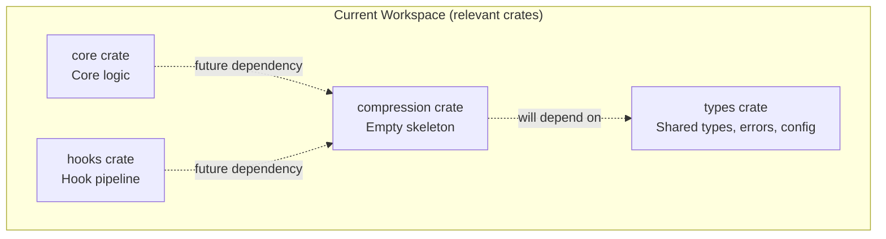
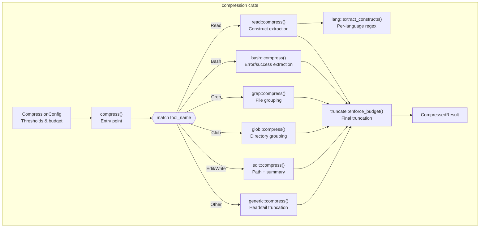
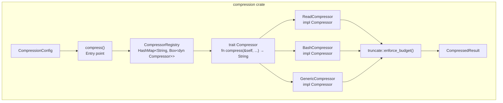
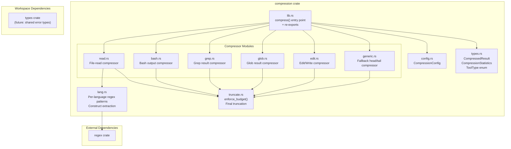
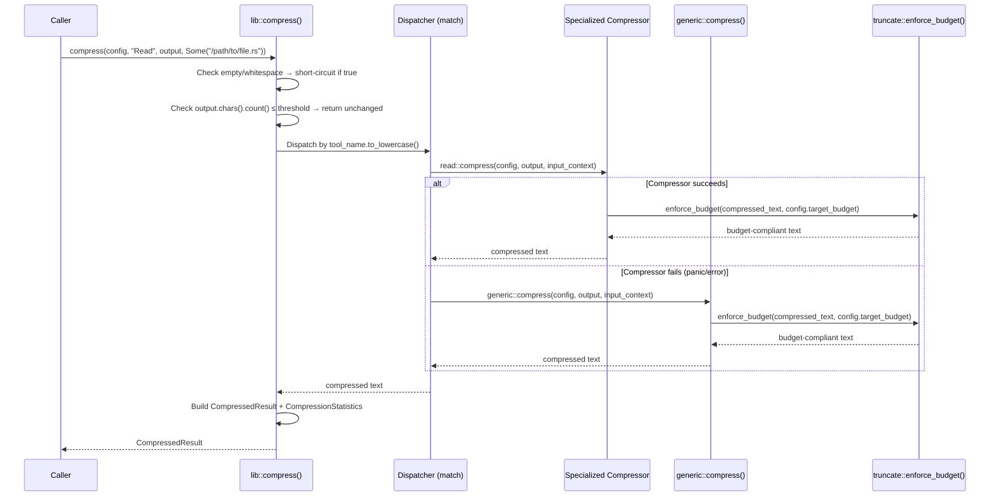
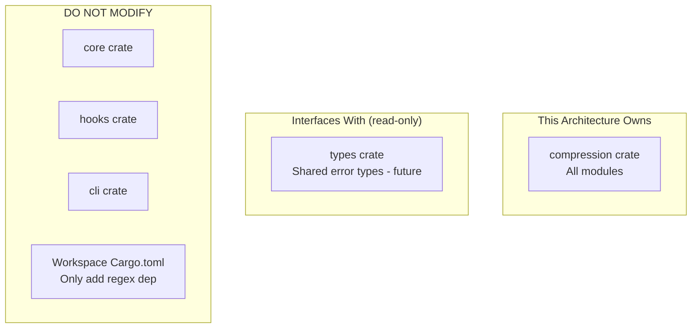

# 004-ar-tool-output-compression

> **Document Type:** Architecture Review
> **Audience:** LLM agents, human reviewers
> **Status:** Proposed
> **Last Updated:** 2026-03-02 <!-- @auto -->
> **Owner:** brianluby <!-- @human-required -->
> **Deciders:** brianluby <!-- @human-required -->

---

## Review Tier Legend

| Marker | Tier | Speckit Behavior |
|--------|------|------------------|
| 🔴 `@human-required` | Human Generated | Prompt human to author; blocks until complete |
| 🟡 `@human-review` | LLM + Human Review | LLM drafts → prompt human to confirm/edit; blocks until confirmed |
| 🟢 `@llm-autonomous` | LLM Autonomous | LLM completes; no prompt; logged for audit |
| ⚪ `@auto` | Auto-generated | System fills (timestamps, links); no prompt |

---

## Document Completion Order

> ⚠️ **For LLM Agents:** Complete sections in this order. Do not fill downstream sections until upstream human-required inputs exist.

1. **Summary (Decision)** → requires human input first
2. **Context (Problem Space)** → requires human input
3. **Decision Drivers** → requires human input (prioritized)
4. **Driving Requirements** → extract from PRD, human confirms
5. **Options Considered** → LLM drafts after drivers exist, human reviews
6. **Decision (Selected + Rationale)** → requires human decision
7. **Implementation Guardrails** → LLM drafts, human reviews
8. **Everything else** → can proceed after decision is made

---

## Linkage ⚪ `@auto`

| Document | ID | Relationship |
|----------|-----|--------------|
| Parent PRD | 004-prd-tool-output-compression.md | Requirements this architecture satisfies |
| Feature Spec | spec.md | Source specification with clarifications |
| Security Review | N/A | No security review required per PRD assessment (minimal attack surface — text-in, text-out with no I/O) |
| Supersedes | — | N/A (greenfield crate) |
| Superseded By | — | — |

---

## Summary

### Decision 🔴 `@human-required`
> Implement tool-output compression as a set of pure functions within the existing `crates/compression` crate, using a dispatcher + per-tool compressor architecture with the `regex` crate for language construct extraction.

### TL;DR for Agents 🟡 `@human-review`
> The compression crate uses a function-based dispatcher pattern: a top-level `compress()` function accepts `CompressionConfig`, tool name, output text, and optional input context, then routes to specialized compressor functions (Read, Bash, Grep, Glob, Edit/Write) or a generic fallback. Each compressor is a standalone function — no traits, no dynamic dispatch, no async. The `regex` crate handles construct extraction. All compressors must be infallible: on error, fall back to generic compression. Never use `unwrap()` in compressor code.

---

## Context

### Problem Space 🔴 `@human-required`

The rusty-brain memory system needs to store tool observations from AI coding sessions. Raw tool outputs range from a few characters to 50,000+ characters, but the memory budget for each observation is approximately 500 tokens (~2,000 characters). Without compression, the system can store only 5-10 observations before exhausting its budget — far too few for practical use.

The architectural challenge is designing a compression subsystem that:
1. Reduces arbitrary tool outputs to a fixed budget while preserving the most semantically important content
2. Handles 6+ distinct tool output formats, each with different structural patterns
3. Remains extensible for future tool types without modifying existing code
4. Operates synchronously, deterministically, and infallibly (no panics, no errors to callers)
5. Fits within the existing workspace crate layout

### Decision Scope 🟡 `@human-review`

**This AR decides:**
- Internal architecture of the `crates/compression` crate
- Module structure and function signatures
- Pattern for dispatching to per-tool compressors
- Approach for language construct extraction (regex vs. AST parsing)
- Error handling strategy within the compression pipeline

**This AR does NOT decide:**
- How the memory pipeline invokes compression (that's a future integration feature, W-5)
- Where compressed observations are stored (that's the observation storage feature)
- Whether to redact secrets from tool outputs (deferred to W-4)
- Specific regex patterns for each language (implementation detail)

### Current State 🟢 `@llm-autonomous`

The `crates/compression` crate exists as an empty skeleton with a single `lib.rs` containing a placeholder test. The workspace already has 7 crates (`cli`, `compression`, `core`, `hooks`, `opencode`, `platforms`, `types`). The `types` crate provides foundational types and error patterns. No compression logic exists yet — this is a greenfield implementation within an established workspace.



### Driving Requirements 🟡 `@human-review`

| PRD Req ID | Requirement Summary | Architectural Implication |
|------------|---------------------|---------------------------|
| M-1 | Compress outputs exceeding threshold | Need a threshold-checking gate before dispatch |
| M-2 | Return unchanged when below threshold | Gate must short-circuit before any compression logic |
| M-3 | Output ≤ target budget | Every code path must pass through a final truncation enforcer |
| M-4 | Specialized compressors for 6 tool types | Need per-tool compression functions with distinct logic |
| M-5 | Generic fallback for unknown tools | Need a default compressor that handles any text |
| M-6 | Case-insensitive tool name dispatch | Dispatcher normalizes tool name before routing |
| M-7 | Result includes text, flag, original size | Defines the `CompressedResult` return type |
| M-8 | Extract language constructs from file reads | Read compressor needs regex-based construct extraction |
| M-9 | Support JS/TS, Python, Rust extraction | Need per-language regex pattern sets |
| M-10 | Preserve errors/success in Bash output | Bash compressor needs line-level classification |
| M-11 | Final truncation with head-preserving marker | Shared truncation utility used by all paths |
| M-12 | Configurable thresholds via `CompressionConfig` | Config struct threaded through all functions |
| M-13 | Fallback on compressor failure, no panics | Error recovery wrapper around each specialized compressor |
| S-1 | Group grep by file with counts | Grep compressor parses file:line format |
| S-2 | Group glob by directory with counts | Glob compressor groups path components |
| S-3 | Compression statistics | Return type includes diagnostic data |
| S-4 | Optional `input_context` string | API accepts `Option<&str>` alongside output |
| S-5 | Empty/whitespace pass-through | Early return before threshold check |

**PRD Constraints inherited:**
- Stable Rust only; `unsafe_code = "forbid"` (workspace lint)
- Synchronous processing only (no async runtime)
- Performance: < 5ms for 10K-char input
- Unicode: `char` count, not byte count
- No logging of memory contents at INFO or above

---

## Decision Drivers 🔴 `@human-required`

1. **Simplicity:** Minimize abstraction layers; this is a text-in, text-out library with no I/O *(traces to constitution: Crate-First)*
2. **Performance:** Each compression call must complete in < 5ms for typical inputs *(traces to PRD SC-006)*
3. **Infallibility:** Compression must never panic or return an error to the caller *(traces to PRD M-13)*
4. **Extensibility:** Adding a new tool-type compressor should require adding one function and one match arm *(traces to PRD M-4, M-5)*
5. **Testability:** Each compressor must be independently unit-testable with no setup *(traces to PRD user stories)*
6. **Budget guarantee:** Every code path must produce output ≤ target budget *(traces to PRD M-3, M-11)*

---

## Options Considered 🟡 `@human-review`

### Option 0: Status Quo / Do Nothing

**Description:** Leave the compression crate empty. Store raw tool outputs in memory without compression.

| Driver | Rating | Notes |
|--------|--------|-------|
| Simplicity | ✅ Good | Zero code to maintain |
| Performance | ✅ Good | No processing overhead |
| Infallibility | ✅ Good | Nothing to fail |
| Extensibility | ❌ Poor | No compression framework to extend |
| Testability | ✅ Good | Nothing to test |
| Budget guarantee | ❌ Poor | Raw outputs of 50K+ chars; memory budget blown |

**Why not viable:** Without compression, the memory system can store only 5-10 observations per session (PRD Problem Statement). This makes the entire rusty-brain project impractical for real-world use. Fails PRD M-1, M-3, M-4, M-5, M-8, M-10 — essentially all Must Have requirements.

---

### Option 1: Function-Based Dispatcher (Recommended)

**Description:** A top-level `compress()` function with a `match` statement that dispatches to standalone compressor functions. Each tool type gets its own module with a public compress function. No traits, no dynamic dispatch, no allocation of compressor objects.



| Driver | Rating | Notes |
|--------|--------|-------|
| Simplicity | ✅ Good | Plain functions, no trait machinery, no heap allocation for dispatch |
| Performance | ✅ Good | Static dispatch via `match`; zero-cost routing; regex compiled once with `LazyLock` |
| Infallibility | ✅ Good | Each compressor wrapped in `catch_unwind` or manual error handling; fallback chain |
| Extensibility | ✅ Good | Add new module + one match arm; no trait impls needed |
| Testability | ✅ Good | Each `mod::compress()` is a pure function testable in isolation |
| Budget guarantee | ✅ Good | `truncate::enforce_budget()` called on every path before returning |

**Pros:**
- Simplest architecture that satisfies all requirements
- Zero overhead from dynamic dispatch or trait objects
- Each compressor module is self-contained and independently testable
- Matches the TypeScript implementation's architectural pattern (direct port)
- Regex patterns compiled once via `LazyLock` — amortized to near-zero per call
- Easy to reason about: follow the match arm to find the code

**Cons:**
- Match statement grows linearly with tool types (minor; 6 arms is manageable)
- No shared interface enforcing compressor function signatures (relies on convention)
- Adding a compressor requires touching two places: new module + match arm in dispatcher

---

### Option 2: Trait-Based Compressor Registry

**Description:** Define a `Compressor` trait with a `compress()` method. Each tool type implements the trait. A registry (`HashMap<String, Box<dyn Compressor>>`) maps tool names to compressor instances. The dispatcher looks up the registry and calls the trait method.



| Driver | Rating | Notes |
|--------|--------|-------|
| Simplicity | ⚠️ Medium | Trait + registry + Box<dyn> adds abstraction layers |
| Performance | ⚠️ Medium | Dynamic dispatch via vtable; HashMap lookup per call; heap allocation for trait objects |
| Infallibility | ✅ Good | Same error handling strategy applies |
| Extensibility | ✅ Good | Add new struct + impl; register in constructor; slightly more ceremony but formalized |
| Testability | ✅ Good | Trait objects can be mocked; but plain functions are equally testable |
| Budget guarantee | ✅ Good | Same truncation enforcer applies |

**Pros:**
- Enforces consistent function signature via trait
- Registry pattern is familiar in Rust ecosystem
- Could support runtime registration of custom compressors (not a current requirement)

**Cons:**
- Dynamic dispatch overhead (vtable indirection) — unnecessary for a fixed set of 6-7 compressors
- Heap allocation for `Box<dyn Compressor>` — adds complexity for no benefit
- `HashMap` lookup on every call vs. a `match` statement (slower, more allocation)
- Over-engineered for a closed set of known tool types
- Adds trait definition, registry construction, and lifetime complexity
- Runtime registration is not a requirement (W-5 explicitly defers pipeline integration)

---

## Decision

### Selected Option 🔴 `@human-required`
> **Option 1: Function-Based Dispatcher**

### Rationale 🔴 `@human-required`

Option 1 satisfies all decision drivers at the highest level. The function-based dispatcher is the simplest architecture that meets every Must Have requirement. The closed set of 6 tool types makes dynamic dispatch unnecessary — a `match` statement provides zero-cost routing with compile-time exhaustiveness checking.

Option 2's trait-based registry adds abstraction (trait definition, Box<dyn>, HashMap lookup) without addressing any requirement that Option 1 doesn't already satisfy. The extensibility benefit of a registry is marginal when adding a compressor is already a one-module-one-match-arm change in Option 1. The PRD explicitly defers runtime extensibility (W-5), so the registry's primary advantage is irrelevant.

#### Simplest Implementation Comparison 🟡 `@human-review`

| Aspect | Simplest Possible | Selected Option | Justification for Complexity |
|--------|-------------------|-----------------|------------------------------|
| Modules | Single `lib.rs` with all logic | 11 modules (lib, config, types, truncate, generic, read, lang, bash, grep, glob, edit) | PRD M-4 requires 6 specialized compressors + generic fallback; separation needed for testability and the 800-line file limit |
| Dependencies | stdlib only | `regex` crate | PRD M-8, M-9 require language construct extraction; stdlib has no regex support |
| Error handling | `unwrap()` everywhere | `catch_unwind` / manual error boundary + fallback | PRD M-13 requires infallible compression with fallback on failure |
| Configuration | Hardcoded constants | `CompressionConfig` struct with `Default` | PRD M-12 requires configurable thresholds (clarified in spec session) |
| Truncation | Single truncation at end | Per-compressor logic + shared final enforcer | PRD M-3, M-11 require guaranteed budget compliance; specialized compressors produce variable-length output |

**Complexity justified by:** Each addition beyond "simplest possible" traces directly to a Must Have PRD requirement. The module separation follows the project's 800-line file limit convention and enables independent testing of each compressor. The `regex` dependency is the only external addition.

### Architecture Diagram 🟡 `@human-review`



---

## Technical Specification

### Component Overview 🟡 `@human-review`

| Component | Responsibility | Interface | Dependencies |
|-----------|---------------|-----------|--------------|
| `lib.rs` (Entry Point) | Top-level `compress()` function; threshold gate; tool name dispatch | `pub fn compress(config, tool_name, output, input_context) -> CompressedResult` | config, types, all compressor modules |
| `config.rs` (CompressionConfig) | Holds configurable thresholds and budget; implements `Default` | `pub struct CompressionConfig` | None |
| `types.rs` (Types) | `CompressedResult`, `CompressionStatistics`, `ToolType` enum | Pub structs and enum | None |
| `read.rs` (Read Compressor) | Extracts language constructs from source file content | `pub fn compress(config, output, input_context) -> String` | lang, truncate |
| `bash.rs` (Bash Compressor) | Extracts errors, warnings, success indicators from command output | `pub fn compress(config, output, input_context) -> String` | truncate |
| `grep.rs` (Grep Compressor) | Groups matches by file, counts per file, top N matches | `pub fn compress(config, output, input_context) -> String` | truncate |
| `glob.rs` (Glob Compressor) | Groups files by directory, counts per directory | `pub fn compress(config, output, input_context) -> String` | truncate |
| `edit.rs` (Edit/Write Compressor) | Extracts file path and change summary | `pub fn compress(config, output, input_context) -> String` | truncate |
| `generic.rs` (Generic Compressor) | Head/tail truncation with omission indicator | `pub fn compress(config, output, input_context) -> String` | truncate |
| `truncate.rs` (Budget Enforcer) | Ensures any string ≤ target budget; head-preserving with marker | `pub fn enforce_budget(text, budget) -> String` | None |
| `lang.rs` (Language Patterns) | Per-language regex patterns for construct extraction | `pub fn extract_constructs(content, file_hint) -> Vec<String>` | regex |

### Data Flow 🟢 `@llm-autonomous`



### Interface Definitions 🟡 `@human-review`

```rust
// ---- config.rs ----

/// Configuration for the compression pipeline.
pub struct CompressionConfig {
    /// Character count above which compression is triggered.
    pub compression_threshold: usize,
    /// Maximum character count for compressed output.
    pub target_budget: usize,
}

impl Default for CompressionConfig {
    fn default() -> Self {
        Self {
            compression_threshold: 3_000,
            target_budget: 2_000,
        }
    }
}

// ---- types.rs ----

/// The tool type, determined by case-insensitive name matching.
pub enum ToolType {
    Read,
    Bash,
    Grep,
    Glob,
    Edit,
    Write,
    Other(String),
}

/// Result of a compression operation.
pub struct CompressedResult {
    /// The (possibly compressed) text.
    pub text: String,
    /// Whether compression was actually applied.
    pub compression_applied: bool,
    /// Character count of the original input.
    pub original_size: usize,
    /// Compression diagnostics (present when compression_applied is true).
    pub statistics: Option<CompressionStatistics>,
}

/// Diagnostic data about a compression operation.
pub struct CompressionStatistics {
    /// Compression ratio (original_size / compressed_size).
    pub ratio: f64,
    /// Number of characters removed.
    pub chars_saved: usize,
    /// Percentage of original removed (0.0–100.0).
    pub percentage_saved: f64,
}

// ---- lib.rs (entry point) ----

/// Compress a tool output according to its tool type.
///
/// This is the primary entry point for the compression pipeline.
/// It never panics and never returns an error.
pub fn compress(
    config: &CompressionConfig,
    tool_name: &str,
    output: &str,
    input_context: Option<&str>,
) -> CompressedResult;
```

### Key Algorithms/Patterns 🟡 `@human-review`

**Pattern: Infallible Dispatch with Fallback**
```text
1. If output is empty or whitespace-only → return unchanged
2. If output.chars().count() ≤ config.compression_threshold → return unchanged
3. Match tool_name.to_ascii_lowercase():
   a. "read" → catch_unwind(read::compress(...))
   b. "bash" → catch_unwind(bash::compress(...))
   c. "grep" → catch_unwind(grep::compress(...))
   d. "glob" → catch_unwind(glob::compress(...))
   e. "edit" | "write" → catch_unwind(edit::compress(...))
   f. _ → generic::compress(...)
4. If catch_unwind caught a panic → log warning, use generic::compress(...)
5. enforce_budget(result, config.target_budget)
6. Build CompressedResult with statistics
```

**Pattern: Lazy-Compiled Regex**
```rust
use std::sync::LazyLock;
use regex::Regex;

static IMPORT_PATTERN: LazyLock<Regex> = LazyLock::new(|| {
    Regex::new(r"(?m)^(?:import|from|use|require)\b.*$").unwrap()
});
```
Regexes are compiled once on first use and reused for all subsequent calls. This amortizes compilation cost to near-zero per invocation.

**Pattern: Read Compressor Construct Extraction**
```text
1. Detect language from input_context file extension (or heuristics)
2. Apply language-specific regex patterns to extract:
   - Import/use/require statements
   - Function/method signatures (fn, def, function, const =>, etc.)
   - Class/struct/enum declarations
   - Error markers (TODO, FIXME, HACK, XXX, BUG)
3. Deduplicate extracted constructs
4. Join with newlines, respecting budget
5. If no constructs found → fall through to generic compressor
```

---

## Constraints & Boundaries

### Technical Constraints 🟡 `@human-review`

**Inherited from PRD:**
- Stable Rust only; `unsafe_code = "forbid"` at workspace level
- Synchronous processing; no async runtime dependency
- Performance: < 5ms for 10,000-character input (SC-006)
- Unicode: character counting by `.chars().count()`, not `.len()`
- No logging of tool output content at INFO level or above (constitution)
- Agent-friendly: structured output, no interactive prompts

**Added by this Architecture:**
- **Dependencies:** Only `regex` crate added (MIT/Apache-2.0, well-maintained, >100M downloads)
- **Module size:** Each module ≤ 400 lines (project convention: 200-400 typical, 800 max)
- **Regex compilation:** All patterns via `LazyLock<Regex>` — no per-call compilation
- **No trait objects:** Compressors are plain functions; no `Box<dyn>` or `&dyn`
- **No `unwrap()` in non-test code:** All fallible operations must handle errors explicitly

### Architectural Boundaries 🟡 `@human-review`



- **Owns:** `crates/compression/` — all source files, tests, Cargo.toml
- **Interfaces With:** `types` crate (may import shared error types if needed)
- **Must Not Touch:** `core`, `hooks`, `cli`, `platforms`, `opencode` crates; workspace Cargo.toml only modified to add `regex` to `[workspace.dependencies]`

### Implementation Guardrails 🟡 `@human-review`

> ⚠️ **Critical for LLM Agents:**

- [ ] **DO NOT** use `unwrap()` or `expect()` in non-test code *(PRD M-13: compression must never panic)*
- [ ] **DO NOT** use `unsafe` blocks *(workspace lint: `unsafe_code = "forbid"`)*
- [ ] **DO NOT** use async/await or tokio *(PRD constraint: synchronous only)*
- [ ] **DO NOT** use `Box<dyn Compressor>` or trait objects for dispatch *(AR decision: function-based)*
- [ ] **DO NOT** log tool output content at INFO level or above *(constitution: memory content privacy)*
- [ ] **DO NOT** compile regex patterns per-call — use `LazyLock<Regex>` *(performance constraint)*
- [ ] **DO NOT** use `.len()` for character counting — use `.chars().count()` *(PRD: Unicode char count)*
- [ ] **MUST** route every code path through `truncate::enforce_budget()` before returning *(PRD M-3, M-11)*
- [ ] **MUST** catch panics from specialized compressors and fall back to generic *(PRD M-13)*
- [ ] **MUST** return `compression_applied: false` for empty, whitespace-only, or below-threshold inputs *(PRD M-2, S-5)*
- [ ] **MUST** keep each module ≤ 400 lines *(project convention)*

---

## Consequences 🟡 `@human-review`

### Positive
- Simplest viable architecture — no unnecessary abstraction layers
- Zero dynamic dispatch overhead; `match` compiles to a jump table
- Each compressor independently testable with no setup or mocking
- Direct correspondence to TypeScript implementation eases porting
- Single external dependency (`regex`) with excellent ecosystem support
- `LazyLock` regex compilation amortizes cost; subsequent calls are near-zero overhead
- Infallible API prevents compression from being a failure point in the memory pipeline

### Negative
- No enforced interface for compressor functions (relies on code review and convention)
- Adding a new tool type requires changes in two places (new module + match arm)
- `catch_unwind` for panic recovery adds minor complexity; only needed as safety net
- `regex` patterns for construct extraction will miss some edge cases (macros, complex generics) — accepted per PRD A-4

### Risks & Mitigations

| Risk | Likelihood | Impact | Mitigation |
|------|------------|--------|------------|
| Regex patterns miss important constructs in edge cases | Med | Low | Accept false negatives (A-4); test against real-world files; budget is configurable |
| `LazyLock` initialization causes latency on first call | Low | Low | First call only; subsequent calls use cached compiled regex; < 1ms for typical pattern sets |
| `catch_unwind` doesn't catch all panics (e.g., stack overflow) | Very Low | Med | Stack overflow is fatal regardless; `catch_unwind` covers all `panic!()` and `unwrap()` cases |
| Module count (10+ files) feels over-structured for initial scope | Low | Low | Each module stays small and focused; prevents the 800-line monolith anti-pattern |

---

## Implementation Guidance

### Suggested Implementation Order 🟢 `@llm-autonomous`

1. **`config.rs` + `types.rs`** — Data structures first (CompressionConfig, CompressedResult, CompressionStatistics, ToolType)
2. **`truncate.rs`** — Budget enforcer (used by every compressor; test thoroughly)
3. **`generic.rs`** — Fallback compressor (head/tail truncation; also the error-recovery target)
4. **`lib.rs` dispatcher** — Entry point with threshold gate + dispatch + fallback error handling
5. **`read.rs` + `lang.rs`** — File-read compressor with language construct extraction (most complex; P1)
6. **`bash.rs`** — Bash output compressor (P1)
7. **`grep.rs`** — Grep compressor with file grouping (P2)
8. **`glob.rs`** — Glob compressor with directory grouping (P2)
9. **`edit.rs`** — Edit/Write compressor (P2; simplest specialized compressor)

### Testing Strategy 🟢 `@llm-autonomous`

| Layer | Test Type | Coverage Target | Notes |
|-------|-----------|-----------------|-------|
| Unit | `truncate.rs` | 100% | Budget boundary, Unicode, empty input, marker text |
| Unit | `generic.rs` | 100% | Head/tail split, line counting, omission indicator |
| Unit | `read.rs` + `lang.rs` | >90% | JS/TS, Python, Rust construct extraction; no-constructs fallback |
| Unit | `bash.rs` | >90% | Error lines, success indicators, mixed output |
| Unit | `grep.rs` | >90% | File grouping, counts, top-N truncation |
| Unit | `glob.rs` | >90% | Directory grouping, JSON parsing, line-delimited |
| Unit | `edit.rs` | >90% | Path extraction, summary, Write vs Edit |
| Unit | `config.rs` | 100% | Default values, custom values |
| Integration | `lib.rs` dispatcher | >90% | End-to-end through all tool types; case-insensitive routing; fallback on unknown |
| Integration | Error recovery | Key paths | Simulate compressor panic → verify fallback |
| Property | Budget guarantee | All paths | No output exceeds `config.target_budget` regardless of input |

### Reference Implementations 🟡 `@human-review`

- TypeScript implementation in agent-brain repository — original source for compression algorithms and regex patterns *(internal)*
- Rust `regex` crate documentation — pattern syntax reference *(external, well-known)*

### Anti-patterns to Avoid 🟡 `@human-review`

- **Don't:** Use `String::new()` + repeated `push_str()` in hot loops
  - **Why:** Causes O(n²) allocation behavior
  - **Instead:** Pre-allocate with `String::with_capacity()` or collect iterators

- **Don't:** Compile regex patterns inside compressor functions
  - **Why:** Regex compilation is expensive (~100μs per pattern); blows the 5ms budget
  - **Instead:** Use `LazyLock<Regex>` at module level

- **Don't:** Use `.len()` to check against character budget
  - **Why:** `.len()` returns byte count; multi-byte Unicode chars would exceed budget
  - **Instead:** Use `.chars().count()` for all budget comparisons

- **Don't:** Return `Result<CompressedResult, _>` from the public API
  - **Why:** Compression must be infallible; callers should never handle compression errors
  - **Instead:** Handle all errors internally and fall back to generic compression

---

## Compliance & Cross-cutting Concerns

### Security Considerations 🟡 `@human-review`

- **Authentication:** N/A — library crate with no network surface
- **Authorization:** N/A — no access control
- **Data handling:** Tool outputs may contain secrets (API keys, passwords). The compressor processes but does not redact them. Secret redaction is deferred to the memory pipeline ingestion layer (PRD W-4). Compressed output should not be logged at INFO or above (constitution).

### Observability 🟢 `@llm-autonomous`

- **Logging:** Log at DEBUG level: tool type dispatched, compression ratio achieved, whether fallback was used. Log at WARN level: compressor panic caught + fallback triggered. Never log output content at INFO or above.
- **Metrics:** `CompressionStatistics` returned with every `CompressedResult` — ratio, chars_saved, percentage_saved
- **Tracing:** Not required for a synchronous library crate; no spans needed

### Error Handling Strategy 🟢 `@llm-autonomous`

```text
Error Category → Handling Approach
├── Empty/whitespace input → Return unchanged (compression_applied: false)
├── Below-threshold input → Return unchanged (compression_applied: false)
├── Specialized compressor panic → catch_unwind, log WARN, fall back to generic
├── Regex pattern failure → Should not happen (patterns are static); if it does, fallback
├── Output exceeds budget → enforce_budget() hard-truncates with marker
└── Unknown tool type → Route to generic compressor (not an error)
```

---

## Migration Plan (if applicable) 🟡 `@human-review`

Not applicable — this is a greenfield implementation in an existing empty crate. No migration from a previous system needed.

### Rollback Plan 🔴 `@human-required`

**Rollback Triggers:**
- Compression crate causes test failures in dependent crates
- Performance regression: compression exceeds 50ms for typical inputs

**Rollback Decision Authority:** brianluby (project owner)

**Rollback Time Window:** Until integration with hooks/memory pipeline (feature W-5); before that, the crate is isolated

**Rollback Procedure:**
1. Revert commits on the `004-tool-output-compression` branch
2. Restore empty `lib.rs` skeleton in `crates/compression/`
3. Remove `regex` from workspace dependencies if no other crate uses it
4. No downstream impact — no other crate depends on compression yet

---

## Open Questions 🟡 `@human-review`

No open questions. All architectural decisions are resolved.

---

## Changelog ⚪ `@auto`

| Version | Date | Author | Changes |
|---------|------|--------|---------|
| 0.1 | 2026-03-02 | Claude (speckit) | Initial proposal |

---

## Decision Record ⚪ `@auto`

| Date | Event | Details |
|------|-------|---------|
| 2026-03-02 | Proposed | Initial architecture review created |

---

## Traceability Matrix 🟢 `@llm-autonomous`

| PRD Req ID | Decision Driver | Option 1 Rating | Component | How Satisfied |
|------------|-----------------|------------------|-----------|---------------|
| M-1 | Budget guarantee | ✅ | lib.rs (threshold gate) | Threshold check before dispatch |
| M-2 | Simplicity | ✅ | lib.rs (threshold gate) | Short-circuit return for below-threshold |
| M-3 | Budget guarantee | ✅ | truncate.rs | enforce_budget() on every path |
| M-4 | Extensibility | ✅ | read, bash, grep, glob, edit modules | One module per tool type |
| M-5 | Extensibility | ✅ | generic.rs | Fallback for unknown tool types |
| M-6 | Simplicity | ✅ | lib.rs (dispatcher) | `tool_name.to_ascii_lowercase()` + match |
| M-7 | Simplicity | ✅ | types.rs | CompressedResult struct |
| M-8 | Performance | ✅ | lang.rs | Regex-based construct extraction |
| M-9 | Performance | ✅ | lang.rs | Per-language pattern sets (JS/TS, Python, Rust) |
| M-10 | Infallibility | ✅ | bash.rs | Line-level error/success classification |
| M-11 | Budget guarantee | ✅ | truncate.rs | Head-preserving truncation with marker |
| M-12 | Testability | ✅ | config.rs | CompressionConfig with Default impl |
| M-13 | Infallibility | ✅ | lib.rs (dispatcher) | catch_unwind + fallback to generic |
| S-1 | — | ✅ | grep.rs | File grouping with match counts |
| S-2 | — | ✅ | glob.rs | Directory grouping with file counts |
| S-3 | — | ✅ | types.rs | CompressionStatistics struct |
| S-4 | — | ✅ | lib.rs (API) | `input_context: Option<&str>` parameter |
| S-5 | Simplicity | ✅ | lib.rs (early return) | Empty/whitespace check before threshold |

---

## Review Checklist 🟢 `@llm-autonomous`

Before marking as Accepted:
- [x] All PRD Must Have requirements appear in Driving Requirements
- [x] Option 0 (Status Quo) is documented
- [x] Simplest Implementation comparison is completed
- [x] Decision drivers are prioritized and addressed
- [x] At least 2 options were seriously considered (Option 1 + Option 2)
- [x] Constraints distinguish inherited vs. new
- [x] Component names are consistent across all diagrams and tables
- [x] Implementation guardrails reference specific PRD constraints
- [x] Rollback triggers and authority are defined
- [x] Security review linked (pending) and N/A documented for N/A aspects
- [x] No open questions blocking implementation

---

## Human Decisions Required

The following decisions need human input:

- [ ] Summary Decision (@human-required) - Select the architectural approach
- [ ] Problem Space (@human-required) - Validate the architectural challenge
- [ ] Decision Drivers (@human-required) - Confirm priority ordering
- [ ] Selected Option (@human-required) - Choose between presented options
- [ ] Rationale (@human-required) - Confirm trade-off reasoning
- [ ] Rollback Plan (@human-required) - Define rollback triggers and authority
- [ ] All @human-review sections - Review LLM-drafted technical details
