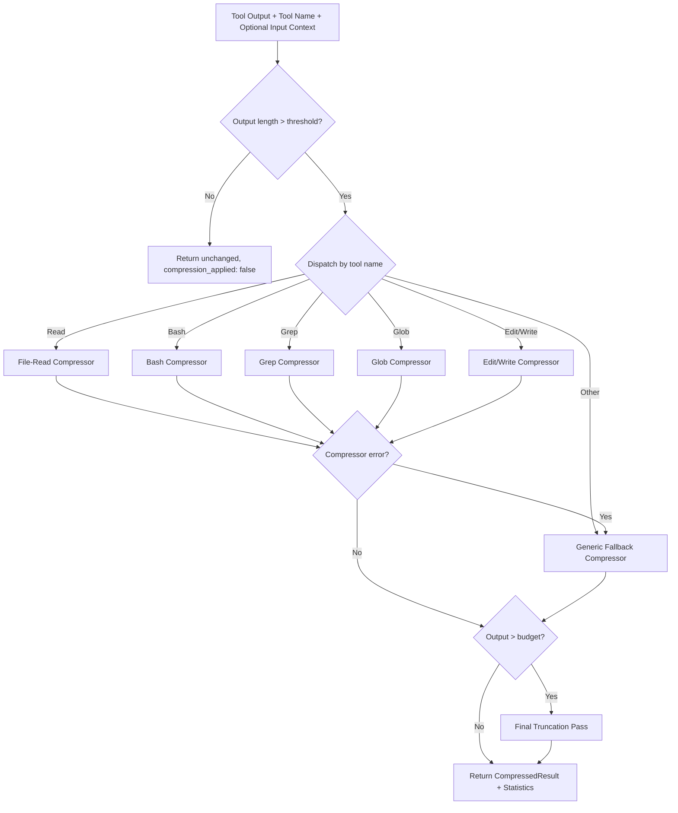
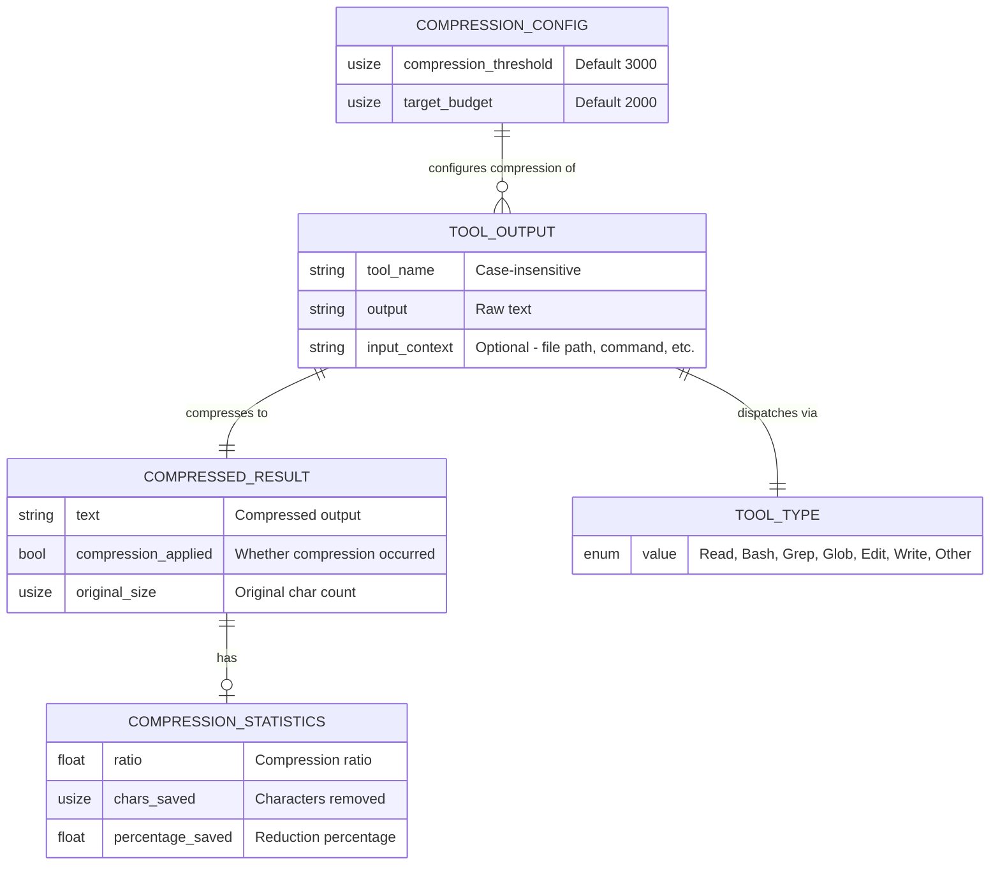
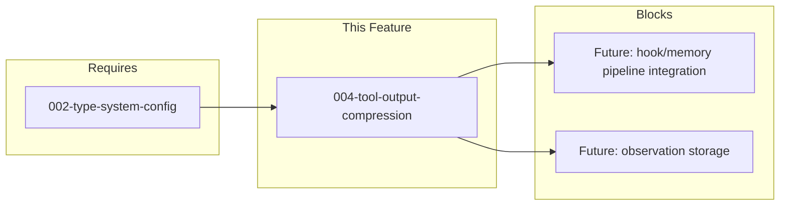

# 004-prd-tool-output-compression

> **Document Type:** Product Requirements Document
> **Audience:** LLM agents, human reviewers
> **Status:** Draft
> **Last Updated:** 2026-03-02 <!-- @auto -->
> **Owner:** brianluby <!-- @human-required -->

**Feature Branch**: `004-tool-output-compression`
**Created**: 2026-03-02
**Status**: Draft
**Input**: User description: "Port the intelligent tool-output compression system that reduces large tool outputs to ~500 tokens, with specialized compressors for Read, Edit, Write, Bash, Grep, Glob, WebFetch and other tool types"

---

## Review Tier Legend

| Marker | Tier | Speckit Behavior |
|--------|------|------------------|
| 🔴 `@human-required` | Human Generated | Prompt human to author; blocks until complete |
| 🟡 `@human-review` | LLM + Human Review | LLM drafts → prompt human to confirm/edit; blocks until confirmed |
| 🟢 `@llm-autonomous` | LLM Autonomous | LLM completes; no prompt; logged for audit |
| ⚪ `@auto` | Auto-generated | System fills (timestamps, links); no prompt |

---

## Document Completion Order

> ⚠️ **For LLM Agents:** Complete sections in this order. Do not fill downstream sections until upstream human-required inputs exist.

1. **Context** (Background, Scope) → requires human input first
2. **Problem Statement & User Scenarios** → requires human input
3. **Requirements** (Must/Should/Could/Won't) → requires human input
4. **Technical Constraints** → human review
5. **Diagrams, Data Model, Interface** → LLM can draft after above exist
6. **Acceptance Criteria** → derived from requirements
7. **Everything else** → can proceed

---

## Context

### Background 🔴 `@human-required`

rusty-brain is a Rust rewrite of agent-brain — a memory system for AI coding agents. During coding sessions, agents invoke tools (Read, Bash, Grep, etc.) that produce outputs ranging from a few lines to tens of thousands of characters. Storing these raw outputs in memvid-encoded memory is impractical: a single large file read or build log would consume the entire memory budget, limiting the system to a handful of observations per session. The original TypeScript implementation solved this with an intelligent compression pipeline; this feature ports that capability to Rust as a foundational crate for the rusty-brain memory pipeline.

### Scope Boundaries 🟡 `@human-review`

**In Scope:**
- Synchronous, text-based compression of tool outputs
- Specialized compressors for Read, Bash, Grep, Glob, Edit, Write tool types
- Generic fallback compressor for all other tool types
- Configurable compression thresholds and target budgets via `CompressionConfig`
- Language construct extraction for JavaScript/TypeScript, Python, and Rust source files
- Compression statistics for diagnostics
- A dispatcher that routes tool outputs to the correct compressor by tool name

**Out of Scope:**
- Async compression — synchronous operation is sufficient for the expected input sizes (confirmed in spec assumptions)
- LLM-based summarization — compression uses deterministic pattern matching, not model inference
- Binary content handling — the system operates on text-only tool outputs
- Secret/sensitive data redaction — this is a separate concern for the memory pipeline, not the compressor
- Integration with the hook/memory pipeline — this PRD covers the compression crate only; integration is a separate feature
- Network operations — no remote calls; all processing is local

### Glossary 🟡 `@human-review`

| Term | Definition |
|------|------------|
| Tool Output | Raw text output from a coding tool invocation (Read, Bash, Grep, etc.) |
| Compressed Result | The output of compression: compressed text, compression flag, and original character count |
| Compression Config | Configuration struct holding tunable parameters: compression threshold (default 3,000 chars), target budget (default 2,000 chars) |
| Compression Threshold | Character count above which compression is triggered (default: 3,000) |
| Target Budget | Maximum character count for compressed output (default: 2,000, approximately 500 tokens) |
| Dispatcher | Entry point that routes tool outputs to the appropriate specialized compressor based on tool name |
| Input Context | Optional string provided alongside tool output to enrich compression (e.g., file path for Read, command for Bash) |
| Construct Extraction | Pattern-matching process that identifies language-specific structures (imports, function signatures, class names) in source code |
| Fallback Compressor | Generic head/tail truncation strategy used for tool types without specialized compressors |
| Compression Statistics | Diagnostic data: compression ratio, characters saved, and percentage reduction |

### Related Documents ⚪ `@auto`

| Document | Link | Relationship |
|----------|------|--------------|
| Feature Spec | spec.md | Source specification with clarifications |
| Architecture Review | ar.md | Defines technical approach |
| Security Review | sec.md | Risk assessment |

---

## Problem Statement 🔴 `@human-required`

AI coding agents generate enormous volumes of tool output during development sessions. A single file read can produce 10,000+ characters, a build log 50,000+, and grep searches thousands of matching lines. When the rusty-brain memory system attempts to store these observations for later recall, raw outputs quickly exhaust the memory budget — typically allowing only 5-10 observations before the context window is saturated.

Without compression, the memory system faces an unacceptable tradeoff: either store very few observations (losing session context) or aggressively discard observations (losing important details). This makes the entire memory pipeline impractical for real-world coding sessions where agents routinely invoke 50-100+ tools.

The cost of not solving this is a memory system that cannot scale beyond toy demonstrations. Compression is the prerequisite that makes the rest of rusty-brain's observation pipeline viable.

---

## User Scenarios & Testing 🔴 `@human-required`

### User Story 1 — Compress Large File Reads for Memory Storage (Priority: P1)

An AI coding agent reads a large source file (e.g., 500+ lines) during a development session. Before storing this observation in memory, the system compresses the file content down to a semantic summary — preserving imports, exports, function signatures, class names, and error patterns — so the memory system can store 20× more observations within its context budget.

> As a memory pipeline, I want file-read outputs compressed to semantic summaries so that the memory system can store 20× more observations within its context budget.

**Why this priority**: File reads are the most frequent tool operation in coding sessions. Without compression, a single large file read would consume the entire memory budget, making the observation storage system impractical. This is the foundational compressor that proves the architecture works.

**Independent Test**: Can be fully tested by passing representative file contents (JavaScript, Python, Rust source files) through the compressor and verifying the output contains key structural elements within the character budget.

**Acceptance Scenarios**:
1. **Given** a 10,000-character source file containing imports, function definitions, and class declarations, **When** the system compresses this Read output, **Then** the result is ≤ target budget characters and contains the import statements, function signatures, and class names from the original
2. **Given** a source file shorter than the compression threshold, **When** the system processes this Read output, **Then** the output is returned unchanged (no compression applied)
3. **Given** a source file in any supported language (JavaScript, TypeScript, Python, Rust), **When** the system compresses this Read output, **Then** language-specific constructs (imports, exports, function/class declarations) are correctly identified and preserved

---

### User Story 2 — Compress Bash Command Output (Priority: P1)

An AI coding agent runs a shell command that produces verbose output (build logs, test results, installation output). The system compresses this output by highlighting errors, warnings, and success indicators while discarding intermediate noise, so the agent's memory retains the actionable information.

> As a memory pipeline, I want bash command outputs compressed to errors, warnings, and success indicators so that only actionable information is stored.

**Why this priority**: Bash outputs are the second most common tool output and often the largest (build logs can exceed 50,000 characters). Compressing these is essential for practical memory storage.

**Independent Test**: Can be fully tested by passing representative bash outputs (build logs with errors, test suite results, npm install output) and verifying errors and success indicators are preserved.

**Acceptance Scenarios**:
1. **Given** a 20,000-character build log containing 3 error lines scattered among informational output, **When** the system compresses this Bash output, **Then** the result is ≤ target budget characters and all 3 error lines are preserved
2. **Given** bash output containing success indicators (e.g., "Build successful", "All tests passed"), **When** the system compresses this output, **Then** the success indicators appear in the compressed result
3. **Given** bash output shorter than the compression threshold, **When** the system processes this output, **Then** it is returned unchanged

---

### User Story 3 — Route Compression by Tool Type (Priority: P1)

The system automatically identifies which tool produced a given output and routes it to the appropriate specialized compressor. If no specialized compressor exists for a tool type, a generic fallback compressor is used.

> As a memory pipeline, I want tool outputs automatically routed to the correct compressor by tool name so that each tool type gets optimal compression.

**Why this priority**: The dispatcher is the entry point for all compression. Without it, individual compressors cannot be used. It must exist before any integration with the hook/memory pipeline.

**Independent Test**: Can be fully tested by calling the dispatcher with each supported tool name and verifying each routes to the correct compression strategy.

**Acceptance Scenarios**:
1. **Given** a tool output from a "Read" operation, **When** the dispatcher is called, **Then** the file-read compressor is used
2. **Given** a tool output from an unknown tool type (e.g., "CustomTool"), **When** the dispatcher is called, **Then** the generic fallback compressor is used
3. **Given** any tool output, **When** the dispatcher returns a result, **Then** the result includes the compressed text, whether compression was applied, and the original size in characters

---

### User Story 4 — Compress Search Results (Priority: P2)

An AI coding agent runs Grep or Glob operations that return hundreds of matching files or lines. The system compresses these results by grouping matches by file or directory and showing only the top results.

> As a memory pipeline, I want search results compressed with grouping and summarization so that match patterns are preserved without storing every individual line.

**Why this priority**: Search operations are common and can produce very large outputs. While slightly less frequent than Read/Bash, they represent a significant portion of memory budget consumption.

**Independent Test**: Can be fully tested by passing representative search outputs and verifying grouping, counting, and truncation behavior.

**Acceptance Scenarios**:
1. **Given** grep output containing 200 matches across 40 files, **When** the system compresses this output, **Then** the result shows unique file names, match counts per file, and the top 10 individual matches, all within the target budget
2. **Given** glob output listing 500 files, **When** the system compresses this output, **Then** the result groups files by directory, shows the top 5 directories with file counts, and includes sample filenames from each group
3. **Given** glob output in JSON array format, **When** the system compresses this output, **Then** the JSON is parsed correctly and files are grouped by directory

---

### User Story 5 — Compress Edit and Write Operations (Priority: P2)

When an AI coding agent edits or creates files, the system compresses the operation record to just the file path and a brief change summary.

> As a memory pipeline, I want edit/write outputs compressed to file path and change summary so that modification history is lightweight but complete.

**Why this priority**: Edit and Write operations are always captured because they represent important state changes. Their compression is simpler but still necessary for memory efficiency.

**Independent Test**: Can be fully tested by passing representative edit/write tool outputs and verifying the file path and change summary are preserved.

**Acceptance Scenarios**:
1. **Given** an Edit tool output containing a file path and a large diff, **When** the system compresses this output, **Then** the result contains the file path, a "Changes applied" indicator, and at most the first 500 characters of the original output
2. **Given** a Write tool output for a newly created file, **When** the system compresses this output, **Then** the result contains the file path and a creation indicator

---

### User Story 6 — Generic Fallback Compression (Priority: P3)

For tool types without specialized compressors, the system applies a generic head/tail truncation strategy that preserves the beginning and end of the output.

> As a memory pipeline, I want a generic fallback compressor so that no tool output goes uncompressed, even as new tools are added.

**Why this priority**: The fallback ensures complete coverage without requiring per-tool customization.

**Independent Test**: Can be fully tested by passing large text blocks and verifying head/tail preservation and omission indicators.

**Acceptance Scenarios**:
1. **Given** a 15,000-character output from an unsupported tool type, **When** the system compresses this output, **Then** the result contains the first 15 lines and last 10 lines of the original, with a `[...N lines omitted...]` indicator between them
2. **Given** the compressed output, **When** examining the result, **Then** the total line count of the original is stated for context

---

## Assumptions & Risks 🟡 `@human-review`

### Assumptions
- [A-1] The compression system operates on text-only tool outputs; binary content is not expected
- [A-2] Character-based token estimation (characters / 4) is a sufficient heuristic; precise tokenization is not required
- [A-3] The 3,000-character compression threshold and 2,000-character target budget are configurable via `CompressionConfig` with these values as defaults, derived from production usage in the TypeScript implementation
- [A-4] Language construct extraction uses pattern matching; 100% accuracy is not required — false negatives (missed constructs) are acceptable, but false positives should be minimized
- [A-5] The compression crate operates synchronously and does not require async runtime
- [A-6] Unicode characters are counted by `char` count, not byte count, consistent with the TypeScript implementation
- [A-7] Tool input context is a single optional string whose meaning varies by tool type

### Risks

| ID | Risk | Likelihood | Impact | Mitigation |
|----|------|------------|--------|------------|
| R-1 | Regex-based construct extraction may miss language constructs in edge cases (e.g., nested templates, macros) | Med | Low | Accept false negatives; minimize false positives; test against real-world source files |
| R-2 | 2,000-character budget may be too small for some tool outputs (losing critical context) | Low | Med | Budget is configurable via `CompressionConfig`; can be tuned per deployment |
| R-3 | TypeScript implementation divergence — Rust port may produce different compressed output | Med | Low | Not a strict requirement; semantic equivalence matters, not byte-for-byte match |
| R-4 | Specialized compressor panics on unexpected input | Low | High | FR-016: automatic fallback to generic compressor on failure with error logging |

---

## Feature Overview

### Flow Diagram 🟡 `@human-review`



### State Diagram (if applicable) 🟡 `@human-review`

Not applicable — compression is a stateless, single-pass operation. No lifecycle transitions.

---

## Requirements

### Must Have (M) — MVP, launch blockers 🔴 `@human-required`
- [ ] **M-1:** System shall compress tool outputs that exceed the configured compression threshold (default 3,000 characters)
- [ ] **M-2:** System shall return outputs unchanged when they are at or below the compression threshold
- [ ] **M-3:** System shall produce compressed output of at most the configured target budget (default 2,000 characters, ~500 tokens)
- [ ] **M-4:** System shall support specialized compression for these tool types: Read, Bash, Grep, Glob, Edit, Write
- [ ] **M-5:** System shall provide a generic fallback compressor for any unrecognized tool type using head/tail truncation
- [ ] **M-6:** System shall dispatch to the correct compressor based on tool name using case-insensitive matching
- [ ] **M-7:** System shall return compression results that include: compressed text, whether compression was applied, and original character count
- [ ] **M-8:** System shall extract language-specific constructs from file reads — imports, exports, function signatures, class/struct names, and error-marker comments (TODO, FIXME, HACK, XXX, BUG)
- [ ] **M-9:** System shall support construct extraction for at least: JavaScript/TypeScript, Python, and Rust
- [ ] **M-10:** System shall preserve error lines and success indicators in Bash output compression
- [ ] **M-11:** System shall apply a final truncation pass to ensure no compressed output exceeds the target budget; truncation preserves the head and appends a `[...truncated to N chars]` marker
- [ ] **M-12:** System shall accept a `CompressionConfig` struct with configurable threshold and budget values with sensible defaults
- [ ] **M-13:** System shall fall back to the generic compressor when a specialized compressor fails, logging the error; compression shall not propagate errors to the caller
- [ ] **M-14:** System shall limit Edit/Write compressed output to the file path, an operation indicator ("Changes applied" or "File created"), and at most the first 500 characters of the original content

### Should Have (S) — High value, not blocking 🔴 `@human-required`
- [ ] **S-1:** System should group grep results by file and show match counts per file
- [ ] **S-2:** System should group glob results by directory and show file counts per directory
- [ ] **S-3:** System should provide compression statistics (ratio, characters saved, percentage reduction) for diagnostic purposes
- [ ] **S-4:** System should accept an optional `input_context: Option<String>` alongside tool output to enrich compressed output (file path for Read, command for Bash, query for Grep/Glob)
- [ ] **S-5:** System should return empty and whitespace-only outputs unchanged with `compression_applied: false`

### Could Have (C) — Nice to have, if time permits 🟡 `@human-review`
- [ ] **C-1:** System could support additional language construct extraction beyond JS/TS, Python, and Rust (e.g., Go, Java, C/C++)
- [ ] **C-2:** System could support per-compressor budget overrides in `CompressionConfig`
- [ ] **C-3:** System could parse glob output in JSON array format and group by directory

### Won't Have (W) — Explicitly deferred 🟡 `@human-review`
- [ ] **W-1:** LLM-based summarization — *Reason: Adds model dependency, latency, and cost; deterministic pattern matching is sufficient for this use case*
- [ ] **W-2:** Async compression — *Reason: Synchronous operation is sufficient for expected input sizes; async adds complexity without benefit*
- [ ] **W-3:** Binary content handling — *Reason: Tool outputs are text-only; binary files are not expected in the compression pipeline*
- [ ] **W-4:** Secret/sensitive data redaction — *Reason: Separate concern for the memory pipeline's ingestion layer, not the compressor*
- [ ] **W-5:** Hook/memory pipeline integration — *Reason: This PRD covers the compression crate only; integration is a separate feature*

---

## Technical Constraints 🟡 `@human-review`

- **Language/Framework:** Stable Rust only; `unsafe` requires architecture justification per constitution
- **Performance:** Compression of a typical 10,000-character input shall complete in under 5 milliseconds
- **Crate Layout:** Must follow the existing crate-first principle — new crate or module within existing crate layout
- **Dependencies:** No new external dependencies without architecture review; pattern matching uses Rust stdlib regex or similar
- **Async:** Not required — synchronous processing only
- **Agent-Friendly:** All output must be structured; no interactive prompts
- **Unicode:** Character counting by `char` count, not byte count

---

## Data Model (if applicable) 🟡 `@human-review`



---

## Interface Contract (if applicable) 🟡 `@human-review`

```rust
// Configuration
struct CompressionConfig {
    compression_threshold: usize, // Default: 3_000
    target_budget: usize,         // Default: 2_000
}

// Output
struct CompressedResult {
    text: String,
    compression_applied: bool,
    original_size: usize,
    statistics: Option<CompressionStatistics>,
}

// Diagnostics
struct CompressionStatistics {
    ratio: f64,
    chars_saved: usize,
    percentage_saved: f64,
}

// Entry point — flat parameters, no ToolOutput struct
fn compress(
    config: &CompressionConfig,
    tool_name: &str,
    output: &str,
    input_context: Option<&str>,
) -> CompressedResult;
```

---

## Evaluation Criteria 🟡 `@human-review`

| Criterion | Weight | Metric | Target | Notes |
|-----------|--------|--------|--------|-------|
| Correctness | Critical | All Must Have ACs pass | 100% | Non-negotiable |
| Budget compliance | Critical | Max output size | ≤ target budget chars | SC-001 |
| Compression ratio | High | Ratio on 20K+ inputs | ≥ 10× | SC-002 |
| Construct preservation | High | Import/signature recall | ≥ 80% | SC-003 |
| Error preservation | Critical | Bash error lines preserved | 100% | SC-004 |
| Performance | High | Latency on 10K input | < 5ms | SC-006 |
| Fault tolerance | High | Compressor failure handling | No panics, graceful fallback | FR-016 |

---

## Tool/Approach Candidates 🟡 `@human-review`

| Option | License | Pros | Cons | Spike Result |
|--------|---------|------|------|--------------|
| Regex-based pattern matching (Rust `regex` crate) | MIT/Apache-2.0 | Fast, deterministic, no external deps, matches TypeScript approach | May miss complex constructs (macros, nested generics) | Recommended — proven in TypeScript impl |
| Tree-sitter parsing | MIT | AST-level accuracy, multi-language support | Heavy dependency, adds build complexity, overkill for extraction task | Deferred to C-1 if regex proves insufficient |

### Selected Approach 🔴 `@human-required`
> **Decision:** Regex-based pattern matching using the Rust `regex` crate
> **Rationale:** Matches the proven TypeScript implementation approach. Provides sufficient accuracy for the target languages (JS/TS, Python, Rust) without the dependency weight of tree-sitter. False negatives are acceptable per A-4; the configurable budget (A-3) provides an escape hatch if precision needs tuning.

---

## Acceptance Criteria 🟡 `@human-review`

| AC ID | Requirement | User Story | Given | When | Then |
|-------|-------------|------------|-------|------|------|
| AC-1 | M-1, M-3 | US-1 | A 10,000-char source file with imports, functions, classes | System compresses the Read output | Result ≤ target budget and contains imports, function signatures, class names |
| AC-2 | M-2 | US-1 | A source file shorter than threshold | System processes the Read output | Output returned unchanged, `compression_applied: false` |
| AC-3 | M-8, M-9 | US-1 | Source files in JS/TS, Python, Rust | System compresses each | Language-specific constructs correctly identified and preserved |
| AC-4 | M-1, M-10 | US-2 | A 20,000-char build log with 3 error lines | System compresses the Bash output | Result ≤ target budget and all 3 error lines preserved |
| AC-5 | M-10 | US-2 | Bash output with success indicators | System compresses the output | Success indicators appear in compressed result |
| AC-6 | M-6 | US-3 | Tool output from "Read" operation | Dispatcher is called | File-read compressor is used |
| AC-7 | M-5, M-6 | US-3 | Tool output from unknown type "CustomTool" | Dispatcher is called | Generic fallback compressor is used |
| AC-8 | M-7 | US-3 | Any tool output | Dispatcher returns result | Result includes compressed text, compression flag, original size |
| AC-9 | S-1 | US-4 | Grep output with 200 matches across 40 files | System compresses | Result shows file names, match counts, top 10 matches within budget |
| AC-10 | S-2 | US-4 | Glob output listing 500 files | System compresses | Result groups by directory, top 5 dirs with counts and samples |
| AC-11 | M-4, M-14 | US-5 | Edit output with file path and large diff | System compresses | Result has file path, "Changes applied" indicator, ≤ 500 chars of original |
| AC-12 | M-5 | US-6 | 15,000-char output from unsupported tool | System compresses | First 15 lines + last 10 lines + `[...N lines omitted...]` indicator |
| AC-13 | M-11 | US-1,2,3 | Compressed output exceeds budget after specialized compression | Final truncation runs | Output truncated from end, head preserved, `[...truncated to N chars]` appended |
| AC-14 | M-12 | US-1,2,3 | Custom CompressionConfig with threshold=5000, budget=3000 | System uses custom config | Compression triggers at 5000 chars, budget respected at 3000 chars |
| AC-15 | M-13 | US-3 | Specialized compressor encounters unexpected error | Dispatcher handles error | Falls back to generic compressor, error logged, no panic |

### Edge Cases 🟢 `@llm-autonomous`
- [ ] **EC-1:** (M-2, S-5) When tool output is empty (zero characters), then returned unchanged with `compression_applied: false`
- [ ] **EC-2:** (M-2, S-5) When tool output is whitespace-only, then returned unchanged with `compression_applied: false`
- [ ] **EC-3:** (M-8) When file read contains no recognizable language constructs (plain text/binary), then falls through to generic compressor
- [ ] **EC-4:** (S-1) When grep output has matches but no file paths (piped input), then treated as ungrouped lines with generic compression
- [ ] **EC-5:** (S-2) When glob output is neither line-delimited paths nor valid JSON, then treated as plain text with generic compression
- [ ] **EC-6:** (M-6) When tool name is in different cases ("read", "Read", "READ"), then case-insensitive matching applies correctly
- [ ] **EC-7:** (M-3) When output contains multi-byte Unicode characters, then counting uses `char` count not byte count

---

## Dependencies 🟡 `@human-review`



- **Requires:** `002-type-system-config` (provides foundational types and config patterns)
- **Blocks:** Future hook/memory pipeline integration, observation storage features
- **External:** `regex` crate (Rust stdlib ecosystem, well-maintained)

---

## Security Considerations 🟡 `@human-review`

| Aspect | Assessment | Notes |
|--------|------------|-------|
| Internet Exposure | No | All processing is local, no network calls |
| Sensitive Data | Yes — indirect | Tool outputs may contain secrets (API keys, passwords in config files); compressor does not redact — deferred to W-4 |
| Authentication Required | No | Library crate, no authentication surface |
| Security Review Required | No | Minimal attack surface — text-in, text-out with no I/O beyond function calls; SEC review recommended for the pipeline integration feature |

---

## Implementation Guidance 🟢 `@llm-autonomous`

### Suggested Approach
- Port the TypeScript implementation's compressor architecture: dispatcher + per-tool compressor functions
- Use the `regex` crate for language construct extraction patterns
- Implement `CompressionConfig` with `Default` trait for sensible defaults
- Each compressor is a function taking `(&CompressionConfig, &str, Option<&str>) -> CompressedResult`
- Dispatcher does case-insensitive tool name matching and routes to the correct compressor

### Anti-patterns to Avoid
- Do not use `unsafe` for string manipulation — Rust's safe string APIs are sufficient
- Do not allocate per-character — work with string slices and collect once
- Do not log tool output content at INFO or above (constitution requirement)
- Do not use `unwrap()` in compressor code — all errors must be caught and trigger fallback

### Reference Examples
- TypeScript implementation in agent-brain repository (original source for compression logic)
- Rust `regex` crate documentation for pattern syntax differences from JavaScript

---

## Spike Tasks 🟡 `@human-review`

- [x] **Spike-1:** Verify `regex` crate can express all construct extraction patterns from the TypeScript implementation — completed (regex crate supports all needed patterns)
- [ ] **Spike-2:** Benchmark compression performance on representative inputs to validate the 5ms target (SC-006)

---

## Success Metrics 🔴 `@human-required`

| Metric | Baseline | Target | Measurement Method |
|--------|----------|--------|-------------------|
| Max compressed output size | N/A (no compression) | ≤ 2,000 chars (configurable) | Unit tests with large inputs |
| Compression ratio on 20K+ inputs | 1× (no compression) | ≥ 10× | Property-based tests |
| Construct preservation (imports, signatures) | 0% (no extraction) | ≥ 80% | Unit tests with known source files |
| Bash error line preservation | 0% | 100% | Unit tests with known error logs |
| Memory observation capacity | ~5-10 per session | 100+ per session (20× improvement) | Integration benchmark |
| Compression latency (10K input) | N/A | < 5ms | Criterion benchmark |

### Technical Verification 🟢 `@llm-autonomous`

| Metric | Target | Verification Method |
|--------|--------|---------------------|
| Test coverage for Must Have ACs | >90% | `cargo tarpaulin` or `cargo llvm-cov` |
| No Critical/High security findings | 0 | `cargo audit` + manual review |
| Zero clippy warnings | 0 | `cargo clippy -- -D warnings` |
| All tests pass | 100% | `cargo test` |
| Formatting compliant | Pass | `cargo fmt --check` |

---

## Definition of Ready 🔴 `@human-required`

### Readiness Checklist
- [x] Problem statement reviewed and validated by stakeholder
- [x] All Must Have requirements have acceptance criteria
- [x] Technical constraints are explicit and agreed
- [x] Dependencies identified and owners confirmed
- [ ] Security review completed (or N/A documented with justification)
- [x] No open questions blocking implementation

### Sign-off
| Role | Name | Date | Decision |
|------|------|------|----------|
| Product Owner | brianluby | YYYY-MM-DD | [Ready / Not Ready] |

---

## Changelog ⚪ `@auto`

| Version | Date | Author | Changes |
|---------|------|--------|---------|
| 0.1 | 2026-03-02 | Claude (speckit) | Initial draft from clarified spec |

---

## Decision Log 🟡 `@human-review`

| Date | Decision | Rationale | Alternatives Considered |
|------|----------|-----------|------------------------|
| 2026-03-02 | Configurable thresholds via `CompressionConfig` | Adaptable to different agent contexts; simplifies testing | Hardcoded constants, environment variables |
| 2026-03-02 | Pass-through for empty/whitespace inputs | Simplest behavior; nothing to compress | Placeholder strings, empty string return |
| 2026-03-02 | Fallback to generic compressor on failure | Compression must never lose observations | Propagate error, return original unchanged |
| 2026-03-02 | Single optional string for input context | Simplest contract covering all tool types | Typed per-tool enum, key-value map |
| 2026-03-02 | Head-preserving final truncation | Beginning contains most important info | Head/tail split, line-boundary truncation |

---

## Open Questions 🟡 `@human-review`

- [x] ~~Q1: Compression thresholds configurable or hardcoded?~~ → Resolved: Configurable via `CompressionConfig`
- [x] ~~Q2: Edge case handling for empty/whitespace/unrecognizable inputs?~~ → Resolved: Pass through unchanged
- [x] ~~Q3: Compressor failure strategy?~~ → Resolved: Fallback to generic, log error
- [x] ~~Q4: Tool input context shape?~~ → Resolved: `Option<String>`
- [x] ~~Q5: Final truncation strategy?~~ → Resolved: Head-preserving with marker

No open questions remain.

---

## Review Checklist 🟢 `@llm-autonomous`

Before marking as Approved:
- [x] All requirements have unique IDs (M-1 through M-13, S-1 through S-5, C-1 through C-3, W-1 through W-5)
- [x] All Must Have requirements have linked acceptance criteria
- [x] User stories are prioritized and independently testable
- [x] Acceptance criteria reference both requirement IDs and user stories
- [x] Glossary terms are used consistently throughout
- [x] Diagrams use terminology from Glossary
- [x] Security considerations documented
- [x] Definition of Ready checklist is complete (pending security review)
- [x] No open questions blocking implementation

---

## Human Review Required

The following sections need human review or input:

- [ ] Background (@human-required) - Verify business context
- [ ] Problem Statement (@human-required) - Validate problem framing
- [ ] User Stories (@human-required) - Confirm priorities and acceptance scenarios
- [ ] Must Have Requirements (@human-required) - Validate MVP scope
- [ ] Should Have Requirements (@human-required) - Confirm priority
- [ ] Selected Approach (@human-required) - Decision needed
- [ ] Success Metrics (@human-required) - Define targets
- [ ] Definition of Ready (@human-required) - Complete readiness checklist
- [ ] All @human-review sections - Review LLM-drafted content
