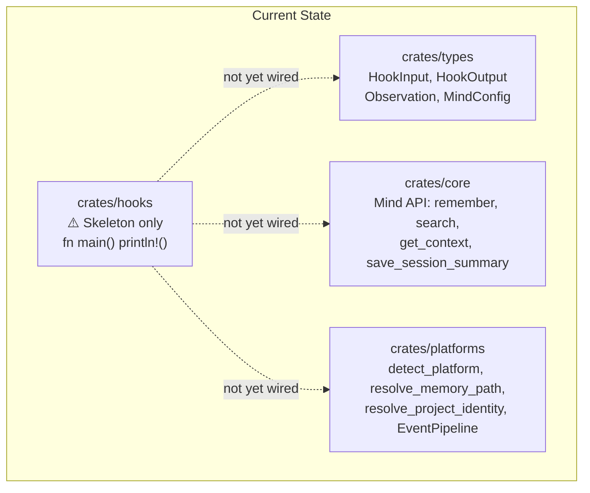
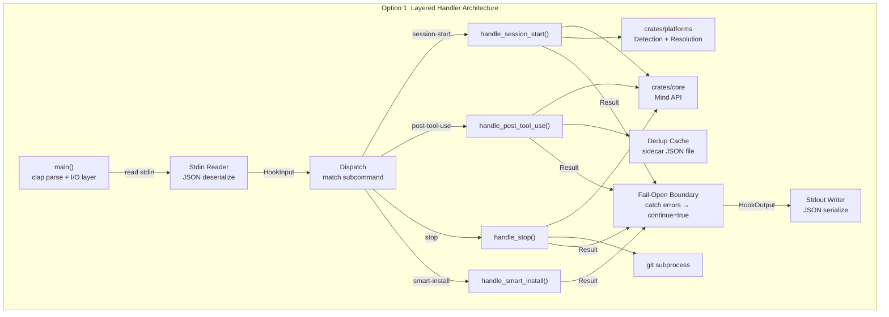
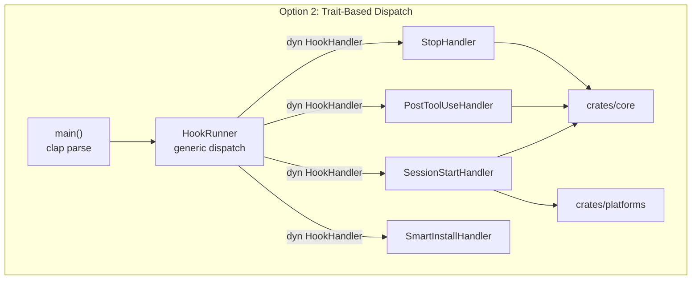
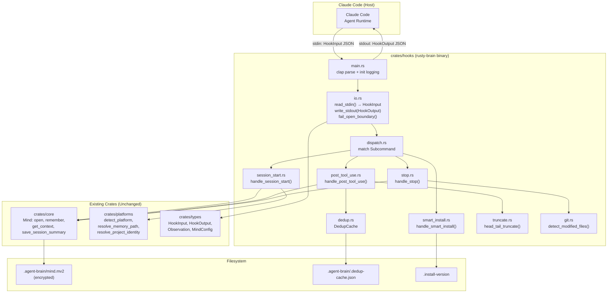
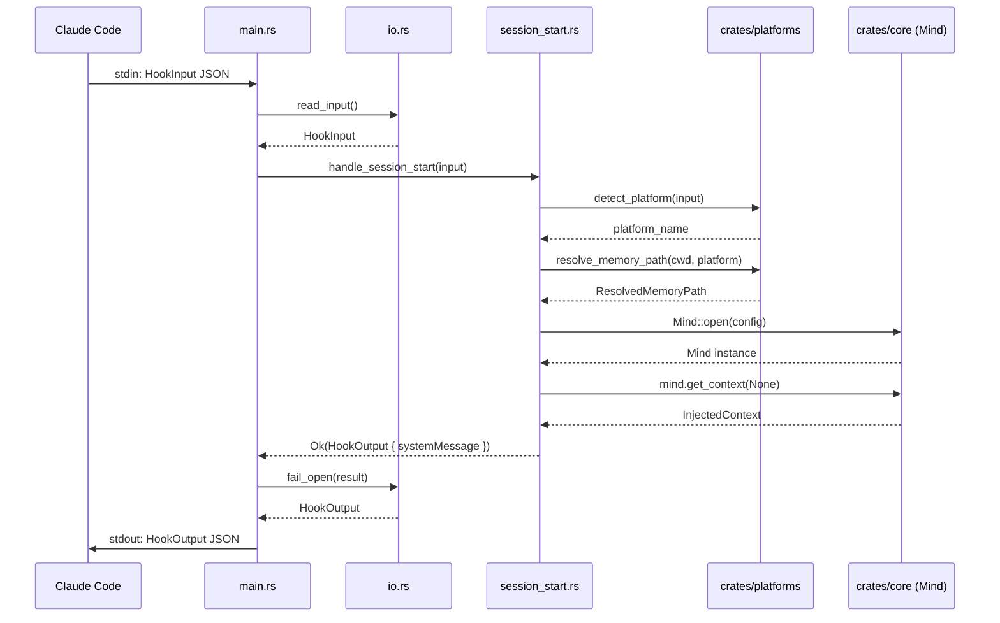
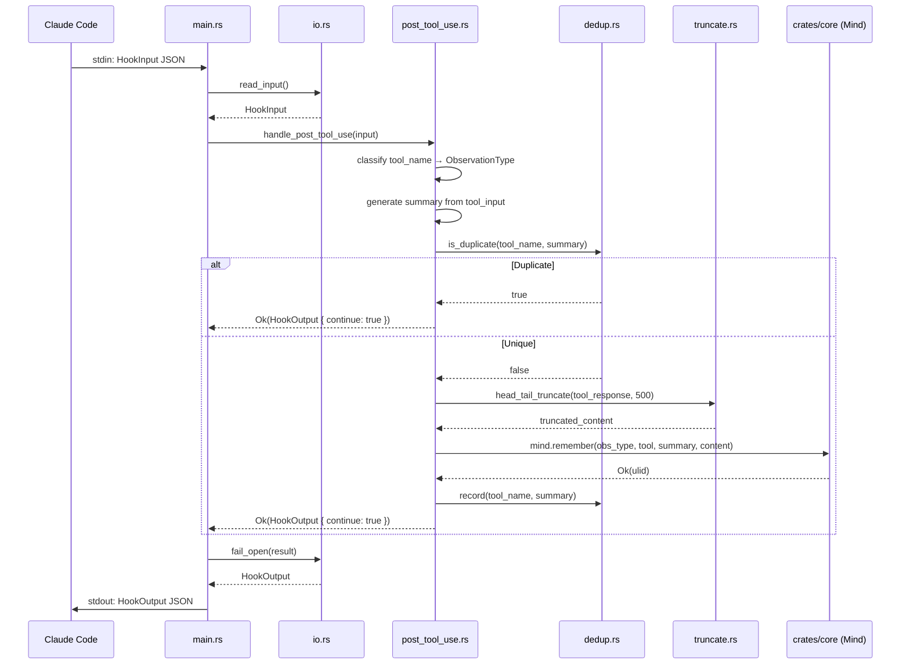
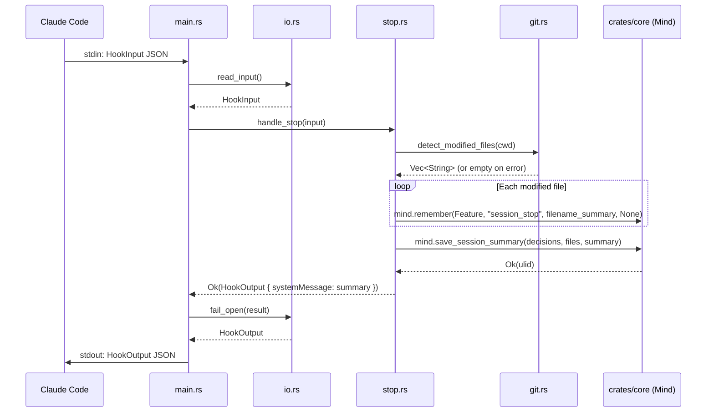
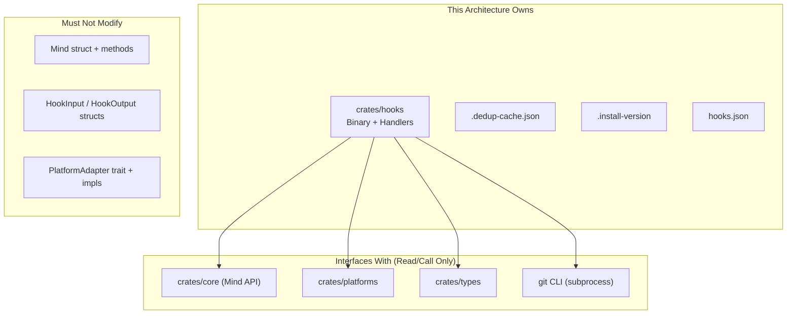

# 006-ar-claude-code-hooks

> **Document Type:** Architecture Review
> **Audience:** LLM agents, human reviewers
> **Status:** Proposed
> **Last Updated:** 2026-03-03 <!-- @auto -->
> **Owner:** Brian Luby <!-- @human-required -->
> **Deciders:** Brian Luby <!-- @human-required -->

---

## Review Tier Legend

| Marker | Tier | Speckit Behavior |
|--------|------|------------------|
| 🔴 `@human-required` | Human Generated | Prompt human to author; blocks until complete |
| 🟡 `@human-review` | LLM + Human Review | LLM drafts → prompt human to confirm/edit; blocks until confirmed |
| 🟢 `@llm-autonomous` | LLM Autonomous | LLM completes; no prompt; logged for audit |
| ⚪ `@auto` | Auto-generated | System fills (timestamps, links); no prompt |

---

## Document Completion Order

> ⚠️ **For LLM Agents:** Complete sections in this order. Do not fill downstream sections until upstream human-required inputs exist.

1. **Summary (Decision)** → requires human input first
2. **Context (Problem Space)** → requires human input
3. **Decision Drivers** → requires human input (prioritized)
4. **Driving Requirements** → extract from PRD, human confirms
5. **Options Considered** → LLM drafts after drivers exist, human reviews
6. **Decision (Selected + Rationale)** → requires human decision
7. **Implementation Guardrails** → LLM drafts, human reviews
8. **Everything else** → can proceed after decision is made

---

## Linkage ⚪ `@auto`

| Document | ID | Relationship |
|----------|-----|--------------|
| Parent PRD | 006-prd-claude-code-hooks.md | Requirements this architecture satisfies |
| Feature Spec | specs/006-claude-code-hooks/spec.md | Source requirements |
| Security Review | 006-sec-claude-code-hooks.md | Security implications of this decision |
| Supersedes | — | N/A (greenfield for hooks crate) |
| Superseded By | — | — |

---

## Summary

### Decision 🔴 `@human-required`

> Implement hooks as a single `rusty-brain` binary in the existing `crates/hooks` crate using clap subcommand dispatch, with thin handler functions that delegate to `crates/core` (Mind API) and `crates/platforms` (detection/resolution), wrapped in a fail-open error boundary.

### TL;DR for Agents 🟡 `@human-review`

> The `crates/hooks` crate produces a single `rusty-brain` binary with four clap subcommands (`session-start`, `post-tool-use`, `stop`, `smart-install`). Each subcommand reads `HookInput` from stdin, delegates to existing `Mind` and platform APIs, and writes `HookOutput` to stdout. Every code path must fail-open (valid JSON output + exit 0). No new external crates beyond what's in the workspace. Deduplication uses a sidecar JSON cache file; git diff uses a subprocess with timeout.

---

## Context

### Problem Space 🔴 `@human-required`

The rusty-brain workspace has a complete memory engine (`crates/core`), type definitions (`crates/types`), and platform adapters (`crates/platforms`), but no executable that Claude Code can invoke. Claude Code discovers hooks via a `hooks.json` manifest and calls them as subprocesses, passing JSON on stdin and reading JSON from stdout. The architectural challenge is: how to structure the binary crate that wires together the existing libraries into a reliable, fast, fail-safe subprocess that Claude Code invokes hundreds of times per session without ever blocking the developer's workflow.

### Decision Scope 🟡 `@human-review`

**This AR decides:**
- Binary crate structure and subcommand dispatch mechanism
- How handlers wire together existing `Mind`, platform detection, and type APIs
- Fail-open error boundary pattern
- Deduplication mechanism for post-tool-use observations
- Git diff integration approach for the stop hook
- Diagnostic logging integration

**This AR does NOT decide:**
- Mind API internals (owned by 003-core-memory-engine)
- Platform detection/resolution logic (owned by 005-platform-adapter-system)
- HookInput/HookOutput protocol definition (owned by crates/types)
- LLM-based compression strategy (deferred — W-1)
- Interactive CLI commands (deferred — W-3)

### Current State 🟢 `@llm-autonomous`

The `crates/hooks` crate exists as a skeleton with `clap` as a dependency and a placeholder `main.rs`. No handler logic, no stdin/stdout wiring, no integration with Mind or platforms.



### Driving Requirements 🟡 `@human-review`

| PRD Req ID | Requirement Summary | Architectural Implication |
|------------|---------------------|---------------------------|
| M-1 | Single binary with 4 subcommands | Need clap-based dispatch in `crates/hooks` binary crate |
| M-2 | Read HookInput from stdin, write HookOutput to stdout | Need stdin/stdout I/O layer with JSON serde |
| M-3 | Fail-open on all errors | Need top-level error boundary wrapping each handler |
| M-4 | Session-start: init Mind + inject context | Handler must call `detect_platform`, `resolve_memory_path`, `Mind::open`, `Mind::get_context` |
| M-5 | Post-tool-use: capture truncated observations | Handler must truncate content, call `Mind::remember` |
| M-6 | Post-tool-use: deduplicate within 60s window | Need sidecar dedup cache with hash-based lookup |
| M-7 | Stop: git diff + session summary + per-file observations | Handler must shell out to git, call `Mind::save_session_summary` and `Mind::remember` per file |
| M-8 | Smart-install: version marker file | Handler reads/writes `.install-version` file |
| M-9 | hooks.json manifest | Need manifest generation or static template |
| M-10 | No stderr in normal operation | Logging must be gated on `RUSTY_BRAIN_LOG` env var |
| M-11 | Memvid encryption for .mv2 files | Pass encryption config to `MindConfig` |
| S-5 | Session-start < 200ms | Minimal overhead in dispatch path; lazy initialization where possible |
| S-6 | Post-tool-use < 100ms | Dedup check must be fast (file-based, not DB); Mind::remember must be efficient |

**PRD Constraints inherited:**
- Rust stable, edition 2024, MSRV 1.85.0
- Must use existing workspace crates; `clap` already in workspace dependencies
- Must follow constitution principles (crate-first, test-first, agent-friendly)
- All hooks must exit with code 0

---

## Decision Drivers 🔴 `@human-required`

1. **Reliability (fail-open):** No hook invocation may ever block the host agent — exit 0 with valid JSON always *(traces to PRD M-3)*
2. **Performance:** session-start < 200ms, post-tool-use < 100ms — hooks are invoked frequently and must not add perceptible latency *(traces to PRD S-5, S-6)*
3. **Simplicity:** Minimize moving parts — the hook is a thin glue layer, not a new application framework *(constitution: crate-first)*
4. **Testability:** Each handler must be independently testable without subprocess invocation *(constitution: test-first)*
5. **Maintainability:** Clear separation between I/O (stdin/stdout/stderr), dispatch, and business logic *(constitution: agent-friendly)*

---

## Options Considered 🟡 `@human-review`

### Option 0: Status Quo / Do Nothing

**Description:** Leave `crates/hooks` as a skeleton. The memory system exists as a library but has no integration with Claude Code.

| Driver | Rating | Notes |
|--------|--------|-------|
| Reliability | ❌ Poor | No hooks exist — Claude Code has no memory integration |
| Performance | N/A | Nothing to measure |
| Simplicity | ✅ Good | Nothing to maintain |
| Testability | N/A | Nothing to test |
| Maintainability | N/A | Nothing to maintain |

**Why not viable:** The entire purpose of feature 006 is to provide the executable entry point. Without it, crates/core and crates/platforms deliver zero user value. *(Fails all PRD Must Have requirements)*

---

### Option 1: Layered Handler Architecture (Recommended)

**Description:** Structure `crates/hooks` as three clean layers: (1) I/O layer (stdin/stdout/stderr/logging), (2) dispatch layer (clap subcommands → handler functions), (3) handler layer (business logic calling Mind + platforms). Each handler is a pure function `fn(HookInput) -> Result<HookOutput, Error>` wrapped by the I/O layer's fail-open boundary.



| Driver | Rating | Notes |
|--------|--------|-------|
| Reliability | ✅ Good | Single fail-open boundary catches all errors; handlers return Result |
| Performance | ✅ Good | No overhead beyond clap parse (~1ms); handlers call existing APIs directly |
| Simplicity | ✅ Good | Three clear layers; handlers are pure functions; no framework or abstractions |
| Testability | ✅ Good | Handlers testable as `fn(HookInput) -> Result<HookOutput>` without subprocess |
| Maintainability | ✅ Good | New hook types = new handler function + clap variant; I/O layer unchanged |

**Pros:**
- Handlers are pure functions testable without I/O
- Fail-open boundary is a single wrapper, not duplicated per handler
- clap is already in workspace; derive macros minimize boilerplate
- Each handler file can be independently modified
- Dedup cache is a simple sidecar JSON file — no in-memory state across invocations

**Cons:**
- File-based dedup cache adds a filesystem read/write per post-tool-use invocation (~1-2ms)
- Handlers must handle `Mind::open` latency inline (no lazy init across invocations since each is a fresh process)

---

### Option 2: Trait-Based Handler Dispatch

**Description:** Define a `HookHandler` trait with a `handle(&self, input: HookInput) -> Result<HookOutput>` method. Each subcommand implements the trait. A generic runner calls the appropriate trait implementation. More extensible but more abstract.



| Driver | Rating | Notes |
|--------|--------|-------|
| Reliability | ✅ Good | Same fail-open pattern via trait runner |
| Performance | ⚠️ Medium | Dynamic dispatch adds minor overhead; trait objects prevent inlining |
| Simplicity | ⚠️ Medium | Trait + struct per handler is more abstraction than needed for 4 fixed variants |
| Testability | ✅ Good | Each handler struct testable via trait interface |
| Maintainability | ✅ Good | Adding handlers = new impl; but 4 handlers don't justify the pattern |

**Pros:**
- Clean extension point for future hook types
- Enforces consistent interface via trait contract
- Runner owns I/O and error handling uniformly

**Cons:**
- Over-engineered for 4 fixed, known subcommands (PRD W-5 explicitly defers extensibility)
- Dynamic dispatch prevents compiler optimizations
- More boilerplate: trait definition, struct per handler, runner generic
- Abstraction adds cognitive overhead with no current benefit

---

## Decision

### Selected Option 🔴 `@human-required`

> **Option 1: Layered Handler Architecture**

### Rationale 🔴 `@human-required`

Option 1 is the simplest approach that satisfies all PRD requirements. The four subcommands are fixed and known (W-5 explicitly defers extensibility), so the trait-based approach (Option 2) adds abstraction with no current benefit. Plain functions with a single fail-open wrapper are easier to test, debug, and understand. The layered separation (I/O → dispatch → handler) keeps each concern isolated without requiring a framework.

#### Simplest Implementation Comparison 🟡 `@human-review`

| Aspect | Simplest Possible | Selected Option | Justification for Complexity |
|--------|-------------------|-----------------|------------------------------|
| Subcommand dispatch | `std::env::args` match | clap derive | clap already in workspace; provides --help, --version (C-3), error messages for free |
| Error handling | `unwrap_or_default` everywhere | Dedicated fail-open boundary function | Centralizes error→HookOutput conversion; prevents accidentally missing a panic path (M-3) |
| Dedup | In-process HashMap | Sidecar JSON file | Each hook invocation is a separate process — no in-memory state to share (M-6) |
| Git integration | `Command::new("git").output()` | Same, plus timeout guard | Timeout prevents hanging if git is slow or stuck (S-6, M-7) |
| Logging | No logging at all | `tracing-subscriber` gated on `RUSTY_BRAIN_LOG` | Needed for diagnosability without violating M-10; `tracing` already in workspace |
| Content truncation | String slicing | Head/tail with token estimation | Preserves beginning and end of tool output for better observation quality (M-5) |

**Complexity justified by:** Every addition beyond the simplest approach directly addresses a specific PRD Must Have (M-3: fail-open boundary, M-5: truncation, M-6: dedup file, M-10: gated logging) or Should Have (S-5/S-6: timeout guard). No speculative extensibility is added.

### Architecture Diagram 🟡 `@human-review`



---

## Technical Specification

### Component Overview 🟡 `@human-review`

| Component | Responsibility | Interface | Dependencies |
|-----------|---------------|-----------|--------------|
| `main.rs` | Entry point: clap parse, init logging, orchestrate I/O | Binary entry point | clap, tracing, tracing-subscriber |
| `io.rs` | Read stdin → HookInput, write HookOutput → stdout, fail-open boundary | `read_input() -> Result<HookInput>`, `write_output(HookOutput)`, `fail_open(Result<HookOutput>) -> HookOutput` | crates/types (serde) |
| `dispatch.rs` | Route subcommand to handler function | `dispatch(Subcommand, HookInput) -> Result<HookOutput>` | Handler modules |
| `session_start.rs` | Init Mind, detect platform, resolve path, inject context | `handle_session_start(HookInput) -> Result<HookOutput>` | crates/core, crates/platforms |
| `post_tool_use.rs` | Classify tool, truncate content, dedup check, store observation | `handle_post_tool_use(HookInput) -> Result<HookOutput>` | crates/core, dedup.rs, truncate.rs |
| `stop.rs` | Git diff, session summary, per-file observations, mind shutdown | `handle_stop(HookInput) -> Result<HookOutput>` | crates/core, git.rs |
| `smart_install.rs` | Read/write `.install-version` marker | `handle_smart_install(HookInput) -> Result<HookOutput>` | std::fs |
| `dedup.rs` | File-based dedup cache: check + record with 60s window | `DedupCache::is_duplicate(tool, summary) -> bool`, `DedupCache::record(tool, summary)` | std::fs, serde_json |
| `truncate.rs` | Head/tail content truncation to ~500 tokens | `head_tail_truncate(content, max_tokens) -> String` | None |
| `git.rs` | Shell out to git for modified file detection | `detect_modified_files(cwd) -> Result<Vec<String>>` | std::process::Command |
| `manifest.rs` | Generate/validate hooks.json | `generate_manifest(binary_path) -> HooksManifest` | serde_json |

### Data Flow 🟢 `@llm-autonomous`

#### Session Start Flow


#### Post Tool Use Flow


#### Stop Flow


### Interface Definitions 🟡 `@human-review`

```rust
// crates/hooks/src/io.rs

/// Read HookInput from stdin. Returns Err on empty/invalid JSON.
pub fn read_input() -> Result<HookInput, HookError>;

/// Write HookOutput as JSON to stdout.
pub fn write_output(output: &HookOutput) -> Result<(), HookError>;

/// Wrap a handler result in fail-open semantics.
/// On Ok: return the HookOutput as-is.
/// On Err: return HookOutput { continue: true, systemMessage: None }.
pub fn fail_open(result: Result<HookOutput, HookError>) -> HookOutput;

// crates/hooks/src/dispatch.rs

#[derive(clap::Parser)]
pub struct Cli {
    #[command(subcommand)]
    pub command: Subcommand,
}

#[derive(clap::Subcommand)]
pub enum Subcommand {
    SessionStart,
    PostToolUse,
    Stop,
    SmartInstall,
}

// crates/hooks/src/session_start.rs
pub fn handle_session_start(input: HookInput) -> Result<HookOutput, HookError>;

// crates/hooks/src/post_tool_use.rs
pub fn handle_post_tool_use(input: HookInput) -> Result<HookOutput, HookError>;

// crates/hooks/src/stop.rs
pub fn handle_stop(input: HookInput) -> Result<HookOutput, HookError>;

// crates/hooks/src/smart_install.rs
pub fn handle_smart_install(input: HookInput) -> Result<HookOutput, HookError>;

// crates/hooks/src/dedup.rs

pub struct DedupCache {
    cache_path: PathBuf,
}

impl DedupCache {
    pub fn new(project_dir: &Path) -> Self;
    /// Check if tool+summary was seen within the last 60 seconds.
    pub fn is_duplicate(&self, tool_name: &str, summary: &str) -> bool;
    /// Record a new tool+summary entry with current timestamp.
    pub fn record(&self, tool_name: &str, summary: &str) -> Result<(), HookError>;
}

// crates/hooks/src/truncate.rs

/// Truncate content to approximately max_tokens using head/tail strategy.
/// Keeps first ~60% and last ~40% of content, inserting "[...truncated...]" marker.
pub fn head_tail_truncate(content: &str, max_tokens: usize) -> String;

// crates/hooks/src/git.rs

/// Shell out to `git diff --name-only HEAD` with a 5-second timeout.
/// Returns empty Vec if git is not available or errors.
pub fn detect_modified_files(cwd: &Path) -> Vec<String>;
```

### Key Algorithms/Patterns 🟡 `@human-review`

**Pattern: Fail-Open Boundary**
```
fn main():
    1. Parse clap subcommand (if parse fails → print help, exit 0)
    2. Init logging (tracing-subscriber gated on RUSTY_BRAIN_LOG)
    3. result = catch_unwind(|| {
           input = read_input()?  // May fail → fail-open
           match subcommand:
               SessionStart → handle_session_start(input)
               PostToolUse  → handle_post_tool_use(input)
               Stop         → handle_stop(input)
               SmartInstall → handle_smart_install(input)
       })
    4. output = match result:
           Ok(Ok(hook_output)) → hook_output
           Ok(Err(error))      → HookOutput::fail_open()  // Log error if RUSTY_BRAIN_LOG
           Err(panic)          → HookOutput::fail_open()  // Log panic if RUSTY_BRAIN_LOG
    5. write_output(&output)  // If this fails, write minimal {} to stdout
    6. exit(0)  // Always
```

**Pattern: File-Based Dedup Cache**
```
DedupCache format (.agent-brain/.dedup-cache.json):
{
    "entries": {
        "<hash(tool_name+summary)>": <unix_timestamp>,
        ...
    }
}

is_duplicate(tool, summary):
    1. hash = blake3/sha256(tool + "|" + summary)  // or simple hash
    2. Load cache file (if not found → not duplicate)
    3. Prune entries older than 60 seconds
    4. Return entries.contains(hash)

record(tool, summary):
    1. hash = blake3/sha256(tool + "|" + summary)
    2. Load cache file (or create empty)
    3. Prune entries older than 60 seconds
    4. Insert hash → current_timestamp
    5. Write cache file (atomic via temp file + rename)
```

**Pattern: Head/Tail Truncation**
```
head_tail_truncate(content, max_tokens=500):
    1. Estimate token count (chars / 4 rough approximation)
    2. If under limit → return as-is
    3. head_size = max_tokens * 0.6 * 4 chars
    4. tail_size = max_tokens * 0.4 * 4 chars
    5. Return content[..head_size] + "\n[...truncated...]\n" + content[-tail_size..]
```

---

## Constraints & Boundaries

### Technical Constraints 🟡 `@human-review`

**Inherited from PRD:**
- Rust stable, edition 2024, MSRV 1.85.0 *(PRD Technical Constraints)*
- Must use existing workspace crates (core, types, platforms) *(PRD Technical Constraints)*
- `clap` already in workspace dependencies *(PRD Tool/Approach Candidates)*
- session-start < 200ms, post-tool-use < 100ms *(PRD S-5, S-6)*
- Exit code always 0 *(PRD M-3)*
- No stderr unless `RUSTY_BRAIN_LOG` set *(PRD M-10, S-3)*
- Memvid encryption for .mv2 files *(PRD M-11)*
- Constitution principles: crate-first, test-first, agent-friendly *(CLAUDE.md)*

**Added by this Architecture:**
- Dedup cache stored at `.agent-brain/.dedup-cache.json` (adjacent to .mv2 file)
- Git subprocess timeout: 5 seconds maximum
- `catch_unwind` wraps all handler code to prevent panics from producing non-JSON output
- No `tokio` runtime in the hooks binary — all I/O is synchronous (subprocess lifecycle is inherently synchronous)
- Hash function for dedup: use `std::hash::DefaultHasher` (no new crypto dependency needed for dedup — this is not a security hash)

### Architectural Boundaries 🟡 `@human-review`



- **Owns:** `crates/hooks` source code, `.dedup-cache.json` format, `.install-version` format, `hooks.json` manifest format
- **Interfaces With:** `crates/core` (Mind API), `crates/platforms` (detection/resolution), `crates/types` (HookInput/HookOutput), git CLI
- **Must Not Touch:** Mind internals, HookInput/HookOutput struct definitions, platform adapter implementations

### Implementation Guardrails 🟡 `@human-review`

> ⚠️ **Critical for LLM Agents:**

- [ ] **DO NOT** use `std::process::exit()` inside handler functions — only in `main()` after output is written *(from M-3: fail-open)*
- [ ] **DO NOT** write to stderr unless `RUSTY_BRAIN_LOG` is set *(from M-10)*
- [ ] **DO NOT** use `unwrap()` or `expect()` in handler code — all errors must propagate via `Result` to the fail-open boundary *(from M-3)*
- [ ] **DO NOT** add `tokio` or async runtime to the hooks binary — subprocess I/O is synchronous *(performance constraint)*
- [ ] **DO NOT** hold the Mind file lock across the entire handler — acquire, operate, release within the handler *(concurrency constraint)*
- [ ] **DO NOT** modify `HookInput` or `HookOutput` struct definitions — those belong to `crates/types` *(architectural boundary)*
- [ ] **DO NOT** assume git is installed — `detect_modified_files` must return empty Vec on any git failure *(from EC-5)*
- [ ] **MUST** wrap all handler dispatch in `catch_unwind` to prevent panics from producing non-JSON output *(from M-2, M-3)*
- [ ] **MUST** always exit with code 0 regardless of outcome *(from M-3)*
- [ ] **MUST** produce valid JSON on stdout even for empty/malformed stdin *(from M-2, EC-1, EC-2)*
- [ ] **MUST** use atomic file writes (write to temp + rename) for dedup cache and version marker *(from concurrency constraint)*
- [ ] **MUST** prune expired entries from dedup cache on every read to prevent unbounded growth *(from M-6)*

---

## Consequences 🟡 `@human-review`

### Positive
- Hooks deliver the core value proposition: persistent memory across Claude Code sessions
- Layered architecture keeps handlers testable as pure functions
- Single binary with clap is the idiomatic Rust pattern — no surprises for contributors
- File-based dedup cache works across process invocations without shared state
- Fail-open boundary ensures hooks never degrade the developer experience

### Negative
- Each hook invocation pays `Mind::open` cost (~10-50ms) — no way to amortize across invocations since each is a fresh process
- File-based dedup cache adds ~1-2ms I/O per post-tool-use invocation
- Head/tail truncation loses middle content — acceptable for MVP but lower quality than LLM compression
- No async: if `Mind::open` or git subprocess is slow, the hook blocks synchronously

### Risks & Mitigations

| Risk | Likelihood | Impact | Mitigation |
|------|------------|--------|------------|
| `Mind::open` exceeds 200ms budget | Medium | High | Profile early; add warning log at 150ms; consider caching Mind instance via Unix socket in future |
| Dedup cache file corruption | Low | Low | Fail-open: if cache unreadable, treat as "not duplicate" and proceed |
| Git subprocess hangs | Low | Medium | 5-second timeout; kill process on timeout; return empty file list |
| Concurrent sessions corrupt dedup cache | Medium | Low | Atomic writes (temp + rename); worst case: a duplicate observation is stored (harmless) |
| Binary size bloat from memvid dependency | Low | Low | Monitor with `cargo bloat`; use LTO and strip in release profile |

---

## Implementation Guidance

### Suggested Implementation Order 🟢 `@llm-autonomous`

1. **I/O layer** (`io.rs`): `read_input`, `write_output`, `fail_open` — foundation everything depends on
2. **Dispatch** (`main.rs`, `dispatch.rs`): clap CLI struct, subcommand enum, main function skeleton
3. **Smart-install handler** (`smart_install.rs`): Simplest handler — validates the full I/O pipeline end-to-end
4. **Truncation** (`truncate.rs`): Pure function, no dependencies — testable in isolation
5. **Dedup cache** (`dedup.rs`): File-based cache with prune logic
6. **Session-start handler** (`session_start.rs`): First handler touching Mind + platforms — proves integration
7. **Post-tool-use handler** (`post_tool_use.rs`): Depends on truncation + dedup
8. **Git integration** (`git.rs`): Subprocess with timeout
9. **Stop handler** (`stop.rs`): Depends on git integration
10. **Manifest** (`manifest.rs`): Generate hooks.json
11. **Logging integration**: Wire `tracing-subscriber` gated on `RUSTY_BRAIN_LOG`

### Testing Strategy 🟢 `@llm-autonomous`

| Layer | Test Type | Coverage Target | Notes |
|-------|-----------|-----------------|-------|
| `io.rs` | Unit | 100% | Test read_input with valid, empty, malformed JSON; test fail_open with Ok and Err |
| `truncate.rs` | Unit | 100% | Test under/over limit, empty string, exact boundary |
| `dedup.rs` | Unit | 95% | Test duplicate detection, expiry, prune, concurrent access, corrupt file |
| `git.rs` | Unit + Integration | 90% | Mock subprocess for unit; real git repo for integration |
| `session_start.rs` | Integration | 90% | Use tempdir with .mv2 file; verify systemMessage content |
| `post_tool_use.rs` | Integration | 90% | Store observation, verify via Mind::search; test dedup |
| `stop.rs` | Integration | 90% | Use git repo tempdir; verify session summary + per-file observations |
| `smart_install.rs` | Unit | 100% | Test fresh install, version match, version mismatch |
| `manifest.rs` | Unit | 100% | Validate generated JSON against schema |
| End-to-end | E2E | Happy + error paths | Invoke binary as subprocess with stdin/stdout piping |

### Reference Implementations 🟡 `@human-review`

- Mind API usage: `crates/core/src/mind.rs` tests *(internal)*
- Platform detection: `crates/platforms/src/detection.rs` tests *(internal)*
- HookInput/HookOutput serde: `crates/types/src/hooks.rs` tests *(internal)*

### Anti-patterns to Avoid 🟡 `@human-review`

- **Don't:** Use `println!` or `eprintln!` directly for hook output
  - **Why:** Mixing raw prints with JSON output corrupts the protocol
  - **Instead:** Use `write_output()` for stdout; `tracing::debug!` for diagnostics (gated by env var)

- **Don't:** Create a shared `Mind` instance across handler invocations
  - **Why:** Each invocation is a separate process — there's no shared state to reuse
  - **Instead:** Open Mind fresh in each handler that needs it

- **Don't:** Use `HashMap` for dedup across invocations
  - **Why:** In-memory state is lost when the process exits
  - **Instead:** Use the sidecar `.dedup-cache.json` file

- **Don't:** Parse clap args AND stdin JSON for the same information
  - **Why:** Subcommand comes from args; all other data comes from stdin HookInput
  - **Instead:** Args → which handler; stdin → handler input

---

## Compliance & Cross-cutting Concerns

### Security Considerations 🟡 `@human-review`

- **Authentication:** N/A — local subprocess invocation by Claude Code
- **Authorization:** N/A — filesystem permissions govern access to .mv2 files
- **Data handling:** Memory files use memvid built-in encryption (M-11); dedup cache contains only hashes and timestamps, no content; version marker contains only a version string
- Full details in 006-sec-claude-code-hooks.md

### Observability 🟢 `@llm-autonomous`

- **Logging:** `tracing` with `tracing-subscriber` EnvFilter, gated on `RUSTY_BRAIN_LOG` env var. Levels: `error` (fail-open triggered), `warn` (latency threshold exceeded), `info` (handler entry/exit), `debug` (detailed flow), `trace` (stdin/stdout content)
- **Metrics:** No runtime metrics emission (subprocess lifecycle too short). Performance validated via benchmark tests.
- **Tracing:** Session ID from HookInput included in all log lines as a structured field for cross-invocation correlation.

### Error Handling Strategy 🟢 `@llm-autonomous`

```
Error Category → Handling Approach
├── Stdin empty/invalid JSON     → fail_open: HookOutput { continue: true }
├── Mind::open failure           → fail_open: log error, return continue: true
├── Mind::remember failure       → fail_open: log error, return continue: true
├── Dedup cache unreadable       → treat as "not duplicate", proceed normally
├── Git subprocess failure       → return empty modified files list, continue
├── Git subprocess timeout       → kill process, return empty list, continue
├── Version file I/O failure     → fail_open: skip version tracking
├── Panic in handler             → catch_unwind → fail_open
└── stdout write failure         → write minimal "{}" as last resort, exit 0
```

---

## Migration Plan

### From Current State to Target State

N/A — greenfield implementation in existing skeleton crate. No migration required; the crate currently has a placeholder `main.rs`.

### Rollback Plan 🔴 `@human-required`

**Rollback Triggers:**
- Hook invocations consistently block Claude Code (violating M-3)
- Memory corruption detected after hook execution
- Performance regression exceeds 2x the target (>400ms session-start, >200ms post-tool-use)

**Rollback Decision Authority:** Brian Luby

**Rollback Time Window:** Any time before hooks.json is deployed to user machines

**Rollback Procedure:**
1. Remove `hooks.json` from the Claude Code settings directory — Claude Code will stop invoking hooks
2. The `crates/hooks` binary can remain installed without impact (it's only called via hooks.json registration)
3. No data loss: .mv2 files remain intact and accessible via future versions

---

## Open Questions 🟡 `@human-review`

- [x] ~~Q1: clap vs manual arg parsing~~ → Resolved: clap (already in workspace)
- [x] ~~Q2: Should dedup hash use `std::hash::DefaultHasher` or a deterministic hash (e.g., FNV/SipHash)?~~ → Resolved: DefaultHasher (60s TTL makes instability harmless)

---

## Changelog ⚪ `@auto`

| Version | Date | Author | Changes |
|---------|------|--------|---------|
| 0.1 | 2026-03-03 | Claude (speckit) | Initial proposal |

---

## Decision Record ⚪ `@auto`

| Date | Event | Details |
|------|-------|---------|
| 2026-03-03 | Proposed | Initial draft created from PRD 006-prd-claude-code-hooks |

---

## Traceability Matrix 🟢 `@llm-autonomous`

| PRD Req ID | Decision Driver | Option Rating | Component | How Satisfied |
|------------|-----------------|---------------|-----------|---------------|
| M-1 | Simplicity | Option 1: ✅ | main.rs, dispatch.rs | clap subcommand dispatch |
| M-2 | Reliability | Option 1: ✅ | io.rs | read_input/write_output with JSON serde |
| M-3 | Reliability | Option 1: ✅ | io.rs (fail_open) | catch_unwind + error→HookOutput conversion |
| M-4 | — | Option 1: ✅ | session_start.rs | Calls detect_platform, resolve_memory_path, Mind::open, Mind::get_context |
| M-5 | Performance | Option 1: ✅ | post_tool_use.rs, truncate.rs | head_tail_truncate to ~500 tokens |
| M-6 | Performance | Option 1: ✅ | dedup.rs | File-based cache with 60s TTL |
| M-7 | — | Option 1: ✅ | stop.rs, git.rs | git diff subprocess + Mind::save_session_summary + per-file Mind::remember |
| M-8 | Simplicity | Option 1: ✅ | smart_install.rs | Read/write .install-version file |
| M-9 | — | Option 1: ✅ | manifest.rs | Generate hooks.json with binary path + subcommand args |
| M-10 | Reliability | Option 1: ✅ | main.rs (logging init) | tracing-subscriber gated on RUSTY_BRAIN_LOG |
| M-11 | — | Option 1: ✅ | session_start.rs | Pass encryption config to MindConfig |
| S-1 | — | Option 1: ✅ | session_start.rs | Include commands/skills in systemMessage |
| S-2 | — | Option 1: ✅ | post_tool_use.rs | Match on tool_name with fallback for unknown tools |
| S-3 | — | Option 1: ✅ | main.rs | RUSTY_BRAIN_LOG env var controls tracing-subscriber |
| S-4 | — | Option 1: ✅ | session_start.rs | Check for .claude/mind.mv2 and suggest migration |
| S-5 | Performance | Option 1: ✅ | session_start.rs | Direct API calls, no overhead beyond Mind::open |
| S-6 | Performance | Option 1: ✅ | post_tool_use.rs | Dedup check ~1ms + Mind::remember inline |

---

## Review Checklist 🟢 `@llm-autonomous`

Before marking as Accepted:
- [x] All PRD Must Have requirements appear in Driving Requirements
- [x] Option 0 (Status Quo) is documented
- [x] Simplest Implementation comparison is completed
- [x] Decision drivers are prioritized and addressed
- [x] At least 2 options were seriously considered
- [x] Constraints distinguish inherited vs. new
- [x] Component names are consistent across all diagrams and tables
- [x] Implementation guardrails reference specific PRD constraints
- [x] Rollback triggers and authority are defined
- [ ] Security review is linked (pending 006-sec-claude-code-hooks.md)
- [x] No open questions blocking implementation (Q2 is informational, not blocking)
