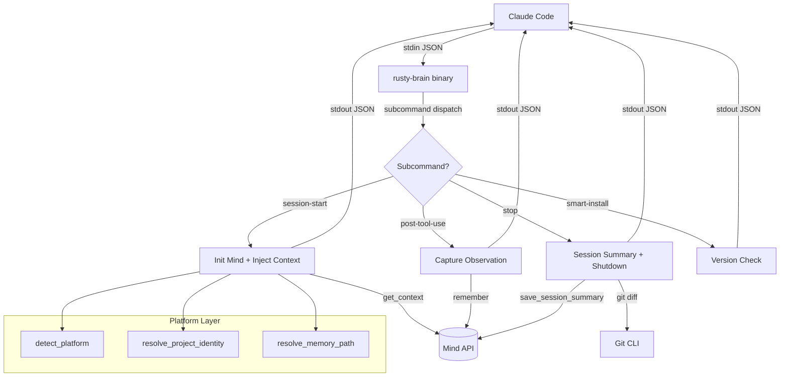
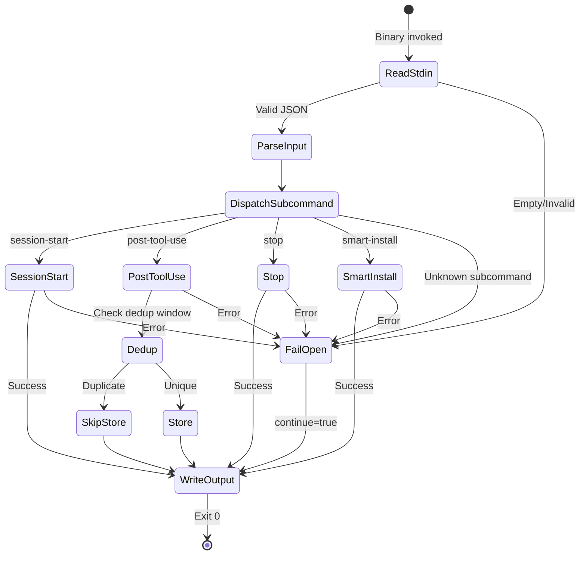
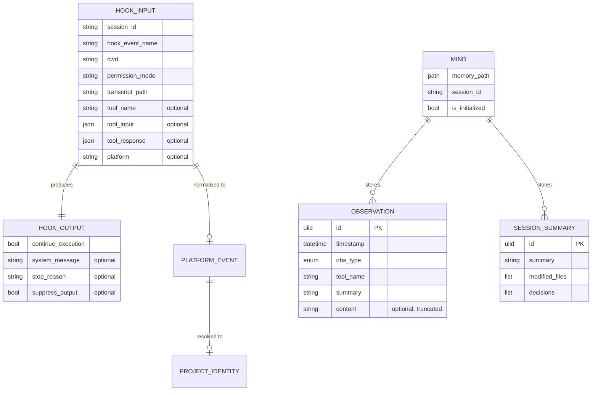
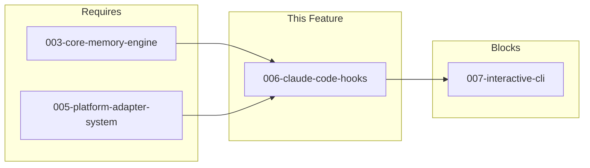

# 006-prd-claude-code-hooks

> **Document Type:** Product Requirements Document
> **Audience:** LLM agents, human reviewers
> **Status:** Draft
> **Last Updated:** 2026-03-03 <!-- @auto -->
> **Owner:** Brian Luby <!-- @human-required -->

**Feature Branch**: `006-claude-code-hooks`
**Created**: 2026-03-03
**Status**: Draft
**Input**: User description: "Build the four hook binaries that Claude Code invokes as subprocess commands (Phase 5 from RUST_ROADMAP.md)"

---

## Review Tier Legend

| Marker | Tier | Speckit Behavior |
|--------|------|------------------|
| 🔴 `@human-required` | Human Generated | Prompt human to author; blocks until complete |
| 🟡 `@human-review` | LLM + Human Review | LLM drafts → prompt human to confirm/edit; blocks until confirmed |
| 🟢 `@llm-autonomous` | LLM Autonomous | LLM completes; no prompt; logged for audit |
| ⚪ `@auto` | Auto-generated | System fills (timestamps, links); no prompt |

---

## Document Completion Order

> ⚠️ **For LLM Agents:** Complete sections in this order. Do not fill downstream sections until upstream human-required inputs exist.

1. **Context** (Background, Scope) → requires human input first
2. **Problem Statement & User Scenarios** → requires human input
3. **Requirements** (Must/Should/Could/Won't) → requires human input
4. **Technical Constraints** → human review
5. **Diagrams, Data Model, Interface** → LLM can draft after above exist
6. **Acceptance Criteria** → derived from requirements
7. **Everything else** → can proceed

---

## Context

### Background 🔴 `@human-required`

rusty-brain is a Rust rewrite of agent-brain — a persistent memory system for AI coding agents. The core memory engine (`crates/core`) and platform adapter system (`crates/platforms`) are complete. The missing piece is the executable entry point: the hook binaries that Claude Code invokes as subprocess commands at key lifecycle events (session start, tool use, session stop). Without these hooks, the memory system has no integration point with the host agent — it exists as a library with no way to be called.

### Scope Boundaries 🟡 `@human-review`

**In Scope:**
- Single `rusty-brain` binary with four subcommands: `session-start`, `post-tool-use`, `stop`, `smart-install`
- JSON stdin/stdout protocol matching Claude Code's hook contract (`HookInput`/`HookOutput`)
- Memory initialization, context injection, observation capture, session summary, and version tracking
- `hooks.json` manifest file for Claude Code hook discovery
- Env-var controlled diagnostic logging (`RUSTY_BRAIN_LOG`)
- Memvid built-in encryption for data-at-rest protection
- Fail-open error handling on all code paths

**Out of Scope:**
- LLM-based compression of tool outputs — deferred to a future compression crate; hooks use head/tail truncation fallback
- Remote memory sync or cloud storage — rusty-brain is local-only by design
- Interactive CLI commands (search, ask, stats) — separate from hook binaries; different UX surface
- Pre-tool-use hooks — not needed for memory capture; only post-tool-use is relevant
- Multi-agent memory sharing — each session operates independently via file locking
- Custom hook event types beyond the four defined — extensibility deferred

### Glossary 🟡 `@human-review`

| Term | Definition |
|------|------------|
| Hook | A subprocess command invoked by Claude Code at a lifecycle event; reads JSON from stdin, writes JSON to stdout |
| HookInput | The JSON payload Claude Code sends to a hook on stdin (defined in `crates/types/src/hooks.rs`) |
| HookOutput | The JSON response a hook writes to stdout (defined in `crates/types/src/hooks.rs`) |
| Mind | The core memory engine that stores and retrieves observations (`crates/core/src/mind.rs`) |
| Observation | A single unit of memory: a tool action, decision, discovery, or session summary |
| Fail-open | Error handling strategy where any internal failure produces a valid output allowing the host agent to continue |
| Deduplication Window | A 60-second time window during which duplicate tool+summary observations are suppressed |
| `.mv2` | Memvid's binary memory file format, used for storing encoded observations |
| Context Injection | The process of loading recent observations and session summaries into the agent's system prompt at session start |
| Platform Adapter | Abstraction layer that normalizes hook inputs across different AI agent platforms (Claude Code, opencode, etc.) |

### Related Documents ⚪ `@auto`

| Document | Link | Relationship |
|----------|------|--------------|
| Feature Spec | specs/006-claude-code-hooks/spec.md | Source requirements |
| Architecture Review | specs/006-claude-code-hooks/ar.md | Defines technical approach |
| Security Review | specs/006-claude-code-hooks/sec.md | Risk assessment |
| Parent Roadmap | RUST_ROADMAP.md | Phase 5 — Hook Binaries |

---

## Problem Statement 🔴 `@human-required`

The rusty-brain memory system has a complete core engine (`Mind` API) and platform adapter layer, but no executable entry point. Claude Code discovers and invokes hooks as subprocess commands — without a binary that implements the hook protocol, the memory system cannot be used. Developers currently have no persistent memory across Claude Code sessions: each session starts from scratch with no context about previous work, decisions, or discoveries. This means repeated explanations, lost insights, and no continuity between sessions. The hook binaries are the integration layer that bridges the memory engine to the host agent, turning a library into a working product.

---

## User Scenarios & Testing 🔴 `@human-required`

### User Story 1 — Session Context Injection (Priority: P1)

A developer starts a new Claude Code session in a project that has existing memory. The session-start hook initializes the memory system, detects the platform, resolves the correct memory file for this project, and injects recent observations and session summaries into the agent's system prompt so the agent has continuity with previous work.

> As a developer using Claude Code, I want my agent to automatically recall what happened in previous sessions so that I don't have to re-explain context, decisions, or project state.

**Why this priority**: Without context injection, the memory system has no way to deliver value. This is the primary interface between stored memories and the agent — it's the entire reason the system exists.

**Independent Test**: Can be fully tested by invoking `rusty-brain session-start` with a valid JSON payload on stdin and verifying that structured context appears in the JSON output on stdout.

**Acceptance Scenarios**:
1. **Given** a project with an existing `.mv2` memory file containing 10+ observations, **When** the session-start hook receives a valid `HookInput` on stdin, **Then** it returns a `HookOutput` with a `systemMessage` containing recent observations, session summaries, and available commands.
2. **Given** a project with no existing memory file, **When** the session-start hook runs, **Then** it creates a new encrypted memory file, returns a welcome message in `systemMessage`, and exits with code 0.
3. **Given** any error occurs during initialization, **When** the session-start hook runs, **Then** it returns a valid `HookOutput` with `continue` set to `true` (fail-open) and exits with code 0.
4. **Given** a project with a legacy memory path (`.claude/mind.mv2`), **When** the session-start hook runs, **Then** the `systemMessage` includes a migration suggestion to move to `.agent-brain/mind.mv2`.

---

### User Story 2 — Tool Observation Capture (Priority: P1)

After the agent executes a tool (e.g., reads a file, runs a command, edits code), the post-tool-use hook captures a compressed observation of what happened and stores it in memory. This builds the agent's knowledge base over the course of a session.

> As a developer using Claude Code, I want the agent's tool actions to be automatically recorded so that the system builds a knowledge base of what was explored, changed, and discovered.

**Why this priority**: This is the primary write path for the memory system. Without tool observation capture, no new memories are created and the system becomes read-only.

**Independent Test**: Can be fully tested by invoking `rusty-brain post-tool-use` with tool execution JSON on stdin and verifying an observation was stored (by subsequently querying the memory file).

**Acceptance Scenarios**:
1. **Given** the agent just ran a Read tool on a source file, **When** the post-tool-use hook receives the tool input and response on stdin, **Then** it stores a compressed observation with the correct observation type, tool name, and summary, and returns a `HookOutput` with `continue` set to `true`.
2. **Given** the same tool+summary combination was captured within the last 60 seconds, **When** the post-tool-use hook receives a duplicate, **Then** it skips storage (deduplication) and returns a valid `HookOutput`.
3. **Given** any error occurs during observation capture, **When** the post-tool-use hook runs, **Then** it returns a valid `HookOutput` with `continue` set to `true` (fail-open) and never blocks the agent's tool execution.
4. **Given** a tool output exceeding 2000 characters, **When** the post-tool-use hook processes it, **Then** the stored observation content is truncated to approximately 500 tokens using head/tail truncation.

---

### User Story 3 — Session Summary and Shutdown (Priority: P2)

When the agent session ends, the stop hook captures a summary of the session including files modified, key decisions made, and total observations. This summary is stored for future sessions to reference.

> As a developer using Claude Code, I want a summary of each session to be automatically saved so that future sessions can quickly understand what was accomplished previously.

**Why this priority**: Session summaries provide high-value, condensed context for future sessions. Less critical than the core read/write paths (US-1/US-2) but essential for long-term memory quality.

**Independent Test**: Can be fully tested by invoking `rusty-brain stop` with a session-end JSON payload and verifying the session summary is stored and includes file modifications detected from git.

**Acceptance Scenarios**:
1. **Given** a session where the agent made code changes, **When** the stop hook runs, **Then** it detects modified files (via `git diff`), generates a session summary, stores it in memory, and returns a `HookOutput` with a summary message.
2. **Given** a session with no code changes, **When** the stop hook runs, **Then** it still stores a session summary (noting no files were changed) and gracefully shuts down the mind instance.
3. **Given** a session where individual file edits were captured, **When** the stop hook runs, **Then** each edited file is stored as a separate observation for fine-grained searchability.
4. **Given** any error during summary generation, **When** the stop hook runs, **Then** it fails open, performs graceful mind shutdown, and exits with code 0.

---

### User Story 4 — Installation and Version Management (Priority: P3)

When Claude Code invokes the smart-install hook (typically at first use or after updates), the system verifies the binary is up-to-date and performs any necessary setup.

> As a developer installing rusty-brain, I want the system to track its installation state so that version mismatches can be detected.

**Why this priority**: This is largely a no-op for the Rust binary distribution but needed for completeness and self-update scenarios.

**Independent Test**: Can be fully tested by invoking `rusty-brain smart-install` and verifying it writes a version marker file and exits cleanly.

**Acceptance Scenarios**:
1. **Given** a fresh installation (no `.install-version` file exists), **When** the smart-install hook runs, **Then** it writes the current binary version to `.install-version` and exits with code 0.
2. **Given** `.install-version` matches the current binary version, **When** the smart-install hook runs, **Then** it exits immediately with no changes (no-op fast path).
3. **Given** any error occurs, **When** the smart-install hook runs, **Then** it fails open and never blocks session startup.

---

### User Story 5 — Hook Registration Manifest (Priority: P2)

The system provides a `hooks.json` manifest file that tells Claude Code which hooks exist, what events they respond to, and where the binary is located.

> As a developer configuring rusty-brain, I want a correctly generated `hooks.json` so that Claude Code can automatically discover and invoke all memory hooks.

**Why this priority**: Without registration, Claude Code cannot discover and invoke the hooks. This is a prerequisite for any hook to function in production.

**Independent Test**: Can be tested by validating the generated `hooks.json` against the Claude Code hook registration schema.

**Acceptance Scenarios**:
1. **Given** a correctly installed rusty-brain, **When** Claude Code reads `hooks.json`, **Then** it finds entries for `session-start`, `post-tool-use`, `stop`, and `smart-install` with correct binary paths and event types.
2. **Given** the binary location changes (e.g., different install directory), **When** a generation command is run, **Then** `hooks.json` is updated with the correct paths.

---

## Assumptions & Risks 🟡 `@human-review`

### Assumptions
- [A-1] The `crates/core` memory engine (`Mind`, `get_mind`, `reset_mind`) is complete and provides the full API needed by hooks (remember, search, get_context, save_session_summary, stats).
- [A-2] The `crates/platforms` adapter system is complete and provides platform detection, identity resolution, and memory path resolution.
- [A-3] The `crates/types` hook protocol types (`HookInput`, `HookOutput`) are complete and match the Claude Code JSON protocol.
- [A-4] Tool-output compression will use basic head/tail truncation as a fallback until a dedicated compression crate is implemented.
- [A-5] Git is the assumed version control system for file-modification detection. Non-git projects fall back to no file-modification tracking.
- [A-6] Memvid's built-in encryption is available and functional for `.mv2` file protection.

### Risks

| ID | Risk | Likelihood | Impact | Mitigation |
|----|------|------------|--------|------------|
| R-1 | memvid-core `Mind::open` latency exceeds 200ms budget for large memory files | Med | High | Profile early; add timeout guard; consider lazy initialization |
| R-2 | Claude Code hook protocol changes without notice | Low | High | Use `#[non_exhaustive]` on HookInput (already done); version-pin protocol |
| R-3 | File lock contention in concurrent sessions causes timeouts | Med | Med | Core already has exponential backoff (100ms base, 5 retries); fail-open on timeout |
| R-4 | Head/tail truncation produces low-quality observations compared to LLM compression | Med | Med | Acceptable for MVP; compression crate is planned as future enhancement |
| R-5 | Binary size grows large due to memvid dependency | Low | Low | Monitor with `cargo bloat`; use LTO and strip in release builds |

---

## Feature Overview

### Flow Diagram 🟡 `@human-review`



### State Diagram 🟡 `@human-review`



---

## Requirements

### Must Have (M) — MVP, launch blockers 🔴 `@human-required`

- [ ] **M-1:** The system shall provide a single `rusty-brain` binary with subcommands (`session-start`, `post-tool-use`, `stop`, `smart-install`) that dispatches to the appropriate hook handler.
- [ ] **M-2:** Each subcommand shall read a single `HookInput` JSON object from stdin and write a single `HookOutput` JSON object to stdout.
- [ ] **M-3:** All subcommands shall fail-open — any internal error shall result in a valid `HookOutput` with `continue` set to `true` and exit code 0.
- [ ] **M-4:** The `session-start` subcommand shall initialize the Mind, detect the platform, resolve the memory path, and return recent context (observations + session summaries) in `systemMessage`.
- [ ] **M-5:** The `post-tool-use` subcommand shall capture tool observations with content truncated to ~500 tokens and store them via `Mind::remember`.
- [ ] **M-6:** The `post-tool-use` subcommand shall deduplicate observations within a 60-second window based on a hash of tool name and summary.
- [ ] **M-7:** The `stop` subcommand shall detect file modifications via `git diff`, generate a session summary via `Mind::save_session_summary`, and store individual file edits as separate observations.
- [ ] **M-8:** The `smart-install` subcommand shall track installation state via a `.install-version` marker file.
- [ ] **M-9:** The system shall provide a `hooks.json` manifest for Claude Code hook discovery, mapping each event type to the binary path with the appropriate subcommand argument.
- [ ] **M-10:** All subcommands shall produce structured, machine-parseable output — no interactive prompts, no unstructured text to stderr in normal operation.
- [ ] **M-11:** Memory files shall use memvid's built-in encryption for data-at-rest protection.

### Should Have (S) — High value, not blocking 🔴 `@human-required`

- [ ] **S-1:** The `session-start` subcommand shall include available commands and skills in its context injection `systemMessage`.
- [ ] **S-2:** The `post-tool-use` subcommand shall support all standard tool types (Read, Edit, Write, Bash, Grep, Glob, WebFetch) and any unknown tool type via a generic fallback.
- [ ] **S-3:** Diagnostic logging shall be controlled via the `RUSTY_BRAIN_LOG` environment variable, outputting to stderr, and shall be silent when unset.
- [ ] **S-4:** The `session-start` subcommand shall detect legacy memory paths (`.claude/mind.mv2`) and include a migration suggestion in the `systemMessage`.
- [ ] **S-5:** The `session-start` subcommand shall complete context delivery within 200ms for memory files with up to 1,000 observations.
- [ ] **S-6:** The `post-tool-use` subcommand shall complete observation storage within 100ms for typical tool outputs.

### Could Have (C) — Nice to have, if time permits 🟡 `@human-review`

- [ ] **C-1:** The `stop` subcommand could include a token count or observation count summary in the `HookOutput` for display to the developer.
- [ ] **C-2:** The `hooks.json` manifest could include a `generate` subcommand that auto-detects binary location and writes the manifest.
- [ ] **C-3:** The binary could support a `--version` flag that prints the version and exits.

### Won't Have (W) — Explicitly deferred 🟡 `@human-review`

- [ ] **W-1:** LLM-based tool output compression — *Reason: Requires a separate compression crate (future phase); head/tail truncation is sufficient for MVP*
- [ ] **W-2:** Pre-tool-use hooks — *Reason: Not needed for memory capture; only observation after tool execution is relevant*
- [ ] **W-3:** Interactive CLI commands (search, ask, stats) — *Reason: Different UX surface; separate binary/subcommands for interactive use*
- [ ] **W-4:** Remote memory sync or cloud storage — *Reason: rusty-brain is local-only by design; network is opt-in per constitution*
- [ ] **W-5:** Custom hook event types — *Reason: Four standard events cover all current needs; extensibility deferred*

---

## Technical Constraints 🟡 `@human-review`

- **Language/Framework:** Rust (stable), edition 2024, MSRV 1.85.0
- **Binary Architecture:** Single binary with subcommand dispatch (e.g., `rusty-brain session-start`)
- **Performance:** session-start < 200ms, post-tool-use < 100ms (for up to 1,000 observations)
- **Dependencies:** Must use existing workspace crates (`core`, `types`, `platforms`); no new external crates without justification
- **Protocol:** Must match Claude Code's `HookInput`/`HookOutput` JSON contract exactly
- **Error Handling:** All code paths must fail-open; exit code always 0
- **Logging:** Stderr only when `RUSTY_BRAIN_LOG` is set; silent by default
- **Encryption:** Must use memvid's built-in encryption for `.mv2` files
- **Concurrency:** Must handle concurrent sessions via existing file locking in `crates/core`
- **Constitution:** Must follow all 13 principles in `.specify/memory/constitution.md` (crate-first, test-first, agent-friendly, etc.)

---

## Data Model 🟡 `@human-review`



---

## Interface Contract 🟡 `@human-review`

```rust
// Stdin — Claude Code sends this (already defined in crates/types/src/hooks.rs)
pub struct HookInput {
    pub session_id: String,
    pub transcript_path: String,
    pub cwd: String,
    pub permission_mode: String,
    pub hook_event_name: String,
    pub tool_name: Option<String>,
    pub tool_input: Option<serde_json::Value>,
    pub tool_response: Option<serde_json::Value>,
    pub tool_use_id: Option<String>,
    pub stop_hook_active: Option<bool>,
    pub last_assistant_message: Option<String>,
    pub source: Option<String>,
    pub model: Option<String>,
    pub prompt: Option<String>,
    pub platform: Option<String>,
}

// Stdout — Hook writes this (already defined in crates/types/src/hooks.rs)
pub struct HookOutput {
    pub continue_execution: Option<bool>,   // "continue" in JSON
    pub system_message: Option<String>,      // "systemMessage" in JSON
    pub stop_reason: Option<String>,         // "stopReason" in JSON
    pub suppress_output: Option<bool>,       // "suppressOutput" in JSON
    pub decision: Option<String>,            // "allow"/"block" for PreToolUse
    pub reason: Option<String>,
    pub hook_specific_output: Option<serde_json::Value>,
}

// Subcommand dispatch (new — to be implemented in crates/hooks or binary crate)
enum Subcommand {
    SessionStart,
    PostToolUse,
    Stop,
    SmartInstall,
}
```

---

## Evaluation Criteria 🟡 `@human-review`

| Criterion | Weight | Metric | Target | Notes |
|-----------|--------|--------|--------|-------|
| Correctness | Critical | All hooks produce valid HookOutput JSON | 100% | Including malformed/empty stdin |
| Performance | High | session-start latency | <200ms p95 | 1,000 observations |
| Performance | High | post-tool-use latency | <100ms p95 | Typical tool output |
| Reliability | Critical | Non-zero exit codes | 0 | Never block host agent |
| Deduplication | High | Duplicate suppression accuracy | 100% | Within 60s window |
| Coverage | High | Test coverage on Must Have requirements | >90% | Unit + integration |

---

## Tool/Approach Candidates 🟡 `@human-review`

| Option | License | Pros | Cons | Spike Result |
|--------|---------|------|------|--------------|
| clap (subcommand dispatch) | MIT/Apache-2.0 | Industry standard, derive macros, shell completions | Adds binary size | Preferred |
| Manual arg parsing | N/A | Zero dependencies, smallest binary | Fragile, no --help/--version | Acceptable fallback |

### Selected Approach 🔴 `@human-required`

> **Decision:** Use `clap` for subcommand dispatch if binary size impact is acceptable; otherwise manual `std::env::args` parsing.
> **Rationale:** clap provides robust parsing, auto-generated help, and is the Rust ecosystem standard. Manual parsing is viable since subcommands are simple and fixed.

---

## Acceptance Criteria 🟡 `@human-review`

| AC ID | Requirement | User Story | Given | When | Then |
|-------|-------------|------------|-------|------|------|
| AC-1 | M-1 | US-1,2,3,4 | rusty-brain binary is built | User runs `rusty-brain session-start` | Correct subcommand handler executes |
| AC-2 | M-2 | US-1,2,3,4 | Valid HookInput JSON on stdin | Any subcommand runs | Valid HookOutput JSON on stdout |
| AC-3 | M-3 | US-1,2,3,4 | Internal error occurs | Any subcommand runs | HookOutput has continue=true, exit code 0 |
| AC-4 | M-4 | US-1 | Project has existing .mv2 file with 10+ observations | session-start runs | systemMessage contains recent observations and summaries |
| AC-5 | M-4 | US-1 | Project has no memory file | session-start runs | New encrypted .mv2 file created, welcome message returned |
| AC-6 | M-5 | US-2 | Agent executed a Read tool | post-tool-use runs | Observation stored with correct type, tool name, truncated content |
| AC-7 | M-6 | US-2 | Same tool+summary within 60 seconds | post-tool-use runs | Duplicate skipped, valid HookOutput returned |
| AC-8 | M-7 | US-3 | Session with code changes | stop runs | Modified files detected via git diff, summary stored, individual edits stored |
| AC-9 | M-8 | US-4 | No .install-version file exists | smart-install runs | Version marker written, exit code 0 |
| AC-10 | M-9 | US-5 | rusty-brain installed | hooks.json read | Contains entries for all 4 events with correct binary paths |
| AC-11 | M-11 | US-1,2,3 | Memory file created or opened | Any memory operation | .mv2 file uses memvid encryption |

### Edge Cases 🟢 `@llm-autonomous`

- [ ] **EC-1:** (M-2) When stdin is empty, then hook returns valid HookOutput with continue=true
- [ ] **EC-2:** (M-2) When stdin contains invalid JSON, then hook returns valid HookOutput with continue=true
- [ ] **EC-3:** (M-3) When memory file is locked by another process, then hook retries with backoff or fails open
- [ ] **EC-4:** (M-2) When unknown `hook_event_name` is received, then hook returns valid HookOutput and does not crash
- [ ] **EC-5:** (M-7) When git is not available in PATH, then stop hook skips file-modification detection gracefully
- [ ] **EC-6:** (M-2) When stdin JSON contains unknown fields, then hook ignores them (forward-compatible deserialization)
- [ ] **EC-7:** (M-3) When multiple Claude Code sessions run concurrently, then file locking prevents corruption

---

## Dependencies 🟡 `@human-review`



- **Requires:** 003-core-memory-engine (Mind API), 005-platform-adapter-system (detection, identity, path resolution)
- **Blocks:** Interactive CLI commands (future phase)
- **External:** memvid-core (pinned git rev `fbddef4`), git CLI (optional, for stop hook)

---

## Security Considerations 🟡 `@human-review`

| Aspect | Assessment | Notes |
|--------|------------|-------|
| Internet Exposure | No | Fully local, no network operations |
| Sensitive Data | Yes | Memory may contain code snippets, file contents, commands — protected by memvid encryption |
| Authentication Required | No | Local filesystem access only |
| Security Review Required | Yes | Link to specs/006-claude-code-hooks/sec.md |

---

## Implementation Guidance 🟢 `@llm-autonomous`

### Suggested Approach

1. Create a `crates/hooks` crate for the binary entry point and subcommand handlers
2. Each subcommand handler is a function: `fn handle_session_start(input: HookInput) -> HookOutput`
3. Main binary: parse subcommand → read stdin → deserialize HookInput → dispatch → serialize HookOutput → write stdout
4. Wrap each handler in a top-level `catch_unwind` + error-to-fail-open converter
5. Deduplication: use a sidecar JSON file (`.agent-brain/.dedup-cache.json`) with timestamp-keyed hashes, pruned on read
6. Git diff: shell out to `git diff --name-only HEAD` with a timeout guard

### Anti-patterns to Avoid

- Do not use `std::process::exit()` inside handlers — let the main function handle exit codes
- Do not write to stderr unless `RUSTY_BRAIN_LOG` is set
- Do not panic on malformed input — always produce a valid HookOutput
- Do not hold the memory file lock longer than necessary — acquire, operate, release
- Do not assume git is available — always handle `Command::new("git")` failures

### Reference Examples

- Existing `HookInput`/`HookOutput` types: `crates/types/src/hooks.rs`
- Mind API usage patterns: `crates/core/src/mind.rs`
- Platform detection flow: `crates/platforms/src/detection.rs`

---

## Spike Tasks 🟡 `@human-review`

- [x] **Spike-1:** Verify `Mind::open` + `Mind::get_context` latency with 1,000 observations stays under 200ms — *Covered by existing core engine benchmarks*
- [ ] **Spike-2:** Validate memvid encryption integration — confirm `Mind::open` supports encryption flags and round-trip correctness

---

## Success Metrics 🔴 `@human-required`

| Metric | Baseline | Target | Measurement Method |
|--------|----------|--------|-------------------|
| Hook invocation success rate | N/A | 100% (fail-open) | Integration test suite |
| Session-start latency (1K obs) | N/A | <200ms p95 | Benchmark test |
| Post-tool-use latency | N/A | <100ms p95 | Benchmark test |
| Dedup accuracy | N/A | 100% | Unit tests with timed duplicates |
| Test coverage (Must Have) | N/A | >90% | cargo-tarpaulin |

### Technical Verification 🟢 `@llm-autonomous`

| Metric | Target | Verification Method |
|--------|--------|---------------------|
| Test coverage for Must Have ACs | >90% | `cargo tarpaulin` |
| No Critical/High security findings | 0 | Security review (sec.md) |
| clippy warnings | 0 | `cargo clippy -- -D warnings` |
| Format compliance | Pass | `cargo fmt --check` |
| All hooks produce valid JSON for all inputs | 100% | Property-based tests with arbitrary HookInput |

---

## Definition of Ready 🔴 `@human-required`

### Readiness Checklist
- [x] Problem statement reviewed and validated by stakeholder
- [x] All Must Have requirements have acceptance criteria
- [x] Technical constraints are explicit and agreed
- [x] Dependencies identified and owners confirmed
- [ ] Security review completed (or N/A documented with justification)
- [x] No open questions blocking implementation

### Sign-off
| Role | Name | Date | Decision |
|------|------|------|----------|
| Product Owner | Brian Luby | YYYY-MM-DD | [Ready / Not Ready] |

---

## Changelog ⚪ `@auto`

| Version | Date | Author | Changes |
|---------|------|--------|---------|
| 0.1 | 2026-03-03 | Claude (speckit) | Initial draft from spec.md + clarifications |

---

## Decision Log 🟡 `@human-review`

| Date | Decision | Rationale | Alternatives Considered |
|------|----------|-----------|------------------------|
| 2026-03-03 | Single binary with subcommands | Standard Rust pattern; reduces binary count, simplifies installation, hooks.json points to same binary | Four separate binaries; single binary auto-detecting from stdin |
| 2026-03-03 | Env-var controlled logging (RUSTY_BRAIN_LOG) | Keeps hooks silent by default (FR-009); standard Rust pattern (env_logger/tracing); logs to stderr to avoid corrupting JSON stdout | No logging at all; always log to file |
| 2026-03-03 | Use memvid built-in encryption | Leverages existing capability; no additional dependencies; protects sensitive code/command observations at rest | No encryption (OS permissions only); optional passphrase encryption; content filtering |

---

## Open Questions 🟡 `@human-review`

- [x] ~~Q1: Binary packaging architecture~~ → Resolved: single binary with subcommands
- [x] ~~Q2: Diagnostic logging approach~~ → Resolved: RUSTY_BRAIN_LOG env var
- [x] ~~Q3: Data-at-rest protection~~ → Resolved: memvid built-in encryption

---

## Review Checklist 🟢 `@llm-autonomous`

Before marking as Approved:
- [x] All requirements have unique IDs (M-1 through M-11, S-1 through S-6, C-1 through C-3, W-1 through W-5)
- [x] All Must Have requirements have linked acceptance criteria
- [x] User stories are prioritized and independently testable
- [x] Acceptance criteria reference both requirement IDs and user stories
- [x] Glossary terms are used consistently throughout
- [x] Diagrams use terminology from Glossary
- [x] Security considerations documented
- [ ] Definition of Ready checklist is complete (pending security review)
- [x] No open questions blocking implementation

---

## Human Review Required

The following sections need human review or input:

- [ ] Background (@human-required) - Verify business context
- [ ] Problem Statement (@human-required) - Validate problem framing
- [ ] User Stories (@human-required) - Confirm priorities and acceptance scenarios
- [ ] Must Have Requirements (@human-required) - Validate MVP scope
- [ ] Should Have Requirements (@human-required) - Confirm priority
- [ ] Selected Approach (@human-required) - Decision needed on clap vs manual arg parsing
- [ ] Success Metrics (@human-required) - Define targets
- [ ] Definition of Ready (@human-required) - Complete readiness checklist
- [ ] All @human-review sections - Review LLM-drafted content
