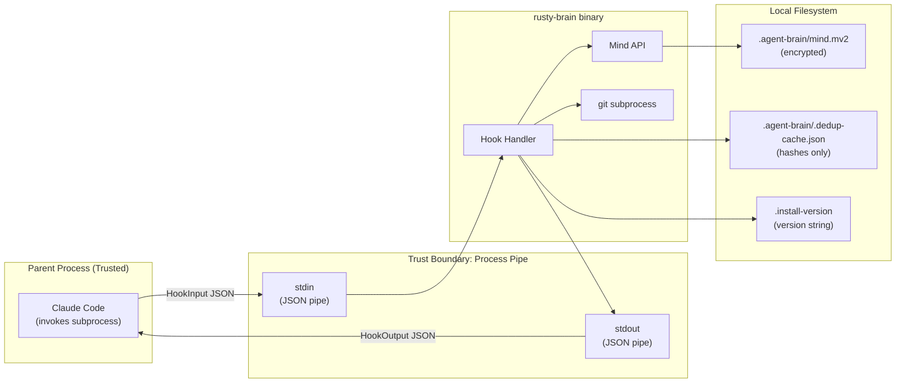
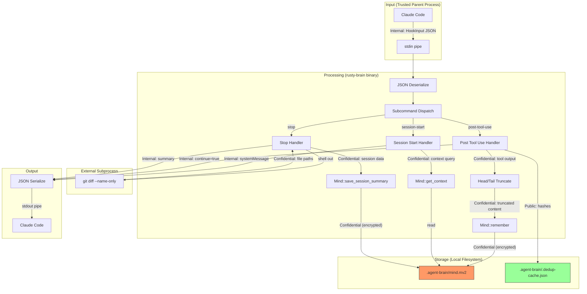
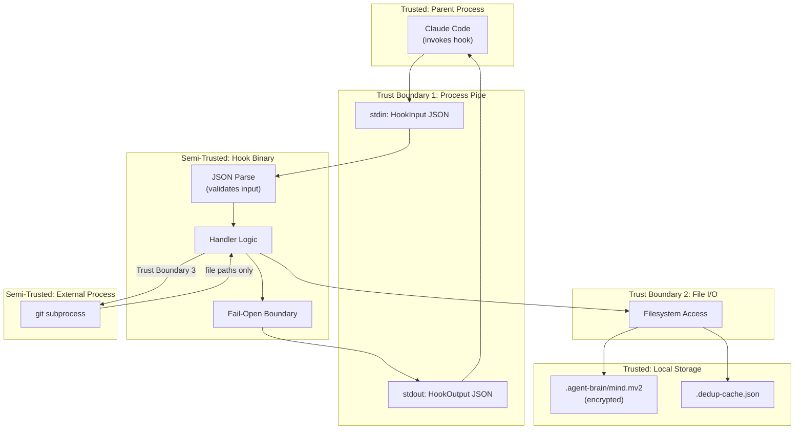

# 006-sec-claude-code-hooks

> **Document Type:** Security Review (Lightweight)
> **Audience:** LLM agents, human reviewers
> **Status:** Draft
> **Last Updated:** 2026-03-03 <!-- @auto -->
> **Reviewer:** Brian Luby <!-- @human-required -->
> **Risk Level:** Low <!-- @human-required -->

---

## Review Tier Legend

| Marker | Tier | Speckit Behavior |
|--------|------|------------------|
| 🔴 `@human-required` | Human Generated | Prompt human to author; blocks until complete |
| 🟡 `@human-review` | LLM + Human Review | LLM drafts → prompt human to confirm/edit; blocks until confirmed |
| 🟢 `@llm-autonomous` | LLM Autonomous | LLM completes; no prompt; logged for audit |
| ⚪ `@auto` | Auto-generated | System fills (timestamps, links); no prompt |

---

## Severity Definitions

| Level | Label | Definition |
|-------|-------|------------|
| 🔴 | **Critical** | Immediate exploitation risk; data breach or system compromise likely |
| 🟠 | **High** | Significant risk; exploitation possible with moderate effort |
| 🟡 | **Medium** | Notable risk; exploitation requires specific conditions |
| 🟢 | **Low** | Minor risk; limited impact or unlikely exploitation |

---

## Linkage ⚪ `@auto`

| Document | ID | Relationship |
|----------|-----|--------------|
| Parent PRD | 006-prd-claude-code-hooks.md | Feature being reviewed |
| Architecture Review | 006-ar-claude-code-hooks.md | Technical implementation |

---

## Purpose

This is a **lightweight security review** intended to catch obvious security concerns early in the product lifecycle. It is NOT a comprehensive threat model. Full threat modeling should occur during implementation when infrastructure-as-code and concrete implementations exist.

**This review answers three questions:**
1. What does this feature expose to attackers?
2. What data does it touch, and how sensitive is that data?
3. What's the impact if something goes wrong?

**Scope of this review:**
- ✅ Attack surface identification
- ✅ Data classification
- ✅ High-level CIA assessment
- ❌ Detailed threat enumeration (deferred to implementation)
- ❌ Penetration testing (deferred to implementation)
- ❌ Compliance audit (separate process)

---

## Feature Security Summary

### One-line Summary 🔴 `@human-required`
> A local subprocess binary that reads JSON from stdin, stores developer observations in encrypted local files, and writes JSON to stdout — no network, no authentication, no multi-user access.

### Risk Assessment 🔴 `@human-required`
> **Risk Level:** Low
> **Justification:** The feature operates entirely locally as a subprocess invoked by Claude Code with no network exposure, no authentication surface, and no multi-user scenarios. Data is protected by memvid encryption and OS file permissions.

---

## Attack Surface Analysis

### Exposure Points 🟡 `@human-review`

| Exposure Type | Details | Authentication | Authorization | Notes |
|---------------|---------|----------------|---------------|-------|
| **None** | **Feature has no external network exposure** | — | — | Local subprocess only; invoked by Claude Code via stdin/stdout pipe |

The binary is invoked as a subprocess by Claude Code. It has no listening sockets, no HTTP endpoints, no webhooks, and no message queue consumers. The only input channel is stdin (piped by the parent process) and the only output is stdout.

### Attack Surface Diagram 🟢 `@llm-autonomous`

### Exposure Checklist 🟢 `@llm-autonomous`

Quick validation of common exposure risks:

- [x] **Internet-facing endpoints require authentication** — N/A: no internet-facing endpoints
- [x] **No sensitive data in URL parameters** — N/A: no URLs, no HTTP
- [x] **File uploads validated** — N/A: no file uploads; stdin is a JSON pipe
- [x] **Rate limiting configured** — N/A: subprocess invocation rate is controlled by the parent process (Claude Code)
- [x] **CORS policy is restrictive** — N/A: no HTTP server
- [x] **No debug/admin endpoints exposed** — N/A: no endpoints; debug logging only via stderr when env var set
- [x] **Webhooks validate signatures** — N/A: no webhooks

---

## Data Flow Analysis

### Data Inventory 🟡 `@human-review`

| Data Element | PRD Entity | Classification | Source | Destination | Retention | Encrypted Rest | Encrypted Transit | Residency |
|--------------|------------|----------------|--------|-------------|-----------|----------------|-------------------|-----------|
| HookInput JSON | HOOK_INPUT | Internal | Claude Code (stdin pipe) | In-memory only | None (process lifetime) | N/A | N/A (local pipe) | Local |
| HookOutput JSON | HOOK_OUTPUT | Public | Generated by handler | Claude Code (stdout pipe) | None (process lifetime) | N/A | N/A (local pipe) | Local |
| Observation content | OBSERVATION | Confidential | Tool inputs/outputs from Claude Code | `.agent-brain/mind.mv2` | Indefinite | Yes (memvid encryption) | N/A (local file) | Local |
| Observation metadata | OBSERVATION | Internal | Derived from tool execution | `.agent-brain/mind.mv2` | Indefinite | Yes (memvid encryption) | N/A (local file) | Local |
| Session summary | SESSION_SUMMARY | Confidential | Aggregated from session | `.agent-brain/mind.mv2` | Indefinite | Yes (memvid encryption) | N/A (local file) | Local |
| Dedup cache entries | — | Public | Hash of tool+summary | `.agent-brain/.dedup-cache.json` | 60 seconds (auto-pruned) | No | N/A (local file) | Local |
| Version marker | — | Public | Binary version constant | `.install-version` | Indefinite | No | N/A (local file) | Local |
| Git diff output | — | Confidential | `git diff` subprocess | In-memory → `.agent-brain/mind.mv2` | Indefinite (as observation) | Yes (in .mv2) | N/A (local pipe) | Local |
| Mind instance state | MIND | Internal | In-memory | Process memory | None (process lifetime) | N/A | N/A | Local |
| Diagnostic logs | — | Internal | Handler execution | stderr (when RUSTY_BRAIN_LOG set) | None (terminal output) | No | N/A | Local |

### Data Classification Reference 🟢 `@llm-autonomous`

| Level | Label | Description | Examples | Handling Requirements |
|-------|-------|-------------|----------|----------------------|
| 1 | **Public** | No impact if disclosed | Marketing content, public docs | No special handling |
| 2 | **Internal** | Minor impact if disclosed | Internal configs, non-sensitive logs | Access controls, no public exposure |
| 3 | **Confidential** | Significant impact if disclosed | PII, user data, credentials | Encryption, audit logging, access controls |
| 4 | **Restricted** | Severe impact if disclosed | Payment data, health records, secrets | Encryption, strict access, compliance requirements |

### Data Flow Diagram 🟢 `@llm-autonomous`

### Data Handling Checklist 🟢 `@llm-autonomous`

- [x] **No Restricted data stored unless absolutely required** — No restricted data handled; observations are Confidential at most
- [x] **Confidential data encrypted at rest** — `.mv2` files use memvid built-in encryption (M-11)
- [x] **All data encrypted in transit (TLS 1.2+)** — N/A: no network transit; data flows via local pipes and filesystem
- [ ] **PII has defined retention policy** — Observations stored indefinitely; no automatic purge mechanism yet (flag for future consideration)
- [x] **Logs do not contain Confidential/Restricted data** — Diagnostic logs at `info` level and below do not include memory content (per constitution: no logging of memory contents at INFO or above without opt-in)
- [x] **Secrets are not hardcoded** — No secrets in the binary; memvid encryption keys managed by memvid-core
- [x] **Data minimization applied** — Tool outputs truncated to ~500 tokens (M-5); only summary and essential metadata stored
- [x] **Data residency requirements documented** — All data local to developer's machine

---

## Third-Party & Supply Chain 🟡 `@human-review`

### New External Services

| Service | Purpose | Data Shared | Communication | Approved? |
|---------|---------|-------------|---------------|-----------|
| git CLI | Detect modified files in stop hook | File paths only (via `git diff --name-only`) | Local subprocess pipe | ✅ Approved (standard dev tool) |

No new external network services are introduced. The git CLI is an existing local tool, not a service dependency.

### New Libraries/Dependencies

No new crate dependencies are introduced by the hooks crate beyond what is already in the workspace `Cargo.toml`. The hooks crate uses:

| Library | Version | License | Purpose | Security Check |
|---------|---------|---------|---------|----------------|
| clap | 4.x (workspace) | MIT/Apache-2.0 | Subcommand dispatch | ✅ Approved (already in workspace) |
| serde/serde_json | 1.x (workspace) | MIT/Apache-2.0 | JSON serialization | ✅ Approved (already in workspace) |
| tracing | 0.1 (workspace) | MIT | Diagnostic logging | ✅ Approved (already in workspace) |
| memvid-core | pinned rev (workspace) | — | Memory storage + encryption | ✅ Approved (already in workspace, pinned) |

### Supply Chain Checklist

- [x] **All new services use encrypted communication** — N/A: no new services
- [x] **Service agreements/ToS reviewed** — N/A: no new services
- [x] **Dependencies have acceptable licenses** — All MIT/Apache-2.0
- [x] **Dependencies are actively maintained** — All are well-maintained ecosystem crates
- [x] **No known critical vulnerabilities** — memvid-core is pinned to specific rev for stability

---

## CIA Impact Assessment

If this feature is compromised, what's the impact?

### Confidentiality 🟡 `@human-review`

> **What could be disclosed?**

| Asset at Risk | Classification | Exposure Scenario | Impact | Likelihood |
|---------------|----------------|-------------------|--------|------------|
| Observation content (code snippets, command outputs) | Confidential | Local attacker reads unencrypted dedup cache — only hashes, no content | Low | Low |
| Observation content | Confidential | Local attacker with file access reads .mv2 directly — encrypted by memvid | Low | Very Low |
| Diagnostic log output | Internal | Developer enables RUSTY_BRAIN_LOG=trace in shared terminal — logs may contain tool inputs | Low | Low |
| Git diff file paths | Confidential | File paths stored as observations — protected by .mv2 encryption | Low | Very Low |

**Confidentiality Risk Level:** Low

### Integrity 🟡 `@human-review`

> **What could be modified or corrupted?**

| Asset at Risk | Modification Scenario | Impact | Likelihood |
|---------------|----------------------|--------|------------|
| .mv2 memory file | Local attacker corrupts memory file — Mind::open handles recovery; hooks fail-open | Low | Very Low |
| .dedup-cache.json | Corrupt dedup cache — handler treats as "not duplicate", stores extra observation (harmless) | Low | Low |
| .install-version | Tamper with version marker — causes unnecessary version check, no security impact | Low | Very Low |
| stdin JSON (HookInput) | Malicious parent process sends crafted JSON — hooks only call Mind API, no command injection | Low | Very Low |

**Integrity Risk Level:** Low

### Availability 🟡 `@human-review`

> **What could be disrupted?**

| Service/Function | Disruption Scenario | Impact | Likelihood |
|------------------|---------------------|--------|------------|
| Hook execution | Mind::open hangs on large/corrupted .mv2 — fail-open returns valid output; Claude Code unaffected | Low | Low |
| Hook execution | Git subprocess hangs — 5-second timeout kills process; hook continues without file list | Low | Low |
| Hook execution | File lock contention — exponential backoff (5 retries); fail-open on timeout | Low | Medium |
| Claude Code session | Hook binary crashes/panics — catch_unwind prevents; worst case: Claude Code ignores missing output | Low | Very Low |

**Availability Risk Level:** Low

### CIA Summary 🟢 `@llm-autonomous`

| Dimension | Risk Level | Primary Concern | Mitigation Priority |
|-----------|------------|-----------------|---------------------|
| **Confidentiality** | Low | Memory content contains code/commands — protected by memvid encryption and OS file permissions | Low |
| **Integrity** | Low | Memory file corruption — handled by Mind::open recovery + fail-open pattern | Low |
| **Availability** | Low | Subprocess hangs — mitigated by timeouts, fail-open, catch_unwind | Low |

**Overall CIA Risk:** Low — *The feature is a local-only subprocess with no network exposure, encrypted storage, and comprehensive fail-open error handling. The attack surface is limited to local filesystem access by the same user.*

---

## Trust Boundaries 🟡 `@human-review`

Where does trust change in this feature?

**Trust Boundary Analysis:**

1. **TB-1: Process Pipe (stdin/stdout)** — Input comes from Claude Code, which is a trusted parent process. However, the hook must still validate JSON structure defensively because: (a) forward-compatibility with protocol changes, (b) defense-in-depth against malformed input. HookInput is `#[non_exhaustive]` and uses `serde(deny_unknown_fields = false)`.

2. **TB-2: Filesystem I/O** — The hook reads/writes to the local filesystem. The `.mv2` file is encrypted. The dedup cache contains only hashes. Path traversal prevention is handled by `crates/platforms` (validates resolved paths stay within project directory).

3. **TB-3: Git Subprocess** — The hook shells out to `git diff`. The output (file paths) is used only for observation storage, not for command construction. No command injection risk because arguments are hardcoded (`--name-only HEAD`), not derived from input.

### Trust Boundary Checklist 🟢 `@llm-autonomous`

- [x] **All input from untrusted sources is validated** — HookInput deserialized via serde with graceful error handling; malformed JSON → fail-open
- [x] **External API responses are validated** — Git subprocess output treated as a list of file paths; unexpected output → empty list
- [x] **Authorization checked at data access, not just entry point** — N/A: single-user local tool with no authorization model
- [x] **Service-to-service calls are authenticated** — N/A: no service-to-service calls; git is a local subprocess

---

## Known Risks & Mitigations 🟡 `@human-review`

| ID | Risk Description | Severity | Mitigation | Status | Owner |
|----|------------------|----------|------------|--------|-------|
| R1 | Diagnostic logs at `trace` level may include tool inputs containing secrets (API keys, tokens from .env files) | 🟡 Medium | RUSTY_BRAIN_LOG is opt-in; trace level requires explicit activation; constitution prohibits logging memory content at INFO or above without opt-in | Mitigated | Developer |
| R2 | Dedup cache stores hashes of tool+summary — hashes are not reversible but could confirm whether a specific tool action occurred | 🟢 Low | Hashes use non-cryptographic DefaultHasher; cache auto-prunes after 60 seconds; minimal information leakage | Accepted | — |
| R3 | Memory file grows indefinitely — no automatic purge mechanism for old observations | 🟢 Low | Out of scope for 006; future feature should add retention/purge policy; current risk is disk space, not security | Accepted | — |
| R4 | Git subprocess arguments are hardcoded but `cwd` comes from HookInput — a crafted cwd could cause git to operate on unexpected repository | 🟢 Low | `cwd` is provided by Claude Code (trusted parent process); platform path resolution validates paths stay within project directory | Mitigated | — |

### Risk Acceptance 🔴 `@human-required`

| Risk ID | Accepted By | Date | Justification | Review Date |
|---------|-------------|------|---------------|-------------|
| R2 | Brian Luby | YYYY-MM-DD | Non-reversible hashes with 60s TTL; minimal information value | YYYY-MM-DD |
| R3 | Brian Luby | YYYY-MM-DD | Disk space concern only; retention policy deferred to future phase | YYYY-MM-DD |

---

## Security Requirements 🟡 `@human-review`

Based on this review, the implementation MUST satisfy:

### Authentication & Authorization

| Req ID | Requirement | PRD AC | Verification Method |
|--------|-------------|--------|---------------------|
| — | N/A — local subprocess with no authentication surface | — | — |

### Data Protection

| Req ID | Requirement | PRD AC | Verification Method |
|--------|-------------|--------|---------------------|
| SEC-1 | All observation content MUST be stored in memvid-encrypted `.mv2` files | AC-11 | Integration test: verify Mind::open with encryption flag; round-trip read/write |
| SEC-2 | Dedup cache MUST NOT store observation content — only non-reversible hashes and timestamps | AC-7 | Unit test: verify cache file contains only hash strings and numeric timestamps |
| SEC-3 | Diagnostic logging at `info` level and below MUST NOT include memory content or tool outputs | — | Code review + unit test: verify log output at info/warn/error levels |
| SEC-4 | HookOutput `systemMessage` MUST NOT echo raw tool inputs/outputs back to Claude Code unfiltered | AC-4 | Integration test: verify systemMessage contains formatted summaries, not raw content |

### Input Validation

| Req ID | Requirement | PRD AC | Verification Method |
|--------|-------------|--------|---------------------|
| SEC-5 | Empty or malformed stdin MUST produce valid HookOutput JSON with `continue: true` | AC-3, EC-1, EC-2 | Unit test: empty stdin, invalid JSON, truncated JSON |
| SEC-6 | Unknown fields in HookInput JSON MUST be silently ignored (forward-compatible deserialization) | EC-6 | Unit test: HookInput with extra fields deserializes without error |
| SEC-7 | Memory path resolution MUST reject paths containing `..` traversal components | — | Unit test: verify path traversal is blocked (already tested in crates/platforms) |

### Operational Security

| Req ID | Requirement | PRD AC | Verification Method |
|--------|-------------|--------|---------------------|
| SEC-8 | All hooks MUST exit with code 0 regardless of internal state — never expose error details via exit code | AC-3 | Integration test: verify exit code 0 for all error scenarios |
| SEC-9 | Git subprocess MUST use hardcoded arguments only — no user-derived input in command construction | AC-8 | Code review: verify Command::new("git") args are string literals |
| SEC-10 | File writes (dedup cache, version marker) MUST use atomic write pattern (temp file + rename) to prevent corruption from concurrent access | — | Unit test: verify atomic write behavior |

---

## Compliance Considerations 🟡 `@human-review`

| Regulation | Applicable? | Relevant Requirements | N/A Justification |
|------------|-------------|----------------------|-------------------|
| GDPR | N/A | — | No personal data collected; tool observations are developer-generated code artifacts, not PII. No data transmitted externally. |
| CCPA | N/A | — | Same as GDPR — no consumer personal information handled |
| SOC 2 | N/A | — | Local developer tool; not a service or SaaS product; no customer data |
| HIPAA | N/A | — | No protected health information handled |
| PCI-DSS | N/A | — | No payment card data handled |
| Other | N/A | — | No regulatory frameworks apply to a local developer productivity tool |

---

## Review Findings

### Issues Identified 🟡 `@human-review`

| ID | Finding | Severity | Category | Recommendation | Status |
|----|---------|----------|----------|----------------|--------|
| F1 | No retention/purge policy for observations — memory file grows indefinitely | 🟢 Low | Data | Add retention policy in future phase; document current behavior | Open (deferred) |
| F2 | Trace-level logging may capture sensitive tool outputs if developer enables RUSTY_BRAIN_LOG=trace | 🟢 Low | Data | Document in user-facing docs that trace level may log sensitive content; consider redacting secrets at trace level in future | Open (informational) |

### Positive Observations 🟢 `@llm-autonomous`

- **Fail-open pattern** prevents hooks from ever blocking the developer's workflow, eliminating availability concerns
- **No network exposure** eliminates entire classes of attacks (MITM, injection, DoS, credential theft)
- **Memvid encryption** for `.mv2` files protects observation content at rest without requiring additional key management
- **`#[non_exhaustive]` on HookInput** ensures forward-compatible deserialization — protocol evolution doesn't break the binary
- **Path traversal prevention** in `crates/platforms` prevents memory file writes outside the project directory
- **Dedup cache stores only hashes** — no content leakage even if cache file is inspected
- **Constitution principle** (no logging of memory contents at INFO+) provides a design-level guarantee against accidental content exposure
- **Pinned memvid-core dependency** (git rev `fbddef4`) prevents supply chain attacks via dependency updates

---

## Open Questions 🟡 `@human-review`

- [x] ~~Q1: Data-at-rest protection~~ → Resolved: memvid built-in encryption (spec clarification session)
- [ ] **Q2:** Should trace-level logging explicitly redact patterns matching common secret formats (API keys, tokens)? Low priority but defense-in-depth.

---

## Changelog ⚪ `@auto`

| Version | Date | Author | Changes |
|---------|------|--------|---------|
| 0.1 | 2026-03-03 | Claude (speckit) | Initial review |

---

## Review Sign-off 🔴 `@human-required`

| Role | Name | Date | Decision |
|------|------|------|----------|
| Security Reviewer | Brian Luby | YYYY-MM-DD | [Approved / Approved with conditions / Rejected] |
| Feature Owner | Brian Luby | YYYY-MM-DD | [Acknowledged] |

### Conditions for Approval (if applicable) 🔴 `@human-required`

- [ ] Confirm memvid encryption integration works correctly (Spike-2 from PRD)
- [ ] Verify trace-level logging behavior is acceptable

---

## Security Requirements Traceability 🟢 `@llm-autonomous`

| SEC Req ID | PRD Req ID | PRD AC ID | Test Type | Test Location |
|------------|------------|-----------|-----------|---------------|
| SEC-1 | M-11 | AC-11 | Integration | tests/session_start_test.rs |
| SEC-2 | M-6 | AC-7 | Unit | tests/dedup_test.rs |
| SEC-3 | M-10, S-3 | — | Code Review + E2E | tests/e2e_test.rs |
| SEC-4 | M-4 | AC-4 | Integration | tests/session_start_test.rs |
| SEC-5 | M-3 | AC-3 | Unit | tests/io_test.rs |
| SEC-6 | M-2 | — | Unit | tests/io_test.rs |
| SEC-7 | — | — | Unit | crates/platforms/tests/ (existing) |
| SEC-8 | M-3 | AC-3 | Integration | tests/io_test.rs + tests/e2e_test.rs |
| SEC-9 | M-7 | AC-8 | Code Review | crates/hooks/src/git.rs |
| SEC-10 | — | — | Unit | tests/dedup_test.rs |

---

## Review Checklist 🟢 `@llm-autonomous`

Before marking as Approved:
- [x] Attack surface documented with auth/authz status for each exposure
- [x] Exposure Points table has no contradictory rows (single "None" row — no endpoints)
- [x] All PRD Data Model entities appear in Data Inventory (HOOK_INPUT, HOOK_OUTPUT, OBSERVATION, SESSION_SUMMARY, MIND)
- [x] All data elements are classified using the 4-tier model
- [x] Third-party dependencies and services are listed
- [x] CIA impact is assessed with Low/Medium/High ratings
- [x] Trust boundaries are identified (3 boundaries documented)
- [x] Security requirements have verification methods specified
- [x] Security requirements trace to PRD ACs where applicable
- [x] No Critical/High findings remain Open
- [x] Compliance N/A items have justification
- [ ] Risk acceptance has named approver and review date (pending human sign-off)
