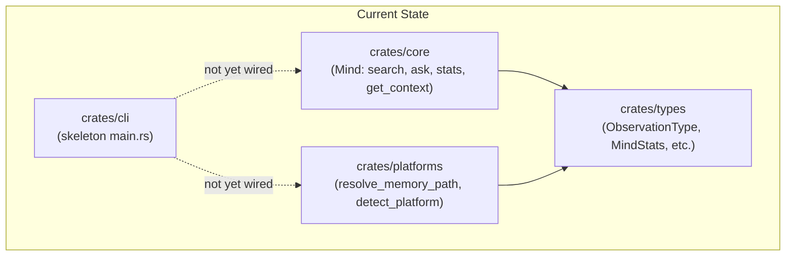
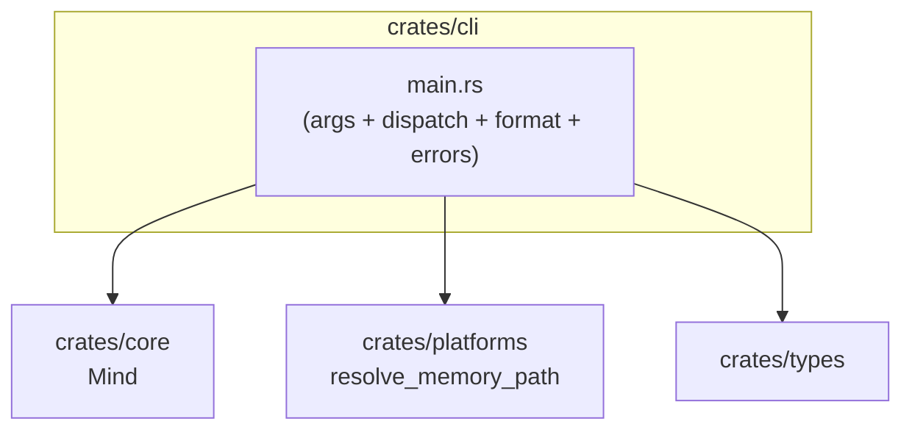
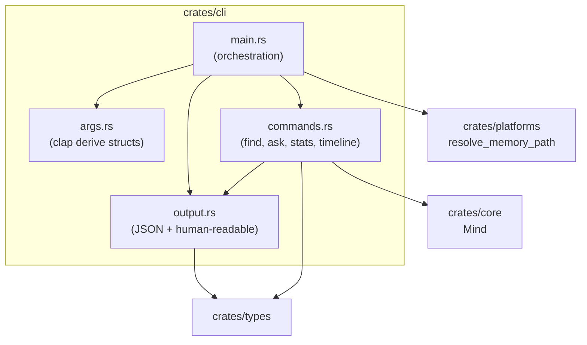
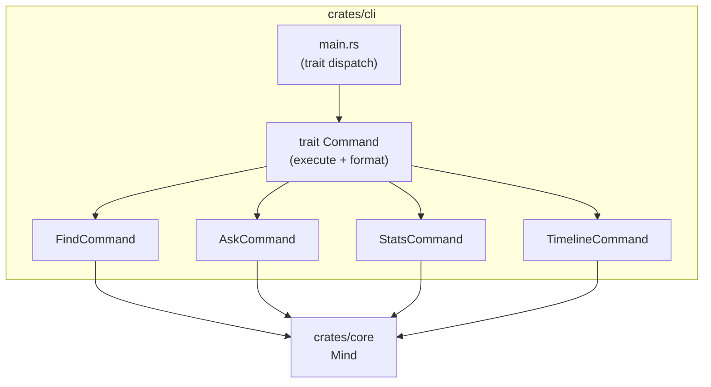
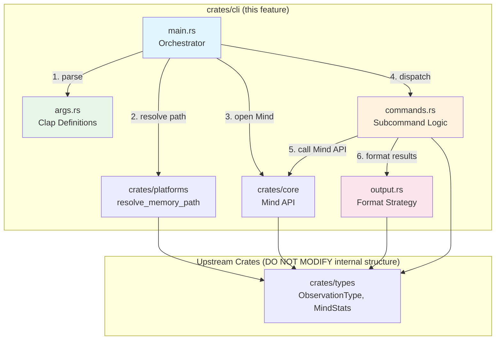
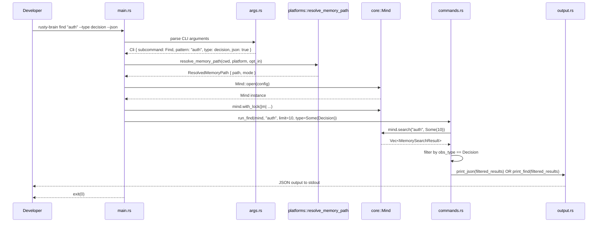
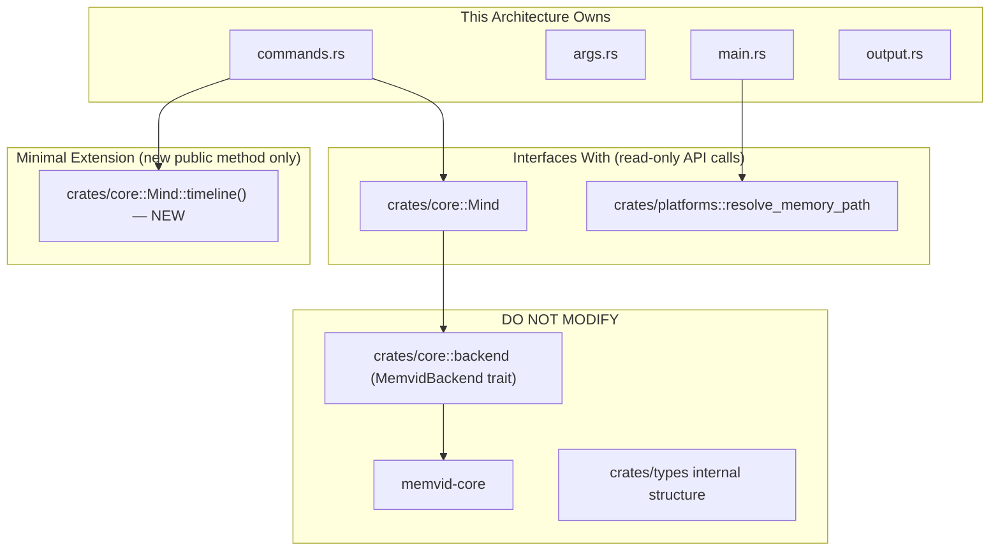

# 007-ar-cli-scripts

> **Document Type:** Architecture Review
> **Audience:** LLM agents, human reviewers
> **Status:** Proposed
> **Last Updated:** 2026-03-02 <!-- @auto -->
> **Owner:** <!-- @human-required -->
> **Deciders:** <!-- @human-required -->

---

## Review Tier Legend

| Marker | Tier | Speckit Behavior |
|--------|------|------------------|
| 🔴 `@human-required` | Human Generated | Prompt human to author; blocks until complete |
| 🟡 `@human-review` | LLM + Human Review | LLM drafts → prompt human to confirm/edit; blocks until confirmed |
| 🟢 `@llm-autonomous` | LLM Autonomous | LLM completes; no prompt; logged for audit |
| ⚪ `@auto` | Auto-generated | System fills (timestamps, links); no prompt |

---

## Document Completion Order

> ⚠️ **For LLM Agents:** Complete sections in this order. Do not fill downstream sections until upstream human-required inputs exist.

1. **Summary (Decision)** → requires human input first
2. **Context (Problem Space)** → requires human input
3. **Decision Drivers** → requires human input (prioritized)
4. **Driving Requirements** → extract from PRD, human confirms
5. **Options Considered** → LLM drafts after drivers exist, human reviews
6. **Decision (Selected + Rationale)** → requires human decision
7. **Implementation Guardrails** → LLM drafts, human reviews
8. **Everything else** → can proceed after decision is made

---

## Linkage ⚪ `@auto`

| Document | ID | Relationship |
|----------|-----|--------------|
| Parent PRD | 007-prd-cli-scripts.md | Requirements this architecture satisfies |
| Feature Spec | spec.md | User scenarios, clarifications |
| Security Review | 007-sec-cli-scripts.md | Security implications (pending) |
| Core Engine AR | specs/003-core-memory-engine/ar.md | Upstream architecture — Mind API design |
| Constitution | .specify/memory/constitution.md | Governing principles |
| Supersedes | — | N/A (greenfield CLI crate) |
| Superseded By | — | — |

---

## Summary

### Decision 🔴 `@human-required`
> Build the CLI as a thin orchestration layer in the existing `crates/cli` crate, using `clap` derive macros for argument parsing, delegating all data operations to the `Mind` public API (with a small API extension for timeline queries), and formatting output through function-based dispatch that switches between human-readable table output and JSON serialization.

### TL;DR for Agents 🟡 `@human-review`
> The CLI crate (`crates/cli`) is a binary with a `main.rs` entry point and three internal modules: `args` (clap definitions), `commands` (one function per subcommand), and `output` (formatting strategy). All memory operations delegate to `Mind` from `crates/core` — no direct backend access. A public `Mind::timeline()` method must be added to `crates/core` (currently `pub(crate)` only). Path resolution uses `platforms::resolve_memory_path`. The `--type` filter is applied as a post-query filter in the CLI layer. Do NOT duplicate any core engine logic.

---

## Context

### Problem Space 🔴 `@human-required`

The PRD requires a `rusty-brain` CLI binary with four subcommands (`find`, `ask`, `stats`, `timeline`) that read from `.mv2` memory files. The architectural challenge is threefold:

1. **API gap**: The core `Mind` struct exposes `search()`, `ask()`, `stats()`, and `get_context()` publicly, but has no public `timeline()` method. The backend `timeline()` + `frame_by_id()` are `pub(crate)`. The CLI needs structured timeline entries but cannot access the backend directly.

2. **Output duality**: Every subcommand must produce both human-readable formatted output (color, tables, pipe detection) and machine-readable JSON from the same data. This requires a clean separation between data retrieval and output formatting.

3. **Integration surface**: The CLI must compose path resolution (`crates/platforms`), memory operations (`crates/core`), and new argument parsing + formatting concerns without introducing tight coupling or duplicating logic from upstream crates.

### Decision Scope 🟡 `@human-review`

**This AR decides:**
- Internal module structure of `crates/cli`
- How the CLI composes `crates/core` and `crates/platforms` APIs
- What minimal API extension is needed on `Mind` for timeline support
- Argument parsing crate and output formatting approach
- How `--type` filtering is implemented (CLI-side vs. core-side)

**This AR does NOT decide:**
- Changes to the `MemvidBackend` trait or memvid-core integration (owned by 003 AR)
- Platform detection logic (owned by 005 AR)
- Future shell completions, write commands, or TUI (explicitly deferred per PRD W-1, W-2, W-3)

### Current State 🟢 `@llm-autonomous`

The `crates/cli` crate exists as a skeleton with a placeholder `main.rs` and a `clap` dependency already declared in the workspace `Cargo.toml`. No production code has been written.



Key observations:
- `Mind::search()` returns `Vec<MemorySearchResult>` (public struct in `crates/core::mind`)
- `Mind::ask()` returns `String`
- `Mind::stats()` returns `MindStats` (public struct in `crates/types`)
- `Mind` has no public `timeline()` method; the backend's `timeline()` + `frame_by_id()` are `pub(crate)` only
- `clap = { version = "4", features = ["derive"] }` is already in workspace dependencies
- `MemorySearchResult` is defined in `crates/core::mind` (not in `crates/types`)

### Driving Requirements 🟡 `@human-review`

| PRD Req ID | Requirement Summary | Architectural Implication |
|------------|---------------------|---------------------------|
| M-1 | `find` subcommand with text search | Needs `Mind::search()` — already public |
| M-2 | `ask` subcommand with synthesized answer | Needs `Mind::ask()` — already public |
| M-3 | `stats` subcommand with memory statistics | Needs `Mind::stats()` — already public |
| M-4 | `timeline` subcommand with chronological order | Needs public `Mind::timeline()` — **currently missing** |
| M-5 | `--json` flag on all subcommands | Requires output formatting strategy (JSON vs. human-readable) |
| M-6 | `--limit` with default of 10 | Argument parsing with defaults; plumb to Mind API |
| M-7 | Auto-detect memory file path | Needs `platforms::resolve_memory_path()` — already public |
| M-8 | `--memory-path` override | Argument parsing; bypasses platform resolution |
| M-9 | Help text with usage examples | `clap` derive macros provide this automatically |
| M-10 | User-friendly error messages | Error mapping layer: `RustyBrainError` → user-facing strings |
| M-11 | Exit code 0/non-zero | Process exit code management in `main()` |
| M-12 | File lock with exponential backoff | Reuse `Mind::with_lock()` — already public |
| S-1 | `--type` filter on find/timeline | Post-query filter in CLI layer (no core API change) |
| S-2 | Pipe detection for color disable | Terminal detection at output layer |
| S-3 | `--verbose` flag for tracing | `tracing-subscriber` initialization in `main()` |
| S-4 | <500ms startup + operation | Lightweight architecture; no unnecessary initialization |

**PRD Constraints inherited:**
- Rust stable, edition 2024, MSRV 1.85.0
- `unsafe` forbidden (workspace lint)
- No interactive prompts (constitution)
- No logging of memory contents at INFO or above (constitution IX)
- Local filesystem only (constitution)

---

## Decision Drivers 🔴 `@human-required`

1. **Simplicity**: Minimize new code and concepts; the CLI is a thin wrapper, not a framework *(traces to M-1 through M-4)*
2. **Performance**: CLI startup + operation under 500ms; no unnecessary initialization *(traces to S-4)*
3. **Consistency**: Reuse existing workspace patterns (clap, tracing, serde) and Mind API conventions *(traces to M-7, M-12)*
4. **Testability**: Each subcommand independently testable with known inputs/outputs *(traces to M-5, M-10, M-11)*
5. **Minimal core API changes**: Avoid modifying `MemvidBackend` trait; expose only what's needed *(traces to M-4)*

---

## Options Considered 🟡 `@human-review`

### Option 0: Status Quo / Do Nothing

**Description:** Keep the CLI crate as a skeleton. Developers have no standalone tool to query memory files.

| Driver | Rating | Notes |
|--------|--------|-------|
| Simplicity | ✅ Good | No new code to maintain |
| Performance | ✅ Good | Nothing to slow down |
| Consistency | N/A | No code to be consistent with |
| Testability | N/A | Nothing to test |
| Minimal core changes | ✅ Good | No changes needed |

**Why not viable:** Directly contradicts PRD M-1 through M-4, M-9, M-10. Developers have no way to inspect memory outside agent sessions. The feature is Phase 6 of the roadmap and a prerequisite for developer adoption.

---

### Option 1: Flat Module Architecture

**Description:** All CLI logic lives in `main.rs` with inline argument parsing, command dispatch, and output formatting. No internal modules.



| Driver | Rating | Notes |
|--------|--------|-------|
| Simplicity | ⚠️ Medium | Simple at first but `main.rs` grows unwieldy (500+ lines for 4 subcommands × 2 output modes) |
| Performance | ✅ Good | Identical runtime characteristics |
| Consistency | ❌ Poor | Other crates use module structure; single-file approach is an outlier |
| Testability | ❌ Poor | Hard to unit test output formatting or error mapping when everything is in `main()` |
| Minimal core changes | ✅ Good | Same core change needed (public timeline) |

**Pros:**
- Zero upfront module planning
- Single file to read

**Cons:**
- `main.rs` exceeds 800-line limit as subcommands and formatting grow
- Cannot test output formatting independently
- Cannot test error mapping without running full CLI
- Mixing concerns: arg parsing, path resolution, Mind operations, formatting all entangled

---

### Option 2: Layered Module Architecture (Recommended)

**Description:** Split the CLI into three focused modules — `args` (clap definitions), `commands` (subcommand logic), `output` (formatting strategy) — with `main.rs` as a thin orchestrator. Add a public `Mind::timeline()` method to `crates/core` that returns `Vec<TimelineEntry>` (a new public type).



| Driver | Rating | Notes |
|--------|--------|-------|
| Simplicity | ✅ Good | Each module <200 lines; clear single responsibility |
| Performance | ✅ Good | Identical runtime; module boundaries are compile-time only |
| Consistency | ✅ Good | Mirrors other crates' module structure (e.g., core has mind, backend, context_builder) |
| Testability | ✅ Good | Each module testable independently: args parse correctly, commands return correct data, output formats correctly |
| Minimal core changes | ⚠️ Medium | Requires adding `Mind::timeline()` public method + public `TimelineEntry` type |

**Pros:**
- Each file stays under 200 lines with a single responsibility
- Output formatting testable without running subcommands
- Error mapping testable without CLI invocation
- `--type` filtering cleanly lives in `commands.rs` as a post-query filter
- Consistent with workspace patterns

**Cons:**
- Slightly more files than Option 1 (4 files vs. 1)
- Requires a small addition to `crates/core` public API (timeline method)

---

### Option 3: Trait-Based Command Pattern

**Description:** Each subcommand implemented as a struct implementing a `Command` trait with `execute()` and `format()` methods. Dispatched via dynamic dispatch.



| Driver | Rating | Notes |
|--------|--------|-------|
| Simplicity | ❌ Poor | Over-engineered for 4 fixed subcommands; trait + dynamic dispatch adds indirection |
| Performance | ✅ Good | Negligible runtime difference |
| Consistency | ⚠️ Medium | The core crate uses traits for extensibility (MemvidBackend), but CLI has no extensibility need |
| Testability | ✅ Good | Each command struct independently testable |
| Minimal core changes | ⚠️ Medium | Same core change needed |

**Pros:**
- Maximally extensible if many subcommands were expected
- Each command is a standalone unit

**Cons:**
- Over-engineering for exactly 4 fixed commands (PRD W-2/W-3 explicitly defer expansion)
- Trait + Box<dyn> dispatch adds conceptual overhead with no benefit
- More boilerplate (trait definition, struct definitions, impl blocks) than direct functions
- Premature abstraction — violates project coding style guidance

---

## Decision

### Selected Option 🔴 `@human-required`
> **Option 2: Layered Module Architecture**

### Rationale 🔴 `@human-required`

Option 2 provides the right balance of structure and simplicity for a CLI with exactly 4 subcommands. Each module stays well under the 200-line threshold, testing is straightforward, and the pattern matches the existing workspace conventions. The only cost is adding a public `Mind::timeline()` method to `crates/core`, which is a natural API extension that the core should have exposed regardless (timeline data was always intended for external consumers — it was marked `#[allow(dead_code)]` with a "reserved for future timeline display" comment).

Option 1 is rejected because it would produce a monolithic `main.rs` that violates the 800-line file limit and makes testing difficult. Option 3 is rejected because it introduces a trait abstraction for 4 fixed commands with no extensibility need — a textbook premature abstraction.

#### Simplest Implementation Comparison 🟡 `@human-review`

| Aspect | Simplest Possible | Selected Option | Justification for Complexity |
|--------|-------------------|-----------------|------------------------------|
| File count | 1 file (`main.rs`) | 4 files (`main.rs`, `args.rs`, `commands.rs`, `output.rs`) | Keeps each file <200 lines; enables independent testing *(M-10, M-11, S-2)* |
| Dependencies | `clap` only | `clap` + `serde_json` + output formatting crate | JSON output required by M-5; human formatting required by PRD scope |
| Core API change | None (copy-paste timeline logic) | Add `Mind::timeline()` public method | Avoids duplicating core logic in CLI *(constitution II: clean abstractions)* |
| Output strategy | Inline if/else for JSON vs text | Dedicated `output.rs` module | Pipe detection (S-2) and `--verbose` (S-3) require centralized output control |
| Type filtering | None | Post-query filter in `commands.rs` | Required by S-1; simple `filter()` on result vec |

**Complexity justified by:** The selected option adds 3 extra files (all small) and 1 core API method to satisfy testability requirements (M-10, M-11), output duality (M-5, S-2), and avoid code duplication (constitution II). No unnecessary abstractions are introduced — functions, not traits.

### Architecture Diagram 🟡 `@human-review`



---

## Technical Specification

### Component Overview 🟡 `@human-review`

| Component | Responsibility | Interface | Dependencies |
|-----------|---------------|-----------|--------------|
| main.rs (Orchestrator) | Parse args, resolve path, open Mind, dispatch subcommand, handle exit codes | Binary entry point | Args, Commands, Output, `crates/core`, `crates/platforms` |
| Args (args.rs) | Define CLI argument structure via clap derive macros | `Cli` struct with `Subcommand` enum | `clap` |
| Commands (commands.rs) | Execute subcommand logic: call Mind API, apply `--type` filter | `run_find()`, `run_ask()`, `run_stats()`, `run_timeline()` functions | `crates/core` (Mind), `crates/types` |
| Output (output.rs) | Format results for stdout (JSON or human-readable), stderr (tracing) | `print_json()`, `print_find()`, `print_ask()`, `print_stats()`, `print_timeline()` functions | `serde_json`, formatting crate, `crates/types` |

### Core API Extension 🟡 `@human-review`

A public `Mind::timeline()` method and a public `TimelineEntry` struct must be added to `crates/core`:

```rust
/// Public timeline entry for CLI consumption.
/// Mirrors the internal backend::TimelineEntry with parsed metadata.
#[derive(Debug, Clone, Serialize)]
pub struct TimelineEntry {
    pub obs_type: ObservationType,
    pub summary: String,
    pub timestamp: DateTime<Utc>,
    pub tool_name: String,
}

impl Mind {
    /// Query timeline entries in chronological order.
    ///
    /// When `reverse` is true, entries are returned most-recent-first
    /// (default CLI behavior). Limit defaults to 10.
    pub fn timeline(
        &self,
        limit: usize,
        reverse: bool,
    ) -> Result<Vec<TimelineEntry>, RustyBrainError> {
        // Delegates to self.backend.timeline() + frame_by_id()
        // Same pattern as stats() but returns entries instead of aggregates
    }
}
```

This follows the existing pattern where `Mind::stats()` iterates `self.backend.timeline()` + `self.backend.frame_by_id()` internally. The new method returns individual entries instead of aggregating them.

### Data Flow 🟢 `@llm-autonomous`



### Interface Definitions 🟡 `@human-review`

```rust
// args.rs — Clap definitions
#[derive(Parser)]
#[command(name = "rusty-brain", about = "Query your AI agent's memory")]
pub struct Cli {
    /// Path to memory file (overrides auto-detection)
    #[arg(long)]
    pub memory_path: Option<PathBuf>,

    /// Enable verbose debug output
    #[arg(short, long)]
    pub verbose: bool,

    #[command(subcommand)]
    pub command: Command,
}

#[derive(Subcommand)]
pub enum Command {
    /// Search memories by text pattern
    Find {
        /// Search pattern
        pattern: String,
        /// Maximum results (default: 10)
        #[arg(long, default_value_t = 10)]
        limit: usize,
        /// Filter by observation type
        #[arg(long, value_parser = parse_obs_type)]
        r#type: Option<ObservationType>,
        /// Output as JSON
        #[arg(long)]
        json: bool,
    },
    /// Ask a question about your memory
    Ask {
        /// Natural language question
        question: String,
        /// Output as JSON
        #[arg(long)]
        json: bool,
    },
    /// View memory statistics
    Stats {
        /// Output as JSON
        #[arg(long)]
        json: bool,
    },
    /// View chronological timeline
    Timeline {
        /// Maximum entries (default: 10)
        #[arg(long, default_value_t = 10)]
        limit: usize,
        /// Filter by observation type
        #[arg(long, value_parser = parse_obs_type)]
        r#type: Option<ObservationType>,
        /// Show oldest entries first
        #[arg(long)]
        oldest_first: bool,
        /// Output as JSON
        #[arg(long)]
        json: bool,
    },
}

// output.rs — CLI output types (for JSON serialization)
#[derive(Serialize)]
pub struct FindOutput {
    pub results: Vec<SearchResultJson>,
    pub count: usize,
}

#[derive(Serialize)]
pub struct SearchResultJson {
    pub obs_type: String,
    pub summary: String,
    pub content_excerpt: Option<String>,
    pub timestamp: String, // RFC 3339
    pub score: f64,
    pub tool_name: String,
}

#[derive(Serialize)]
pub struct AskOutput {
    pub answer: String,
    pub has_results: bool,
}

#[derive(Serialize)]
pub struct TimelineOutput {
    pub entries: Vec<TimelineEntryJson>,
    pub count: usize,
}

#[derive(Serialize)]
pub struct TimelineEntryJson {
    pub obs_type: String,
    pub summary: String,
    pub timestamp: String, // RFC 3339
}
```

### Key Algorithms/Patterns 🟡 `@human-review`

**Pattern: Post-Query Type Filter**

The `--type` filter is applied after querying the Mind API rather than modifying the core search/timeline APIs. This keeps the core API simple and the filtering logic in the CLI where it belongs.

```
1. Query Mind API (search or timeline) with user's limit
2. If --type is specified:
   a. Filter results where obs_type matches
   b. Note: may return fewer than --limit results
3. Format and output filtered results
```

This means `--limit 10 --type decision` fetches 10 results from the core then filters, potentially returning fewer than 10. This is acceptable because:
- The alternative (fetching more to compensate) requires knowing the type distribution upfront
- Users can increase `--limit` if they need more filtered results
- The behavior is predictable and easy to reason about

**Pattern: Output Strategy (Functions, Not Traits)**

Rather than a trait with `format()` methods, output uses simple functions dispatched by an if/else on the `--json` flag. This is the simplest correct approach for a fixed set of 4 output formats.

```
if json_flag {
    print_json(&data)  // serde_json::to_string_pretty → stdout
} else {
    print_human(&data)  // table formatting → stdout
}
```

---

## Constraints & Boundaries

### Technical Constraints 🟡 `@human-review`

**Inherited from PRD:**
- Rust stable, edition 2024, MSRV 1.85.0
- CLI startup + operation <500ms for typical files (S-4)
- `find` <1s at 10,000 observations
- No interactive prompts (constitution)
- No memory content logging at INFO+ (constitution IX)
- `unsafe` forbidden (workspace lint)

**Added by this Architecture:**
- `crates/cli` depends on `crates/core` and `crates/platforms` — never the reverse
- CLI-local output types (`FindOutput`, `AskOutput`, etc.) are defined in `crates/cli` only — not added to `crates/types`
- `Mind::timeline()` (new public method) follows the same pattern as `Mind::stats()` — internal backend delegation, no trait change
- `MemorySearchResult` must gain `#[derive(Serialize)]` (or a CLI-local serializable mirror)
- New workspace dependencies: a table formatting crate (e.g., `comfy-table`) and `tracing-subscriber` for CLI log initialization

### Architectural Boundaries 🟡 `@human-review`



- **Owns:** `crates/cli` — all 4 source files
- **Extends (minimally):** `crates/core::Mind` — add `timeline()` public method + `TimelineEntry` public struct
- **Interfaces With:** `crates/core::Mind` (search, ask, stats, with_lock), `crates/platforms::resolve_memory_path`
- **Must Not Touch:** `MemvidBackend` trait, memvid-core, `crates/types` internal structure, `crates/platforms` internal structure

### Implementation Guardrails 🟡 `@human-review`

> ⚠️ **Critical for LLM Agents:**

- [ ] **DO NOT** access `crates/core::backend` types directly — they are `pub(crate)` *(constitution II: memvid isolation)*
- [ ] **DO NOT** duplicate search, stats, or timeline logic from `Mind` — always delegate *(PRD anti-pattern)*
- [ ] **DO NOT** add interactive prompts, confirmation dialogs, or stdin reads *(constitution: agent-friendly)*
- [ ] **DO NOT** log memory content (summaries, excerpts) at INFO level or above *(constitution IX)*
- [ ] **DO NOT** modify the `MemvidBackend` trait *(003 AR boundary)*
- [ ] **DO NOT** add CLI-specific types to `crates/types` — keep them in `crates/cli` *(minimize cross-crate coupling)*
- [ ] **MUST** use `Mind::with_lock()` for all operations that open the memory file *(M-12)*
- [ ] **MUST** exit with code 0 on success, 1 on general error, 2 on lock timeout *(M-11, PRD exit codes)*
- [ ] **MUST** use `platforms::resolve_memory_path()` for auto-detection — never hardcode paths *(M-7)*
- [ ] **MUST** validate `--limit` is a positive integer before passing to Mind API *(EC-4)*
- [ ] **MUST** validate `--type` against known `ObservationType` variants before filtering *(EC-5)*
- [ ] **MUST** output tracing/debug messages to stderr only, never stdout *(S-3, standard CLI convention)*

---

## Consequences 🟡 `@human-review`

### Positive
- Thin CLI layer with <600 total lines of production code
- Full test coverage possible via unit tests on each module
- Zero impact on existing crate internals (except 1 new public method on Mind)
- Consistent with workspace conventions (clap, serde, tracing)
- `--json` output provides stable contract for scripting and automation

### Negative
- Requires a small change to `crates/core` (adding `Mind::timeline()`) — this crosses the 007 feature boundary into 003's domain
- `--type` post-query filtering may return fewer than `--limit` results, which could surprise users
- Adding a table formatting crate increases binary size slightly

### Risks & Mitigations

| Risk | Likelihood | Impact | Mitigation |
|------|------------|--------|------------|
| `Mind::timeline()` addition introduces regression in core crate | Low | High | Add comprehensive tests for the new method; run full `cargo test` across workspace |
| `MemorySearchResult` lacks `Serialize` derive, requiring a mirror type | Med | Low | Check if adding `Serialize` to the existing type is acceptable; if not, map to CLI-local struct |
| Binary size exceeds expectations due to formatting crate | Low | Low | Benchmark release binary size; strip debug symbols; choose lightweight crate |
| `ask()` latency exceeds 500ms for large files | Med | Med | Document that `ask` may be slower for large memory files; benchmark during implementation |

---

## Implementation Guidance

### Suggested Implementation Order 🟢 `@llm-autonomous`

1. **Core API extension**: Add `Mind::timeline()` public method and `TimelineEntry` public struct to `crates/core`. Write tests.
2. **args.rs**: Define clap `Cli` and `Command` enum with all flags. Write parse tests.
3. **output.rs**: Implement JSON serialization types and human-readable formatting functions. Write output tests.
4. **commands.rs**: Implement `run_find()`, `run_ask()`, `run_stats()`, `run_timeline()` with type filtering. Write command tests.
5. **main.rs**: Wire orchestration: parse → resolve path → open Mind → dispatch → exit code. Write integration tests.
6. **Error handling**: Map `RustyBrainError` variants to user-friendly messages and exit codes.
7. **Polish**: Pipe detection (S-2), verbose mode (S-3), edge case messages.

### Testing Strategy 🟢 `@llm-autonomous`

| Layer | Test Type | Coverage Target | Notes |
|-------|-----------|-----------------|-------|
| Unit | args.rs parse tests | 100% of flag combinations | Clap provides parse testing utilities |
| Unit | output.rs formatting | Each output type × JSON + human | Verify JSON is valid via `serde_json::from_str` |
| Unit | commands.rs logic | Each subcommand + type filter | Use `Mind::open_with_backend(MockBackend)` for test data |
| Integration | Full CLI invocation | Happy path + all error cases | Use `assert_cmd` or `std::process::Command` |
| Integration | Core timeline method | Round-trip: remember → timeline → verify | Same test pattern as existing `mind_tests.rs` |

### Reference Implementations 🟡 `@human-review`

- `crates/core/src/mind.rs` lines 292-369 — `Mind::stats()` pattern: backend timeline + frame_by_id iteration *(internal, same pattern for new timeline method)*
- `crates/core/src/backend.rs` — `MockBackend` for test doubles *(internal)*
- `crates/platforms/src/path_policy.rs` — `resolve_memory_path()` API *(internal)*

### Anti-patterns to Avoid 🟡 `@human-review`

- **Don't:** Import or use `crates/core::backend::*` types in CLI code
  - **Why:** They are `pub(crate)` by design to isolate memvid
  - **Instead:** Use only the public `Mind` methods and types
- **Don't:** Create a `Command` trait or use dynamic dispatch for subcommands
  - **Why:** Over-engineering for 4 fixed commands; premature abstraction
  - **Instead:** Direct function calls dispatched by match on `Command` enum
- **Don't:** Implement `--type` by modifying `Mind::search()` signature
  - **Why:** Couples CLI-specific UI concern into core API
  - **Instead:** Post-query filter in `commands.rs`
- **Don't:** Print tracing output to stdout
  - **Why:** Contaminates data output, breaks `--json` piping
  - **Instead:** `tracing-subscriber` configured to write to stderr only

---

## Compliance & Cross-cutting Concerns

### Security Considerations 🟡 `@human-review`

Full details in Security Review document (pending).

- Authentication: None required (local file access, OS permissions enforce 0600)
- Authorization: None required
- Data handling: Memory content displayed to the terminal is visible to the current user only; `--memory-path` accepts arbitrary paths but `Mind::open()` validates file existence and format
- Error messages: Must not include raw memory content or internal stack traces

### Observability 🟢 `@llm-autonomous`

- **Logging:** `tracing` crate with subscriber initialized in `main.rs`. DEBUG level enabled by `--verbose` flag. Output to stderr only.
- **Metrics:** None for CLI (single-shot process, no long-running metrics). Performance measured via integration test benchmarks.
- **Tracing:** Key trace points: memory path resolution, Mind open, search/ask/stats/timeline execution time, result count.

### Error Handling Strategy 🟢 `@llm-autonomous`

```
Error Category → Handling Approach
├── Invalid arguments → clap reports error automatically, exit 1
├── Missing memory file → User-friendly message with path hint, exit 1
├── Corrupted memory file → User-friendly message suggesting recovery, exit 1
├── Lock timeout → "File in use" message with retry suggestion, exit 2
├── Invalid --limit value → clap validation or manual check, exit 1
├── Invalid --type value → List valid types in error message, exit 1
├── Mind API errors → Map RustyBrainError to user message, exit 1
└── Unexpected panics → Should not occur (no unsafe); if they do, let process abort
```

---

## Migration Plan (if applicable) 🟡 `@human-review`

Not applicable — this is a greenfield binary crate. No existing CLI to migrate from.

### Rollback Plan 🔴 `@human-required`

**Rollback Triggers:**
- The new `Mind::timeline()` method introduces regression in core crate tests
- Binary compilation fails on supported platforms

**Rollback Decision Authority:** Repository owner

**Rollback Time Window:** Any time before merge to main

**Rollback Procedure:**
1. Revert the `Mind::timeline()` addition in `crates/core`
2. Remove or empty `crates/cli/src/` back to skeleton
3. Run `cargo test` to verify workspace is clean

---

## Open Questions 🟡 `@human-review`

- [x] ~~**Q1:** Should `MemorySearchResult` get `#[derive(Serialize)]` or should CLI define a mirror type?~~ → CLI defines serializable mirror types (`SearchResultJson`, `TimelineEntryJson`) to avoid forcing serialization on core consumers.

No open questions blocking implementation.

---

## Changelog ⚪ `@auto`

| Version | Date | Author | Changes |
|---------|------|--------|---------|
| 0.1 | 2026-03-02 | LLM | Initial proposal |

---

## Decision Record ⚪ `@auto`

| Date | Event | Details |
|------|-------|---------|
| 2026-03-02 | Proposed | Initial draft: 3 options analyzed, Option 2 recommended |

---

## Traceability Matrix 🟢 `@llm-autonomous`

| PRD Req ID | Decision Driver | Option 2 Rating | Component | How Satisfied |
|------------|-----------------|------------------|-----------|---------------|
| M-1 | Simplicity | ✅ | Commands | `run_find()` delegates to `Mind::search()` |
| M-2 | Simplicity | ✅ | Commands | `run_ask()` delegates to `Mind::ask()` |
| M-3 | Simplicity | ✅ | Commands | `run_stats()` delegates to `Mind::stats()` |
| M-4 | Minimal core changes | ✅ | Commands + Core | `run_timeline()` delegates to new `Mind::timeline()` |
| M-5 | Testability | ✅ | Output | `print_json()` uses `serde_json::to_string_pretty` |
| M-6 | Simplicity | ✅ | Args | `clap` `default_value_t = 10` on `--limit` |
| M-7 | Consistency | ✅ | Main | `platforms::resolve_memory_path()` called in orchestrator |
| M-8 | Simplicity | ✅ | Args | `--memory-path` parsed by clap, bypasses resolution |
| M-9 | Simplicity | ✅ | Args | `clap` auto-generates help from derive macros |
| M-10 | Testability | ✅ | Main + Output | Error mapping layer converts `RustyBrainError` → user message |
| M-11 | Testability | ✅ | Main | `std::process::exit()` with explicit codes |
| M-12 | Consistency | ✅ | Main | `Mind::with_lock()` wraps all operations |
| S-1 | Simplicity | ✅ | Commands | Post-query `filter()` on `ObservationType` |
| S-2 | Testability | ✅ | Output | Terminal detection in output module |
| S-3 | Consistency | ✅ | Main | `tracing-subscriber` init with filter level |
| S-4 | Performance | ✅ | All | Thin layer; no unnecessary initialization |

---

## Review Checklist 🟢 `@llm-autonomous`

Before marking as Accepted:
- [x] All PRD Must Have requirements appear in Driving Requirements
- [x] Option 0 (Status Quo) is documented
- [x] Simplest Implementation comparison is completed
- [x] Decision drivers are prioritized and addressed
- [x] At least 2 options were seriously considered (3 total)
- [x] Constraints distinguish inherited vs. new
- [x] Component names are consistent across all diagrams and tables
- [x] Implementation guardrails reference specific PRD constraints
- [x] Rollback triggers and authority are defined
- [ ] Security review is linked (pending — sec.md not yet created)
- [x] No open questions blocking implementation
