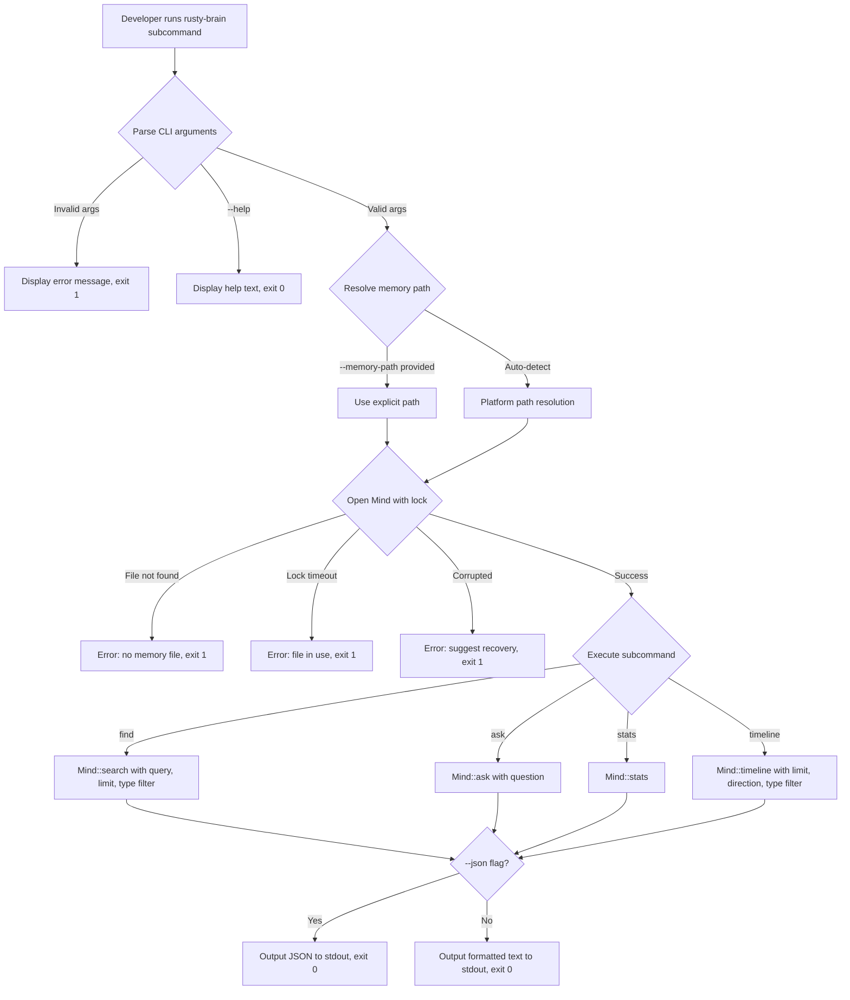
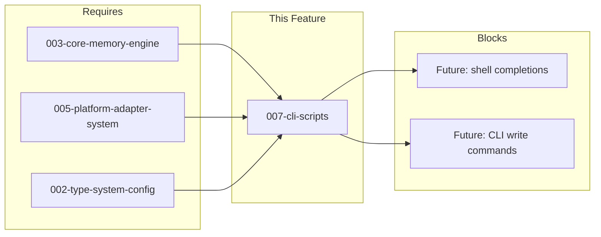

# 007-prd-cli-scripts

> **Document Type:** Product Requirements Document
> **Audience:** LLM agents, human reviewers
> **Status:** Draft
> **Last Updated:** 2026-03-02 <!-- @auto -->
> **Owner:** <!-- @human-required -->

**Feature Branch**: `007-cli-scripts`
**Created**: 2026-03-02
**Status**: Draft
**Input**: User description: "Provide developer-facing CLI tools for interacting with the memory system: find, ask, stats, timeline (Phase 6 from RUST_ROADMAP.md)"

---

## Review Tier Legend

| Marker | Tier | Speckit Behavior |
|--------|------|------------------|
| 🔴 `@human-required` | Human Generated | Prompt human to author; blocks until complete |
| 🟡 `@human-review` | LLM + Human Review | LLM drafts → prompt human to confirm/edit; blocks until confirmed |
| 🟢 `@llm-autonomous` | LLM Autonomous | LLM completes; no prompt; logged for audit |
| ⚪ `@auto` | Auto-generated | System fills (timestamps, links); no prompt |

---

## Document Completion Order

> ⚠️ **For LLM Agents:** Complete sections in this order. Do not fill downstream sections until upstream human-required inputs exist.

1. **Context** (Background, Scope) → requires human input first
2. **Problem Statement & User Scenarios** → requires human input
3. **Requirements** (Must/Should/Could/Won't) → requires human input
4. **Technical Constraints** → human review
5. **Diagrams, Data Model, Interface** → LLM can draft after above exist
6. **Acceptance Criteria** → derived from requirements
7. **Everything else** → can proceed

---

## Context

### Background 🔴 `@human-required`

rusty-brain is a Rust rewrite of [agent-brain](https://github.com/brianluby/agent-brain/) — a memory system for AI coding agents. The CLI Scripts feature is Phase 6 of the Rust roadmap, providing developer-facing terminal commands for querying the memory system outside of agent sessions. Today, developers can only interact with their memory through agent hooks — there is no standalone way to search, ask questions about, or inspect the memory store. This feature closes that gap by shipping a `rusty-brain` binary with four subcommands (`find`, `ask`, `stats`, `timeline`) that provide read-only access to `.mv2` memory files.

### Scope Boundaries 🟡 `@human-review`

**In Scope:**
- `rusty-brain` CLI binary with `find`, `ask`, `stats`, `timeline` subcommands
- Human-readable formatted output (color, tables) with automatic non-interactive terminal detection
- Machine-readable `--json` output for all subcommands
- `--limit`, `--type`, `--oldest-first`, `--memory-path`, `--verbose` flags
- Automatic memory file path resolution (reuse `crates/platforms` logic)
- File lock handling with exponential backoff (reuse `crates/core` pattern)
- Integration with `crates/core` Mind API for all data operations

**Out of Scope:**
- Write operations — CLI is read-only; writing is handled by the hooks system (Phase 5)
- Interactive prompts or TUI — all commands are single-shot, non-interactive per constitution
- Network operations — local filesystem only per constitution
- Memory file creation — CLI reads existing files; creation is handled by the core engine during agent sessions
- Shell completions — nice to have but deferred to avoid scope creep
- Custom output templates or formatting — structured JSON covers automation needs

### Glossary 🟡 `@human-review`

| Term | Definition |
|------|------------|
| CLI Binary | The `rusty-brain` executable providing subcommand-based access to the memory system |
| Subcommand | One of the four operations: `find`, `ask`, `stats`, `timeline` |
| Observation | A single memory entry stored in the `.mv2` file, classified by `ObservationType` |
| ObservationType | One of 10 variants: discovery, decision, problem, solution, pattern, warning, success, refactor, bugfix, feature |
| Search Result | A memory match containing observation type, timestamp, summary, content excerpt, and relevance score |
| Memory Statistics | An aggregate view of the memory file: total observations, sessions, date range, file size, type distribution |
| Timeline Entry | A chronologically ordered observation record with timestamp, type, and summary |
| Mind | The core memory engine struct from `crates/core` that provides search, ask, stats, and timeline APIs |
| `.mv2` | Memvid's video-encoded memory storage file format |
| Memory Path Resolution | The logic from `crates/platforms` that locates the correct `.mv2` file for the current project |

### Related Documents ⚪ `@auto`

| Document | Link | Relationship |
|----------|------|--------------|
| Feature Spec | spec.md | Detailed user scenarios and clarifications |
| Architecture Review | ar.md | Defines technical approach |
| Security Review | sec.md | Risk assessment |
| Rust Roadmap | RUST_ROADMAP.md | Strategic context — Phase 6 |
| Constitution | .specify/memory/constitution.md | Governing principles |
| Core Memory Engine PRD | specs/003-core-memory-engine/prd.md | Upstream dependency — provides Mind API |
| Platform Adapter PRD | specs/005-platform-adapter-system/ | Upstream dependency — provides path resolution |

---

## Problem Statement 🔴 `@human-required`

Developers using rusty-brain-powered AI agents currently have no standalone way to query their memory store. All memory interaction happens implicitly through agent hooks during coding sessions. If a developer wants to recall a decision made three sessions ago, search for all observations about a specific topic, check how many memories are stored, or review a chronological log of recent agent activity, they have no tool to do so.

This creates several pain points:
- **No auditability** — developers cannot inspect what the agent has remembered without starting a full agent session.
- **No debugging** — when the agent behaves unexpectedly (e.g., recalling incorrect context), there is no way to inspect the underlying memory data.
- **No maintenance visibility** — developers cannot monitor memory file growth, check for corruption indicators, or understand the composition of their memory store.

The CLI Scripts feature addresses this by providing four terminal commands that expose the core engine's read capabilities directly to developers, enabling search, question-answering, statistics, and chronological browsing of memory data.

---

## User Scenarios & Testing 🔴 `@human-required`

### User Story 1 — Search Memories by Pattern (Priority: P1)

A developer wants to find specific memories from past sessions — for example, all observations related to "authentication" or a specific file path. They run a search command from the terminal and get a list of matching memories with their type, timestamp, and content excerpt.

> As a developer, I want to search my memory store by text pattern so that I can find specific past observations without starting an agent session.

**Why this priority**: Search is the most fundamental way developers interact with their memory outside of the agent. It enables debugging, auditing, and knowledge retrieval.

**Independent Test**: Can be fully tested by running the find command against a memory file with known observations and verifying matching results appear with correct formatting.

**Acceptance Scenarios**:

1. **Given** a memory file with 50+ observations spanning multiple types and sessions, **When** the developer runs `rusty-brain find "authentication"`, **Then** matching observations are displayed with observation type, timestamp, summary, and a content excerpt, ordered by relevance.
2. **Given** a search pattern that matches no observations, **When** the developer runs `rusty-brain find "xyznonexistent"`, **Then** a clear "no results found" message is displayed.
3. **Given** the developer wants to limit results, **When** they run `rusty-brain find "error" --limit 5`, **Then** at most 5 results are returned.
4. **Given** the developer wants machine-readable output, **When** they run `rusty-brain find "auth" --json`, **Then** results are output as a JSON array suitable for piping to other tools.
5. **Given** the developer wants only decisions, **When** they run `rusty-brain find "auth" --type decision`, **Then** only observations with type `decision` are returned.

---

### User Story 2 — Ask Questions About Memory (Priority: P1)

A developer wants to ask a natural language question about their project history — for example, "What decisions were made about the database schema?" The system searches memory and returns a synthesized answer drawing from relevant observations.

> As a developer, I want to ask natural language questions about my project memory so that I can get direct answers instead of manually sifting through search results.

**Why this priority**: Question-answering provides the highest-value interaction for developers. This is the "killer feature" for developer adoption.

**Independent Test**: Can be fully tested by running the ask command with a question and verifying a coherent answer is returned that draws from stored observations.

**Acceptance Scenarios**:

1. **Given** a memory file with observations about database decisions, **When** the developer runs `rusty-brain ask "What database schema changes were made?"`, **Then** a synthesized answer is displayed that references relevant observations.
2. **Given** a question with no relevant memories, **When** the developer runs `rusty-brain ask "What about quantum computing?"`, **Then** a clear message indicates no relevant memories were found.
3. **Given** the developer wants machine-readable output, **When** they run `rusty-brain ask "..." --json`, **Then** the answer is output as a JSON object.

---

### User Story 3 — View Memory Statistics (Priority: P2)

A developer wants to understand the state of their memory file — how many observations are stored, how many sessions, the time range covered, file size, and breakdown by observation type.

> As a developer, I want to view statistics about my memory store so that I can monitor its health, growth, and composition.

**Why this priority**: Statistics provide essential visibility into the memory system. Developers need to know their memory is working, growing, and not corrupted. Less critical than search/ask since it doesn't retrieve specific knowledge.

**Independent Test**: Can be fully tested by running the stats command against a memory file and verifying the displayed counts, dates, and breakdowns are accurate.

**Acceptance Scenarios**:

1. **Given** a memory file with observations from multiple sessions, **When** the developer runs `rusty-brain stats`, **Then** a summary is displayed showing total observations, total sessions, oldest and newest memory timestamps, file size, and a breakdown of observation counts by type.
2. **Given** an empty or newly created memory file, **When** the developer runs `rusty-brain stats`, **Then** it shows zero counts with appropriate messaging rather than an error.
3. **Given** the developer wants machine-readable output, **When** they run `rusty-brain stats --json`, **Then** statistics are output as a JSON object.

---

### User Story 4 — View Chronological Timeline (Priority: P2)

A developer wants to see a chronological view of recent memory entries — a timeline of what happened across recent sessions. This is useful for reviewing what the agent did, debugging unexpected behavior, or recapping past work.

> As a developer, I want to browse a chronological timeline of recent observations so that I can understand the narrative of my agent's past sessions.

**Why this priority**: Timeline provides temporal context that search alone cannot. Seeing what happened in order helps developers understand the narrative of their sessions.

**Independent Test**: Can be fully tested by running the timeline command and verifying entries appear in reverse chronological order with correct timestamps and types.

**Acceptance Scenarios**:

1. **Given** a memory file with observations from 3 sessions, **When** the developer runs `rusty-brain timeline`, **Then** observations are displayed in reverse chronological order (most recent first) with timestamp, observation type, and summary.
2. **Given** the developer wants to see more or fewer entries, **When** they run `rusty-brain timeline --limit 50`, **Then** at most 50 entries are displayed.
3. **Given** the developer wants the oldest entries first, **When** they run `rusty-brain timeline --oldest-first`, **Then** entries are displayed in chronological order (oldest first).
4. **Given** the developer wants machine-readable output, **When** they run `rusty-brain timeline --json`, **Then** entries are output as a JSON array.
5. **Given** the developer wants only discoveries, **When** they run `rusty-brain timeline --type discovery`, **Then** only observations with type `discovery` are displayed.

---

### User Story 5 — CLI Error Handling & Help (Priority: P2)

A developer encounters an error condition (missing file, invalid arguments, locked file) or needs to discover available commands. The CLI provides clear, actionable feedback in all cases.

> As a developer, I want clear error messages and help text so that I can understand what went wrong and how to use the CLI correctly.

**Why this priority**: Good error handling and discoverability are essential for developer adoption. A CLI that produces cryptic errors or stack traces will be abandoned.

**Independent Test**: Can be fully tested by triggering each error condition and verifying the output is a clear message (not a stack trace), and by running `--help` and verifying usage information is displayed.

**Acceptance Scenarios**:

1. **Given** the developer runs `rusty-brain` with no arguments, **When** the CLI starts, **Then** help text is displayed showing available subcommands and usage examples.
2. **Given** the memory file does not exist at the resolved path, **When** any subcommand is run, **Then** a clear error message indicates no memory file was found with a suggestion for where to create one.
3. **Given** the memory file is locked by an active agent session, **When** any subcommand is run, **Then** the CLI waits with exponential backoff (100ms base, 5 retries, 2x multiplier) and displays a clear error after retries are exhausted.
4. **Given** the developer passes `--limit 0` or `--limit -1`, **When** the subcommand processes arguments, **Then** a clear error indicates the limit must be a positive integer.

---

## Assumptions & Risks 🟡 `@human-review`

### Assumptions
- [A-1] The `crates/core` Mind API (search, ask, stats, timeline/get_context) is complete and stable from Phase 2 implementation.
- [A-2] The `crates/platforms` path resolution logic is available and correctly resolves memory file paths per platform.
- [A-3] The CLI binary name will be `rusty-brain`, matching the project name, distributed as a single static binary.
- [A-4] The CLI is read-only — it does not create, write, or modify observations. Writing is handled exclusively by the hooks system.
- [A-5] No authentication or access control is needed — the CLI operates on local files owned by the current user.
- [A-6] Color and table formatting for human-readable output; `--json` flag switches to structured output for automation.

### Risks

| ID | Risk | Likelihood | Impact | Mitigation |
|----|------|------------|--------|------------|
| R-1 | Core Mind API surface may not expose timeline entries with sufficient detail for CLI display | Low | High | Verify backend `timeline()` + `frame_by_id()` APIs return all needed fields before implementation |
| R-2 | memvid-core `ask()` latency may exceed 500ms target for large memory files | Med | Med | Benchmark against memory files with 1K, 5K, 10K observations; document acceptable performance envelope |
| R-3 | Memory path resolution may fail in edge cases (e.g., not inside a project directory) | Low | Med | Fall back to clear error with `--memory-path` hint; test path resolution across all supported platforms |
| R-4 | Binary size may be unexpectedly large due to memvid-core dependency | Low | Low | Profile binary size; strip debug symbols for release; document expected size range |

---

## Feature Overview

### Flow Diagram 🟡 `@human-review`



---

## Requirements

### Must Have (M) — MVP, launch blockers 🔴 `@human-required`

- [ ] **M-1:** The CLI shall provide a `find` subcommand that accepts a text pattern and returns matching observations with observation type, timestamp, summary, content excerpt, and relevance score.
- [ ] **M-2:** The CLI shall provide an `ask` subcommand that accepts a natural language question and returns a synthesized answer from memory.
- [ ] **M-3:** The CLI shall provide a `stats` subcommand that returns total observations, total sessions, oldest/newest timestamps, file size, and observation type breakdown.
- [ ] **M-4:** The CLI shall provide a `timeline` subcommand that returns observations in chronological order with configurable direction (`--oldest-first`) and limit.
- [ ] **M-5:** All subcommands shall support a `--json` flag that outputs valid, parseable JSON to stdout.
- [ ] **M-6:** The `find` and `timeline` subcommands shall support `--limit <N>` with a default of 10 when not specified. The `ask` subcommand is exempt from `--limit`.
- [ ] **M-7:** The CLI shall automatically detect the correct memory file path using the platform path resolution logic from `crates/platforms`.
- [ ] **M-8:** The CLI shall support `--memory-path <path>` to override automatic path detection.
- [ ] **M-9:** The CLI shall display help text with usage examples when invoked with no arguments or `--help`.
- [ ] **M-10:** The CLI shall provide clear, user-friendly error messages (not stack traces) for all failure modes: missing file, invalid arguments, corrupted memory, lock timeout.
- [ ] **M-11:** All subcommands shall exit with code 0 on success and non-zero on failure.
- [ ] **M-12:** The CLI shall handle locked memory files by waiting with exponential backoff (100ms base, 5 retries, 2x multiplier), displaying a clear error after retries are exhausted.

### Should Have (S) — High value, not blocking 🔴 `@human-required`

- [ ] **S-1:** The `find` and `timeline` subcommands shall support `--type <obs_type>` to filter results by observation type (discovery, decision, problem, solution, pattern, warning, success, refactor, bugfix, feature).
- [ ] **S-2:** The CLI shall automatically disable color and formatting when output is piped to another command (non-interactive terminal detection).
- [ ] **S-3:** The CLI shall support a global `--verbose` / `-v` flag that enables DEBUG-level tracing output to stderr for diagnostic purposes.
- [ ] **S-4:** The CLI binary shall start and return results in under 500ms for typical operations (memory files with fewer than 1,000 observations).

### Could Have (C) — Nice to have, if time permits 🟡 `@human-review`

- [ ] **C-1:** The `find` subcommand could support `--since <date>` and `--until <date>` flags to filter results by time range.
- [ ] **C-2:** The `stats` subcommand could display a compact histogram/bar chart of observation type distribution in human-readable mode.
- [ ] **C-3:** The CLI could support a `--no-color` flag to explicitly disable color output regardless of terminal detection.

### Won't Have (W) — Explicitly deferred 🟡 `@human-review`

- [ ] **W-1:** Shell completion scripts (bash, zsh, fish) — *Reason: Deferred to avoid scope creep; can be added as a follow-up feature without changing the core CLI.*
- [ ] **W-2:** Write/modify operations (add, edit, delete observations) — *Reason: CLI is explicitly read-only by design; write operations belong to the hooks system.*
- [ ] **W-3:** Interactive TUI mode (full-screen browsing, scrolling) — *Reason: Violates constitution's agent-friendly non-interactive requirement; developer can pipe to `less`.*
- [ ] **W-4:** Custom output format templates — *Reason: JSON output covers automation needs; custom templates add complexity without clear demand.*
- [ ] **W-5:** Remote memory file access (SSH, HTTP) — *Reason: Local-only by constitution; network capabilities are opt-in and out of scope for Phase 6.*

---

## Technical Constraints 🟡 `@human-review`

- **Language/Framework:** Rust (stable), edition 2024, MSRV 1.85.0 — consistent with existing workspace
- **Crate Layout:** New `crates/cli` binary crate within the existing workspace; depends on `crates/core` and `crates/platforms`
- **Performance:** CLI startup + operation must complete in under 500ms for typical use; `find` must return within 1 second for 10,000 observations
- **Output:** Human-readable output to stdout with color/table formatting; `--json` for structured output; `--verbose` tracing to stderr
- **Compatibility:** Must run on macOS and Linux; Windows support is best-effort
- **Dependencies:** Argument parsing crate (e.g., `clap`) and output formatting crate (e.g., `comfy-table`, `colored`) may be added; minimize new dependency count
- **Constitution Compliance:** No interactive prompts in agent code paths; all output must be structured (JSON/TOML) when `--json` is set; no logging of memory contents at INFO or above

---

## Data Model (if applicable) 🟡 `@human-review`

The CLI consumes existing data structures from `crates/core` and `crates/types`. No new persistent data models are introduced.

**Consumed Types:**

```
MemorySearchResult (from crates/core::mind)
├── obs_type: ObservationType
├── summary: String
├── content_excerpt: Option<String>
├── timestamp: DateTime<Utc>
├── score: f64
└── tool_name: String

MindStats (from crates/types)
├── total_observations: u64
├── total_sessions: u64
├── oldest_memory: Option<DateTime<Utc>>
├── newest_memory: Option<DateTime<Utc>>
├── file_size_bytes: u64
└── type_counts: HashMap<ObservationType, u64>
```

**New Output Types (CLI-local, for JSON serialization):**

```
FindOutput
├── results: Vec<SearchResultJson>
└── count: usize

AskOutput
├── answer: String
└── has_results: bool

StatsOutput (mirrors MindStats with serialization)

TimelineOutput
├── entries: Vec<TimelineEntryJson>
└── count: usize
```

---

## Interface Contract (if applicable) 🟡 `@human-review`

**CLI Argument Structure:**

```
rusty-brain [--memory-path <PATH>] [--verbose|-v] <SUBCOMMAND>

SUBCOMMANDS:
  find <PATTERN> [--limit <N>] [--type <TYPE>] [--json]
  ask <QUESTION> [--json]
  stats [--json]
  timeline [--limit <N>] [--type <TYPE>] [--oldest-first] [--json]
```

**Exit Codes:**

| Code | Meaning |
|------|---------|
| 0 | Success |
| 1 | General error (invalid arguments, missing file, corrupted memory) |
| 2 | Lock timeout (memory file in use) |

**JSON Output Contract (find):**

```json
{
  "results": [
    {
      "obs_type": "decision",
      "summary": "Chose PostgreSQL for user data",
      "content_excerpt": "After evaluating options...",
      "timestamp": "2026-02-28T14:30:00Z",
      "score": 0.92,
      "tool_name": "read_file"
    }
  ],
  "count": 1
}
```

**JSON Output Contract (ask):**

```json
{
  "answer": "The database schema was changed to add...",
  "has_results": true
}
```

**JSON Output Contract (stats):**

```json
{
  "total_observations": 247,
  "total_sessions": 12,
  "oldest_memory": "2026-01-15T09:00:00Z",
  "newest_memory": "2026-03-01T18:45:00Z",
  "file_size_bytes": 524288,
  "type_counts": {
    "discovery": 89,
    "decision": 45,
    "problem": 32,
    "solution": 28,
    "pattern": 15,
    "warning": 12,
    "success": 10,
    "refactor": 8,
    "bugfix": 5,
    "feature": 3
  }
}
```

**JSON Output Contract (timeline):**

```json
{
  "entries": [
    {
      "obs_type": "discovery",
      "summary": "Found unused import in auth module",
      "timestamp": "2026-03-01T18:45:00Z"
    }
  ],
  "count": 1
}
```

---

## Evaluation Criteria 🟡 `@human-review`

| Criterion | Weight | Metric | Target | Notes |
|-----------|--------|--------|--------|-------|
| Performance | High | CLI startup + operation time | <500ms p95 (typical files) | Benchmark with 100, 1K, 10K observations |
| Search Performance | High | `find` response time at 10K observations | <1 second | memvid search latency is the bottleneck |
| Output Correctness | Critical | JSON parseable by `jq` | 100% of subcommands | Validate with `jq .` in tests |
| Error Quality | High | No stack traces in user output | 0 stack traces | All errors must be user-friendly messages |
| Binary Size | Low | Release binary size | <20MB (stripped) | Monitor but don't optimize aggressively |

---

## Tool/Approach Candidates 🟡 `@human-review`

| Option | License | Pros | Cons | Spike Result |
|--------|---------|------|------|--------------|
| clap (arg parsing) | MIT/Apache-2.0 | Industry standard, derive macros, built-in help/completions | Adds compile time; larger binary | Widely used in Rust CLI ecosystem |
| argh (arg parsing) | BSD-3 | Lightweight, fast compile | Less feature-rich, no built-in color help | Google-maintained but less ecosystem adoption |
| comfy-table (output) | MIT | Column alignment, color support, terminal width detection | Additional dependency | Well-maintained, focused scope |
| tabled (output) | MIT | Rich formatting, multiple table styles | Heavier dependency | More features than needed |
| colored (output) | MPL-2.0 | Simple color API, terminal detection | MPL license may have implications | Very lightweight |

### Selected Approach 🔴 `@human-required`
> **Decision:** Option 2 — Layered Module Architecture (clap 4 derive + comfy-table), as selected in [ar.md](ar.md)
> **Rationale:** Four focused modules (`main.rs`, `args.rs`, `commands.rs`, `output.rs`) each under 200 lines with single responsibility. Functions (not traits) for output dispatch. One new public `Mind::timeline()` method added to `crates/core`. See ar.md §Decision for full analysis of 3 options.

---

## Acceptance Criteria 🟡 `@human-review`

| AC ID | Requirement | User Story | Given | When | Then |
|-------|-------------|------------|-------|------|------|
| AC-1 | M-1 | US-1 | Memory file with 50+ observations | `rusty-brain find "authentication"` | Matching results displayed with type, timestamp, summary, excerpt, ordered by relevance |
| AC-2 | M-1 | US-1 | Search pattern matches nothing | `rusty-brain find "xyznonexistent"` | "No results found" message displayed |
| AC-3 | M-2 | US-2 | Memory file with relevant observations | `rusty-brain ask "What schema changes?"` | Synthesized answer displayed referencing observations |
| AC-4 | M-2 | US-2 | Question has no relevant memories | `rusty-brain ask "quantum computing?"` | "No relevant memories found" message displayed |
| AC-5 | M-3 | US-3 | Memory file with multiple sessions | `rusty-brain stats` | Shows total observations, sessions, date range, file size, type breakdown |
| AC-6 | M-3 | US-3 | Empty memory file | `rusty-brain stats` | Shows zero counts, no error |
| AC-7 | M-4 | US-4 | Memory file with 3 sessions | `rusty-brain timeline` | Observations in reverse chronological order with timestamp, type, summary |
| AC-8 | M-5 | US-1 | Any subcommand | `rusty-brain find "auth" --json` | Valid JSON output parseable by `jq` |
| AC-9 | M-6 | US-1 | No `--limit` specified | `rusty-brain find "auth"` | Exactly 10 or fewer results returned |
| AC-10 | M-7 | US-1 | Inside a project directory | `rusty-brain find "auth"` (no --memory-path) | Correct memory file auto-detected |
| AC-11 | M-8 | US-1 | Explicit path provided | `rusty-brain --memory-path /tmp/test.mv2 find "auth"` | Uses explicit path, ignores auto-detection |
| AC-12 | M-9 | US-5 | No arguments | `rusty-brain` | Help text with subcommands and usage displayed |
| AC-13 | M-10 | US-5 | Missing memory file | `rusty-brain find "auth"` | User-friendly error (not stack trace) |
| AC-14 | M-11 | US-5 | Successful operation | Any subcommand | Exit code 0 |
| AC-15 | M-11 | US-5 | Failed operation | Any error scenario | Non-zero exit code |
| AC-16 | M-12 | US-5 | Memory file locked | Any subcommand | Waits with backoff, errors after retries |
| AC-17 | S-1 | US-1 | Type filter applied | `rusty-brain find "auth" --type decision` | Only `decision` observations returned |
| AC-18 | S-2 | US-1 | Output piped | `rusty-brain find "auth" \| cat` | No color codes in output |
| AC-19 | S-3 | US-5 | Verbose mode | `rusty-brain -v find "auth"` | DEBUG tracing output on stderr |

### Edge Cases 🟢 `@llm-autonomous`

- [ ] **EC-1:** (M-10) When the memory file does not exist at the resolved path, then a clear error message is displayed with suggestion for where to create one.
- [ ] **EC-2:** (M-12) When the memory file is locked and all 5 retries exhaust, then exit code 2 with "file in use" message.
- [ ] **EC-3:** (M-10) When the memory file is corrupted, then a user-friendly error suggests running the system to trigger auto-recovery.
- [ ] **EC-4:** (M-6) When `--limit 0` or `--limit -1` is provided, then a clear error indicates the limit must be a positive integer.
- [ ] **EC-5:** (S-1) When `--type` is given an invalid observation type, then a clear error lists valid type values.
- [ ] **EC-6:** (M-9) When an unrecognized subcommand is provided, then help text is displayed with available commands.
- [ ] **EC-7:** (M-1) When the search query is empty, then a clear error indicates a pattern is required.

---

## Dependencies 🟡 `@human-review`



- **Requires:** 003-core-memory-engine (Mind API), 005-platform-adapter-system (path resolution), 002-type-system-config (shared types)
- **Blocks:** None currently; future shell completions and write commands would depend on this
- **External:** memvid-core (pinned git rev `fbddef4`)

---

## Security Considerations 🟡 `@human-review`

| Aspect | Assessment | Notes |
|--------|------------|-------|
| Internet Exposure | No | CLI operates on local filesystem only |
| Sensitive Data | Yes | Memory files may contain code snippets, file paths, and development context |
| Authentication Required | No | Local file access governed by OS file permissions (0600) |
| Security Review Required | Yes | Link to sec.md — file path handling and error message content should not leak sensitive data |

**Additional considerations:**
- Error messages must not include raw memory content or full file paths beyond what is necessary for diagnosis
- The `--memory-path` flag accepts arbitrary file paths; validate that the path exists and is a file (not a directory) before attempting to open
- JSON output should not include internal implementation details or stack traces

---

## Implementation Guidance 🟢 `@llm-autonomous`

### Suggested Approach
- Create `crates/cli` as a binary crate in the existing workspace with `[[bin]]` target named `rusty-brain`
- Use `clap` derive macros for argument parsing — maps naturally to the subcommand structure
- Implement a thin orchestration layer: parse args → resolve path → open Mind → execute subcommand → format output
- Reuse `Mind::search()`, `Mind::ask()`, `Mind::stats()`, and backend timeline APIs directly
- For `--type` filtering, apply a post-query filter on `ObservationType` (simpler than modifying the core API)
- For `--json`, implement `serde::Serialize` on output structs and use `serde_json::to_string_pretty`
- For human-readable output, use a table formatting crate for aligned columns

### Anti-patterns to Avoid
- Do not duplicate core engine logic in the CLI — always delegate to Mind API methods
- Do not add interactive prompts or confirmation dialogs — all commands are single-shot
- Do not log memory content at INFO level or above — per constitution IX
- Do not catch and silently ignore errors — surface all failures with clear messages
- Do not hardcode memory file paths — always use platform resolution or `--memory-path`

### Reference Examples
- The `crates/core/src/mind.rs` Mind API provides all data access methods
- The `crates/platforms/src/path_policy.rs` provides memory path resolution
- The 003-core-memory-engine PRD and implementation demonstrate the project's coding patterns

---

## Spike Tasks 🟡 `@human-review`

- [ ] **Spike-1:** Verify that `Mind::search()`, `Mind::ask()`, `Mind::stats()`, and backend timeline APIs return all fields needed for CLI display (obs_type, summary, content excerpt, timestamp, score, tool_name).
- [ ] **Spike-2:** Benchmark `Mind::ask()` latency with memory files of 1K, 5K, and 10K observations to validate <500ms target feasibility.

---

## Success Metrics 🔴 `@human-required`

| Metric | Baseline | Target | Measurement Method |
|--------|----------|--------|-------------------|
| Subcommand correctness | N/A | 100% of ACs pass | Automated integration tests |
| CLI response time (typical) | N/A | <500ms p95 | Benchmark with 1K observations |
| Find response time (large files) | N/A | <1s at 10K observations | Benchmark |
| JSON output validity | N/A | 100% parseable by `jq` | Automated test: pipe to `jq .` |
| Error message quality | N/A | 0 stack traces in user output | Manual review + test for all error paths |

### Technical Verification 🟢 `@llm-autonomous`

| Metric | Target | Verification Method |
|--------|--------|---------------------|
| Test coverage for Must Have ACs | >90% | CI pipeline (`cargo test`) |
| No Critical/High security findings | 0 | Security review |
| `cargo clippy -- -D warnings` | 0 warnings | CI pipeline |
| `cargo fmt --check` | Pass | CI pipeline |
| All `--json` outputs valid | 100% | Tests pipe output through JSON parser |

---

## Definition of Ready 🔴 `@human-required`

### Readiness Checklist
- [x] Problem statement reviewed and validated by stakeholder
- [x] All Must Have requirements have acceptance criteria
- [x] Technical constraints are explicit and agreed
- [x] Dependencies identified and owners confirmed
- [ ] Security review completed (or N/A documented with justification)
- [x] No open questions blocking implementation

### Sign-off
| Role | Name | Date | Decision |
|------|------|------|----------|
| Product Owner | | YYYY-MM-DD | [Ready / Not Ready] |

---

## Changelog ⚪ `@auto`

| Version | Date | Author | Changes |
|---------|------|--------|---------|
| 0.1 | 2026-03-02 | LLM | Initial draft from spec.md with clarifications |

---

## Decision Log 🟡 `@human-review`

| Date | Decision | Rationale | Alternatives Considered |
|------|----------|-----------|------------------------|
| 2026-03-02 | File lock: exponential backoff | Reuse core's `with_lock` pattern for consistency | Immediate error; read without lock |
| 2026-03-02 | Default limit: 10 for find/timeline | Matches core search default; prevents terminal overflow | 20, 25, or no default |
| 2026-03-02 | `--limit` exempt for `ask` | `ask` returns single synthesized answer | Limit source memories; limit answer length |
| 2026-03-02 | `--type` filter on find/timeline | Low implementation cost; high developer value; data already supports it | Timeline only; deferred |
| 2026-03-02 | `--verbose` flag to stderr | Core already instruments with tracing; trivial to expose | RUST_LOG env var only; --verbose + --quiet |

---

## Open Questions 🟡 `@human-review`

- [x] ~~**Q1:** All clarification questions resolved in spec.md session 2026-03-02~~

No open questions blocking implementation.

---

## Review Checklist 🟢 `@llm-autonomous`

Before marking as Approved:
- [x] All requirements have unique IDs (M-1 through M-12, S-1 through S-4, C-1 through C-3, W-1 through W-5)
- [x] All Must Have requirements have linked acceptance criteria (AC-1 through AC-16)
- [x] User stories are prioritized and independently testable (US-1 through US-5)
- [x] Acceptance criteria reference both requirement IDs and user stories
- [x] Glossary terms are used consistently throughout
- [x] Diagrams use terminology from Glossary
- [x] Security considerations documented
- [ ] Definition of Ready checklist is complete (pending security review)
- [x] No open questions blocking implementation

---

## Human Review Required

The following sections need human review or input:

- [ ] Background (@human-required) - Verify business context
- [ ] Problem Statement (@human-required) - Validate problem framing
- [ ] User Stories (@human-required) - Confirm priorities and acceptance scenarios
- [ ] Must Have Requirements (@human-required) - Validate MVP scope
- [ ] Should Have Requirements (@human-required) - Confirm priority
- [ ] Selected Approach (@human-required) - Decision needed (architecture review)
- [ ] Success Metrics (@human-required) - Define targets
- [ ] Definition of Ready (@human-required) - Complete readiness checklist
- [ ] All @human-review sections - Review LLM-drafted content
