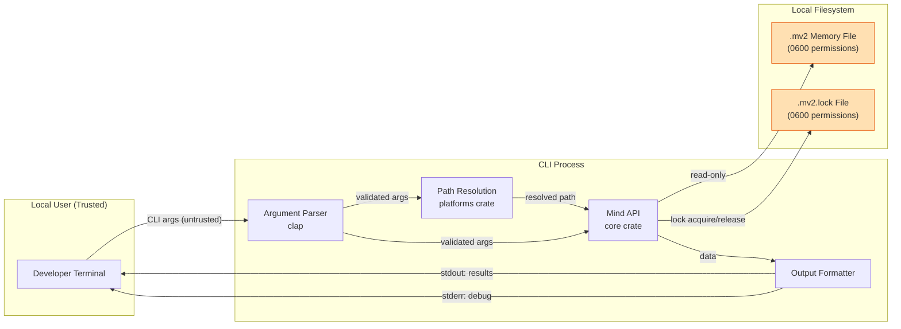
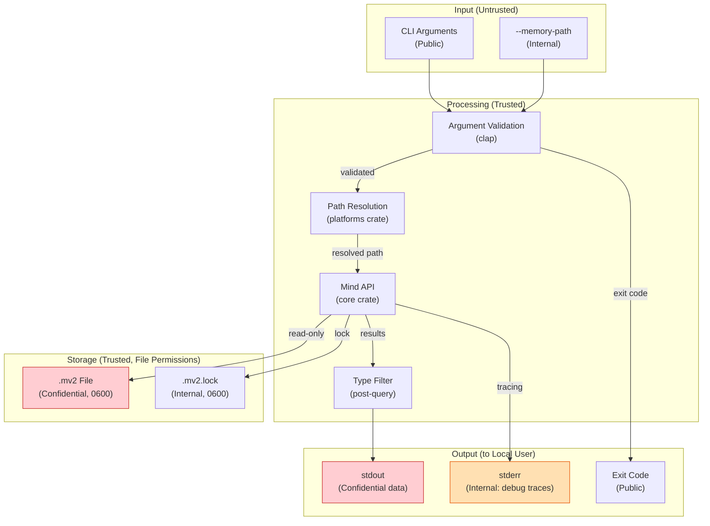
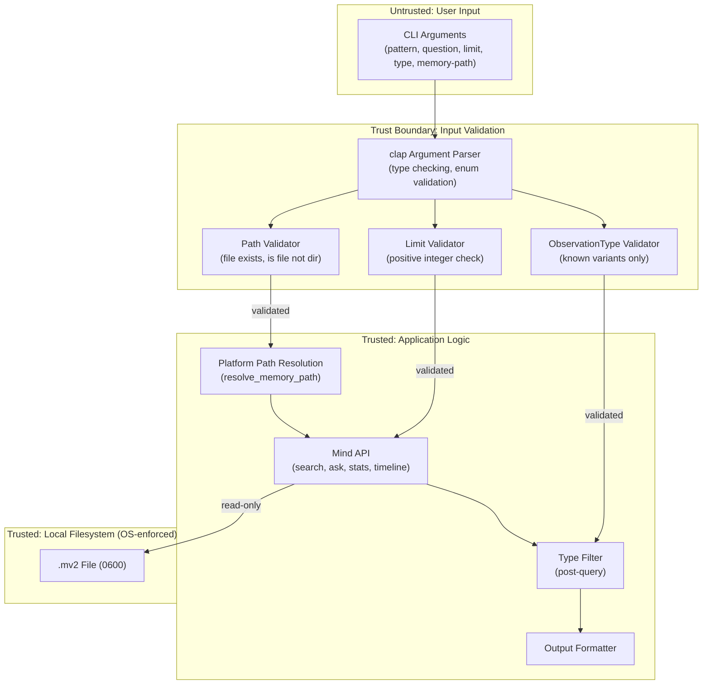

# 007-sec-cli-scripts

> **Document Type:** Security Review (Lightweight)
> **Audience:** LLM agents, human reviewers
> **Status:** Draft
> **Last Updated:** 2026-03-02 <!-- @auto -->
> **Reviewer:** <!-- @human-required -->
> **Risk Level:** Low <!-- @human-required -->

---

## Review Tier Legend

| Marker | Tier | Speckit Behavior |
|--------|------|------------------|
| 🔴 `@human-required` | Human Generated | Prompt human to author; blocks until complete |
| 🟡 `@human-review` | LLM + Human Review | LLM drafts → prompt human to confirm/edit; blocks until confirmed |
| 🟢 `@llm-autonomous` | LLM Autonomous | LLM completes; no prompt; logged for audit |
| ⚪ `@auto` | Auto-generated | System fills (timestamps, links); no prompt |

---

## Severity Definitions

| Level | Label | Definition |
|-------|-------|------------|
| 🔴 | **Critical** | Immediate exploitation risk; data breach or system compromise likely |
| 🟠 | **High** | Significant risk; exploitation possible with moderate effort |
| 🟡 | **Medium** | Notable risk; exploitation requires specific conditions |
| 🟢 | **Low** | Minor risk; limited impact or unlikely exploitation |

---

## Linkage ⚪ `@auto`

| Document | ID | Relationship |
|----------|-----|--------------|
| Parent PRD | 007-prd-cli-scripts.md | Feature being reviewed |
| Architecture Review | 007-ar-cli-scripts.md | Technical implementation |
| Feature Spec | spec.md | User scenarios and clarifications |
| Constitution | .specify/memory/constitution.md | Governing principles (esp. IX: no content logging) |

---

## Purpose

This is a **lightweight security review** intended to catch obvious security concerns early in the product lifecycle. It is NOT a comprehensive threat model. Full threat modeling should occur during implementation when infrastructure-as-code and concrete implementations exist.

**This review answers three questions:**
1. What does this feature expose to attackers?
2. What data does it touch, and how sensitive is that data?
3. What's the impact if something goes wrong?

**Scope of this review:**
- ✅ Attack surface identification
- ✅ Data classification
- ✅ High-level CIA assessment
- ❌ Detailed threat enumeration (deferred to implementation)
- ❌ Penetration testing (deferred to implementation)
- ❌ Compliance audit (separate process)

---

## Feature Security Summary

### One-line Summary 🔴 `@human-required`
> A local-only, read-only CLI binary that reads `.mv2` memory files from the local filesystem and displays observation data (summaries, excerpts, statistics, timelines) to the terminal — no network access, no authentication, no write operations.

### Risk Assessment 🔴 `@human-required`
> **Risk Level:** Low
> **Justification:** The CLI operates exclusively on local files owned by the current user, performs only read operations, has no network exposure, and requires no authentication. The primary risk is information disclosure through terminal output or error messages, mitigated by existing file permission controls (0600) and constitution-mandated content logging restrictions.

---

## Attack Surface Analysis

### Exposure Points 🟡 `@human-review`

| Exposure Type | Details | Authentication | Authorization | Notes |
|---------------|---------|----------------|---------------|-------|
| CLI Argument Input | `--memory-path <path>`: arbitrary file path from user | — | — | Must validate path points to a file, not a directory; traversal mitigated by Mind::open validation |
| CLI Argument Input | `find <pattern>`: text search pattern from user | — | — | Passed directly to Mind::search(); no shell expansion risk |
| CLI Argument Input | `ask <question>`: natural language question from user | — | — | Passed directly to Mind::ask(); no injection vector (local memvid, no SQL/LLM prompt) |
| CLI Argument Input | `--limit <N>`: numeric input from user | — | — | Must validate positive integer; clap handles type enforcement |
| CLI Argument Input | `--type <obs_type>`: enum value from user | — | — | Must validate against known ObservationType variants |
| Terminal Output | stdout: observation summaries, content excerpts, answers | — | — | May contain sensitive code snippets or file paths from the developer's project |
| Terminal Output | stderr: tracing debug output when `--verbose` enabled | — | — | May contain internal file paths, timing data, backend operations |
| Local Filesystem Read | `.mv2` memory file read access | — | OS file permissions (0600) | File permissions set by core engine at creation time |
| Local Filesystem Read/Write | `.mv2.lock` lock file creation during read operations | — | OS file permissions | Lock file created adjacent to memory file; must also be 0600 |

### Attack Surface Diagram 🟢 `@llm-autonomous`

### Exposure Checklist 🟢 `@llm-autonomous`

Quick validation of common exposure risks:

- [x] **Internet-facing endpoints require authentication** — N/A: No internet-facing endpoints. CLI is local-only.
- [x] **No sensitive data in URL parameters** — N/A: No URLs. CLI arguments are local process memory only.
- [x] **File uploads validated** — N/A: No file uploads. CLI reads existing `.mv2` files.
- [x] **Rate limiting configured** — N/A: No network endpoints. Local process exits after each invocation.
- [x] **CORS policy is restrictive** — N/A: No web endpoints.
- [x] **No debug/admin endpoints exposed** — `--verbose` outputs to stderr only; no persistent debug endpoints.
- [x] **Webhooks validate signatures** — N/A: No webhooks.

---

## Data Flow Analysis

### Data Inventory 🟡 `@human-review`

| Data Element | PRD Entity | Classification | Source | Destination | Retention | Encrypted Rest | Encrypted Transit | Residency |
|--------------|------------|----------------|--------|-------------|-----------|----------------|-------------------|-----------|
| Search Results | Search Result | Confidential | `.mv2` file | Terminal stdout | None (transient) | N/A (read-only) | N/A (local) | Local filesystem |
| Synthesized Answer | — (Mind::ask output) | Confidential | `.mv2` file | Terminal stdout | None (transient) | N/A (read-only) | N/A (local) | Local filesystem |
| Memory Statistics | Memory Statistics | Internal | `.mv2` file | Terminal stdout | None (transient) | N/A (read-only) | N/A (local) | Local filesystem |
| Timeline Entries | Timeline Entry | Confidential | `.mv2` file | Terminal stdout | None (transient) | N/A (read-only) | N/A (local) | Local filesystem |
| Observation Summaries | Observation (summary field) | Confidential | `.mv2` file | Terminal stdout | None (transient) | N/A (read-only) | N/A (local) | Local filesystem |
| Content Excerpts | Observation (content field) | Confidential | `.mv2` file | Terminal stdout | None (transient) | N/A (read-only) | N/A (local) | Local filesystem |
| File Paths | — (resolved memory path) | Internal | Platform resolution / `--memory-path` | stderr (verbose), error messages | None (transient) | N/A | N/A | Local filesystem |
| Debug/Tracing Output | — (tracing spans) | Internal | CLI process | Terminal stderr | None (transient) | N/A | N/A | Local filesystem |

### Data Classification Reference 🟢 `@llm-autonomous`

| Level | Label | Description | Examples | Handling Requirements |
|-------|-------|-------------|----------|----------------------|
| 1 | **Public** | No impact if disclosed | CLI help text, version info | No special handling |
| 2 | **Internal** | Minor impact if disclosed | Memory file paths, statistics counts, tracing output | Access controls, no public exposure |
| 3 | **Confidential** | Significant impact if disclosed | Observation summaries, content excerpts, code snippets, synthesized answers | File permissions (0600), no logging at INFO+, terminal output only |
| 4 | **Restricted** | Severe impact if disclosed | N/A for this feature | N/A |

### Data Flow Diagram 🟢 `@llm-autonomous`

### Data Handling Checklist 🟢 `@llm-autonomous`

- [x] **No Restricted data stored unless absolutely required** — No Restricted data involved. All data is Confidential or Internal.
- [x] **Confidential data encrypted at rest** — `.mv2` files use 0600 permissions; encryption at rest is handled by OS-level disk encryption (not application-level). Acceptable for local developer tool.
- [x] **All data encrypted in transit (TLS 1.2+)** — N/A: No network transit. All data stays on local filesystem.
- [x] **PII has defined retention policy** — N/A: CLI does not store any data. All output is transient (terminal display).
- [x] **Logs do not contain Confidential/Restricted data** — Constitution IX mandates no memory content at INFO or above. `--verbose` (DEBUG) outputs to stderr only and shows operation metadata, not memory content.
- [x] **Secrets are not hardcoded** — No secrets needed. CLI operates on local files with OS permissions.
- [x] **Data minimization applied** — Content excerpts are truncated to 200 characters (core Mind API). `--limit` constrains result count.
- [x] **Data residency requirements documented** — N/A: All data local to the developer's machine.

---

## Third-Party & Supply Chain 🟡 `@human-review`

### New External Services

| Service | Purpose | Data Shared | Communication | Approved? |
|---------|---------|-------------|---------------|-----------|
| *None* | CLI is local-only | — | — | — |

### New Libraries/Dependencies

| Library | Version | License | Purpose | Security Check |
|---------|---------|---------|---------|----------------|
| clap | 4.x | MIT/Apache-2.0 | Argument parsing | ✅ Approved — already in workspace `Cargo.toml` |
| tracing-subscriber | 0.3.x | MIT | CLI tracing initialization | ⚠️ Review — new dependency; widely used, MIT licensed, maintained by tokio team |
| comfy-table (or similar) | Latest | MIT | Human-readable table output | ⚠️ Review — new dependency; evaluate license and maintenance status |

### Supply Chain Checklist

- [x] **All new services use encrypted communication** — N/A: No external services.
- [x] **Service agreements/ToS reviewed** — N/A: No external services.
- [x] **Dependencies have acceptable licenses** — clap (MIT/Apache), tracing-subscriber (MIT), comfy-table (MIT) — all acceptable.
- [ ] **Dependencies are actively maintained** — Verify at implementation time: check last commit date and open issues for comfy-table.
- [ ] **No known critical vulnerabilities** — Run `cargo audit` at implementation time for all new dependencies.

---

## CIA Impact Assessment

If this feature is compromised, what's the impact?

### Confidentiality 🟡 `@human-review`

> **What could be disclosed?**

| Asset at Risk | Classification | Exposure Scenario | Impact | Likelihood |
|---------------|----------------|-------------------|--------|------------|
| Observation summaries and content excerpts | Confidential | Another local user reads terminal output (shoulder surfing, shared screen, terminal history) | Low | Low |
| Code snippets in memory | Confidential | Terminal output piped to a shared log file or remote system | Medium | Low |
| File paths in error messages | Internal | Error messages reveal project directory structure | Low | Medium |
| Debug tracing output | Internal | `--verbose` enabled in a shared session or piped to a log | Low | Low |

**Confidentiality Risk Level:** Low

### Integrity 🟡 `@human-review`

> **What could be modified or corrupted?**

| Asset at Risk | Modification Scenario | Impact | Likelihood |
|---------------|----------------------|--------|------------|
| `.mv2` memory file | CLI is read-only by design; no write operations exist. Integrity risk only from `with_lock` lock file creation, which is a metadata-only side effect. | None | None |
| Lock file (`.mv2.lock`) | Stale lock file left behind if CLI crashes mid-operation | Low (blocks subsequent access until lock timeout) | Low |

**Integrity Risk Level:** Low

### Availability 🟡 `@human-review`

> **What could be disrupted?**

| Service/Function | Disruption Scenario | Impact | Likelihood |
|------------------|---------------------|--------|------------|
| CLI subcommands | `.mv2` file corrupted by external process during read | Low (core handles corruption gracefully) | Low |
| CLI subcommands | Lock file held by crashed agent prevents CLI access | Low (exponential backoff + timeout with clear error) | Low |
| Developer workflow | Very large memory file causes CLI to exceed 500ms target | Low (performance degrades but CLI still functions) | Medium |

**Availability Risk Level:** Low

### CIA Summary 🟢 `@llm-autonomous`

| Dimension | Risk Level | Primary Concern | Mitigation Priority |
|-----------|------------|-----------------|---------------------|
| **Confidentiality** | Low | Terminal output may contain code snippets from memory | Low — mitigated by file permissions and local-only operation |
| **Integrity** | Low | CLI is read-only; no write surface exists | Low — by design |
| **Availability** | Low | Lock contention or large file performance | Low — backoff + timeout handles lock; performance is benchmarked |

**Overall CIA Risk:** Low — *The CLI is a local-only, read-only tool with no network exposure, no authentication surface, and no write operations. The primary residual risk is inadvertent disclosure of memory content through terminal output in shared environments.*

---

## Trust Boundaries 🟡 `@human-review`

Where does trust change in this feature?

**Key trust boundary:** The only boundary crossing is from CLI arguments (untrusted user input) into the application logic. `clap` provides type enforcement, and additional validation ensures `--limit` is positive and `--type` is a known variant. The `--memory-path` argument is the highest-risk input as it accepts an arbitrary filesystem path, but `Mind::open()` validates the file format before reading.

### Trust Boundary Checklist 🟢 `@llm-autonomous`

- [x] **All input from untrusted sources is validated** — clap handles type checking; `--limit`, `--type`, and `--memory-path` have additional validation.
- [x] **External API responses are validated** — N/A: No external APIs.
- [x] **Authorization checked at data access, not just entry point** — N/A: No authorization model. OS file permissions (0600) are the access control.
- [x] **Service-to-service calls are authenticated** — N/A: No service calls.

---

## Known Risks & Mitigations 🟡 `@human-review`

| ID | Risk Description | Severity | Mitigation | Status | Owner |
|----|------------------|----------|------------|--------|-------|
| R1 | `--memory-path` accepts arbitrary file paths; user could point it at a non-`.mv2` file causing unexpected behavior | 🟢 Low | `Mind::open()` validates file format; fails with clear error if not a valid `.mv2` file. No risk of reading arbitrary file content — memvid parser rejects non-`.mv2` data. | Mitigated | Implementation |
| R2 | Terminal output may contain sensitive code snippets or decisions from memory, visible to shoulder surfers or in terminal history | 🟢 Low | Content excerpts are truncated to 200 chars. `--json` output can be piped to secure locations. Terminal history is user-controlled. File permissions (0600) prevent unauthorized file reads. | Accepted | User responsibility |
| R3 | Error messages could leak internal file paths or memory file structure | 🟢 Low | Implementation guardrail: error messages must show only the resolved memory path (user already knows this) and not internal backend details or memory content. | Open | Implementation |
| R4 | `--verbose` debug output to stderr may include timing information useful for side-channel analysis | 🟢 Low | `--verbose` is opt-in and outputs to stderr. No sensitive content logged at any level per constitution IX. Timing data for a local CLI has negligible side-channel risk. | Accepted | N/A |
| R5 | Stale `.mv2.lock` file from crashed CLI could block subsequent access | 🟢 Low | Lock file uses `fs2` file-level locking which is released when the process exits (OS cleans up). Stale lock files from OS-level crashes are handled by the exponential backoff + timeout pattern. | Mitigated | Core crate |

### Risk Acceptance 🔴 `@human-required`

| Risk ID | Accepted By | Date | Justification | Review Date |
|---------|-------------|------|---------------|-------------|
| R2 | | YYYY-MM-DD | Terminal output visibility is inherent to any CLI tool; file permissions prevent unauthorized access to the source data | YYYY-MM-DD |
| R4 | | YYYY-MM-DD | Local-only CLI; timing side-channels are not a meaningful threat vector | YYYY-MM-DD |

---

## Security Requirements 🟡 `@human-review`

Based on this review, the implementation MUST satisfy:

### Authentication & Authorization

| Req ID | Requirement | PRD AC | Verification Method |
|--------|-------------|--------|---------------------|
| SEC-1 | No authentication is required — access is controlled by OS file permissions (0600) on `.mv2` files | AC-10, AC-11 | Manual Review: verify no auth mechanism is implemented (intentionally absent) |

### Data Protection

| Req ID | Requirement | PRD AC | Verification Method |
|--------|-------------|--------|---------------------|
| SEC-2 | CLI MUST NOT log observation content (summaries, excerpts, answers) at INFO level or above (constitution IX) | AC-19 | Unit Test: verify tracing output at INFO/WARN/ERROR contains no memory content |
| SEC-3 | Error messages MUST NOT include raw observation content or internal stack traces | AC-13 | Unit Test: trigger each error path and verify output contains only user-friendly messages |
| SEC-4 | `--verbose` debug output MUST go to stderr only, never stdout | AC-19 | Unit Test: verify stdout contains only data output when `--verbose` is enabled |

### Input Validation

| Req ID | Requirement | PRD AC | Verification Method |
|--------|-------------|--------|---------------------|
| SEC-5 | `--limit` MUST be validated as a positive integer (>0) before passing to Mind API | AC-9, EC-4 | Unit Test: verify `--limit 0` and `--limit -1` produce clear error |
| SEC-6 | `--type` MUST be validated against known `ObservationType` variants before filtering | AC-17, EC-5 | Unit Test: verify invalid type produces error listing valid values |
| SEC-7 | `--memory-path` MUST be validated as an existing file (not directory) before passing to Mind::open | AC-11, EC-1 | Integration Test: verify directory path and nonexistent path produce clear errors |
| SEC-8 | Search pattern and question inputs MUST NOT be used in shell commands, SQL, or any injection-susceptible context | AC-1, AC-3 | Code Review: verify inputs are passed only to Mind::search() and Mind::ask() which use memvid lexical search |

### Operational Security

| Req ID | Requirement | PRD AC | Verification Method |
|--------|-------------|--------|---------------------|
| SEC-9 | Lock files created by the CLI MUST have 0600 permissions (consistent with `.mv2` file permissions) | AC-16 | Integration Test: verify lock file permissions after CLI operation |
| SEC-10 | CLI MUST exit cleanly (releasing lock) even when interrupted by signals (SIGINT, SIGTERM) | AC-16 | Manual Test: Ctrl+C during operation and verify lock is released |

---

## Compliance Considerations 🟡 `@human-review`

| Regulation | Applicable? | Relevant Requirements | N/A Justification |
|------------|-------------|----------------------|-------------------|
| GDPR | N/A | — | CLI is a local developer tool; no personal data collection, no network transmission, no data controller/processor relationship |
| CCPA | N/A | — | No consumer personal information collected or sold |
| SOC 2 | N/A | — | No multi-tenant service; local single-user CLI tool |
| HIPAA | N/A | — | No protected health information handled |
| PCI-DSS | N/A | — | No payment card data handled |
| Other | N/A | — | No regulatory requirements apply to a local-only developer CLI tool |

---

## Review Findings

### Issues Identified 🟡 `@human-review`

| ID | Finding | Severity | Category | Recommendation | Status |
|----|---------|----------|----------|----------------|--------|
| F1 | `--memory-path` accepts arbitrary paths without pre-validation before `Mind::open` | 🟢 Low | Input Validation | Add path existence and is-file check before calling `Mind::open()` to provide a clear error rather than relying on memvid parser error | Open |
| F2 | No explicit signal handling for lock cleanup on SIGINT/SIGTERM | 🟢 Low | Operational | `fs2` file locks are released on process exit by the OS; verify this behavior in tests. Consider `ctrlc` crate only if OS cleanup proves insufficient. | Open |
| F3 | `MemorySearchResult.content_excerpt` truncation at 200 chars may still expose sensitive code in terminal | 🟢 Low | Data Protection | Acceptable risk for a developer tool; the user owns the data and is requesting it explicitly. Document in CLI help that output may contain project-specific content. | Accepted |

### Positive Observations 🟢 `@llm-autonomous`

- Read-only design eliminates entire classes of integrity attacks (no write surface)
- Constitution mandates (no content logging at INFO+, no network, no interactive prompts) significantly reduce the attack surface
- Existing core engine handles file corruption detection, backup, and recovery — CLI inherits these protections
- File permissions (0600) set at creation time by core engine provide OS-level access control
- `unsafe` code is forbidden at the workspace level, eliminating memory safety vulnerabilities
- Lock file pattern with exponential backoff prevents denial-of-service from concurrent access

---

## Open Questions 🟡 `@human-review`

- [x] ~~**Q1:** Does the CLI need to verify `.mv2` file permissions are 0600 before reading?~~ → No: the core engine sets permissions at creation time; the CLI trusts the core's security posture. If a user manually changes permissions, that is their prerogative.

No open questions blocking implementation.

---

## Changelog ⚪ `@auto`

| Version | Date | Author | Changes |
|---------|------|--------|---------|
| 0.1 | 2026-03-02 | LLM | Initial lightweight security review |

---

## Review Sign-off 🔴 `@human-required`

| Role | Name | Date | Decision |
|------|------|------|----------|
| Security Reviewer | | YYYY-MM-DD | [Approved / Approved with conditions / Rejected] |
| Feature Owner | | YYYY-MM-DD | [Acknowledged] |

### Conditions for Approval (if applicable) 🔴 `@human-required`

- [ ] Findings F1 and F2 addressed during implementation (both Low severity)

---

## Security Requirements Traceability 🟢 `@llm-autonomous`

| SEC Req ID | PRD Req ID | PRD AC ID | Test Type | Test Location |
|------------|------------|-----------|-----------|---------------|
| SEC-1 | M-7, M-8 | AC-10, AC-11 | Manual Review | N/A (verify absence of auth) |
| SEC-2 | S-3 | AC-19 | Unit Test | `crates/cli/src/commands.rs` |
| SEC-3 | M-10 | AC-13 | Unit Test | `crates/cli/src/main.rs` |
| SEC-4 | S-3 | AC-19 | Unit Test | `crates/cli/src/output.rs` |
| SEC-5 | M-6 | AC-9 | Unit Test | `crates/cli/src/args.rs` |
| SEC-6 | S-1 | AC-17 | Unit Test | `crates/cli/src/args.rs` |
| SEC-7 | M-8 | AC-11 | Integration Test | `crates/cli/tests/` |
| SEC-8 | M-1, M-2 | AC-1, AC-3 | Code Review | `crates/cli/src/commands.rs` |
| SEC-9 | M-12 | AC-16 | Integration Test | `crates/cli/tests/` |
| SEC-10 | M-12 | AC-16 | Manual Test | Manual: Ctrl+C during operation |

---

## Review Checklist 🟢 `@llm-autonomous`

Before marking as Approved:
- [x] Attack surface documented with auth/authz status for each exposure
- [x] Exposure Points table has no contradictory rows
- [x] All PRD Data Model entities appear in Data Inventory (Search Result, Memory Statistics, Timeline Entry, plus observation fields)
- [x] All data elements are classified using the 4-tier model
- [x] Third-party dependencies and services are listed
- [x] CIA impact is assessed with Low/Medium/High ratings
- [x] Trust boundaries are identified
- [x] Security requirements have verification methods specified
- [x] Security requirements trace to PRD ACs where applicable
- [x] No Critical/High findings remain Open
- [x] Compliance N/A items have justification
- [ ] Risk acceptance has named approver and review date (pending human sign-off)
