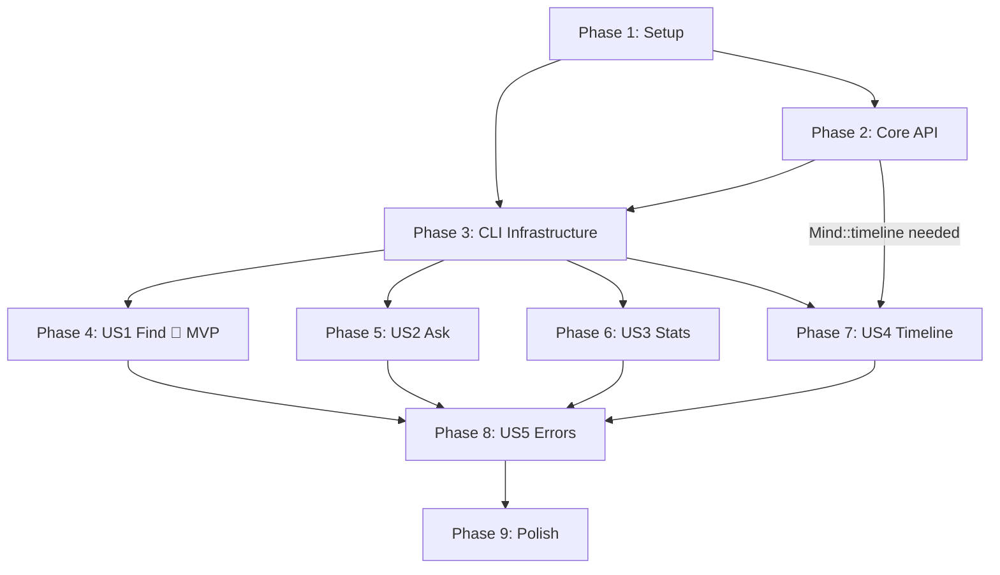

# Tasks: CLI Scripts (007)

**Input**: Design documents from `/specs/007-cli-scripts/`
**Prerequisites**: plan.md, spec.md, prd.md, ar.md, sec.md, research.md, data-model.md, contracts/

**Tests**: Included — constitution V (Test-First) is non-negotiable, user global rules mandate TDD with 80% coverage.

**Organization**: Tasks grouped by user story to enable independent implementation and testing.

## Format: `[ID] [P?] [Story] Description`

- **[P]**: Can run in parallel (different files, no dependencies)
- **[Story]**: Which user story this task belongs to (e.g., US1, US2)
- Exact file paths included in descriptions

---

## Phase 1: Setup

**Purpose**: Add new dependencies and wire the CLI crate into the workspace.

- [x] T001 Add `tracing-subscriber = { version = "0.3", features = ["fmt", "env-filter"] }` and `comfy-table = "7"` to `[workspace.dependencies]` in `Cargo.toml` (workspace root)
- [x] T002 Update `crates/cli/Cargo.toml`: add dependencies `rusty-brain-core = { path = "../core" }`, `types = { path = "../types" }`, `serde = { workspace = true }`, `serde_json = { workspace = true }`, `chrono = { workspace = true }`, `tracing = { workspace = true }`, `tracing-subscriber = { workspace = true }`, `comfy-table = { workspace = true }`; set `[[bin]] name = "rusty-brain"` and verify `cargo check -p cli` compiles

---

## Phase 2: Foundational — Core API Extension

**Purpose**: Add `Mind::timeline()` public method and `TimelineEntry` struct to `crates/core`. BLOCKS Phase 4+ (US4 Timeline).

- [x] T004 Write tests for `Mind::timeline()` in `crates/core/src/mind.rs` (`#[cfg(test)]` module): `test_timeline_empty`, `test_timeline_reverse_order`, `test_timeline_chronological_order`, `test_timeline_limit_respected`, `test_timeline_metadata_parsing`, `test_timeline_malformed_metadata_fallback`; and a round-trip integration test (`remember` → `timeline` → verify fields match) in `crates/core/tests/` — **write tests FIRST (TDD red phase)**
- [x] T003 Implement `pub struct TimelineEntry { obs_type, summary, timestamp, tool_name }` and `pub fn Mind::timeline(&self, limit: usize, reverse: bool) -> Result<Vec<TimelineEntry>, RustyBrainError>` in `crates/core/src/mind.rs` per `contracts/mind-timeline.md` — delegate to `self.backend.timeline()` + `self.backend.frame_by_id()` following the `Mind::stats()` pattern (lines 292-369)

**Checkpoint**: `cargo test -p rusty-brain-core` passes with new timeline tests green.

---

## Phase 3: Foundational — CLI Infrastructure

**Purpose**: Build the CLI skeleton so all subcommands compile (with `todo!()` stubs) and `--help` works.

**CRITICAL**: No user story work can begin until this phase is complete.

- [x] T005 [P] Implement `Cli` struct and `Command` enum with all subcommand definitions (find, ask, stats, timeline), `parse_obs_type` helper, and `--limit` range validation (`value_parser!(usize).range(1..)`) in `crates/cli/src/args.rs` per `contracts/cli-args.md`
- [x] T006 [P] Define CLI output types (`FindOutput`, `SearchResultJson`, `AskOutput`, `StatsOutput`, `TimelineOutput`, `TimelineEntryJson`) with `#[derive(Serialize)]` and `From` conversions from upstream types, plus `pub fn print_json<T: Serialize>(data: &T) -> Result<(), CliError>` helper in `crates/cli/src/output.rs` per `data-model.md` field mappings
- [x] T007 Implement `CliError` enum (variants: `Core(RustyBrainError)`, `MemoryFileNotFound { path }`, `NotAFile { path }`, `Io(io::Error)`) with `exit_code()` method (0=success, 1=general, 2=lock timeout) and `Display` impl; implement `fn run() -> Result<(), CliError>` orchestration (parse Cli → resolve path via `MindConfig::from_env()` with `--memory-path` override → validate file exists and is_file → `Mind::open()` → `mind.with_lock()` → dispatch match calling command stubs); implement `fn main()` calling `run()` with error printing to stderr and `std::process::exit()` in `crates/cli/src/main.rs`
- [x] T008 Create `pub fn run_find(mind, pattern, limit, type_filter, json) -> Result<(), CliError>`, `pub fn run_ask(mind, question, json) -> Result<(), CliError>`, `pub fn run_stats(mind, json) -> Result<(), CliError>`, `pub fn run_timeline(mind, limit, type_filter, oldest_first, json) -> Result<(), CliError>` with `todo!()` bodies in `crates/cli/src/commands.rs`; add `mod args; mod commands; mod output;` to `crates/cli/src/main.rs`
- [x] T009 Create shared integration test helper in `crates/cli/tests/common/mod.rs`: `setup_test_mind(observations: &[TestObs]) -> (TempDir, PathBuf)` that creates a temp directory, builds `MindConfig`, opens `Mind`, calls `remember()` for each test observation, and returns the temp dir guard + memory file path for use by `std::process::Command` tests

**Checkpoint**: `cargo build -p cli` compiles. `cargo run -p cli -- --help` shows all four subcommands with descriptions. `cargo run -p cli -- find "test"` panics with `todo!()` (expected — stubs not yet implemented).

---

## Phase 4: User Story 1 — Search Memories by Pattern (Priority: P1) 🎯 MVP

**Goal**: Developer runs `rusty-brain find "authentication"` and gets matching results with type, timestamp, summary, excerpt.

**Independent Test**: Run `find` against a memory file with known observations; verify matching results appear with correct formatting and JSON output.

**PRD Requirements**: M-1, M-5, M-6, S-1 | **SEC Requirements**: SEC-5, SEC-6, SEC-8

### Tests for User Story 1

> **Write these tests FIRST; ensure they FAIL before implementation (T011)**

- [x] T010 [US1] Write integration tests in `crates/cli/tests/find_test.rs` using `common::setup_test_mind`: `test_find_returns_matching_results` (AC-1), `test_find_no_results_message` (AC-2), `test_find_respects_limit` (AC-9, M-6 default=10), `test_find_json_output_valid` (AC-8, pipe to `serde_json::from_str`), `test_find_type_filter` (AC-17, S-1), `test_find_default_limit_is_10` (AC-9), `test_find_empty_pattern_error` (EC-7, empty string `""` → clear error)

### Implementation for User Story 1

- [x] T011 [US1] Implement `run_find()` in `crates/cli/src/commands.rs`: validate pattern is non-empty (return `CliError` if empty, per EC-7), call `mind.search(pattern, Some(limit))`, apply `--type` post-query filter on `obs_type`, map results to `FindOutput` via `From`, dispatch to `print_json` or `print_find_human` based on `json` flag
- [x] T012 [US1] Implement `print_find_human(output: &FindOutput)` in `crates/cli/src/output.rs`: use `comfy-table` to render table with columns [Type, Score, Timestamp, Summary] (truncate summary to terminal width); print "No results found." when `count == 0`

**Checkpoint**: `cargo test -p cli` passes all find tests. `cargo run -p cli -- find "test" --json` returns valid JSON. MVP is functional.

---

## Phase 5: User Story 2 — Ask Questions About Memory (Priority: P1)

**Goal**: Developer runs `rusty-brain ask "What decisions were made?"` and gets a synthesized answer.

**Independent Test**: Run `ask` with a question; verify coherent answer referencing stored observations.

**PRD Requirements**: M-2, M-5 | **SEC Requirements**: SEC-8

### Tests for User Story 2

- [x] T013 [US2] Write integration tests in `crates/cli/tests/ask_test.rs`: `test_ask_returns_answer` (AC-3), `test_ask_no_relevant_memories` (AC-4), `test_ask_json_output_valid` (AC-8)

### Implementation for User Story 2

- [x] T014 [US2] Implement `run_ask()` in `crates/cli/src/commands.rs`: call `mind.ask(question)`, construct `AskOutput { answer, has_results }` (detect empty/no-results response), dispatch to `print_json` or `print_ask_human`
- [x] T015 [US2] Implement `print_ask_human(output: &AskOutput)` in `crates/cli/src/output.rs`: print answer text directly (no table); print "No relevant memories found for your question." when `!has_results`

**Checkpoint**: `cargo test -p cli` passes all ask tests. Both P1 stories (find + ask) are functional.

---

## Phase 6: User Story 3 — View Memory Statistics (Priority: P2)

**Goal**: Developer runs `rusty-brain stats` and sees total observations, sessions, date range, file size, type breakdown.

**Independent Test**: Run `stats` against a memory file; verify displayed counts and dates are accurate.

**PRD Requirements**: M-3, M-5 | **SEC Requirements**: SEC-2

### Tests for User Story 3

- [x] T016 [US3] Write integration tests in `crates/cli/tests/stats_test.rs`: `test_stats_displays_summary` (AC-5, verify total_observations/sessions/timestamps/file_size/type_counts), `test_stats_empty_memory_file` (AC-6, zero counts no error), `test_stats_json_output_valid` (AC-8, verify snake_case keys per `contracts/json-output.md`)

### Implementation for User Story 3

- [x] T017 [US3] Implement `run_stats()` in `crates/cli/src/commands.rs`: call `mind.stats()`, map `MindStats` to `StatsOutput` (camelCase → snake_case keys, timestamps → RFC 3339 strings, ObservationType keys → lowercase strings), dispatch to `print_json` or `print_stats_human`
- [x] T018 [US3] Implement `print_stats_human(output: &StatsOutput)` in `crates/cli/src/output.rs`: print summary section (total observations, sessions, date range, file size with human-readable formatting), then type breakdown table with `comfy-table`

**Checkpoint**: `cargo test -p cli` passes all stats tests.

---

## Phase 7: User Story 4 — View Chronological Timeline (Priority: P2)

**Goal**: Developer runs `rusty-brain timeline` and sees recent observations in reverse chronological order.

**Independent Test**: Run `timeline` and verify entries appear in correct order with timestamps and types.

**PRD Requirements**: M-4, M-5, M-6, S-1 | **SEC Requirements**: SEC-6

### Tests for User Story 4

- [x] T019 [US4] Write integration tests in `crates/cli/tests/timeline_test.rs`: `test_timeline_reverse_chronological` (AC-7, default most-recent-first), `test_timeline_oldest_first` (spec scenario 3), `test_timeline_respects_limit` (spec scenario 2), `test_timeline_json_output_valid` (AC-8), `test_timeline_type_filter` (spec scenario 5), `test_timeline_default_limit_is_10` (M-6, run without --limit and verify at most 10 entries)

### Implementation for User Story 4

- [x] T020 [US4] Implement `run_timeline()` in `crates/cli/src/commands.rs`: call `mind.timeline(limit, !oldest_first)` (reverse=true for default newest-first), apply `--type` post-query filter, map to `TimelineOutput`, dispatch to `print_json` or `print_timeline_human`
- [x] T021 [US4] Implement `print_timeline_human(output: &TimelineOutput)` in `crates/cli/src/output.rs`: use `comfy-table` to render table with columns [Timestamp, Type, Summary]; print "No timeline entries." when `count == 0`

**Checkpoint**: `cargo test -p cli` passes all timeline tests. All four subcommands are functional.

---

## Phase 8: User Story 5 — CLI Error Handling & Help (Priority: P2)

**Goal**: Developer encounters clear, actionable error messages for all failure modes; help text is discoverable.

**Independent Test**: Trigger each error condition and verify output is user-friendly (no stack traces).

**PRD Requirements**: M-9, M-10, M-11, M-12 | **SEC Requirements**: SEC-3, SEC-5, SEC-6, SEC-7

### Tests for User Story 5

- [x] T022 [US5] Write integration tests in `crates/cli/tests/error_test.rs`: `test_no_args_shows_help` (AC-12, exit 0), `test_missing_memory_file_error` (AC-13, EC-1, user-friendly message with path), `test_invalid_limit_zero` (EC-4, clear error), `test_invalid_type_lists_valid` (EC-5, lists all valid types), `test_memory_path_not_a_file` (SEC-7, directory path → error), `test_exit_code_zero_on_success` (AC-14), `test_exit_code_nonzero_on_failure` (AC-15), `test_lock_timeout_exit_code_2` (AC-16, EC-2, acquire fs2 file lock in test then run CLI → expect exit 2 with "file in use" message), `test_corrupted_memory_file_error` (EC-3, write garbage bytes to .mv2 path then run CLI → expect user-friendly error suggesting recovery)

### Implementation for User Story 5

- [x] T023 [US5] Refine `CliError` `Display` messages in `crates/cli/src/main.rs`: memory file not found → include resolved path + "Use --memory-path or run from a project directory"; not a file → "Path is a directory, not a file"; lock timeout → "Memory file is in use by another process. Try again shortly." (exit 2); core errors → map to user-friendly messages without stack traces or memory content (SEC-3)
- [x] T024 [US5] Verify `--memory-path` pre-validation (exists + is_file) catches F1 finding; verify error messages contain no raw observation content per SEC-3; ensure all tests in `error_test.rs` pass

**Checkpoint**: All error paths produce user-friendly messages. No stack traces reach stdout/stderr.

---

## Phase 9: Polish & Cross-Cutting Concerns

**Purpose**: Non-interactive terminal detection, verbose mode, security verification, quality gates.

- [x] T025 [P] Implement pipe detection in `crates/cli/src/output.rs`: check `std::io::stdout().is_terminal()` (or `atty` crate) to disable color/table formatting when piped (S-2, AC-18); ensure `--json` mode is unaffected
- [x] T026 [P] Implement `--verbose` tracing subscriber init in `crates/cli/src/main.rs`: when `cli.verbose`, initialize `tracing_subscriber::fmt().with_max_level(Level::DEBUG).with_writer(std::io::stderr).init()` (S-3, AC-19, SEC-4 — stderr only); verify no tracing output to stdout
- [x] T027 [P] Write test for pipe detection in `crates/cli/tests/pipe_test.rs`: verify `--json` output has no ANSI escape codes; write test for `--verbose` output goes to stderr not stdout in `crates/cli/tests/verbose_test.rs`; write `test_no_memory_content_at_info_level` verifying no observation summaries/excerpts appear in tracing output at INFO/WARN/ERROR levels (SEC-2, constitution IX)
- [x] T028 [P] Write `test_lock_file_permissions_0600` in `crates/cli/tests/security_test.rs`: run a CLI subcommand, verify the `.mv2.lock` file created during operation has 0600 permissions (SEC-9); verify lock is released after CLI exits
- [x] T029 [P] Write `test_signal_cleanup_releases_lock` in `crates/cli/tests/security_test.rs`: spawn CLI process, send SIGINT, verify lock file is released and `.mv2` is accessible by a subsequent CLI invocation (SEC-10); note: `fs2` file locks are OS-released on process exit — this test verifies that behavior
- [x] T030 [P] Benchmark CLI response time in `crates/cli/tests/bench_test.rs`: measure startup + operation for `find`, `stats`, `timeline` with 100 and 1,000 observations using `std::time::Instant`; assert <500ms p95 for typical operations (S-4); log results to stderr for CI visibility
- [x] T031 Run full quality gates: `cargo test --workspace` (all green), `cargo clippy --workspace -- -D warnings` (zero warnings), `cargo fmt --check` (compliant), `cargo audit` (no known critical vulnerabilities in dependencies per SEC supply chain checklist)
- [x] T032 Validate all `quickstart.md` commands work end-to-end with a real `.mv2` file: build, help, find, ask, stats, timeline, --json, --memory-path, --verbose

---

## Dependencies & Execution Order

### Phase Dependencies



### User Story Dependencies

- **US1 (Find, P1)**: Depends on Phase 3 only — can start first
- **US2 (Ask, P1)**: Depends on Phase 3 only — can run in parallel with US1
- **US3 (Stats, P2)**: Depends on Phase 3 only — can run in parallel with US1/US2
- **US4 (Timeline, P2)**: Depends on Phase 2 (Mind::timeline) AND Phase 3 — can run in parallel with US1/US2/US3 after Phase 2
- **US5 (Errors, P2)**: Depends on all subcommands being implemented (US1-US4) for comprehensive error testing

### Within Each User Story

1. Tests written FIRST (must FAIL before implementation — TDD red phase)
2. Command function implemented (TDD green phase)
3. Human-readable output implemented
4. All tests pass (TDD verification)

### Parallel Opportunities

**Phase 3** (after Phase 1+2):
- T005 (args.rs), T006 (output.rs types) can run in parallel — different files, no dependencies

**User Stories** (after Phase 3):
- US1, US2, US3, US4 can all start in parallel (different test files, different command functions)
- Recommended sequential order for single agent: US1 → US2 → US3 → US4 (priority order)

**Phase 9**:
- T025 (pipe detection), T026 (verbose mode), T027 (polish tests) can run in parallel
- T028 (lock permissions), T029 (signal cleanup), T030 (benchmark) can run in parallel

---

## Parallel Example: Phase 3 Infrastructure

```text
# These can run simultaneously (different files):
Agent 1: T005 — crates/cli/src/args.rs
Agent 2: T006 — crates/cli/src/output.rs

# Then sequentially:
T007 — crates/cli/src/main.rs (depends on args.rs + output.rs)
T008 — crates/cli/src/commands.rs (depends on main.rs module declarations)
T009 — crates/cli/tests/common/mod.rs (depends on binary compiling)
```

## Parallel Example: User Stories

```text
# After Phase 3 completes, all stories can start in parallel:
Agent 1: T010 → T011 → T012 (US1 Find)
Agent 2: T013 → T014 → T015 (US2 Ask)
Agent 3: T016 → T017 → T018 (US3 Stats)
Agent 4: T019 → T020 → T021 (US4 Timeline — also needs Phase 2)
```

---

## Implementation Strategy

### MVP First (User Story 1 Only)

1. Complete Phase 1: Setup (T001-T002)
2. Complete Phase 2: Core API Extension (T003-T004)
3. Complete Phase 3: CLI Infrastructure (T005-T009)
4. Complete Phase 4: US1 Find (T010-T012)
5. **STOP and VALIDATE**: `cargo run -p cli -- find "test" --json` works against real memory file
6. Commit and mark as MVP checkpoint

### Suggested MVP Scope

**US1 (Find)** alone provides immediate developer value — search is the most fundamental way developers interact with their memory outside of agent sessions. Ship US1 first, then add remaining subcommands incrementally.

### Incremental Delivery

1. Setup + Core API + CLI Infrastructure → Foundation ready
2. Add US1 Find → Test → **MVP!** (search is the most fundamental operation)
3. Add US2 Ask → Test → P1 complete (both high-value subcommands)
4. Add US3 Stats → Test → Visibility into memory health
5. Add US4 Timeline → Test → All subcommands functional
6. Add US5 Errors → Test → Production-quality error handling
7. Polish → Security verification → Benchmark → Quality gates → Ready for merge

---

## Traceability Matrix

| Task | PRD Req | SEC Req | AC |
|------|---------|---------|-----|
| T003-T004 | M-4 | — | AC-7 |
| T005 | M-6, M-8, M-9, S-1, S-3 | SEC-5, SEC-6 | AC-9, AC-11, AC-12 |
| T006 | M-5 | — | AC-8 |
| T007 | M-5, M-7, M-10, M-11, M-12 | SEC-3, SEC-7 | AC-8, AC-10, AC-13-16 |
| T010-T012 | M-1, M-5, M-6, S-1 | SEC-5, SEC-6, SEC-8 | AC-1, AC-2, AC-8, AC-9, AC-17, EC-7 |
| T013-T015 | M-2, M-5 | SEC-8 | AC-3, AC-4, AC-8 |
| T016-T018 | M-3, M-5 | — | AC-5, AC-6, AC-8 |
| T019-T021 | M-4, M-5, M-6, S-1 | SEC-6 | AC-7, AC-8 |
| T022-T024 | M-9, M-10, M-11, M-12 | SEC-3, SEC-5-7 | AC-12-16, EC-2, EC-3 |
| T025-T027 | S-2, S-3 | SEC-2, SEC-4 | AC-18, AC-19 |
| T028-T029 | — | SEC-9, SEC-10 | AC-16 |
| T030 | S-4 | — | — |

---

## Notes

- [P] tasks = different files, no dependencies on incomplete tasks
- [Story] label maps to PRD user stories (US1-US5)
- Each user story is independently completable and testable
- TDD workflow: write test → verify it fails → implement → verify it passes
- Commit after each phase checkpoint
- `todo!()` stubs in Phase 3 enable TDD red phase — tests can be written before implementation exists (they'll fail with panic, which is the expected red state)
