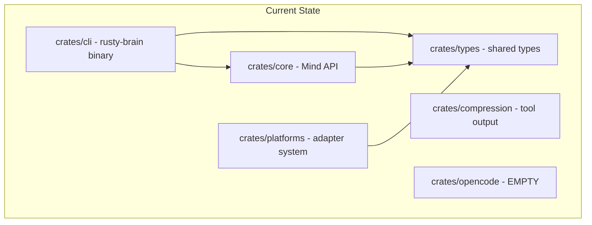
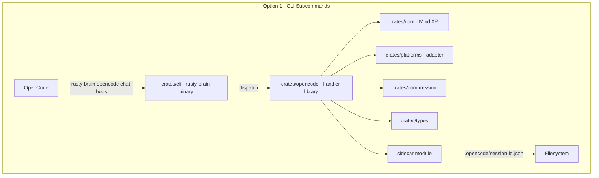
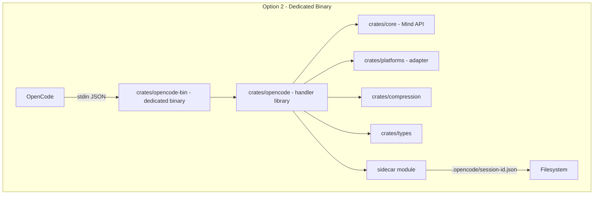
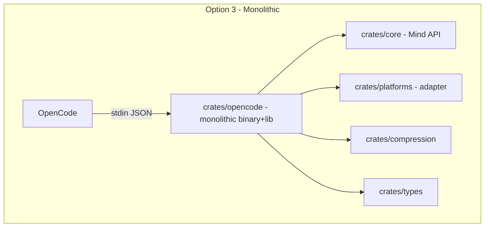
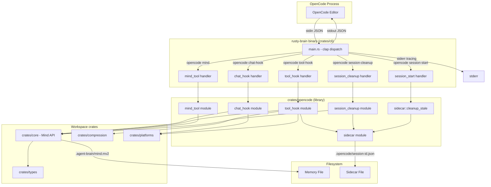
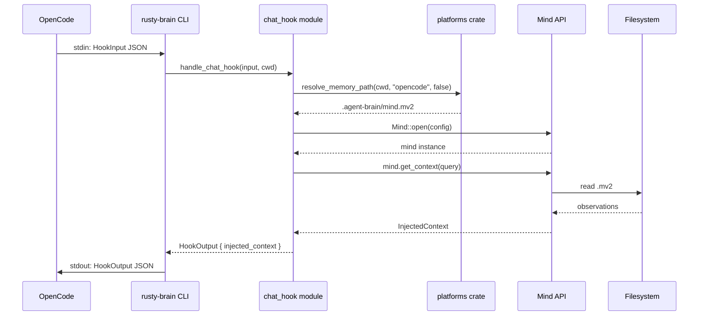
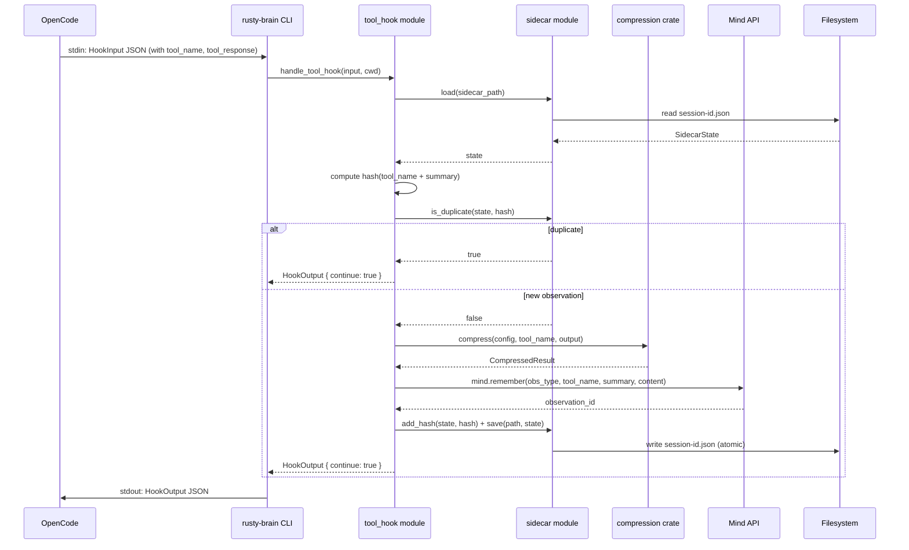
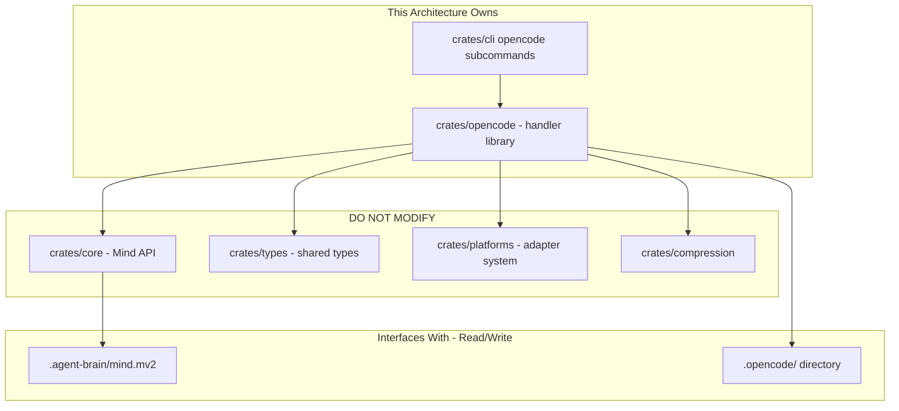

# 008-ar-opencode-plugin

> **Document Type:** Architecture Review
> **Audience:** LLM agents, human reviewers
> **Status:** Proposed
> **Last Updated:** 2026-03-03 <!-- @auto -->
> **Owner:** brianluby <!-- @human-required -->
> **Deciders:** brianluby <!-- @human-required -->

---

## Review Tier Legend

| Marker | Tier | Speckit Behavior |
|--------|------|------------------|
| :red_circle: `@human-required` | Human Generated | Prompt human to author; blocks until complete |
| :yellow_circle: `@human-review` | LLM + Human Review | LLM drafts → prompt human to confirm/edit; blocks until confirmed |
| :green_circle: `@llm-autonomous` | LLM Autonomous | LLM completes; no prompt; logged for audit |
| :white_circle: `@auto` | Auto-generated | System fills (timestamps, links); no prompt |

---

## Document Completion Order

> :warning: **For LLM Agents:** Complete sections in this order. Do not fill downstream sections until upstream human-required inputs exist.

1. **Summary (Decision)** -> requires human input first
2. **Context (Problem Space)** -> requires human input
3. **Decision Drivers** -> requires human input (prioritized)
4. **Driving Requirements** -> extract from PRD, human confirms
5. **Options Considered** -> LLM drafts after drivers exist, human reviews
6. **Decision (Selected + Rationale)** -> requires human decision
7. **Implementation Guardrails** -> LLM drafts, human reviews
8. **Everything else** -> can proceed after decision is made

---

## Linkage :white_circle: `@auto`

| Document | ID | Relationship |
|----------|-----|--------------|
| Parent PRD | specs/008-opencode-plugin/prd.md | Requirements this architecture satisfies |
| Security Review | specs/008-opencode-plugin/sec.md | Security implications of this decision |
| Feature Spec | specs/008-opencode-plugin/spec.md | Source specification with clarifications |
| Supersedes | — | N/A (new feature) |
| Superseded By | — | — |

---

## Summary

### Decision :red_circle: `@human-required`

> Library-only crate (`crates/opencode`) with handler modules dispatched by the existing CLI binary via new `opencode` subcommands, using stdin/stdout JSON protocol and file-backed sidecar for session state.

### TL;DR for Agents :yellow_circle: `@human-review`

> The OpenCode plugin is implemented as a library crate (`crates/opencode`) containing handler modules for chat hooks, tool hooks, mind tool, session cleanup, and sidecar state management. The existing `crates/cli` binary gains an `opencode` subcommand group that reads JSON from stdin and writes JSON to stdout. Each invocation is a stateless subprocess; session state (dedup cache) persists via a sidecar JSON file. All errors fail-open with WARN-level tracing to stderr. Do NOT use `get_mind()` singleton, `deny_unknown_fields`, or log memory contents at INFO level.

---

## Context

### Problem Space :red_circle: `@human-required`

The PRD requires integrating rusty-brain with OpenCode via three capabilities: a chat hook (context injection), a tool hook (observation capture with dedup), and a native mind tool (5 modes). The architectural challenge is: how do we structure a plugin that is invoked as a subprocess per event, must persist session state across invocations (dedup cache), and must integrate with three existing crates (`core`, `platforms`, `compression`) while remaining independently testable?

The key tensions are:
1. **Statelessness vs. session state** — subprocess-per-event means no in-process state, but deduplication requires session-scoped memory
2. **Binary topology** — single binary vs. multiple binaries vs. extending the existing CLI
3. **Testability** — I/O (stdin/stdout) must be separable from business logic for unit testing
4. **Cross-platform reuse** — handler logic should be reusable if a third platform (Cursor, Zed, etc.) is added later

### Decision Scope :yellow_circle: `@human-review`

**This AR decides:**
- Internal module structure of `crates/opencode`
- Binary entry point topology (how OpenCode invokes the plugin)
- Sidecar file management approach
- How handler logic composes with existing `core`, `platforms`, and `compression` crates

**This AR does NOT decide:**
- OpenCode's specific manifest format (deferred to Spike-1 in PRD)
- Whether OpenCode passes session IDs or the plugin generates them (deferred to Spike-1)
- Changes to existing crates (`core`, `platforms`, `compression`, `types`)
- The Claude Code hook architecture (unaffected)

### Current State :green_circle: `@llm-autonomous`

The `crates/opencode` crate exists as an empty scaffold (a single `lib.rs` with a placeholder test). The workspace already has a functional CLI binary (`crates/cli/`) using clap-derive with subcommands (`find`, `ask`, `stats`, `timeline`). The three dependency crates are complete:



The `crates/platforms` crate already provides `opencode_adapter()`, `detect_platform()`, `resolve_memory_path()`, and `resolve_project_identity()`. The `crates/types` crate already defines `HookInput`, `HookOutput`, `PlatformEvent`, and `EventKind`.

### Driving Requirements :yellow_circle: `@human-review`

| PRD Req ID | Requirement Summary | Architectural Implication |
|------------|---------------------|---------------------------|
| M-1 | Chat hook injects context via JSON stdout | Needs a handler module that reads `HookInput` from stdin, calls `Mind::get_context`, and writes `HookOutput` to stdout |
| M-2 | Tool hook captures compressed observations | Needs a handler module that reads `HookInput`, calls `compress()` + `Mind::remember`, writes `HookOutput` |
| M-3 | Mind tool with 5 modes (search/ask/recent/stats/remember) | Needs a dispatcher that routes by mode to corresponding `Mind` API calls, with new `MindToolInput`/`MindToolOutput` types |
| M-4 | Dedup via 1024-entry LRU sidecar file | Needs a sidecar module with atomic read/write, LRU eviction, and hash computation |
| M-5 | Fail-open with WARN tracing to stderr | All handler entry points must catch panics and errors, returning valid JSON stdout regardless |
| M-6 | LegacyFirst memory path resolution | Handlers call `resolve_memory_path(cwd, "opencode", false)` |
| M-7 | Forward-compatible input deserialization | Input types must not use `deny_unknown_fields`; use `#[serde(flatten)]` or ignore extras |
| M-8 | Plugin manifest file | Static file or generated manifest; does not require runtime code |
| S-1 | Session cleanup on deletion | Handler module that reads sidecar, generates summary via `Mind::save_session_summary`, deletes sidecar |
| S-2 | Orphan cleanup on session start | Sidecar module scans directory for stale files (>24h) |
| S-3 | Topic-relevant context injection | Chat hook passes user query to `Mind::get_context(Some(query))` |

**PRD Constraints inherited:**
- Rust stable, edition 2024, MSRV 1.85.0
- Existing workspace crates only (no new external crates without AR justification)
- stdin/stdout JSON protocol, stderr for tracing
- Performance: chat hook <200ms, tool hook <750ms end-to-end (handler-only <100ms p95 excluding Mind::open())
- Constitution: agent-friendly (III), contract-first (IV), test-first (V), memory integrity (VII), security-first (IX), machine-parseable errors (X), no silent failures (XI)

---

## Decision Drivers :red_circle: `@human-required`

1. **Testability** — handler logic must be unit-testable without stdin/stdout I/O *(traces to Constitution V, PRD M-1..M-3)*
2. **Simplicity** — minimize new binaries, build targets, and module count *(traces to Constitution XII)*
3. **Performance** — chat hook <200ms, tool hook <750ms end-to-end including Mind::open() (handler-only <100ms p95) *(traces to PRD M-1, M-2)*
4. **Reusability** — handler logic reusable for future platform integrations *(traces to PRD background: multi-platform validation)*
5. **Fail-open reliability** — no code path can crash or block the developer's workflow *(traces to PRD M-5)*
6. **Dependency discipline** — use existing crates, minimize new dependencies *(traces to Constitution XIII)*

---

## Options Considered :yellow_circle: `@human-review`

### Option 0: Status Quo / Do Nothing

**Description:** Leave `crates/opencode` empty. No OpenCode integration exists.

| Driver | Rating | Notes |
|--------|--------|-------|
| Testability | N/A | Nothing to test |
| Simplicity | :white_check_mark: Good | No new code |
| Performance | N/A | Nothing to measure |
| Reusability | :x: Poor | No multi-platform validation |
| Fail-open | N/A | No plugin to fail |
| Dependency discipline | :white_check_mark: Good | No new deps |

**Why not viable:** Cannot satisfy any PRD requirements (M-1 through M-8). The entire feature is undelivered.

---

### Option 1: Library + CLI Subcommands

**Description:** Implement all handler logic in `crates/opencode` as a library. Extend the existing `crates/cli/` binary with an `opencode` subcommand group (`rusty-brain opencode chat-hook`, `rusty-brain opencode tool-hook`, `rusty-brain opencode mind <mode>`). The CLI handles stdin/stdout I/O; the library handles pure business logic. OpenCode's manifest points to the existing `rusty-brain` binary with appropriate subcommand arguments.



| Driver | Rating | Notes |
|--------|--------|-------|
| Testability | :white_check_mark: Good | Library functions are pure; CLI handles I/O |
| Simplicity | :white_check_mark: Good | Single binary, reuses existing CLI infrastructure, no new build targets |
| Performance | :white_check_mark: Good | Single binary startup; no overhead vs. dedicated binary |
| Reusability | :white_check_mark: Good | Library functions callable from any future binary/CLI |
| Fail-open | :white_check_mark: Good | CLI wraps handlers in catch-all; library returns `Result` |
| Dependency discipline | :white_check_mark: Good | `crates/cli` already has clap; opencode lib needs only workspace crates |

**Pros:**
- Single binary — no additional build targets or installation complexity
- Existing CLI patterns (clap-derive, error handling, JSON output) are reused
- Library is fully testable without I/O
- OpenCode manifest just points to `rusty-brain` binary with subcommand args
- Future platforms can add their own subcommand groups

**Cons:**
- CLI binary grows in size (marginal — just adds a subcommand group)
- OpenCode invocations go through clap parsing (microsecond overhead, negligible)
- CLI and opencode crate become coupled at the binary level (but not at the library level)

---

### Option 2: Library + Dedicated Binary

**Description:** Core logic in `crates/opencode` as a library. Add a separate `crates/opencode-bin/` crate with its own binary target (`rusty-brain-opencode`) that reads stdin JSON and dispatches to library handlers. OpenCode's manifest points to this dedicated binary.



| Driver | Rating | Notes |
|--------|--------|-------|
| Testability | :white_check_mark: Good | Same library separation as Option 1 |
| Simplicity | :warning: Medium | Additional crate, binary, and build target |
| Performance | :white_check_mark: Good | Slightly leaner than full CLI (no clap overhead) |
| Reusability | :white_check_mark: Good | Same library approach as Option 1 |
| Fail-open | :white_check_mark: Good | Same pattern as Option 1 |
| Dependency discipline | :warning: Medium | New crate needs its own Cargo.toml and deps (serde_json, tracing at minimum) |

**Pros:**
- Clean separation — OpenCode binary is purpose-built with no CLI overhead
- Binary can skip clap entirely (just reads stdin JSON, dispatches by event type)
- No coupling to CLI crate

**Cons:**
- Additional crate to maintain, build, and install
- Duplicates I/O patterns already solved in CLI (error handling, JSON output, tracing setup)
- Installation becomes more complex (two binaries to distribute)
- Minimal performance benefit over Option 1 (clap parsing is microseconds)

---

### Option 3: Monolithic Binary in opencode crate

**Description:** Everything (I/O, dispatch, handlers, sidecar) in `crates/opencode` as both a library and binary (`[[bin]]` target in the same crate). No separation between I/O and business logic.



| Driver | Rating | Notes |
|--------|--------|-------|
| Testability | :x: Poor | I/O mixed with logic; hard to unit test without mocking stdin/stdout |
| Simplicity | :warning: Medium | One crate, but I/O code entangled with handlers |
| Performance | :white_check_mark: Good | Lean binary |
| Reusability | :x: Poor | I/O-coupled handlers can't be reused by other platforms |
| Fail-open | :warning: Medium | Harder to catch all error paths when I/O is mixed in |
| Dependency discipline | :warning: Medium | Needs its own clap or raw stdin parsing |

**Pros:**
- Everything in one place — low cognitive overhead for small scope
- Standalone binary with no dependency on CLI crate

**Cons:**
- Violates testability principle (Constitution V) — business logic coupled to I/O
- Handler logic not reusable for future platforms
- Harder to achieve fail-open guarantee with mixed concerns
- Does not follow existing crate patterns (library + separate binary)

---

## Decision

### Selected Option :red_circle: `@human-required`

> **Option 1: Library + CLI Subcommands**

### Rationale :red_circle: `@human-required`

Option 1 scores highest across all decision drivers. It provides the same testability as Option 2 (library functions are pure, CLI handles I/O) while being simpler (no new binary, no new crate). The existing CLI already solves stdin/stdout patterns, error handling, JSON output, and tracing setup — reusing it avoids duplicating that work.

The marginal complexity of adding subcommands to the CLI is far less than creating and maintaining a separate binary crate. Clap parsing overhead is negligible (<1ms) against the 100-200ms performance budgets.

Option 3 was rejected because it violates testability (Constitution V) and reusability. Option 2 was rejected because the additional crate overhead is not justified — the CLI binary is already the natural entry point.

#### Simplest Implementation Comparison :yellow_circle: `@human-review`

| Aspect | Simplest Possible | Selected Option | Justification for Complexity |
|--------|-------------------|-----------------|------------------------------|
| Crates | Put everything in `crates/opencode` as monolithic binary | Library in `crates/opencode`, subcommands in `crates/cli` | Testability (Constitution V) — library functions must be unit-testable without I/O |
| Modules | Single `lib.rs` with all logic | 5 modules: `chat_hook`, `tool_hook`, `mind_tool`, `sidecar`, `session_cleanup` | Each PRD capability (M-1, M-2, M-3, M-4, S-1) maps to a focused handler; keeps modules under 400 lines per coding style |
| Dependencies | Just `serde_json` for stdin/stdout | Workspace crates (core, platforms, compression, types) + serde | Required by PRD — context injection needs `core`, observation capture needs `compression`, path resolution needs `platforms` |
| Sidecar | Hash set in a flat file | Struct with LRU eviction, atomic writes, stale cleanup | PRD M-4 (bounded 1024-entry LRU), S-2 (orphan cleanup), fail-open on I/O errors |
| Error handling | Let errors propagate to stderr | Catch-all at handler entry, WARN trace, return valid JSON | PRD M-5 (fail-open) — errors must never block OpenCode |

**Complexity justified by:** Every module and pattern directly maps to a PRD Must Have requirement. The library/binary split is the minimum needed for Constitution V (test-first). The sidecar LRU + cleanup is the minimum needed for PRD M-4 + S-2.

### Architecture Diagram :yellow_circle: `@human-review`



---

## Technical Specification

### Component Overview :yellow_circle: `@human-review`

| Component | Responsibility | Interface | Dependencies |
|-----------|---------------|-----------|--------------|
| chat_hook module | Read `HookInput` from stdin, resolve memory path, call `Mind::get_context`, return `HookOutput` with injected context | `fn handle_chat_hook(input: &HookInput, cwd: &Path) -> Result<HookOutput, RustyBrainError>` | `core::Mind`, `platforms::resolve_memory_path` |
| tool_hook module | Read `HookInput`, check sidecar for dedup, compress tool output, call `Mind::remember`, update sidecar | `fn handle_tool_hook(input: &HookInput, cwd: &Path) -> Result<HookOutput, RustyBrainError>` | `core::Mind`, `compression::compress`, `sidecar` |
| mind_tool module | Read `MindToolInput`, dispatch by mode to Mind APIs, return `MindToolOutput` | `fn handle_mind_tool(input: &MindToolInput, cwd: &Path) -> Result<MindToolOutput, RustyBrainError>` | `core::Mind` |
| sidecar module | Load/save session state, LRU dedup cache, hash computation, stale file cleanup | `fn load(path) -> Result<SidecarState, RustyBrainError>`, `fn save(path, state) -> Result<(), RustyBrainError>`, `fn is_duplicate(state, hash) -> bool` (infallible: pure `Vec` lookup), `fn cleanup_stale(dir, max_age)` (best-effort fail-open per M-5; logs warnings, never propagates errors) | `serde_json`, `std::fs` |
| session_cleanup module | Read sidecar for observation metadata, generate summary, call `Mind::save_session_summary`, delete sidecar | `fn handle_session_cleanup(session_id: &str, cwd: &Path) -> Result<HookOutput, RustyBrainError>` | `core::Mind`, `sidecar` |
| CLI opencode subcommands | Parse subcommands, read stdin, call library handlers, write stdout, catch errors for fail-open | clap-derive `Opencode` subcommand enum | `crates/opencode` library |

### Data Flow :green_circle: `@llm-autonomous`

**Chat Hook Flow:**


**Tool Hook Flow:**


### Interface Definitions :yellow_circle: `@human-review`

```rust
// === crates/opencode public API ===
// Handlers return Result<..., RustyBrainError>; fail-open wrapper functions
// (handle_with_failopen, mind_tool_with_failopen) catch errors/panics and
// return valid default output with WARN tracing.

/// Chat hook handler — returns HookOutput with injected context.
/// On error: returns Err(RustyBrainError); wrapper fails-open.
pub fn handle_chat_hook(input: &HookInput, cwd: &Path) -> Result<HookOutput, RustyBrainError>;

/// Tool hook handler — captures observation with dedup.
/// On error: returns Err(RustyBrainError); wrapper fails-open.
pub fn handle_tool_hook(input: &HookInput, cwd: &Path) -> Result<HookOutput, RustyBrainError>;

/// Mind tool handler — dispatches by mode.
/// On error: returns Err(RustyBrainError); wrapper fails-open.
pub fn handle_mind_tool(input: &MindToolInput, cwd: &Path) -> Result<MindToolOutput, RustyBrainError>;

/// Session cleanup handler — generates summary, deletes sidecar.
/// On error: returns Err(RustyBrainError); wrapper fails-open.
pub fn handle_session_cleanup(session_id: &str, cwd: &Path) -> Result<HookOutput, RustyBrainError>;

/// Orphaned sidecar cleanup — deletes files older than max_age.
/// Fails-open: logs WARN on errors, never panics.
pub fn cleanup_stale(sidecar_dir: &Path, max_age: Duration);

// === New types in crates/opencode (or crates/types) ===

#[derive(Deserialize)]
pub struct MindToolInput {
    pub mode: String,
    pub query: Option<String>,
    pub content: Option<String>,
    pub limit: Option<usize>,
}

#[derive(Serialize)]
pub struct MindToolOutput {
    pub success: bool,
    #[serde(skip_serializing_if = "Option::is_none")]
    pub data: Option<serde_json::Value>,
    /// Stable machine-parseable error code (e.g. "E_INPUT_INVALID_FORMAT").
    #[serde(skip_serializing_if = "Option::is_none")]
    pub error_code: Option<String>,
    #[serde(skip_serializing_if = "Option::is_none")]
    pub error: Option<String>,
}

// === Sidecar state ===

#[derive(Serialize, Deserialize)]
pub struct SidecarState {
    pub session_id: String,
    pub created_at: DateTime<Utc>,
    pub last_updated: DateTime<Utc>,
    pub observation_count: u32,
    pub dedup_hashes: Vec<String>, // Bounded LRU, max 1024
}
```

### Key Algorithms/Patterns :yellow_circle: `@human-review`

**Pattern: Fail-Open Handler Wrapper**
```rust
fn handle_with_failopen<F>(handler: F) -> HookOutput
where F: FnOnce() -> Result<HookOutput, RustyBrainError>
{
    match std::panic::catch_unwind(AssertUnwindSafe(handler)) {
        Ok(Ok(output)) => output,
        Ok(Err(e)) => {
            tracing::warn!(error = %e, "handler failed, proceeding with fail-open");
            HookOutput::default()  // continue: true, no injected context
        }
        Err(panic) => {
            tracing::warn!("handler panicked, proceeding with fail-open");
            HookOutput::default()
        }
    }
}
```

**Pattern: Sidecar LRU Eviction**
```rust
fn with_hash(state: &SidecarState, hash: String) -> SidecarState {
    if state.dedup_hashes.contains(&hash) {
        // Move to end (most recently used)
        state.dedup_hashes.retain(|h| h != &hash);
        state.dedup_hashes.push(hash);
    } else {
        if state.dedup_hashes.len() >= 1024 {
            state.dedup_hashes.remove(0);  // Evict oldest
        }
        state.dedup_hashes.push(hash);
    }
}
```

**Pattern: Dedup Hash Computation**
```rust
fn compute_dedup_hash(tool_name: &str, summary: &str) -> String {
    use std::hash::{Hash, Hasher};
    use std::collections::hash_map::DefaultHasher;
    let mut hasher = DefaultHasher::new();
    tool_name.hash(&mut hasher);
    summary.hash(&mut hasher);
    format!("{:016x}", hasher.finish())
}
```

---

## Constraints & Boundaries

### Technical Constraints :yellow_circle: `@human-review`

**Inherited from PRD:**
- Rust stable, edition 2024, MSRV 1.85.0
- Use existing workspace crates only
- stdin/stdout JSON protocol, stderr for tracing
- Chat hook <200ms, tool hook <750ms end-to-end including Mind::open() (handler-only <100ms p95)
- All 13 constitution principles apply
- No `deny_unknown_fields` on input types (M-7)

**Added by this Architecture:**
- `crates/opencode` is a library crate only (no `[[bin]]` target); binary lives in `crates/cli`
- Handler functions accept parsed input structs and return output structs — no direct stdin/stdout I/O in the library
- Sidecar files use atomic write (write to temp file, rename) to prevent corruption on crash
- `MindToolInput` and `MindToolOutput` types defined in `crates/opencode` (not `crates/types`) since they are OpenCode-specific
- LRU eviction implemented as a `Vec<String>` with front-removal (no external `lru` crate needed for 1024 entries)

### Architectural Boundaries :yellow_circle: `@human-review`



- **Owns:** `crates/opencode` library, `crates/cli` opencode subcommand additions
- **Interfaces With:** `crates/core` (Mind API), `crates/platforms` (path resolution, adapter), `crates/compression` (tool output), `crates/types` (HookInput/HookOutput), filesystem (`.agent-brain/mind.mv2`, `.opencode/`)
- **Must Not Touch:** Existing `crates/core`, `crates/types`, `crates/platforms`, `crates/compression` implementations

### Implementation Guardrails :yellow_circle: `@human-review`

> :warning: **Critical for LLM Agents:**

- [ ] **DO NOT** use `deny_unknown_fields` on any input deserialization struct *(PRD M-7 — forward compatibility)*
- [ ] **DO NOT** use `get_mind()` singleton — each subprocess invocation creates its own `Mind` instance *(subprocess-per-event model)*
- [ ] **DO NOT** log memory contents (observations, search results) at INFO level or above *(Constitution IX — security-first)*
- [ ] **DO NOT** add interactive prompts or user-facing `eprintln!` in library code *(Constitution III — agent-friendly)*
- [ ] **DO NOT** add new external crates without explicit justification *(Constitution XIII)*
- [ ] **DO NOT** read/write stdin/stdout in `crates/opencode` library code — I/O belongs in `crates/cli` only
- [ ] **MUST** wrap all handler entry points in fail-open catch-all *(PRD M-5)*
- [ ] **MUST** use atomic writes (temp + rename) for sidecar file updates *(Constitution VII — memory integrity)*
- [ ] **MUST** use `resolve_memory_path(cwd, "opencode", false)` for LegacyFirst path resolution *(PRD M-6)*
- [ ] **MUST** emit errors via `tracing::warn!` to stderr *(PRD M-5, Constitution XI)*
- [ ] **MUST** write tests before implementation *(Constitution V — test-first, non-negotiable)*

---

## Consequences :yellow_circle: `@human-review`

### Positive
- Single binary simplifies installation and distribution
- Library/binary split enables comprehensive unit testing without I/O mocking
- Reuses proven CLI patterns (error handling, JSON output, tracing)
- Handler functions are reusable for future platform integrations (just add subcommands)
- Sidecar file approach works regardless of invocation model (subprocess, daemon, etc.)

### Negative
- CLI binary grows in scope (adds opencode subcommand group and opencode crate dependency)
- CLI and opencode crate have a compile-time coupling (but library is independently usable)
- Sidecar file I/O adds ~5-10ms per invocation (well within 100ms budget, but not zero)
- Vec-based LRU is O(n) for contains/remove — acceptable for n=1024, would not scale to larger caches

### Risks & Mitigations

| Risk | Likelihood | Impact | Mitigation |
|------|------------|--------|------------|
| Sidecar file corruption on concurrent write (OpenCode sends parallel hook events) | Low | Med | Atomic writes (temp + rename); best-effort dedup without file locks |
| OpenCode manifest format incompatible with CLI subcommand invocation | Med | Med | Manifest is a static file; can be adapted to call binary with any arguments |
| Vec-based LRU performance degrades with future cache size increases | Low | Low | 1024 entries is well within O(n) performance; can switch to `lru` crate if needed |
| CLI binary startup time increases with opencode dependencies | Low | Low | Only loads opencode code paths when subcommand is invoked (clap lazy dispatch) |

---

## Implementation Guidance

### Suggested Implementation Order :green_circle: `@llm-autonomous`

1. **Sidecar module** (`crates/opencode/src/sidecar.rs`) — SidecarState struct, load/save with atomic writes, LRU hash management, stale cleanup, dedup hash computation
2. **Types** (`crates/opencode/src/types.rs`) — `MindToolInput`, `MindToolOutput`, error types
3. **Chat hook handler** (`crates/opencode/src/chat_hook.rs`) — context injection via `Mind::get_context`
4. **Tool hook handler** (`crates/opencode/src/tool_hook.rs`) — observation capture with dedup via sidecar
5. **Mind tool handler** (`crates/opencode/src/mind_tool.rs`) — mode dispatch to Mind APIs
6. **Session cleanup handler** (`crates/opencode/src/session_cleanup.rs`) — summary generation, sidecar deletion
7. **Fail-open wrapper** (`crates/opencode/src/lib.rs`) — `handle_with_failopen` utility
8. **CLI subcommands** (`crates/cli/src/opencode.rs`) — clap subcommand definitions, stdin/stdout I/O, handler dispatch
9. **Plugin manifest** — static JSON/TOML file for OpenCode discovery

### Testing Strategy :green_circle: `@llm-autonomous`

| Layer | Test Type | Coverage Target | Notes |
|-------|-----------|-----------------|-------|
| Sidecar | Unit | 95% | Load/save, LRU eviction, hash computation, stale cleanup, atomic writes, corrupt file handling |
| Chat hook | Unit + Integration | 90% | Context injection with known memory, empty memory, error paths |
| Tool hook | Unit + Integration | 90% | Observation capture, dedup detection, compression, sidecar update |
| Mind tool | Unit | 90% | All 5 modes with known memory, invalid mode, empty results |
| Session cleanup | Unit + Integration | 85% | Summary generation, sidecar deletion, empty session |
| Fail-open | Unit | 100% | Error recovery, panic recovery, valid JSON output guaranteed |
| CLI integration | Integration | Key paths | stdin/stdout round-trip for each subcommand |

### Reference Implementations :yellow_circle: `@human-review`

- `crates/cli/src/main.rs` — CLI binary pattern with clap-derive, error handling, JSON output *(internal)*
- `crates/cli/src/commands.rs` — Command dispatch pattern *(internal)*
- `crates/core/src/mind.rs` — Mind API usage patterns *(internal)*
- `crates/platforms/src/adapter.rs` — OpenCode adapter and event normalization *(internal)*
- `crates/compression/src/lib.rs` — `compress()` function usage *(internal)*

### Anti-patterns to Avoid :yellow_circle: `@human-review`

- **Don't:** Put stdin/stdout I/O in `crates/opencode` library code
  - **Why:** Makes handlers untestable without I/O mocking
  - **Instead:** Accept parsed structs, return output structs; CLI handles I/O

- **Don't:** Use `get_mind()` singleton for Mind access
  - **Why:** Each subprocess invocation is independent; singleton was designed for long-lived processes
  - **Instead:** Create `Mind::open(config)` per invocation

- **Don't:** Use an external `lru` crate for the dedup cache
  - **Why:** Adds a dependency for a trivial data structure at n=1024
  - **Instead:** Vec-based LRU with front-removal is sufficient

- **Don't:** Store raw observation content in the sidecar file
  - **Why:** Increases file size and sensitivity
  - **Instead:** Store only dedup hashes (16-byte hex strings)

---

## Compliance & Cross-cutting Concerns

### Security Considerations :yellow_circle: `@human-review`

Full details in specs/008-opencode-plugin/sec.md (pending).

- **Authentication:** N/A — local filesystem access only
- **Authorization:** File permissions (0600) on sidecar files to prevent unauthorized access
- **Data handling:** Sidecar files contain only dedup hashes (not raw content); memory file accessed via existing `Mind` API with its own file locking

### Observability :green_circle: `@llm-autonomous`

- **Logging:** `tracing` crate at WARN level for fail-open errors; DEBUG level via `--verbose` flag or `RUSTY_BRAIN_DEBUG=1` is deferred (PRD C-2, Could Have)
- **Metrics:** No runtime metrics (local CLI tool); performance validated via integration test assertions
- **Tracing:** Each handler logs entry/exit at TRACE level; errors at WARN level; all to stderr

### Error Handling Strategy :green_circle: `@llm-autonomous`

```text
Error Category → Handling Approach
├── Input parsing errors → Return structured error JSON (MindToolOutput.error)
├── Memory file not found → Chat hook: create new file; others: fail-open
├── Memory file locked → Retry with backoff (Mind::with_lock); fail-open on timeout
├── Sidecar I/O errors → Fail-open (skip dedup on read failure; skip save on write failure)
├── Compression errors → Impossible (compress() is infallible); but catch_unwind wraps all
├── Sidecar corruption → Delete and recreate (new empty state); WARN trace
└── Panics → catch_unwind at handler entry; return valid JSON; WARN trace
```

---

## Migration Plan

N/A — greenfield implementation. No existing OpenCode integration to migrate from.

### Rollback Plan :red_circle: `@human-required`

**Rollback Triggers:**
- Plugin causes OpenCode crashes or hangs in >1% of invocations
- Memory file corruption traced to plugin writes
- Performance consistently exceeds budgets (>200ms chat, >750ms tool end-to-end)

**Rollback Decision Authority:** Project maintainer (brianluby)

**Rollback Time Window:** Any time before merge to main

**Rollback Procedure:**
1. Remove `opencode` subcommand from `crates/cli/src/main.rs`
2. Remove `opencode` dependency from `crates/cli/Cargo.toml`
3. Leave `crates/opencode` library code in place (harmless if not compiled into binary)
4. Remove plugin manifest from installation
5. OpenCode reverts to operating without memory integration

---

## Open Questions :yellow_circle: `@human-review`

- [ ] **Q1:** What is OpenCode's exact plugin manifest format? (PRD Spike-1)
- [ ] **Q2:** Does the `opencode` subcommand group need a dedicated `--stdin` flag, or should it always read from stdin? (Implementer decides based on testing ergonomics)

---

## Changelog :white_circle: `@auto`

| Version | Date | Author | Changes |
|---------|------|--------|---------|
| 0.1 | 2026-03-03 | Claude (LLM) | Initial proposal |

---

## Decision Record :white_circle: `@auto`

| Date | Event | Details |
|------|-------|---------|
| 2026-03-03 | Proposed | Initial draft created from PRD 008-prd-opencode-plugin |

---

## Traceability Matrix :green_circle: `@llm-autonomous`

| PRD Req ID | Decision Driver | Option 1 Rating | Component | How Satisfied |
|------------|-----------------|-----------------|-----------|---------------|
| M-1 | Testability, Performance | :white_check_mark: Good | chat_hook module | `handle_chat_hook` calls `Mind::get_context`, returns `HookOutput` with injected context |
| M-2 | Testability, Performance | :white_check_mark: Good | tool_hook module | `handle_tool_hook` calls `compress` + `Mind::remember`, updates sidecar |
| M-3 | Testability | :white_check_mark: Good | mind_tool module | `handle_mind_tool` dispatches by mode to `Mind` search/ask/recent/stats/remember |
| M-4 | Simplicity | :white_check_mark: Good | sidecar module | Vec-based LRU with 1024-entry bound, loaded/saved per invocation |
| M-5 | Fail-open reliability | :white_check_mark: Good | fail-open wrapper | `handle_with_failopen` catches errors + panics, emits WARN trace |
| M-6 | Simplicity | :white_check_mark: Good | chat_hook, tool_hook | `resolve_memory_path(cwd, "opencode", false)` returns `.agent-brain/mind.mv2` |
| M-7 | Simplicity | :white_check_mark: Good | types | No `deny_unknown_fields` on `MindToolInput` or `HookInput` deserialization |
| M-8 | Simplicity | :white_check_mark: Good | manifest file | Static JSON file generated during build/install |
| S-1 | Testability | :white_check_mark: Good | session_cleanup module | `handle_session_cleanup` calls `Mind::save_session_summary`, deletes sidecar |
| S-2 | Simplicity | :white_check_mark: Good | sidecar module | `cleanup_stale` scans directory, deletes files >24h old |
| S-3 | Testability | :white_check_mark: Good | chat_hook module | Passes user query to `Mind::get_context(Some(query))` |

---

## Review Checklist :green_circle: `@llm-autonomous`

Before marking as Accepted:
- [x] All PRD Must Have requirements appear in Driving Requirements
- [x] Option 0 (Status Quo) is documented
- [x] Simplest Implementation comparison is completed
- [x] Decision drivers are prioritized and addressed
- [x] At least 2 options were seriously considered (3 options + status quo)
- [x] Constraints distinguish inherited vs. new
- [x] Component names are consistent across all diagrams and tables
- [x] Implementation guardrails reference specific PRD constraints
- [x] Rollback triggers and authority are defined
- [ ] Security review is linked (pending sec.md)
- [x] No open questions blocking implementation (Q1/Q2 are spike-level)

---

## Human Decisions Required

The following decisions need human input:

- [ ] Summary Decision (@human-required) - Select the architectural approach
- [ ] Problem Space (@human-required) - Validate the architectural challenge
- [ ] Decision Drivers (@human-required) - Confirm priority ordering
- [ ] Selected Option (@human-required) - Choose between presented options
- [ ] Rationale (@human-required) - Confirm trade-off reasoning
- [ ] Rollback Plan (@human-required) - Define rollback triggers and authority
- [ ] All @human-review sections - Review LLM-drafted technical details
