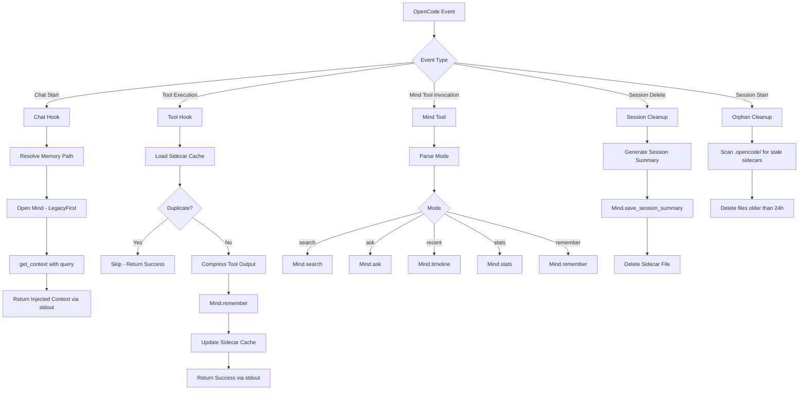
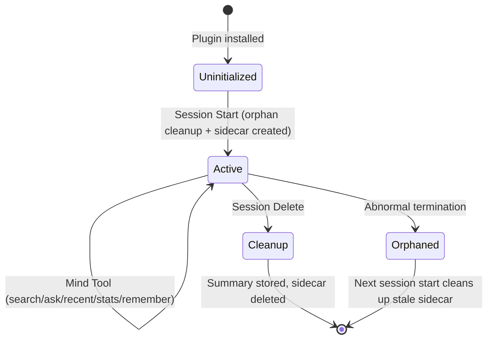
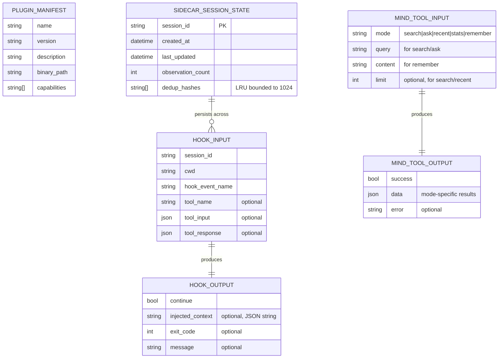
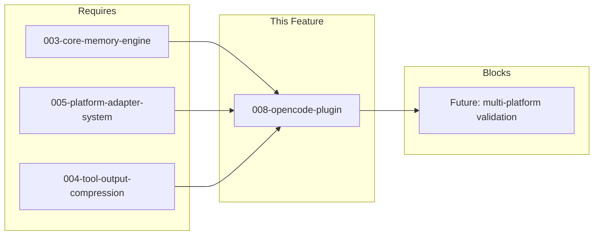

# 008-prd-opencode-plugin

> **Document Type:** Product Requirements Document
> **Audience:** LLM agents, human reviewers
> **Status:** Draft
> **Last Updated:** 2026-03-03 <!-- @auto -->
> **Owner:** brianluby <!-- @human-required -->

**Feature Branch**: `008-opencode-plugin`
**Created**: 2026-03-03
**Status**: Draft
**Input**: User description: "Port the OpenCode plugin integration: chat hook, tool hook, native mind tool, session cleanup, deduplication (Phase 7 from RUST_ROADMAP.md)"

---

## Review Tier Legend

| Marker | Tier | Speckit Behavior |
|--------|------|------------------|
| :red_circle: `@human-required` | Human Generated | Prompt human to author; blocks until complete |
| :yellow_circle: `@human-review` | LLM + Human Review | LLM drafts → prompt human to confirm/edit; blocks until confirmed |
| :green_circle: `@llm-autonomous` | LLM Autonomous | LLM completes; no prompt; logged for audit |
| :white_circle: `@auto` | Auto-generated | System fills (timestamps, links); no prompt |

---

## Document Completion Order

> :warning: **For LLM Agents:** Complete sections in this order. Do not fill downstream sections until upstream human-required inputs exist.

1. **Context** (Background, Scope) → requires human input first
2. **Problem Statement & User Scenarios** → requires human input
3. **Requirements** (Must/Should/Could/Won't) → requires human input
4. **Technical Constraints** → human review
5. **Diagrams, Data Model, Interface** → LLM can draft after above exist
6. **Acceptance Criteria** → derived from requirements
7. **Everything else** → can proceed

---

## Context

### Background :red_circle: `@human-required`

rusty-brain provides persistent memory for AI coding agents, allowing them to recall past decisions, patterns, and project context across sessions. Currently, only Claude Code is integrated via hooks. OpenCode is another AI coding editor that would benefit from the same memory system. Integrating rusty-brain with OpenCode expands the user base and validates the platform adapter architecture (crate `platforms`) designed in feature 005. This is Phase 7 of the RUST_ROADMAP.md.

### Scope Boundaries :yellow_circle: `@human-review`

**In Scope:**
- Chat message hook for context injection into OpenCode conversations
- Tool execution hook for capturing compressed observations
- Native `mind` tool with five modes (search, ask, recent, stats, remember)
- Session cleanup on conversation deletion (summary generation, memory release)
- Session-scoped deduplication via file-backed sidecar cache
- Plugin manifest for OpenCode discovery and registration
- Orphaned sidecar file cleanup on session start

**Out of Scope:**
- OpenCode UI modifications — the plugin integrates through OpenCode's existing plugin protocol, not custom UI
- Remote/cloud memory sync — rusty-brain is local-only by constitution (Principle IX)
- New memory storage formats — uses existing `.mv2` format via `crates/core`
- Claude Code hook changes — the existing Claude Code integration is unaffected
- OpenCode plugin protocol design — we adapt to OpenCode's existing protocol, not design a new one

### Glossary :yellow_circle: `@human-review`

| Term | Definition |
|------|------------|
| Chat Hook | An integration point that intercepts OpenCode conversations to inject memory context before the AI agent processes the message |
| Tool Hook | An integration point that captures observations after the AI agent executes a tool (file read, command run, code edit) |
| Mind Tool | A native tool exposed to OpenCode's AI agent with five operational modes: search, ask, recent, stats, remember |
| Sidecar File | A lightweight JSON file (`.opencode/session-<id>.json`) that persists session state (dedup cache, metadata) across subprocess invocations within a single session |
| Observation | A unit of knowledge stored in memory: includes type, tool name, summary, optional content, and metadata |
| Deduplication Cache | A bounded (1024-entry LRU) set of hashes preventing the same tool+summary combination from being stored twice in a session |
| Fail-Open | Error handling strategy where internal failures are logged but never block the developer's workflow |
| LegacyFirst Mode | Memory path resolution that uses `.agent-brain/mind.mv2`, shared across all platforms |
| Plugin Manifest | A configuration file declaring the plugin's capabilities, binary paths, and metadata for OpenCode to discover and load |

### Related Documents :white_circle: `@auto`

| Document | Link | Relationship |
|----------|------|--------------|
| Feature Spec | specs/008-opencode-plugin/spec.md | Source specification with clarifications |
| Architecture Review | specs/008-opencode-plugin/ar.md | Defines technical approach |
| Security Review | specs/008-opencode-plugin/sec.md | Risk assessment |
| Parent Roadmap | RUST_ROADMAP.md#phase-7 | Strategic context |
| Constitution | .specify/memory/constitution.md | Governing principles |

---

## Problem Statement :red_circle: `@human-required`

AI coding agents lose all context between sessions — every new conversation starts from scratch with no awareness of past decisions, patterns discovered, or problems solved. rusty-brain solves this for Claude Code via hooks, but developers using OpenCode have no memory integration. This means OpenCode users miss the core value proposition: persistent, cross-session project knowledge that makes the AI agent meaningfully more effective over time.

Without this integration, the platform adapter system (feature 005) remains validated for only one platform, and the project cannot demonstrate that rusty-brain is a genuinely multi-platform memory system rather than a Claude Code-specific tool.

---

## User Scenarios & Testing :red_circle: `@human-required`

### User Story 1 — Context Injection in Chat (Priority: P1)

A developer using OpenCode starts a conversation with the AI agent. The chat message hook intercepts the conversation, retrieves relevant context from the memory system (recent observations, session summaries, related memories), and injects it into the conversation so the agent has continuity with previous work.

> As a developer using OpenCode, I want my AI agent to automatically recall context from previous sessions so that I don't have to re-explain my project's history, decisions, and patterns every time.

**Why this priority**: Context injection is the core value proposition of the memory system. Without it, the agent starts every conversation from scratch. This is the primary read path that delivers stored knowledge back to the developer.

**Independent Test**: Can be fully tested by triggering a chat hook with a test message and verifying that the response includes injected context from a memory file with known observations.

**Acceptance Scenarios**:
1. **Given** a project with an existing memory file containing observations, **When** the developer starts a new chat in OpenCode, **Then** the chat hook injects recent observations and session summaries into the conversation context.
2. **Given** a project with no existing memory file, **When** the developer starts a chat, **Then** the hook creates a new memory file and injects a welcome message indicating the memory system is active.
3. **Given** any error occurs during context retrieval, **When** the chat hook runs, **Then** it fails open — the conversation proceeds normally without injected context, and a WARN-level trace is emitted to stderr.
4. **Given** a conversation about a specific topic (e.g., "authentication"), **When** the chat hook processes the message, **Then** it includes topic-relevant memories in addition to recent observations.

---

### User Story 2 — Tool Observation Capture (Priority: P1)

When the AI agent executes a tool (reads files, runs commands, edits code), the tool execution hook captures a compressed observation and stores it in memory, building the project's knowledge base.

> As a developer using OpenCode, I want my AI agent's tool executions to be automatically captured as observations so that future sessions can recall what was done and why.

**Why this priority**: This is the primary write path. Without tool observation capture, the memory system never accumulates new knowledge and becomes stale.

**Independent Test**: Can be fully tested by triggering a tool hook with a simulated tool execution and verifying an observation is stored in the memory file.

**Acceptance Scenarios**:
1. **Given** the agent executes a file read tool, **When** the tool hook receives the execution result, **Then** it stores a compressed observation with the correct observation type, tool name, and summary.
2. **Given** the same tool+summary combination was already captured in this session, **When** the tool hook receives a duplicate execution, **Then** it skips storage (deduplication via sidecar cache) and does not create a redundant observation.
3. **Given** any error occurs during observation capture, **When** the tool hook runs, **Then** it fails open — the tool execution completes normally and a WARN-level trace is emitted to stderr.
4. **Given** a large tool output (e.g., a file with thousands of lines), **When** the tool hook processes it, **Then** the stored observation content is compressed to approximately 500 tokens.

---

### User Story 3 — Native Mind Tool (Priority: P1)

The developer or AI agent interacts with the memory system directly through a native `mind` tool integrated into OpenCode, supporting search, ask, recent, stats, and remember modes.

> As a developer using OpenCode, I want to directly search, query, and store memories so that I have on-demand access to my project's accumulated knowledge.

**Why this priority**: The native tool enables intentional, explicit memory interactions beyond the automatic background hooks — the developer actively choosing to search, ask, or remember something.

**Independent Test**: Can be fully tested by invoking the mind tool with each mode and verifying correct results.

**Acceptance Scenarios**:
1. **Given** a memory file with stored observations, **When** the mind tool is invoked in `search` mode with a query, **Then** matching observations are returned with type, timestamp, summary, and content excerpt.
2. **Given** a memory file with stored observations, **When** the mind tool is invoked in `ask` mode with a question, **Then** a synthesized answer is returned drawing from relevant memories.
3. **Given** a memory file with recent activity, **When** the mind tool is invoked in `recent` mode, **Then** the most recent observations are returned in reverse chronological order.
4. **Given** a memory file, **When** the mind tool is invoked in `stats` mode, **Then** memory statistics are returned (total observations, sessions, date range, file size, type breakdown).
5. **Given** a user wants to manually store a note, **When** the mind tool is invoked in `remember` mode with content, **Then** a new observation is stored with type `Discovery` and confirmation is returned.

---

### User Story 4 — Session Cleanup (Priority: P2)

When a session or conversation is deleted in OpenCode, the plugin performs cleanup: generating a session summary, storing final observations, deleting the sidecar file, and releasing the memory file.

> As a developer using OpenCode, I want session summaries to be automatically generated when conversations end so that future sessions have a high-level record of what was accomplished.

**Why this priority**: Session cleanup ensures data integrity and creates high-value session summaries. Less critical than the core read/write/tool paths, but important for long-term memory quality.

**Independent Test**: Can be fully tested by triggering a session deletion event and verifying a session summary is stored and the sidecar file is cleaned up.

**Acceptance Scenarios**:
1. **Given** an active session with captured observations, **When** the session is deleted, **Then** a session summary is generated and stored including observation count, key decisions, and files modified, and the sidecar file is deleted.
2. **Given** an active session with no observations, **When** the session is deleted, **Then** a minimal session summary is stored and the sidecar file is deleted.
3. **Given** any error during cleanup, **When** the session deletion occurs, **Then** the deletion completes normally (fail-open) and a WARN-level trace is emitted to stderr.

---

### User Story 5 — Plugin Registration and Discovery (Priority: P2)

OpenCode discovers and loads the rusty-brain plugin through a manifest file declaring capabilities and binary paths.

> As a developer installing rusty-brain, I want OpenCode to automatically discover the plugin so that memory integration works without manual configuration.

**Why this priority**: Without registration, OpenCode cannot discover the plugin. This is a prerequisite for all other functionality, but lower priority for specification because the format is dictated by OpenCode's plugin system.

**Independent Test**: Can be tested by validating the manifest file against OpenCode's plugin schema and verifying OpenCode loads the plugin.

**Acceptance Scenarios**:
1. **Given** a correctly installed rusty-brain plugin, **When** OpenCode loads its plugin registry, **Then** it discovers rusty-brain with its declared capabilities (chat hook, tool hook, mind tool).
2. **Given** the plugin binary is missing or inaccessible, **When** OpenCode attempts to load the plugin, **Then** OpenCode receives a clear error indicating the binary was not found.

---

### User Story 6 — Orphaned Sidecar Cleanup (Priority: P3)

On session start, the plugin scans for and deletes stale sidecar files from previous sessions that terminated abnormally.

> As a developer using OpenCode, I want stale session files to be cleaned up automatically so that disk space is not wasted by orphaned state from crashed sessions.

**Why this priority**: Housekeeping concern — prevents gradual accumulation of orphaned files but does not affect core functionality.

**Independent Test**: Can be tested by creating sidecar files with timestamps >24 hours old, triggering a session start, and verifying they are deleted.

**Acceptance Scenarios**:
1. **Given** sidecar files older than 24 hours exist in `.opencode/`, **When** a new session starts, **Then** those files are deleted.
2. **Given** sidecar files younger than 24 hours exist, **When** a new session starts, **Then** those files are preserved.
3. **Given** any error during cleanup scan, **When** a new session starts, **Then** the session proceeds normally (fail-open) and a WARN-level trace is emitted.

---

## Assumptions & Risks :yellow_circle: `@human-review`

### Assumptions
- [A-1] The `crates/core` memory engine (`Mind`, `get_mind`) is complete and provides search, ask, get_context, remember, save_session_summary, stats, and timeline APIs.
- [A-2] The `crates/platforms` adapter system is complete and provides the OpenCode platform adapter, detection, identity resolution, and path policy.
- [A-3] The `crates/compression` crate is complete and provides tool output compression via `compress()`.
- [A-4] OpenCode's plugin system supports binary plugins invoked as subprocesses with structured (JSON) stdin/stdout. If a different pattern is required, the manifest and invocation layer will be adapted.
- [A-5] The deduplication cache is session-scoped (reset on session start), bounded to 1024 entries with LRU eviction, and persisted as a sidecar file.
- [A-6] The `mind` tool's `remember` mode stores observations with type `Discovery` by default.

### Risks

| ID | Risk | Likelihood | Impact | Mitigation |
|----|------|------------|--------|------------|
| R-1 | OpenCode's plugin protocol differs significantly from assumed subprocess+JSON model | Med | High | Design plugin core logic independent of invocation layer; adapter pattern allows swapping the protocol wrapper |
| R-2 | Sidecar file I/O adds latency to tool hook (100ms budget) | Low | Med | Sidecar reads/writes are small JSON (<100KB); benchmark in integration tests |
| R-3 | Cross-process file locking contention between OpenCode and Claude Code sessions | Low | Med | Reuse existing `Mind::with_lock` exponential backoff; fail-open if lock acquisition fails |
| R-4 | OpenCode plugin API changes between versions | Med | Med | FR-014 forward compatibility (ignore unknown fields); pin tested OpenCode version in CI |

---

## Feature Overview

### Flow Diagram :yellow_circle: `@human-review`



### State Diagram :yellow_circle: `@human-review`



---

## Requirements

### Must Have (M) — MVP, launch blockers :red_circle: `@human-required`

- [ ] **M-1:** The plugin shall provide a chat message hook that injects relevant context (recent observations, session summaries, topic-relevant memories) into OpenCode conversations via structured JSON on stdout.
- [ ] **M-2:** The plugin shall provide a tool execution hook that captures compressed observations after each tool execution.
- [ ] **M-3:** The plugin shall provide a native `mind` tool with five modes: `search`, `ask`, `recent`, `stats`, and `remember`, returning structured JSON output.
- [ ] **M-4:** The tool execution hook shall deduplicate observations within a session using a bounded (1024-entry LRU), session-scoped sidecar file keyed on tool name + summary hash.
- [ ] **M-5:** All hooks and tools shall fail-open — internal errors shall not block the developer's workflow. Errors shall be emitted via `tracing` at WARN level to stderr.
- [ ] **M-6:** The plugin shall resolve the memory file using LegacyFirst mode (`.agent-brain/mind.mv2`), sharing memory across all platforms.
- [ ] **M-7:** The plugin shall handle unknown fields in input gracefully for forward compatibility (serde `deny_unknown_fields` not used on input types).
- [ ] **M-8:** The plugin shall provide a manifest file for OpenCode plugin discovery and registration.

### Should Have (S) — High value, not blocking :red_circle: `@human-required`

- [ ] **S-1:** The plugin shall perform session cleanup on deletion: generate and store a session summary, delete the sidecar file, and release the memory file.
- [ ] **S-2:** On session start, the plugin shall scan for and delete orphaned sidecar session files older than 24 hours.
- [ ] **S-3:** The chat hook shall include topic-relevant memories (via `Mind::get_context` with the user's query) in addition to recent observations.

### Could Have (C) — Nice to have, if time permits :yellow_circle: `@human-review`

- [ ] **C-1:** The `mind` tool `remember` mode could accept an optional observation type parameter, overriding the default `Discovery` type.
- [ ] **C-2:** The plugin could expose a `--verbose` flag or `RUSTY_BRAIN_DEBUG=1` env var that increases tracing output to DEBUG level for troubleshooting.

### Won't Have (W) — Explicitly deferred :yellow_circle: `@human-review`

- [ ] **W-1:** Remote/cloud memory sync — *Reason: Constitution Principle IX mandates local-only by default; remote sync is a separate feature*
- [ ] **W-2:** OpenCode UI customization — *Reason: Plugin integrates through existing protocol, not custom UI elements*
- [ ] **W-3:** Multi-file memory (separate `.mv2` per platform) — *Reason: Clarification decided on shared LegacyFirst path*
- [ ] **W-4:** Background daemon for continuous memory indexing — *Reason: Plugin is subprocess-per-event; no long-lived process*

---

## Technical Constraints :yellow_circle: `@human-review`

- **Language/Framework:** Rust stable, edition 2024, MSRV 1.85.0. Implementation within existing `crates/opencode` crate.
- **Performance:** Chat hook context injection shall complete within 200ms. Tool observation capture shall complete within 100ms. These include sidecar file I/O.
- **Dependencies:** Must use existing workspace crates (`core`, `platforms`, `compression`, `types`). No new external crates without explicit justification in AR. `lru` crate may be needed for the dedup cache if not hand-rolling.
- **Constitution Compliance:** All 13 principles apply. Key constraints: agent-friendly output (III), contract-first (IV), test-first (V), memory integrity (VII), security-first (IX), machine-parseable errors (X), no silent failures (XI).
- **I/O Protocol:** stdin for JSON input, stdout for JSON output, stderr for tracing diagnostics. No interactive prompts.
- **File Locking:** Reuse `Mind::with_lock` for cross-process safety with exponential backoff.

---

## Data Model :yellow_circle: `@human-review`



---

## Interface Contract :yellow_circle: `@human-review`

```rust
// === Chat Hook ===
// stdin: HookInput (from crates/types)
// stdout: HookOutput with system_message + hook_specific_output populated

// === Tool Hook ===
// stdin: HookInput with tool_name, tool_input, tool_response populated
// stdout: HookOutput (continue_execution: Some(true))

// === HookOutput (from crates/types, DO NOT MODIFY) ===
struct HookOutput {
    continue_execution: Option<bool>,   // serde rename → "continue"
    stop_reason: Option<String>,        // serde rename → "stopReason"
    suppress_output: Option<bool>,      // serde rename → "suppressOutput"
    system_message: Option<String>,     // serde rename → "systemMessage" — context injection text
    decision: Option<String>,           // PreToolUse permission decision
    reason: Option<String>,             // Human-readable reason for decision
    hook_specific_output: Option<Value>,// serde rename → "hookSpecificOutput" — structured InjectedContext
}

// === Mind Tool ===
// stdin: MindToolInput
struct MindToolInput {
    mode: String,          // "search" | "ask" | "recent" | "stats" | "remember"
    query: Option<String>, // Required for search, ask
    content: Option<String>, // Required for remember
    limit: Option<usize>,  // Optional for search, recent
}

// stdout: MindToolOutput
struct MindToolOutput {
    success: bool,
    data: Option<serde_json::Value>, // Mode-specific structured data
    error: Option<String>,           // Machine-readable error message
}

// === Sidecar File Schema ===
struct SidecarState {
    session_id: String,
    created_at: DateTime<Utc>,
    last_updated: DateTime<Utc>,
    observation_count: u32,
    dedup_hashes: Vec<String>, // Bounded LRU, max 1024
}
```

---

## Evaluation Criteria :yellow_circle: `@human-review`

| Criterion | Weight | Metric | Target | Notes |
|-----------|--------|--------|--------|-------|
| Context Injection Latency | High | p95 response time | <200ms | SC-001 |
| Tool Capture Latency | High | p95 response time | <100ms | SC-002, includes sidecar I/O |
| Deduplication Accuracy | Critical | Duplicate prevention rate | 100% within session | SC-004 |
| Fail-Open Reliability | Critical | Error visibility to user | 0 user-visible errors | SC-005 |
| Mind Tool Correctness | High | Mode result accuracy | All 5 modes correct | SC-003 |
| Plugin Discovery | Medium | Manifest validation | Valid schema, loads successfully | SC-007 |

---

## Tool/Approach Candidates :yellow_circle: `@human-review`

| Option | License | Pros | Cons | Spike Result |
|--------|---------|------|------|--------------|
| Subprocess per event (current assumption) | N/A | Simple, stateless, matches Claude Code pattern | Requires sidecar file for session state | Validated by Claude Code hooks |
| Long-lived daemon process | N/A | In-memory state, no sidecar needed | Complex lifecycle, crash recovery, process management | Not explored |

### Selected Approach :red_circle: `@human-required`

> **Decision:** Subprocess per event with sidecar file for session state persistence.
> **Rationale:** Matches the Claude Code integration pattern, keeps the plugin stateless between invocations, and the sidecar file approach (clarified in spec) handles session state cleanly without process management complexity.

---

## Acceptance Criteria :yellow_circle: `@human-review`

| AC ID | Requirement | User Story | Given | When | Then |
|-------|-------------|------------|-------|------|------|
| AC-1 | M-1 | US-1 | Project with existing memory file | Chat hook triggered | Recent observations and session summaries injected into conversation context |
| AC-2 | M-1 | US-1 | Project with no memory file | Chat hook triggered | New memory file created, welcome message injected |
| AC-3 | M-1, M-5 | US-1 | Error during context retrieval | Chat hook triggered | Conversation proceeds without context, WARN trace emitted |
| AC-4 | M-1, S-3 | US-1 | Topic-specific conversation | Chat hook with query | Topic-relevant memories included |
| AC-5 | M-2 | US-2 | Agent executes file read tool | Tool hook receives result | Compressed observation stored with correct type, tool name, summary |
| AC-6 | M-2, M-4 | US-2 | Same tool+summary already captured | Tool hook receives duplicate | Storage skipped via sidecar dedup cache |
| AC-7 | M-2, M-5 | US-2 | Error during observation capture | Tool hook triggered | Tool execution completes, WARN trace emitted |
| AC-8 | M-2 | US-2 | Large tool output (thousands of lines) | Tool hook processes output | Observation compressed to ~500 tokens |
| AC-9 | M-3 | US-3 | Memory file with observations | Mind tool: search mode | Matching observations returned with type, timestamp, summary, excerpt |
| AC-10 | M-3 | US-3 | Memory file with observations | Mind tool: ask mode | Synthesized answer returned from relevant memories |
| AC-11 | M-3 | US-3 | Memory file with activity | Mind tool: recent mode | Recent observations in reverse chronological order |
| AC-12 | M-3 | US-3 | Memory file exists | Mind tool: stats mode | Statistics returned (observations, sessions, date range, size, type breakdown) |
| AC-13 | M-3 | US-3 | User provides content | Mind tool: remember mode | Observation stored as Discovery type, confirmation returned |
| AC-14 | S-1 | US-4 | Active session with observations | Session deleted | Session summary stored, sidecar file deleted |
| AC-15 | S-1 | US-4 | Active session, no observations | Session deleted | Minimal summary stored, sidecar file deleted |
| AC-16 | M-8 | US-5 | Plugin correctly installed | OpenCode loads registry | Plugin discovered with declared capabilities |
| AC-17 | S-2 | US-6 | Sidecar files older than 24h exist | New session starts | Stale files deleted |
| AC-18 | M-6 | US-1,2,3 | Plugin resolves memory path | Any hook/tool invoked | Path is `.agent-brain/mind.mv2` (LegacyFirst) |

### Edge Cases :green_circle: `@llm-autonomous`

- [ ] **EC-1:** (M-5) When the memory file is locked by a concurrent Claude Code session, the plugin retries with backoff then fails open.
- [ ] **EC-2:** (M-7) When OpenCode sends an unrecognized event type, the plugin ignores it gracefully without crashing.
- [ ] **EC-3:** (M-3) When the mind tool receives an invalid mode, it returns a structured error listing valid modes.
- [ ] **EC-4:** (M-4) When the dedup cache reaches 1024 entries, the oldest entry is evicted (LRU) and the new hash is inserted.
- [ ] **EC-5:** (M-6) When the plugin is invoked outside a project directory, it resolves the memory path using cwd as fallback.
- [ ] **EC-6:** (M-7) When input JSON contains unknown fields, deserialization succeeds (forward compatibility).
- [ ] **EC-7:** (S-2) When orphan cleanup encounters a permission error on a stale file, it logs WARN and continues scanning.

---

## Dependencies :yellow_circle: `@human-review`



- **Requires:** 003-core-memory-engine, 004-tool-output-compression, 005-platform-adapter-system
- **Blocks:** none (validates multi-platform architecture)
- **External:** OpenCode plugin protocol (version TBD)

---

## Security Considerations :yellow_circle: `@human-review`

| Aspect | Assessment | Notes |
|--------|------------|-------|
| Internet Exposure | No | Plugin is local-only; no network calls |
| Sensitive Data | Yes | Memory contents may contain code, decisions, file paths — treated as potentially sensitive per Constitution IX |
| Authentication Required | No | Local filesystem access only |
| Security Review Required | Yes | Link to specs/008-opencode-plugin/sec.md |

Additional security notes:
- Memory contents shall not be logged at INFO level or above without explicit opt-in (Constitution IX)
- Sidecar files contain dedup hashes (not raw content) — low sensitivity
- File permissions on sidecar files should match memory file permissions (0600)
- Plugin shall not store or transmit API keys, tokens, or secrets

---

## Implementation Guidance :green_circle: `@llm-autonomous`

### Suggested Approach
- Implement within `crates/opencode/src/` using the existing empty crate scaffold
- Reuse `HookInput`/`HookOutput` types from `crates/types` for the hook protocol
- Define `MindToolInput`/`MindToolOutput` as new types in `crates/opencode` (or `crates/types` if reusable)
- Use `opencode_adapter()` from `crates/platforms` for event normalization
- Use `resolve_memory_path(cwd, "opencode", false)` for LegacyFirst path resolution
- Use `Mind::open()` for hooks (read-write) and `Mind::open_read_only()` for read-only mind tool modes
- Sidecar file operations should be a standalone module with atomic write semantics

### Anti-patterns to Avoid
- Do not use `deny_unknown_fields` on input deserialization — breaks forward compatibility (M-7)
- Do not use `get_mind()` singleton — each subprocess invocation is independent
- Do not buffer observations in memory across invocations — use sidecar file
- Do not log memory contents at INFO level (Constitution IX)
- Do not add interactive prompts (Constitution III)

### Reference Examples
- `crates/core/src/mind.rs` — Mind API usage patterns
- `crates/platforms/src/adapter.rs` — OpenCode adapter implementation
- `crates/compression/src/lib.rs` — `compress()` function for tool output

---

## Spike Tasks :yellow_circle: `@human-review`

- [ ] **Spike-1:** Investigate OpenCode's actual plugin protocol (manifest format, invocation mechanism, event types) and validate assumption A-4. Completion criteria: documented protocol specification or confirmed subprocess+JSON model.
- [ ] **Spike-2:** Benchmark sidecar file read/write latency to confirm it fits within the 100ms tool hook budget. Completion criteria: p95 read+write < 20ms for a 1024-entry JSON file.

---

## Success Metrics :red_circle: `@human-required`

| Metric | Baseline | Target | Measurement Method |
|--------|----------|--------|-------------------|
| Context injection latency | N/A | <200ms p95 | Integration test with timer assertions |
| Tool capture latency | N/A | <100ms p95 | Integration test with timer assertions |
| Deduplication accuracy | N/A | 100% within session | Unit test with known duplicates |
| Fail-open compliance | N/A | 0 user-visible errors | Integration tests with injected failures |
| Mind tool correctness | N/A | 5/5 modes correct | Unit tests per mode against known memory |

### Technical Verification :green_circle: `@llm-autonomous`

| Metric | Target | Verification Method |
|--------|--------|---------------------|
| Test coverage for Must Have ACs | >90% | `cargo test` + coverage report |
| No Critical/High security findings | 0 | Security review (sec.md) |
| Zero clippy warnings | 0 | `cargo clippy --workspace -- -D warnings` |
| Formatting compliant | Pass | `cargo fmt --check` |

---

## Definition of Ready :red_circle: `@human-required`

### Readiness Checklist
- [x] Problem statement reviewed and validated by stakeholder
- [x] All Must Have requirements have acceptance criteria
- [x] Technical constraints are explicit and agreed
- [x] Dependencies identified and owners confirmed (003, 004, 005 complete)
- [ ] Security review completed (or N/A documented with justification)
- [x] No open questions blocking implementation (5 clarifications resolved in spec)

### Sign-off
| Role | Name | Date | Decision |
|------|------|------|----------|
| Product Owner | brianluby | YYYY-MM-DD | [Ready / Not Ready] |

---

## Changelog :white_circle: `@auto`

| Version | Date | Author | Changes |
|---------|------|--------|---------|
| 0.1 | 2026-03-03 | Claude (LLM) | Initial draft from spec with 5 clarifications |

---

## Decision Log :yellow_circle: `@human-review`

| Date | Decision | Rationale | Alternatives Considered |
|------|----------|-----------|------------------------|
| 2026-03-03 | Sidecar file for session state | Works with any invocation model; simple; file-backed | In-memory only, embed in .mv2, skip dedup entirely |
| 2026-03-03 | Shared memory path (LegacyFirst) | Maximizes memory value across platforms | Platform-isolated, configurable per-project |
| 2026-03-03 | WARN-level tracing to stderr | Matches project convention; doesn't interfere with JSON protocol | Silent discard, log file, JSON diagnostic field |
| 2026-03-03 | 1024-entry LRU dedup cache | Covers even aggressive multi-hour sessions; <100KB sidecar | Unbounded, 256, 4096 |
| 2026-03-03 | Stale cleanup on session start (24h TTL) | Self-healing; no background process | No cleanup, TTL in file, rely on session-end event only |

---

## Open Questions :yellow_circle: `@human-review`

- [ ] **Q1:** What is the exact OpenCode plugin manifest format? (Spike-1 will resolve this)
- [ ] **Q2:** Does OpenCode pass a session ID in its events, or must the plugin generate one?

---

## Review Checklist :green_circle: `@llm-autonomous`

Before marking as Approved:
- [x] All requirements have unique IDs (M-1..M-8, S-1..S-3, C-1..C-2, W-1..W-4)
- [x] All Must Have requirements have linked acceptance criteria
- [x] User stories are prioritized and independently testable
- [x] Acceptance criteria reference both requirement IDs and user stories
- [x] Glossary terms are used consistently throughout
- [x] Diagrams use terminology from Glossary
- [x] Security considerations documented
- [ ] Definition of Ready checklist is complete (pending security review)
- [x] No open questions blocking implementation (Q1/Q2 are spike-level, not blockers)

---

## Human Review Required

The following sections need human review or input:

- [ ] Background (@human-required) - Verify business context
- [ ] Problem Statement (@human-required) - Validate problem framing
- [ ] User Stories (@human-required) - Confirm priorities and acceptance scenarios
- [ ] Must Have Requirements (@human-required) - Validate MVP scope
- [ ] Should Have Requirements (@human-required) - Confirm priority
- [ ] Selected Approach (@human-required) - Decision needed
- [ ] Success Metrics (@human-required) - Define targets
- [ ] Definition of Ready (@human-required) - Complete readiness checklist
- [ ] All @human-review sections - Review LLM-drafted content
