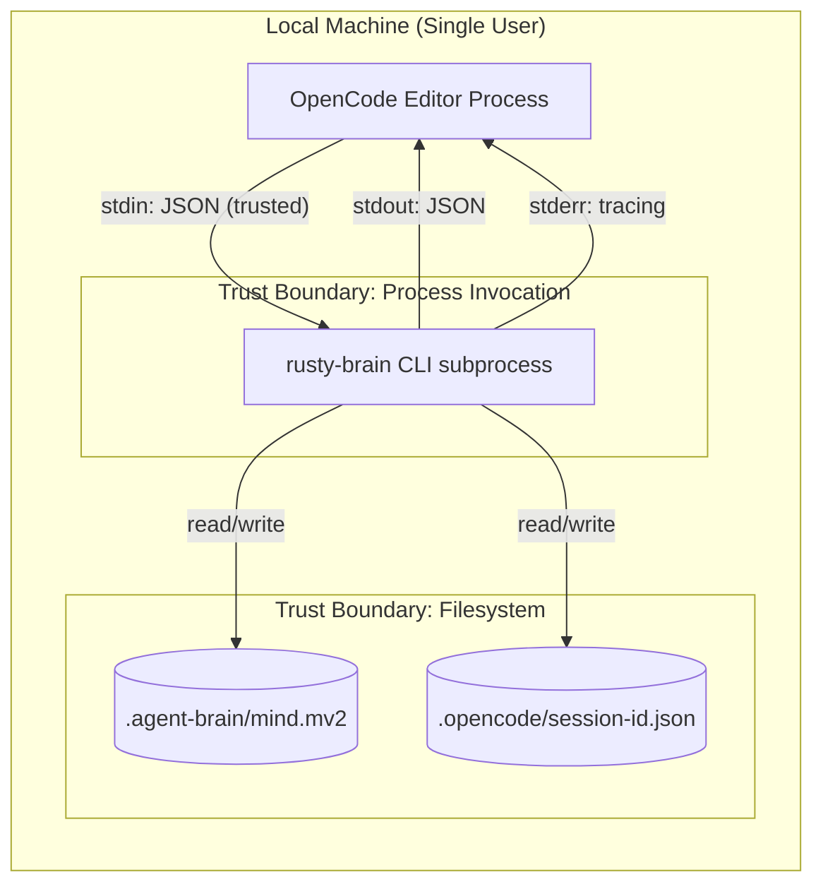
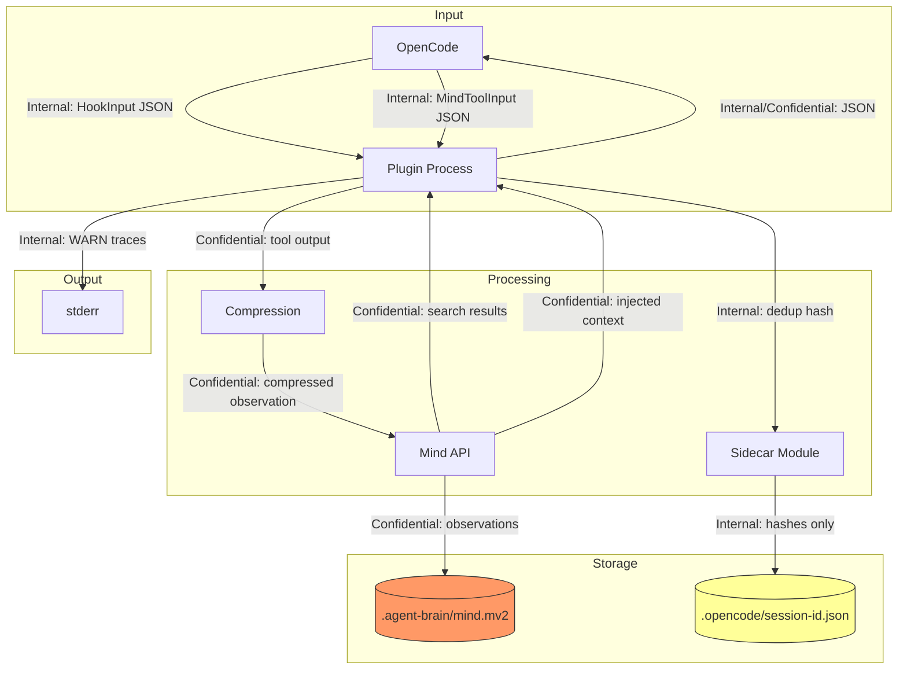
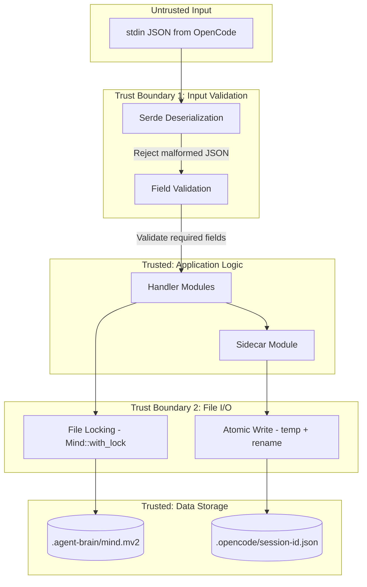

# 008-sec-opencode-plugin

> **Document Type:** Security Review (Lightweight)
> **Audience:** LLM agents, human reviewers
> **Status:** Draft
> **Last Updated:** 2026-03-03 <!-- @auto -->
> **Reviewer:** brianluby <!-- @human-required -->
> **Risk Level:** Low <!-- @human-required -->

---

## Review Tier Legend

| Marker | Tier | Speckit Behavior |
|--------|------|------------------|
| :red_circle: `@human-required` | Human Generated | Prompt human to author; blocks until complete |
| :yellow_circle: `@human-review` | LLM + Human Review | LLM drafts → prompt human to confirm/edit; blocks until confirmed |
| :green_circle: `@llm-autonomous` | LLM Autonomous | LLM completes; no prompt; logged for audit |
| :white_circle: `@auto` | Auto-generated | System fills (timestamps, links); no prompt |

---

## Severity Definitions

| Level | Label | Definition |
|-------|-------|------------|
| :red_circle: | **Critical** | Immediate exploitation risk; data breach or system compromise likely |
| :orange_circle: | **High** | Significant risk; exploitation possible with moderate effort |
| :yellow_circle: | **Medium** | Notable risk; exploitation requires specific conditions |
| :green_circle: | **Low** | Minor risk; limited impact or unlikely exploitation |

---

## Linkage :white_circle: `@auto`

| Document | ID | Relationship |
|----------|-----|--------------|
| Parent PRD | specs/008-opencode-plugin/prd.md | Feature being reviewed |
| Architecture Review | specs/008-opencode-plugin/ar.md | Technical implementation |

---

## Purpose

This is a **lightweight security review** intended to catch obvious security concerns early in the product lifecycle. It is NOT a comprehensive threat model. Full threat modeling should occur during implementation when infrastructure-as-code and concrete implementations exist.

**This review answers three questions:**
1. What does this feature expose to attackers?
2. What data does it touch, and how sensitive is that data?
3. What's the impact if something goes wrong?

**Scope of this review:**
- :white_check_mark: Attack surface identification
- :white_check_mark: Data classification
- :white_check_mark: High-level CIA assessment
- :x: Detailed threat enumeration (deferred to implementation)
- :x: Penetration testing (deferred to implementation)
- :x: Compliance audit (separate process)

---

## Feature Security Summary

### One-line Summary :red_circle: `@human-required`

> A local-only CLI plugin that reads/writes project memory files (`.mv2`) and session state files (`.json`) from the local filesystem, invoked as a subprocess by OpenCode with JSON stdin/stdout protocol — no network exposure, no authentication, no multi-user access.

### Risk Assessment :red_circle: `@human-required`

> **Risk Level:** Low
> **Justification:** Plugin operates entirely on the local filesystem with no network access, no remote APIs, no user authentication, and no multi-user scenarios. The primary risk is information disclosure through log output or file permission misconfigurations.

---

## Attack Surface Analysis

### Exposure Points :yellow_circle: `@human-review`

| Exposure Type | Details | Authentication | Authorization | Notes |
|---------------|---------|----------------|---------------|-------|
| Local Process stdin | JSON input from OpenCode parent process | No — trusted parent process | No — local user context | Input validated via serde deserialization; unknown fields ignored (M-7) |
| Local Process stdout | JSON output to OpenCode parent process | No | No | Output is structured JSON; no raw memory content at INFO level |
| Local Process stderr | Tracing diagnostics at WARN level | No | No | May contain error context; must not contain memory content |
| Filesystem Read | `.agent-brain/mind.mv2` memory file | No — filesystem permissions | OS-level file permissions | Shared across platforms (Claude Code, OpenCode) |
| Filesystem Write | `.agent-brain/mind.mv2` memory file | No — filesystem permissions | OS-level file permissions | Atomic writes via `Mind::with_lock` |
| Filesystem Read/Write | `.opencode/session-<id>.json` sidecar files | No — filesystem permissions | OS-level file permissions | Contains dedup hashes only, not raw content |

### Attack Surface Diagram :green_circle: `@llm-autonomous`

### Exposure Checklist :green_circle: `@llm-autonomous`

Quick validation of common exposure risks:

- [x] **Internet-facing endpoints require authentication** — N/A: No internet-facing endpoints
- [x] **No sensitive data in URL parameters** — N/A: No URLs; local process communication via stdin/stdout
- [x] **File uploads validated** — N/A: No file uploads; plugin reads/writes known file paths
- [x] **Rate limiting configured** — N/A: Local subprocess invoked by trusted parent process
- [x] **CORS policy is restrictive** — N/A: No HTTP endpoints
- [x] **No debug/admin endpoints exposed** — N/A: No endpoints; debug output goes to stderr only when --verbose enabled
- [x] **Webhooks validate signatures** — N/A: No webhooks

---

## Data Flow Analysis

### Data Inventory :yellow_circle: `@human-review`

| Data Element | PRD Entity | Classification | Source | Destination | Retention | Encrypted Rest | Encrypted Transit | Residency |
|--------------|------------|----------------|--------|-------------|-----------|----------------|-------------------|-----------|
| Plugin manifest | PLUGIN_MANIFEST | Public | Static file | OpenCode registry | Permanent | No | N/A (local file) | Local |
| Hook input JSON | HOOK_INPUT | Internal | OpenCode (stdin) | Plugin process memory | Transient (process lifetime) | No | N/A (pipe) | Local |
| Hook output JSON | HOOK_OUTPUT | Internal | Plugin process | OpenCode (stdout) | Transient (process lifetime) | No | N/A (pipe) | Local |
| Injected context | HOOK_OUTPUT.injected_context | Confidential | Memory file (.mv2) | OpenCode conversation context | Transient | No | N/A (pipe) | Local |
| Tool execution data | HOOK_INPUT.tool_response | Confidential | OpenCode agent | Plugin process, then compressed into .mv2 | Persistent (in .mv2) | No | N/A (pipe) | Local |
| Mind tool input | MIND_TOOL_INPUT | Internal | OpenCode (stdin) | Plugin process memory | Transient | No | N/A (pipe) | Local |
| Mind tool output | MIND_TOOL_OUTPUT | Confidential | Memory file (.mv2) | OpenCode (stdout) | Transient | No | N/A (pipe) | Local |
| Session state | SIDECAR_SESSION_STATE | Internal | Plugin process | .opencode/session-id.json | Session lifetime + 24h orphan window | No | N/A (local file) | Local |
| Dedup hashes | SIDECAR_SESSION_STATE.dedup_hashes | Internal | Plugin process | .opencode/session-id.json | Session lifetime + 24h | No | N/A (local file) | Local |
| Memory observations | Observation (from crates/types) | Confidential | Tool executions, user input | .agent-brain/mind.mv2 | Permanent | No | N/A (local file) | Local |
| Session summaries | SessionSummary (from crates/types) | Confidential | Plugin session cleanup | .agent-brain/mind.mv2 | Permanent | No | N/A (local file) | Local |
| Tracing diagnostics | stderr output | Internal | Plugin process | stderr (terminal/log) | Transient | No | N/A (pipe) | Local |

### Data Classification Reference :green_circle: `@llm-autonomous`

| Level | Label | Description | Examples | Handling Requirements |
|-------|-------|-------------|----------|----------------------|
| 1 | **Public** | No impact if disclosed | Plugin manifest, version info | No special handling |
| 2 | **Internal** | Minor impact if disclosed | Hook I/O metadata, dedup hashes, session state | Access controls, no public exposure |
| 3 | **Confidential** | Significant impact if disclosed | Memory observations (code snippets, decisions, file paths), injected context, search results | File permissions (0600), no logging at INFO+ |
| 4 | **Restricted** | Severe impact if disclosed | N/A for this feature | N/A |

### Data Flow Diagram :green_circle: `@llm-autonomous`

### Data Handling Checklist :green_circle: `@llm-autonomous`

- [x] **No Restricted data stored unless absolutely required** — No Restricted data in scope
- [ ] **Confidential data encrypted at rest** — Memory file (.mv2) is NOT encrypted at rest; acceptable for local-only tool (Constitution IX: local-only by default)
- [x] **All data encrypted in transit (TLS 1.2+)** — N/A: All data transfer is local (pipes, filesystem)
- [x] **PII has defined retention policy** — Memory observations are permanent; user controls deletion by removing .mv2 file
- [x] **Logs do not contain Confidential/Restricted data** — Constitution IX enforced: no memory content logged at INFO+; WARN traces contain error context only
- [x] **Secrets are not hardcoded** — Plugin does not handle secrets (API keys, tokens, passwords)
- [x] **Data minimization applied** — Dedup hashes (not raw content) in sidecar; observations compressed before storage
- [x] **Data residency requirements documented** — All data local to user's machine

---

## Third-Party & Supply Chain :yellow_circle: `@human-review`

### New External Services

| Service | Purpose | Data Shared | Communication | Approved? |
|---------|---------|-------------|---------------|-----------|
| **None** | Plugin has no external service dependencies | — | — | N/A |

### New Libraries/Dependencies

| Library | Version | License | Purpose | Security Check |
|---------|---------|---------|---------|----------------|
| **None anticipated** | — | — | AR specifies no new external crates; Vec-based LRU avoids `lru` crate | N/A |

Note: The AR explicitly decided against adding the `lru` crate, using a Vec-based LRU instead. All dependencies (`serde`, `serde_json`, `tracing`, `chrono`, etc.) are already approved workspace dependencies.

### Supply Chain Checklist

- [x] **All new services use encrypted communication** — N/A: No external services
- [x] **Service agreements/ToS reviewed** — N/A: No external services
- [x] **Dependencies have acceptable licenses** — All existing workspace deps are MIT/Apache
- [x] **Dependencies are actively maintained** — Existing deps verified in prior features
- [x] **No known critical vulnerabilities** — No new dependencies introduced

---

## CIA Impact Assessment

If this feature is compromised, what's the impact?

### Confidentiality :yellow_circle: `@human-review`

> **What could be disclosed?**

| Asset at Risk | Classification | Exposure Scenario | Impact | Likelihood |
|---------------|----------------|-------------------|--------|------------|
| Memory observations (code, decisions) | Confidential | File permission misconfiguration on .mv2 file allows other local users to read | Medium | Low |
| Injected context in stdout | Confidential | Parent process (OpenCode) logs stdout containing memory content | Low | Low |
| Tracing output on stderr | Internal | Verbose mode accidentally enabled in production; error messages leak observation metadata | Low | Low |
| Sidecar session state | Internal | File permission misconfiguration on .opencode/ directory | Low | Very Low |

**Confidentiality Risk Level:** Low

### Integrity :yellow_circle: `@human-review`

> **What could be modified or corrupted?**

| Asset at Risk | Modification Scenario | Impact | Likelihood |
|---------------|----------------------|--------|------------|
| Memory file (.mv2) | Concurrent write from OpenCode and Claude Code without proper locking | Medium | Low |
| Memory file (.mv2) | Sidecar corruption causes dedup failure; duplicate observations stored | Low | Low |
| Sidecar file | Crash during non-atomic write corrupts session state | Low | Low |
| Memory file (.mv2) | Malicious input via stdin causes unintended observation storage | Low | Very Low |

**Integrity Risk Level:** Low

### Availability :yellow_circle: `@human-review`

> **What could be disrupted?**

| Service/Function | Disruption Scenario | Impact | Likelihood |
|------------------|---------------------|--------|------------|
| OpenCode workflow | Plugin crash or hang blocks OpenCode's event processing | Medium | Low |
| Memory file access | File lock contention causes timeout; fail-open means context not injected | Low | Low |
| Sidecar I/O | Disk full prevents sidecar writes; dedup stops working for session | Low | Very Low |

**Availability Risk Level:** Low

### CIA Summary :green_circle: `@llm-autonomous`

| Dimension | Risk Level | Primary Concern | Mitigation Priority |
|-----------|------------|-----------------|---------------------|
| **Confidentiality** | Low | File permissions on .mv2 could expose project memory to other local users | Medium |
| **Integrity** | Low | Concurrent cross-platform writes without proper locking | Medium |
| **Availability** | Low | Plugin crash/hang blocking OpenCode | High (fail-open design addresses this) |

**Overall CIA Risk:** Low — Local-only plugin with no network exposure. Primary mitigations are file permissions (0600) and fail-open design to prevent workflow disruption.

---

## Trust Boundaries :yellow_circle: `@human-review`

Where does trust change in this feature?

**Key trust boundaries:**
1. **stdin deserialization** — Plugin trusts that OpenCode sends well-formed JSON, but serde deserialization rejects malformed input. Unknown fields are accepted (M-7 forward compatibility) but never acted upon.
2. **Filesystem I/O** — Plugin trusts file integrity via `Mind::with_lock` (cross-process locking) and atomic writes for sidecar files. Corrupted sidecar files are deleted and recreated.

### Trust Boundary Checklist :green_circle: `@llm-autonomous`

- [x] **All input from untrusted sources is validated** — stdin JSON parsed via serde with type validation; malformed input returns error or fails-open
- [x] **External API responses are validated** — N/A: No external APIs
- [x] **Authorization checked at data access, not just entry point** — N/A: Single-user local tool; OS file permissions provide authorization
- [x] **Service-to-service calls are authenticated** — N/A: No service-to-service calls

---

## Known Risks & Mitigations :yellow_circle: `@human-review`

| ID | Risk Description | Severity | Mitigation | Status | Owner |
|----|------------------|----------|------------|--------|-------|
| R1 | Memory file (.mv2) readable by other local users if permissions are too permissive | :yellow_circle: Medium | Sidecar files created with 0600 permissions; .mv2 permissions inherited from `crates/core` (already 0600) | Mitigated | Implementation |
| R2 | Fail-open design silently suppresses security-relevant errors (e.g., permission denied on memory file) | :yellow_circle: Medium | All fail-open errors emit WARN-level tracing to stderr; CI tests verify WARN output for all error paths | Mitigated | Implementation |
| R3 | Forward compatibility (no deny_unknown_fields) could allow injection of unexpected data into processing | :green_circle: Low | Unknown fields are deserialized but never accessed; handlers only use explicitly typed fields | Mitigated | Implementation |
| R4 | Verbose/debug mode could log Confidential memory content | :green_circle: Low | Constitution IX enforced: no memory content at INFO+; code review checklist includes log audit | Mitigated | Code Review |
| R5 | Concurrent OpenCode + Claude Code sessions could cause file contention | :green_circle: Low | Mind::with_lock provides exponential backoff; fail-open on lock timeout | Mitigated | Implementation |

### Risk Acceptance :red_circle: `@human-required`

| Risk ID | Accepted By | Date | Justification | Review Date |
|---------|-------------|------|---------------|-------------|
| R1 | brianluby | YYYY-MM-DD | Local-only tool; OS-level file permissions are the appropriate control | YYYY-MM-DD |
| R2 | brianluby | YYYY-MM-DD | Fail-open is the correct trade-off for a developer tool — workflow disruption is worse than suppressed errors | YYYY-MM-DD |

---

## Security Requirements :yellow_circle: `@human-review`

Based on this review, the implementation MUST satisfy:

### Authentication & Authorization

| Req ID | Requirement | PRD AC | Verification Method |
|--------|-------------|--------|---------------------|
| SEC-1 | N/A — local-only tool with no authentication requirements | — | — |

### Data Protection

| Req ID | Requirement | PRD AC | Verification Method |
|--------|-------------|--------|---------------------|
| SEC-2 | Sidecar files (.opencode/session-*.json) MUST be created with 0600 permissions | AC-6, AC-17 | Unit Test |
| SEC-3 | Memory content (observations, search results, context) MUST NOT be logged at INFO level or above | AC-3, AC-7 | Unit Test + Code Review |
| SEC-4 | Sidecar files MUST contain only dedup hashes, NOT raw observation content | AC-6 | Unit Test |
| SEC-5 | The plugin MUST NOT store, log, or transmit API keys, tokens, or secrets found in tool output | AC-5 | Code Review |

### Input Validation

| Req ID | Requirement | PRD AC | Verification Method |
|--------|-------------|--------|---------------------|
| SEC-6 | All stdin JSON input MUST be validated via serde deserialization with typed structs (reject malformed JSON) | AC-1, AC-5, AC-9 | Unit Test |
| SEC-7 | Input deserialization MUST NOT use deny_unknown_fields (forward compatibility per M-7), but unknown fields MUST NOT influence processing logic | AC-1, AC-5 | Unit Test |
| SEC-8 | Mind tool mode parameter MUST be validated against a fixed whitelist (search, ask, recent, stats, remember) | AC-9..AC-13 | Unit Test |
| SEC-9 | File paths resolved via resolve_memory_path MUST be validated to stay within the project directory (path traversal prevention) | AC-18 | Unit Test (already enforced by crates/platforms) |

### Operational Security

| Req ID | Requirement | PRD AC | Verification Method |
|--------|-------------|--------|---------------------|
| SEC-10 | Fail-open error handling MUST emit WARN-level tracing for all suppressed errors (no silent failures per Constitution XI) | AC-3, AC-7 | Integration Test |
| SEC-11 | Sidecar atomic writes MUST use temp file + rename to prevent corruption on crash | AC-6 | Unit Test |
| SEC-12 | Orphan cleanup MUST only delete files matching the sidecar naming pattern (session-*.json) in the .opencode/ directory — no recursive deletion | AC-17 | Unit Test |

---

## Compliance Considerations :yellow_circle: `@human-review`

| Regulation | Applicable? | Relevant Requirements | N/A Justification |
|------------|-------------|----------------------|-------------------|
| GDPR | N/A | — | Local-only tool; no personal data collection, no data transmission, no data processing on behalf of others. User controls all data on their own machine. |
| CCPA | N/A | — | No consumer data collection or sale; local developer tool only |
| SOC 2 | N/A | — | Not a SaaS service; local CLI tool with no multi-tenant concerns |
| HIPAA | N/A | — | No health data processing |
| PCI-DSS | N/A | — | No payment data processing |
| Other | N/A | — | No regulatory framework applies to a local-only developer CLI tool |

---

## Review Findings

### Issues Identified :yellow_circle: `@human-review`

| ID | Finding | Severity | Category | Recommendation | Status |
|----|---------|----------|----------|----------------|--------|
| F1 | Memory file (.mv2) is not encrypted at rest | :green_circle: Low | Data | Acceptable for local-only tool; document that users should rely on full-disk encryption for sensitive projects | Open |
| F2 | Fail-open design means security errors (e.g., permission denied) are suppressed from user view | :green_circle: Low | CIA | WARN-level tracing ensures errors are diagnosable; consider adding a `--strict` mode in future that fails-closed for security-sensitive environments | Open |
| F3 | No mechanism to exclude sensitive files/patterns from observation capture | :green_circle: Low | Data | Tool output compression already reduces content, but credentials in tool output could be stored. Recommend future `.rusty-brain-ignore` pattern file | Open |

### Positive Observations :green_circle: `@llm-autonomous`

- Fail-open design (PRD M-5) ensures the plugin never blocks the developer's workflow, which is the correct security/usability trade-off for a local developer tool
- Constitution IX (no logging memory content at INFO+) provides a clear, enforceable rule against information disclosure via logs
- Sidecar files store only dedup hashes (not raw content), minimizing data sensitivity of the session state
- File locking via `Mind::with_lock` with exponential backoff prevents race conditions and data corruption
- Forward compatibility (M-7) is implemented safely — unknown fields are accepted but never processed
- Atomic writes for sidecar files prevent corruption on crash
- No network access eliminates the entire class of network-based attacks
- Path traversal prevention is already enforced by `crates/platforms::resolve_memory_path`

---

## Open Questions :yellow_circle: `@human-review`

- [ ] **Q1:** Should the plugin support a `.rusty-brain-ignore` file to exclude sensitive file patterns from observation capture? (Deferred to future feature)
- [ ] **Q2:** Should sidecar file permissions be verified on read (not just set on create) to detect permission changes? (Low priority — local-only tool)

---

## Changelog :white_circle: `@auto`

| Version | Date | Author | Changes |
|---------|------|--------|---------|
| 0.1 | 2026-03-03 | Claude (LLM) | Initial review from PRD + AR |

---

## Review Sign-off :red_circle: `@human-required`

| Role | Name | Date | Decision |
|------|------|------|----------|
| Security Reviewer | brianluby | YYYY-MM-DD | [Approved / Approved with conditions / Rejected] |
| Feature Owner | brianluby | YYYY-MM-DD | [Acknowledged] |

### Conditions for Approval (if applicable) :red_circle: `@human-required`

- [ ] Verify sidecar files are created with 0600 permissions (SEC-2)
- [ ] Verify no memory content logged at INFO+ (SEC-3) via code review

---

## Security Requirements Traceability :green_circle: `@llm-autonomous`

| SEC Req ID | PRD Req ID | PRD AC ID | Test Type | Test Location |
|------------|------------|-----------|-----------|---------------|
| SEC-2 | M-4 | AC-6, AC-17 | Unit | crates/opencode/tests/sidecar_test.rs |
| SEC-3 | M-5 | AC-3, AC-7 | Unit + Code Review | crates/opencode/tests/logging_test.rs |
| SEC-4 | M-4 | AC-6 | Unit | crates/opencode/tests/sidecar_test.rs |
| SEC-5 | M-2 | AC-5 | Code Review | Manual audit |
| SEC-6 | M-1, M-2, M-3 | AC-1, AC-5, AC-9 | Unit | crates/opencode/tests/chat_hook_test.rs, tool_hook_test.rs, mind_tool_test.rs |
| SEC-7 | M-7 | AC-1, AC-5 | Unit | crates/opencode/tests/chat_hook_test.rs, tool_hook_test.rs, mind_tool_test.rs |
| SEC-8 | M-3 | AC-9..AC-13 | Unit | crates/opencode/tests/mind_tool_test.rs |
| SEC-9 | M-6 | AC-18 | Unit | crates/platforms/tests/ (existing) |
| SEC-10 | M-5 | AC-3, AC-7 | Integration | crates/opencode/tests/failopen_test.rs |
| SEC-11 | M-4 | AC-6 | Unit | crates/opencode/tests/sidecar_test.rs |
| SEC-12 | S-2 | AC-17 | Unit | crates/opencode/tests/sidecar_test.rs |

---

## Review Checklist :green_circle: `@llm-autonomous`

Before marking as Approved:
- [x] Attack surface documented with auth/authz status for each exposure
- [x] Exposure Points table has no contradictory rows
- [x] All PRD Data Model entities appear in Data Inventory (PLUGIN_MANIFEST, SIDECAR_SESSION_STATE, HOOK_INPUT, HOOK_OUTPUT, MIND_TOOL_INPUT, MIND_TOOL_OUTPUT + derived entities)
- [x] All data elements are classified using the 4-tier model
- [x] Third-party dependencies and services are listed (none new)
- [x] CIA impact is assessed with Low/Medium/High ratings
- [x] Trust boundaries are identified
- [x] Security requirements have verification methods specified
- [x] Security requirements trace to PRD ACs where applicable
- [x] No Critical/High findings remain Open
- [x] Compliance N/A items have justification
- [ ] Risk acceptance has named approver and review date (pending human sign-off)

---

## Security Review Actions

**Overall Risk Level**: Low

### Required Actions (based on risk level):

**All Risk Levels:**
- [ ] Feature Security Summary (@human-required) - Validate risk assessment
- [ ] Risk Acceptance (@human-required) - Sign off on accepted risks
- [ ] Review Sign-off (@human-required) - Final approval

**Medium+ Risk:**
- N/A — Risk level is Low. No additional review actions required beyond standard sign-off.
