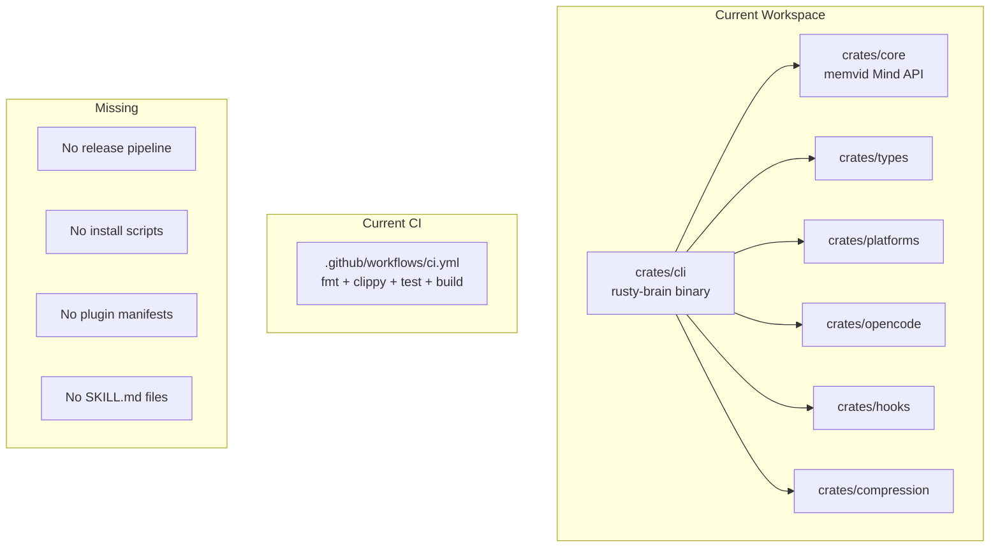
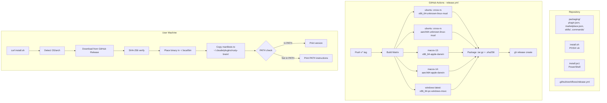
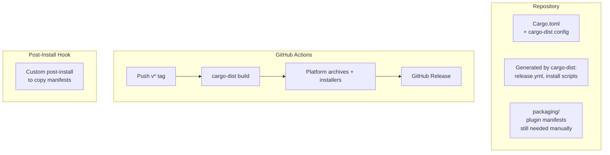
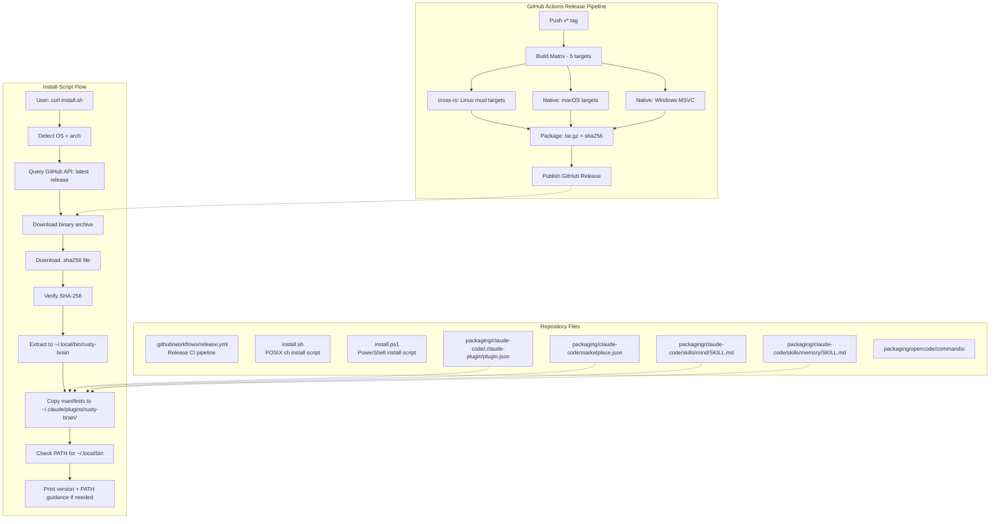
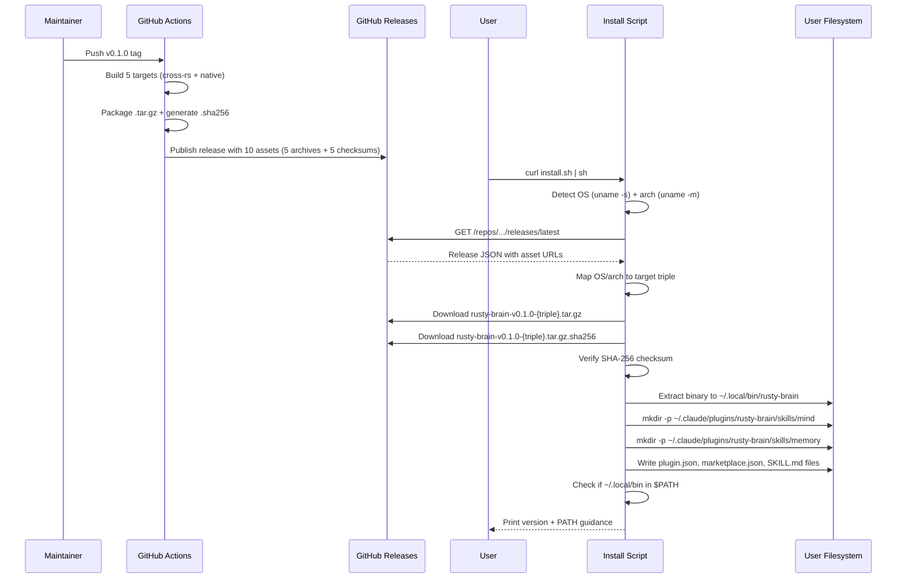
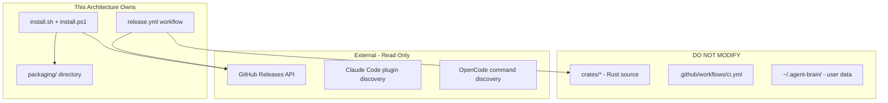

# 009-ar-plugin-packaging

> **Document Type:** Architecture Review
> **Audience:** LLM agents, human reviewers
> **Status:** Proposed
> **Last Updated:** 2026-03-04 <!-- @auto -->
> **Owner:** Brian Luby <!-- @human-required -->
> **Deciders:** Brian Luby <!-- @human-required -->

---

## Review Tier Legend

| Marker | Tier | Speckit Behavior |
|--------|------|------------------|
| `@human-required` | Human Generated | Prompt human to author; blocks until complete |
| `@human-review` | LLM + Human Review | LLM drafts; prompt human to confirm/edit; blocks until confirmed |
| `@llm-autonomous` | LLM Autonomous | LLM completes; no prompt; logged for audit |
| `@auto` | Auto-generated | System fills (timestamps, links); no prompt |

---

## Document Completion Order

> Complete sections in this order. Do not fill downstream sections until upstream human-required inputs exist.

1. **Summary (Decision)** -> requires human input first
2. **Context (Problem Space)** -> requires human input
3. **Decision Drivers** -> requires human input (prioritized)
4. **Driving Requirements** -> extract from PRD, human confirms
5. **Options Considered** -> LLM drafts after drivers exist, human reviews
6. **Decision (Selected + Rationale)** -> requires human decision
7. **Implementation Guardrails** -> LLM drafts, human reviews
8. **Everything else** -> can proceed after decision is made

---

## Linkage `@auto`

| Document | ID | Relationship |
|----------|-----|--------------|
| Parent PRD | 009-prd-plugin-packaging.md | Requirements this architecture satisfies |
| Security Review | 009-sec-plugin-packaging.md | Security implications of this decision |
| Feature Spec | specs/009-plugin-packaging/spec.md | Source specification with clarifications |
| Supersedes | — | N/A (new feature) |
| Superseded By | — | — |

---

## Summary

### Decision `@human-required`
> Add a GitHub Actions release workflow and repository-embedded install scripts that build cross-platform binaries, package them with SHA-256 checksums, and install the binary plus Claude Code plugin manifests to well-known paths (`~/.local/bin` and `~/.claude/plugins/rusty-brain/`).

### TL;DR for Agents `@human-review`
> This architecture adds a release pipeline (GitHub Actions) and install scripts (POSIX sh + PowerShell) alongside the existing workspace. No Rust code changes are needed — the binary is already built by `crates/cli`. The install script downloads a pre-built binary, verifies its SHA-256 checksum, places it in `~/.local/bin`, and copies plugin manifests to `~/.claude/plugins/rusty-brain/`. Do NOT modify shell config files or add auto-update logic. All new files are scripts, YAML workflows, and JSON/Markdown manifests — no new Rust crates.

---

## Context

### Problem Space `@human-required`
The rusty-brain workspace produces a single binary (`rusty-brain` from `crates/cli`) but has no mechanism to deliver it to users. The existing CI (`ci.yml`) runs fmt/clippy/test/build but never publishes artifacts. Users must clone the repo and compile from source. Additionally, no plugin manifests or skill definitions exist, so even a manually compiled binary cannot integrate with Claude Code or OpenCode. The architectural challenge is: how do we add a release pipeline, install scripts, and plugin manifests with minimal changes to the existing Rust workspace while supporting 5 platform targets?

### Decision Scope `@human-review`

**This AR decides:**
- How release binaries are built, packaged, and published (CI pipeline architecture)
- How install scripts discover, download, verify, and place binaries
- How plugin manifests and skill definitions are structured and installed
- Where new files (scripts, workflows, manifests) live in the repository

**This AR does NOT decide:**
- Changes to the Rust codebase or workspace crate structure (no Rust code changes needed)
- npm wrapper or crates.io publication strategy (Could Have, deferred to separate AR if pursued)
- Code signing or notarization approach (explicitly out of scope per PRD W-3, W-4)
- Auto-update mechanism (explicitly out of scope per PRD W-1)

### Current State `@llm-autonomous`



The binary `rusty-brain` is already produced by `crates/cli` with clap 4 subcommand dispatch. CI runs on `ubuntu-latest` only and does not produce release artifacts.

### Driving Requirements `@human-review`

| PRD Req ID | Requirement Summary | Architectural Implication |
|------------|---------------------|---------------------------|
| M-1 | Plugin manifests at `~/.claude/plugins/rusty-brain/` | Need `plugin.json`, `marketplace.json` templates in repo; install script copies them |
| M-2 | SKILL.md files for mind and memory skills | Need `skills/` directory structure in repo; install script copies to plugin dir |
| M-3 | Pre-compiled binaries for 5 targets | Need cross-compilation CI matrix with GitHub Actions |
| M-4 | Asset naming `rusty-brain-v{ver}-{triple}.tar.gz` + `.sha256` | Need packaging step in CI; SHA-256 generation |
| M-5 | `install.sh` for macOS/Linux | POSIX sh script in repo root; platform detection + download + verify + install |
| M-6 | `install.ps1` for Windows | PowerShell script in repo root; same flow as install.sh |
| M-7 | Upgrade without data loss | Install script must only replace binary and manifests, never touch `~/.agent-brain/` |
| M-8 | Manifests reference Rust binary | Plugin manifests must use `~/.local/bin/rusty-brain` as binary path |
| M-9 | Static linking (musl for Linux) | CI must use musl target for Linux; macOS/Windows use native toolchains |
| M-10 | Clear error messages | Install script error handling design |
| M-11 | Print PATH instructions, no auto-modify | Install script must check PATH, print guidance only |
| S-1 | OpenCode command definitions | Need `commands/` directory with command configs in repo |
| S-2 | Automated CI release on tag | GitHub Actions workflow triggered by version tags |
| S-3 | Install script at raw GitHub URL | Scripts must live at predictable repo paths |

**PRD Constraints inherited:**
- Rust stable, edition 2024, MSRV 1.85.0
- memvid-core pinned at git rev `fbddef4`
- `install.sh` must be POSIX sh compatible
- Linux targets use musl static linking
- macOS minimum 11.0 (Big Sur)
- Windows uses MSVC toolchain

---

## Decision Drivers `@human-required`

1. **Simplicity:** Minimize new moving parts; no new Rust crates, no external services beyond GitHub *(traces to PRD constraint: existing workspace structure)*
2. **Cross-platform reliability:** All 5 targets must produce working binaries from CI *(traces to PRD M-3, M-9)*
3. **Install experience:** Single command, checksum-verified, clear errors *(traces to PRD M-5, M-6, M-8, M-10)*
4. **Maintainability:** CI workflow and scripts should be straightforward to update when adding targets or changing paths *(traces to PRD S-2)*
5. **Security:** HTTPS-only downloads, checksum verification before any binary placement *(traces to PRD M-4, M-8)*

---

## Options Considered `@human-review`

### Option 0: Status Quo / Do Nothing

**Description:** Keep the existing CI (`ci.yml`) as-is. Users compile from source. No install scripts, no plugin manifests.

| Driver | Rating | Notes |
|--------|--------|-------|
| Simplicity | ✅ Good | No changes needed |
| Cross-platform reliability | ❌ Poor | Users must have Rust toolchain; musl/cross-compile is their problem |
| Install experience | ❌ Poor | No install path exists at all |
| Maintainability | ✅ Good | Nothing to maintain |
| Security | ⚠️ Medium | Users build from source (trustworthy) but no checksum verification for pre-builts |

**Why not viable:** Completely fails the core mission (PRD M-1 through M-11). The feature exists specifically to solve this gap.

---

### Option 1: GitHub Actions + cross-rs (Custom Scripts)

**Description:** Add a `release.yml` GitHub Actions workflow that uses `cross-rs` for Linux cross-compilation and native runners for macOS/Windows. Custom `install.sh` and `install.ps1` scripts in the repo handle download, verification, and installation. Plugin manifests and skill definitions are stored in a `packaging/` directory in the repo and copied by the install script.



| Driver | Rating | Notes |
|--------|--------|-------|
| Simplicity | ✅ Good | One new workflow + two scripts + static files; no new crates |
| Cross-platform reliability | ✅ Good | cross-rs is battle-tested for Linux; native runners for macOS/Windows |
| Install experience | ✅ Good | Full control over UX; matches rustup pattern |
| Maintainability | ✅ Good | Standard GitHub Actions patterns; scripts are self-contained |
| Security | ✅ Good | HTTPS enforced; SHA-256 per asset; no eval in scripts |

**Pros:**
- Full control over install script behavior and error messages
- cross-rs handles Docker-based cross-compilation for Linux musl targets
- Native macOS/Windows builds on GitHub-provided runners (no cross-compilation needed)
- Plugin manifests are plain files in the repo; easy to update
- Matches patterns used by ripgrep, bat, delta, and similar Rust CLI tools

**Cons:**
- Must maintain custom install scripts (but they're small ~200 lines each)
- cross-rs adds Docker overhead for Linux builds (acceptable for CI)
- Two separate scripts (sh + ps1) to maintain

---

### Option 2: cargo-dist (Automated Release Tooling)

**Description:** Use `cargo-dist` to generate CI workflows and install scripts automatically from `Cargo.toml` configuration. cargo-dist produces platform-specific installers and manages the release process.



| Driver | Rating | Notes |
|--------|--------|-------|
| Simplicity | ⚠️ Medium | cargo-dist abstracts CI but adds its own config complexity; post-install hooks needed for manifests |
| Cross-platform reliability | ✅ Good | Handles cross-compilation and runner selection automatically |
| Install experience | ⚠️ Medium | Generated install scripts are less customizable; plugin manifest copying requires post-install hook |
| Maintainability | ⚠️ Medium | cargo-dist config is another abstraction to learn; generated files may conflict with custom needs |
| Security | ✅ Good | Same HTTPS + checksum approach |

**Pros:**
- Less boilerplate to write initially
- Automatically generates CI workflow and install scripts
- Handles platform detection and archive creation
- Growing Rust ecosystem adoption

**Cons:**
- Generated install scripts don't support custom post-install steps (plugin manifest copying) natively — requires hooks
- Less control over error messages and UX of install scripts
- Generated CI workflow may conflict with existing `ci.yml` patterns
- Another tool dependency to keep updated
- Plugin manifest installation requires custom post-install script anyway, negating much of the automation benefit

---

## Decision

### Selected Option `@human-required`
> **Option 1: GitHub Actions + cross-rs (Custom Scripts)**

### Rationale `@human-required`

Option 1 provides full control over the install experience, which is critical for this feature. The install script must handle not just binary placement but also plugin manifest installation to `~/.claude/plugins/rusty-brain/` — a requirement cargo-dist doesn't natively support. The custom scripts (~200 lines each) are a small maintenance burden compared to the flexibility gained. The pattern is well-established in the Rust CLI ecosystem (ripgrep, bat, delta all use similar approaches).

Option 2 (cargo-dist) would reduce initial boilerplate but introduces an abstraction layer that doesn't support our primary differentiator (plugin manifest installation). We'd end up writing custom post-install scripts anyway, negating cargo-dist's main value proposition.

#### Simplest Implementation Comparison `@human-review`

| Aspect | Simplest Possible | Selected Option | Justification for Complexity |
|--------|-------------------|-----------------|------------------------------|
| CI | Single-platform build, manual upload | 5-target matrix with auto-publish | PRD M-3 requires 5 targets; PRD S-2 requires automation |
| Install | Direct binary download link in README | Platform-detecting install.sh + install.ps1 | PRD M-5, M-6 require platform detection and checksum verification |
| Plugin setup | Manual: "copy these files to ~/.claude/plugins/" | Install script auto-copies manifests | PRD M-1 requires plugin discovery without manual config |
| Checksums | None (trust HTTPS) | SHA-256 sidecar per asset | PRD M-4 explicitly requires checksum verification |
| PATH handling | "Add to PATH yourself" | Detect and print instructions | PRD M-11 requires detection + guidance |

**Complexity justified by:** Every complexity addition is directly required by a Must Have PRD requirement. The simplest possible approach (manual download + manual setup) would fail M-1, M-3, M-4, M-5, M-6, and M-11.

### Architecture Diagram `@human-review`



---

## Technical Specification

### Component Overview `@human-review`

| Component | Responsibility | Interface | Dependencies |
|-----------|---------------|-----------|--------------|
| Release Pipeline | Build 5-target binaries, package, publish to GitHub Releases | GitHub Actions workflow (tag trigger) | cross-rs, Rust toolchain, GitHub Releases API |
| Install Script (sh) | Download, verify, install binary + manifests on macOS/Linux | POSIX sh script via `curl \| sh` | curl/wget, sha256sum/shasum, GitHub Releases API |
| Install Script (ps1) | Download, verify, install binary + manifests on Windows | PowerShell script | Invoke-WebRequest, Get-FileHash, GitHub Releases API |
| Plugin Manifests | Register rusty-brain as Claude Code plugin | JSON files at `~/.claude/plugins/rusty-brain/` | Claude Code plugin discovery |
| Skill Definitions | Define mind and memory skills for Claude Code | SKILL.md files in plugin `skills/` dir | Claude Code skill loading |
| Command Definitions | Register OpenCode slash commands | Config files in user's OpenCode commands dir | OpenCode command discovery |

### Data Flow `@llm-autonomous`



### Interface Definitions `@human-review`

```json
// packaging/claude-code/plugin.json
{
  "name": "rusty-brain",
  "version": "{VERSION}",
  "description": "AI memory system powered by memvid",
  "binary": "{HOME}/.local/bin/rusty-brain",
  "skills": [
    "skills/mind/SKILL.md",
    "skills/memory/SKILL.md"
  ]
}

// Release asset naming (contract)
// Archive:  rusty-brain-v{version}-{target-triple}.tar.gz
// Checksum: rusty-brain-v{version}-{target-triple}.tar.gz.sha256
//
// Target triples:
//   x86_64-unknown-linux-musl
//   aarch64-unknown-linux-musl
//   x86_64-apple-darwin
//   aarch64-apple-darwin
//   x86_64-pc-windows-msvc

// GitHub Actions build matrix (release.yml)
// matrix.include:
//   - target: x86_64-unknown-linux-musl,   os: ubuntu-24.04, use_cross: true
//   - target: aarch64-unknown-linux-musl,   os: ubuntu-24.04, use_cross: true
//   - target: x86_64-apple-darwin,          os: macos-13,      use_cross: false
//   - target: aarch64-apple-darwin,         os: macos-14,      use_cross: false
//   - target: x86_64-pc-windows-msvc,       os: windows-latest, use_cross: false
```

### Key Algorithms/Patterns `@human-review`

**Pattern:** Platform Detection (install.sh)
```
1. OS = uname -s (Darwin, Linux)
2. ARCH = uname -m (x86_64, aarch64, arm64)
3. Normalize: arm64 -> aarch64
4. Map to target triple: {ARCH}-{os_suffix}
   - Darwin -> apple-darwin
   - Linux  -> unknown-linux-musl
5. If no match -> error with supported platforms list
```

**Pattern:** Checksum Verification (install.sh)
```
1. Download archive to temp dir
2. Download .sha256 sidecar to temp dir
3. Compute SHA-256 of downloaded archive (sha256sum or shasum -a 256)
4. Compare computed hash with content of .sha256 file
5. If mismatch -> delete temp files, exit with error
6. If match -> proceed to extract and install
```

**Pattern:** Upgrade Safety
```
1. Check if ~/.local/bin/rusty-brain exists
2. If exists: note current version (rusty-brain --version)
3. Download and verify new binary to temp location
4. Replace binary atomically (mv from temp to target)
5. Never touch ~/.agent-brain/ directory (memory files preserved)
6. Print upgrade summary: old version -> new version
```

---

## Constraints & Boundaries

### Technical Constraints `@human-review`

**Inherited from PRD:**
- Rust stable, edition 2024, MSRV 1.85.0
- memvid-core pinned at git rev `fbddef4`
- `install.sh` must be POSIX sh compatible (no bashisms)
- Linux targets use musl for static linking
- macOS minimum 11.0 (Big Sur); `MACOSX_DEPLOYMENT_TARGET=11.0`
- Windows uses MSVC toolchain
- No automatic shell config modification

**Added by this Architecture:**
- Linux target triples use `musl` suffix (not `gnu`): `x86_64-unknown-linux-musl`, `aarch64-unknown-linux-musl`
- cross-rs is used only for Linux targets; macOS and Windows use native compilation on GitHub-provided runners
- Plugin manifests are embedded in the install script as heredocs (not downloaded separately) to avoid extra network requests
- Install scripts use a temp directory for downloads; cleanup on failure is mandatory
- Release workflow uses pinned action versions (SHA, not tags) for supply chain security

### Architectural Boundaries `@human-review`



- **Owns:** `release.yml`, `install.sh`, `install.ps1`, `packaging/` directory
- **Interfaces With:** GitHub Releases API (publish + download), Claude Code plugin discovery, OpenCode command discovery
- **Must Not Touch:** Rust workspace source code, existing `ci.yml`, user memory files (`~/.agent-brain/`)

### Implementation Guardrails `@human-review`

> **Critical for LLM Agents:**

- [ ] **DO NOT** add new Rust crates or modify `Cargo.toml` workspace members *(no Rust code changes needed)*
- [ ] **DO NOT** modify `crates/cli/` or any existing Rust source files
- [ ] **DO NOT** modify `.github/workflows/ci.yml` *(add new `release.yml` alongside it)*
- [ ] **DO NOT** use bash-specific syntax in `install.sh` *(must be POSIX sh; PRD constraint)*
- [ ] **DO NOT** use `eval`, backtick command substitution, or indirect execution in install scripts *(security)*
- [ ] **DO NOT** modify shell config files (`.bashrc`, `.zshrc`, `.profile`) *(PRD M-11)*
- [ ] **DO NOT** touch `~/.agent-brain/` or any `.mv2` files during install/upgrade *(PRD M-7)*
- [ ] **MUST** use pinned action SHAs (not tags) in GitHub Actions workflow *(supply chain security)*
- [ ] **MUST** verify SHA-256 checksum before placing binary on disk *(PRD M-4, M-8)*
- [ ] **MUST** enforce HTTPS for all downloads *(security)*
- [ ] **MUST** clean up temp files on failure (trap handler) *(PRD M-10)*
- [ ] **MUST** use `MACOSX_DEPLOYMENT_TARGET=11.0` for macOS builds *(PRD constraint)*
- [ ] **MUST** use `--target` flag with musl triples for Linux builds via cross-rs *(PRD M-9)*

---

## Consequences `@human-review`

### Positive
- Users can install rusty-brain in under 60 seconds with a single command on any of 5 supported platforms
- Claude Code discovers the plugin automatically after installation — zero manual config
- Existing users' memory files are never at risk during upgrade
- The approach is proven by dozens of Rust CLI projects (ripgrep, bat, delta, fd)
- No changes to the Rust workspace — clean separation between code and distribution

### Negative
- Two install scripts (sh + ps1) to maintain — changes must be kept in sync
- cross-rs adds Docker-based build overhead for Linux targets (acceptable for CI, ~5-10 min added)
- Plugin manifest format is based on current Claude Code conventions; if conventions change, manifests need updating
- No auto-update; users must re-run the install script to upgrade

### Risks & Mitigations

| Risk | Likelihood | Impact | Mitigation |
|------|------------|--------|------------|
| musl static linking fails with memvid-core C dependencies | Low | High | Spike-1 (PRD): test musl build with memvid round-trip; fallback to glibc with documented caveat |
| Claude Code plugin discovery convention changes | Med | High | Pin to known format; spike-test with minimal plugin before full implementation |
| cross-rs version incompatibility with workspace | Low | Med | Pin cross-rs version in workflow; test in CI before release |
| Install script PATH detection fails on exotic shells | Low | Low | Detect via `echo $PATH` check; gracefully fallback to always printing instructions |
| GitHub API rate limiting blocks install script | Low | Low | Use unauthenticated API (60 req/hr); document `GITHUB_TOKEN` env var for CI usage |

---

## Implementation Guidance

### Suggested Implementation Order `@llm-autonomous`

1. **Plugin manifests and skill definitions** — Create `packaging/` directory with `plugin.json`, `marketplace.json`, SKILL.md files, and OpenCode command definitions. These are static files that can be validated immediately.
2. **Release workflow** — Create `.github/workflows/release.yml` with 5-target build matrix. Test by pushing a `v0.0.1-test` tag.
3. **Install script (sh)** — Write `install.sh` with platform detection, download, SHA-256 verification, binary placement, and manifest installation. Test on macOS and Linux.
4. **Install script (ps1)** — Write `install.ps1` with equivalent Windows logic.
5. **Integration test** — Tag a release, run install script on each platform, verify `rusty-brain --version` and Claude Code plugin discovery.

### Testing Strategy `@llm-autonomous`

| Layer | Test Type | Coverage Target | Notes |
|-------|-----------|-----------------|-------|
| Install script (sh) | Unit (shellcheck + bats) | All functions | Use `bats` test framework for sh scripts; shellcheck for lint |
| Install script (ps1) | Unit (Pester) | All functions | Use Pester framework for PowerShell testing |
| Release pipeline | Integration | All 5 targets | Push test tag; verify all assets published |
| Binary smoke test | E2E per platform | `--version` on each target | Run in CI matrix after build |
| Plugin discovery | E2E | Claude Code sees skills | Manual test + Spike-3 from PRD |
| Checksum verification | Unit | Valid + corrupted cases | Test both pass and fail paths |
| Upgrade safety | Integration | Binary replaced, .mv2 untouched | Install, create .mv2, upgrade, verify .mv2 intact |

### Reference Implementations `@human-review`

- [rustup install script](https://github.com/rust-lang/rustup/blob/master/rustup-init.sh) — POSIX sh, platform detection, PATH guidance *(external, established pattern)*
- [starship install script](https://github.com/starship/starship/blob/master/install/install.sh) — Simpler example of the same pattern *(external)*
- [ripgrep CI workflow](https://github.com/BurntSushi/ripgrep/blob/master/.github/workflows/release.yml) — GitHub Actions cross-platform release *(external)*

### Anti-patterns to Avoid `@human-review`

- **Don't:** Hardcode version numbers in install scripts
  - **Why:** Scripts become stale; every release requires script updates
  - **Instead:** Query GitHub API for latest release at runtime

- **Don't:** Bundle all platform binaries into a single archive
  - **Why:** Users download ~5x the data they need
  - **Instead:** Per-platform archives; install script picks the right one

- **Don't:** Use `cargo-dist` for the initial implementation
  - **Why:** It doesn't support custom post-install steps (plugin manifest copying); we'd need custom scripts anyway
  - **Instead:** Custom scripts with full control; evaluate cargo-dist for future simplification

- **Don't:** Download plugin manifests separately from a different URL
  - **Why:** Extra network request, extra failure point
  - **Instead:** Embed manifests in the install script as heredocs or include them in the binary archive

---

## Compliance & Cross-cutting Concerns

### Security Considerations `@human-review`
- **Download integrity:** SHA-256 verification of all downloaded artifacts before placement
- **Transport security:** HTTPS enforced for all GitHub API and asset downloads
- **Script injection:** No `eval`, no backtick substitution, no dynamic code execution in install scripts
- **Supply chain:** GitHub Actions workflow uses pinned SHAs for all third-party actions
- **Privilege:** Install scripts do not require root/sudo; `~/.local/bin` is user-writable
- **TOCTOU:** `curl | sh` has inherent time-of-check/time-of-use risk; documented as known limitation

### Observability `@llm-autonomous`
- **Install script:** Prints progress messages to stdout (downloading, verifying, installing)
- **Error reporting:** All errors include the failed step, expected vs actual state, and suggested resolution
- **Release pipeline:** GitHub Actions provides built-in logging; build matrix shows per-target status
- **Version tracking:** `rusty-brain --version` includes version string embedded at build time via `CARGO_PKG_VERSION`

### Error Handling Strategy `@llm-autonomous`
```
Error Category -> Handling Approach
├── Unsupported platform   -> Print supported platforms list, exit 1
├── Network failure        -> Print error with URL that failed, suggest retry, exit 1
├── Checksum mismatch      -> Delete downloaded files, print mismatch details, exit 1
├── Permission denied      -> Suggest creating dir or using different path, exit 1
├── Missing dependencies   -> Print which tool is missing (curl/sha256sum), exit 1
└── GitHub API error       -> Print HTTP status + response, suggest GITHUB_TOKEN, exit 1
```

All error paths must clean up temp files via `trap` handler.

---

## Migration Plan `@human-review`

### From Current State to Target State

This is an additive change — no existing functionality is modified or migrated. The migration is purely "from nothing to something."

1. **Phase 1: Add packaging files** — `packaging/` directory, install scripts (no CI changes)
2. **Phase 2: Add release workflow** — `release.yml` alongside existing `ci.yml`
3. **Phase 3: First release** — Push first version tag, verify end-to-end
4. **Phase 4: Announce** — Update README with install instructions

### Rollback Plan `@human-required`

**Rollback Triggers:**
- Install script fails on >1 supported platform after release
- Binary crashes on startup on any platform
- Plugin manifests cause Claude Code errors

**Rollback Decision Authority:** Repository owner (Brian Luby)

**Rollback Time Window:** Indefinite (GitHub Releases can be deleted/replaced at any time)

**Rollback Procedure:**
1. Delete the GitHub Release (removes all assets)
2. If install script is broken: push fix to main branch (raw URL auto-updates)
3. Users who already installed can continue using previous version
4. No data loss possible — install never touches `.mv2` files

---

## Open Questions `@human-review`

- [x] ~~Plugin install location~~ — Resolved: `~/.claude/plugins/rusty-brain/`
- [x] ~~Asset naming~~ — Resolved: `rusty-brain-v{ver}-{triple}.tar.gz`
- [x] ~~Checksum algorithm~~ — Resolved: SHA-256 with `.sha256` sidecar
- [x] Plugin manifests will be embedded in the install script as heredocs.

---

## Changelog `@auto`

| Version | Date | Author | Changes |
|---------|------|--------|---------|
| 0.1 | 2026-03-04 | Claude (LLM) | Initial proposal |

---

## Decision Record `@auto`

| Date | Event | Details |
|------|-------|---------|
| 2026-03-04 | Proposed | Initial draft created from PRD 009-prd-plugin-packaging |

---

## Traceability Matrix `@llm-autonomous`

| PRD Req ID | Decision Driver | Option 1 Rating | Component | How Satisfied |
|------------|-----------------|------------------|-----------|---------------|
| M-1 | Install experience | ✅ | Plugin Manifests + Install Script | Install script copies `plugin.json` and `marketplace.json` to `~/.claude/plugins/rusty-brain/` |
| M-2 | Install experience | ✅ | Skill Definitions + Install Script | Install script copies SKILL.md files to plugin `skills/` subdirectories |
| M-3 | Cross-platform reliability | ✅ | Release Pipeline | 5-target build matrix with cross-rs (Linux) + native (macOS/Windows) |
| M-4 | Security | ✅ | Release Pipeline | SHA-256 sidecar generated per archive in CI; naming follows contract |
| M-5 | Install experience | ✅ | Install Script (sh) | POSIX sh script with platform detection, download, verify, install |
| M-6 | Install experience | ✅ | Install Script (ps1) | PowerShell script with equivalent flow |
| M-7 | Install experience | ✅ | Install Script | Only replaces binary + manifests; never touches `~/.agent-brain/` |
| M-8 | Install experience | ✅ | Plugin Manifests | All manifests reference `~/.local/bin/rusty-brain` (Rust binary path) |
| M-9 | Cross-platform reliability | ✅ | Release Pipeline | Linux uses musl via cross-rs; macOS/Windows use native toolchains |
| M-10 | Install experience | ✅ | Install Script | Comprehensive error handling with cleanup and actionable messages |
| M-11 | Install experience | ✅ | Install Script | PATH detection + print instructions (no shell config modification) |
| S-1 | Install experience | ✅ | Command Definitions | OpenCode command configs in `packaging/opencode/commands/` |
| S-2 | Maintainability | ✅ | Release Pipeline | `release.yml` triggered by `v*` tag push; fully automated |
| S-3 | Install experience | ✅ | Install Script | Scripts at repo root; accessible via raw.githubusercontent.com URL |

---

## Review Checklist `@llm-autonomous`

Before marking as Accepted:
- [x] All PRD Must Have requirements appear in Driving Requirements
- [x] Option 0 (Status Quo) is documented
- [x] Simplest Implementation comparison is completed
- [x] Decision drivers are prioritized and addressed
- [x] At least 2 options were seriously considered (Option 1 + Option 2)
- [x] Constraints distinguish inherited vs. new
- [x] Component names are consistent across all diagrams and tables
- [x] Implementation guardrails reference specific PRD constraints
- [x] Rollback triggers and authority are defined
- [x] Security review is linked (`sec.md`)
- [x] No blocking open questions (Q1 is non-blocking preference)
