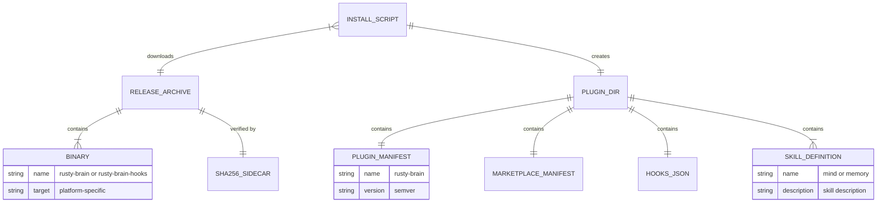

# Data Model: Plugin Packaging & Distribution

**Feature**: 009-plugin-packaging | **Date**: 2026-03-04

## Overview

This feature introduces no new Rust data types or database entities. All "entities" are static files (JSON manifests, Markdown skill definitions, shell scripts) that are created at build/install time and read by external systems (Claude Code, OpenCode, shell). This data model documents the file-based entities and their relationships.

## Entities

### Release Archive

A platform-specific compressed archive containing pre-compiled binaries.

| Field | Type | Constraints | Example |
|-------|------|-------------|---------|
| version | semver string | Must match `Cargo.toml` workspace version | `0.1.0` |
| target_triple | string enum | One of 5 supported targets | `x86_64-unknown-linux-musl` |
| archive_name | derived string | `rusty-brain-v{version}-{target_triple}.tar.gz` | `rusty-brain-v0.1.0-x86_64-unknown-linux-musl.tar.gz` |
| sha256_checksum | hex string (64 chars) | SHA-256 of archive file | `a1b2c3...` |
| download_url | URL | GitHub Release asset URL | `https://github.com/brianluby/rusty-brain/releases/download/v0.1.0/...` |

**Archive Contents**:
```
rusty-brain-v0.1.0-x86_64-unknown-linux-musl/
├── rusty-brain              # CLI binary
├── rusty-brain-hooks        # Hook handler binary
├── LICENSE
└── README.md
```

**Supported Target Triples**:
- `x86_64-unknown-linux-musl`
- `aarch64-unknown-linux-musl`
- `x86_64-apple-darwin`
- `aarch64-apple-darwin`
- `x86_64-pc-windows-msvc`

### Plugin Manifest (plugin.json)

JSON file that registers the plugin with Claude Code.

| Field | Type | Required | Description |
|-------|------|----------|-------------|
| name | string | Yes | Plugin identifier (`rusty-brain`) |
| version | string | No | Semver version |
| description | string | No | Human-readable description |
| author | object | No | `{ name, url }` |
| repository | string | No | GitHub repository URL |
| homepage | string | No | Project homepage |
| license | string | No | License identifier |
| keywords | string[] | No | Discovery keywords |
| skills | string[] | No | Relative paths to skill directories |
| hooks | string | No | Relative path to hooks.json |
| commands | string[] | No | Relative paths to command files |

**Location**: `~/.claude/plugins/rusty-brain/.claude-plugin/plugin.json`

### Marketplace Manifest (marketplace.json)

JSON file that identifies the marketplace/publisher for the plugin.

| Field | Type | Required | Description |
|-------|------|----------|-------------|
| name | string | Yes | Marketplace name |
| description | string | No | Marketplace description |
| owner | object | No | `{ name, url }` |
| plugins | array | Yes | Array of `{ name, description, version, source }` |

**Location**: `~/.claude/plugins/rusty-brain/marketplace.json`

### Hook Registration (hooks.json)

JSON file that registers binary commands to execute on Claude Code lifecycle events.

| Field | Type | Required | Description |
|-------|------|----------|-------------|
| description | string | No | Hook set description |
| hooks | object | Yes | Map of event name to hook array |

**Hook Events Used**:
- `SessionStart`: Runs `rusty-brain-hooks session-start`
- `PostToolUse`: Runs `rusty-brain-hooks post-tool-use` (matcher: `*`)
- `Stop`: Runs `rusty-brain-hooks stop`

**Location**: `~/.claude/plugins/rusty-brain/hooks/hooks.json`

### Skill Definition (SKILL.md)

Markdown file with YAML frontmatter that describes a capability Claude Code can invoke.

| Field | Type | Required | Description |
|-------|------|----------|-------------|
| name | string (frontmatter) | Yes | Skill identifier |
| description | string (frontmatter) | Yes | Skill description |
| body | markdown | Yes | Instructions and invocation commands |

**Skills**:
- `mind`: Search and manage persistent memory (`skills/mind/SKILL.md`)
- `memory`: Capture and store memories (`skills/memory/SKILL.md`)

**Location**: `~/.claude/plugins/rusty-brain/skills/{name}/SKILL.md`

### Command Definition (OpenCode)

Markdown file with YAML frontmatter for OpenCode slash commands.

| Field | Type | Required | Description |
|-------|------|----------|-------------|
| description | string (frontmatter) | Yes | Command help text |
| argument-hint | string (frontmatter) | No | Placeholder for arguments |
| body | markdown | Yes | Instructions for the agent |

**Commands**: `mind-ask`, `mind-search`, `mind-recent`, `mind-stats`

**Location**: OpenCode's command discovery directory (installed by user)

## Relationships



## State Transitions

This feature has no runtime state transitions. All entities are static files created at install time. The only state change is:

1. **Not Installed** -> **Installed**: Install script runs, creates files
2. **Installed (v1)** -> **Installed (v2)**: Upgrade replaces binary and manifests, preserves `.mv2` files

## Validation Rules

- Plugin manifest `name` field must be `"rusty-brain"` (exact match)
- Version strings must be valid semver
- `${CLAUDE_PLUGIN_ROOT}` in hooks.json must not be expanded at install time — it's resolved by Claude Code at runtime
- Binary files must be executable (`chmod +x`)
- Hooks binary must exist at the path referenced in hooks.json
