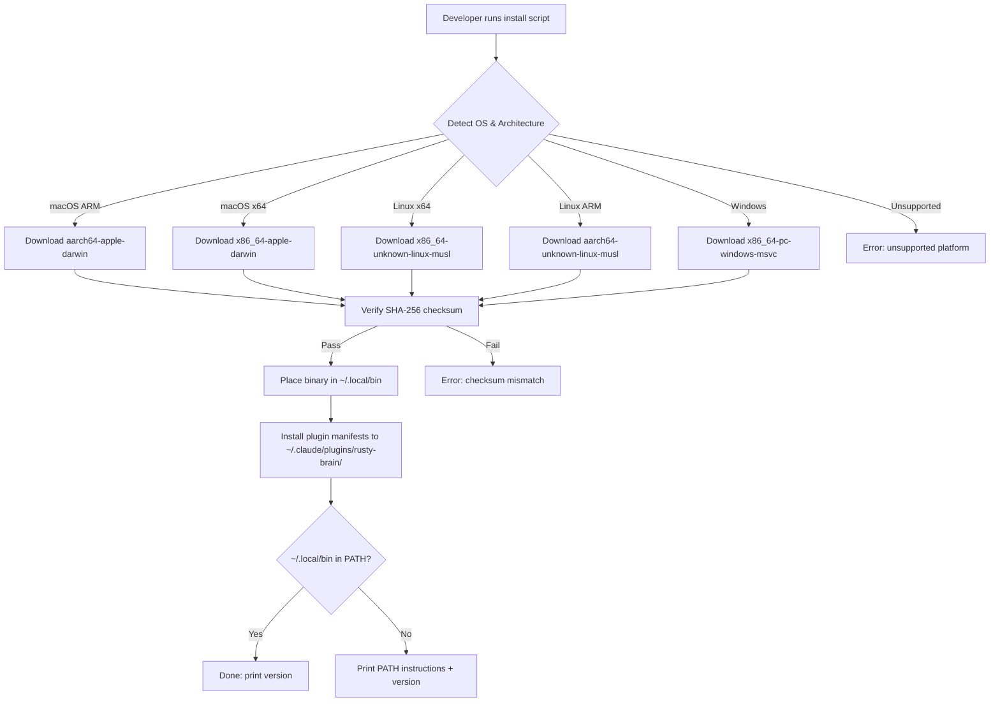
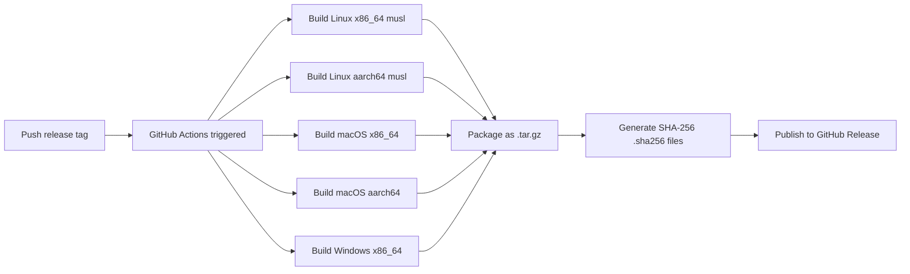
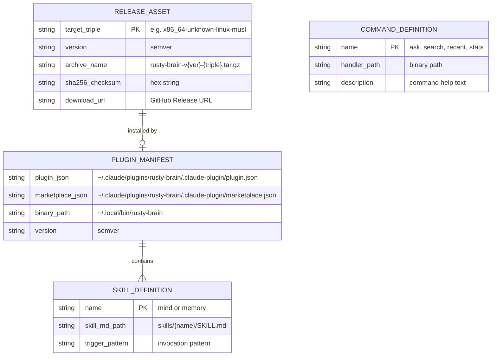
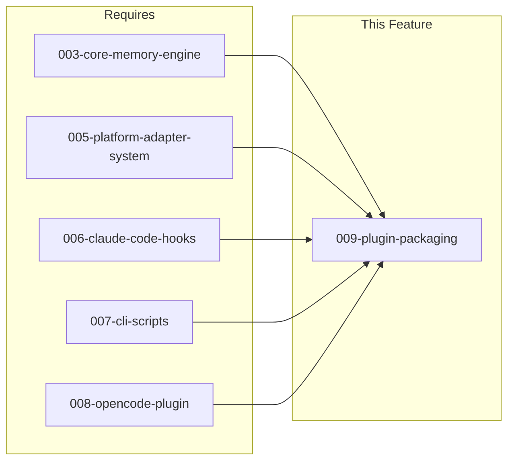

# 009-prd-plugin-packaging

> **Document Type:** Product Requirements Document
> **Audience:** LLM agents, human reviewers
> **Status:** Draft
> **Last Updated:** 2026-03-04 <!-- @auto -->
> **Owner:** Brian Luby <!-- @human-required -->

**Feature Branch**: `009-plugin-packaging`
**Created**: 2026-03-04
**Status**: 
**Input**: User description: "Phase 8 — Plugin Packaging & Distribution. Make the Rust version installable and usable in the same way as the Node.js original."

---

## Review Tier Legend

| Marker | Tier | Speckit Behavior |
|--------|------|------------------|
| `@human-required` | Human Generated | Prompt human to author; blocks until complete |
| `@human-review` | LLM + Human Review | LLM drafts; prompt human to confirm/edit; blocks until confirmed |
| `@llm-autonomous` | LLM Autonomous | LLM completes; no prompt; logged for audit |
| `@auto` | Auto-generated | System fills (timestamps, links); no prompt |

---

## Document Completion Order

> Complete sections in this order. Do not fill downstream sections until upstream human-required inputs exist.

1. **Context** (Background, Scope) -> requires human input first
2. **Problem Statement & User Scenarios** -> requires human input
3. **Requirements** (Must/Should/Could/Won't) -> requires human input
4. **Technical Constraints** -> human review
5. **Diagrams, Data Model, Interface** -> LLM can draft after above exist
6. **Acceptance Criteria** -> derived from requirements
7. **Everything else** -> can proceed

---

## Context

### Background `@human-required`

rusty-brain is a Rust rewrite of agent-brain, a memory system for AI coding agents. The Rust implementation (memvid-core based) is functionally complete but lacks the packaging, distribution, and plugin integration that the Node.js original provides. Without installable binaries and plugin manifests, users cannot adopt the Rust version as a drop-in replacement, meaning the performance and reliability improvements remain inaccessible.

### Scope Boundaries `@human-review`

**In Scope:**
- Plugin manifests (`plugin.json`, `marketplace.json`) for Claude Code at `~/.claude/plugins/rusty-brain/`
- Skill definitions (SKILL.md) for Claude Code `mind` and `memory` skills
- Command definitions for OpenCode (`ask`, `search`, `recent`, `stats`)
- Cross-platform CI/CD release pipeline (GitHub Actions)
- Install scripts (`install.sh` for macOS/Linux, `install.ps1` for Windows)
- Release binary builds for 5 targets (Linux x86_64, Linux aarch64, macOS x86_64, macOS aarch64, Windows x86_64)
- Binary SHA-256 checksum generation and verification
- Upgrade-in-place support preserving memory files and configuration

**Out of Scope:**
- Auto-update mechanism — users re-run install script manually; deferred to reduce complexity
- Package manager packages (Homebrew, apt, chocolatey) — future enhancement after core distribution is proven
- GUI installer for any platform — CLI-first tool, GUI adds no value for the target audience
- macOS code signing/notarization — future enhancement; requires Apple Developer account
- Windows code signing — future enhancement; requires certificate
- Docker image distribution — not needed for CLI tool installed per-user

### Glossary `@human-review`

| Term | Definition |
|------|------------|
| Target Triple | Rust platform identifier (e.g., `x86_64-unknown-linux-musl`) used in binary naming and CI matrix |
| Plugin Manifest | `plugin.json` and `marketplace.json` files that register rusty-brain with Claude Code |
| Skill Definition | A SKILL.md file describing a capability (mind, memory) that Claude Code can invoke |
| Command Definition | A configuration file registering a slash command with OpenCode |
| Install Script | `install.sh` (macOS/Linux) or `install.ps1` (Windows) that automates binary download and setup |
| musl | Static C library used for Linux builds to avoid glibc version dependencies |
| .mv2 | memvid video-encoded memory file format used by rusty-brain |

### Related Documents `@auto`

| Document | Link | Relationship |
|----------|------|--------------|
| Feature Spec | specs/009-plugin-packaging/spec.md | Source specification with clarifications |
| Architecture Review | specs/009-plugin-packaging/ar.md | Defines technical approach |
| Security Review | specs/009-plugin-packaging/sec.md | Risk assessment |

---

## Problem Statement `@human-required`

The Rust implementation of rusty-brain (built on memvid-core) delivers superior performance and reliability compared to the Node.js original, but it cannot be adopted because there is no way to install it. Users must compile from source with a Rust toolchain, and even then there are no plugin manifests or skill definitions to integrate with Claude Code or OpenCode. The Node.js version remains the only installable option, creating a bottleneck where improvements to the Rust codebase provide zero user value. Solving this unblocks adoption of the Rust version as a complete drop-in replacement.

---

## User Scenarios & Testing `@human-required`

### User Story 1 — One-Command Installation (Priority: P1)

A developer discovers rusty-brain and wants to install it. They run a single command which detects their platform, downloads the correct binary to `~/.local/bin`, verifies its SHA-256 checksum, and reports success. If `~/.local/bin` is not in PATH, the script prints instructions for the user to add it.

> As a developer, I want to install rusty-brain with a single command so that I can start using AI memory features without compiling from source or manual configuration.

**Why this priority**: Without a frictionless install path, no other distribution features matter. This is the gateway to adoption.

**Independent Test**: Run the install script on a clean machine and verify the binary is placed correctly, is executable, passes checksum verification, and responds to `rusty-brain --version`.

**Acceptance Scenarios**:
1. **Given** a macOS ARM machine with no rusty-brain installed, **When** the user runs `curl -sSf https://raw.githubusercontent.com/brianluby/rusty-brain/main/install.sh | sh`, **Then** the correct `aarch64-apple-darwin` binary is downloaded to `~/.local/bin`, checksum verified, and `rusty-brain --version` returns a valid version string.
2. **Given** a Linux x86_64 machine, **When** the user runs the install script, **Then** the correct `x86_64-unknown-linux-musl` binary is installed and functional.
3. **Given** a Windows x86_64 machine, **When** the user runs `install.ps1`, **Then** the correct `.exe` binary is downloaded and placed in a discoverable location.
4. **Given** rusty-brain is already installed, **When** the user runs the install script again, **Then** it upgrades to the latest version without losing existing `.mv2` files or configuration.
5. **Given** `~/.local/bin` is not in the user's PATH, **When** installation completes, **Then** the script prints clear instructions for adding it to PATH without modifying shell config files.

---

### User Story 2 — Claude Code Plugin Registration (Priority: P1)

After installation, rusty-brain appears as a registered Claude Code plugin with working skills. The install script places plugin manifests and skill definitions at `~/.claude/plugins/rusty-brain/`, and the binary path in the manifests points to the installed Rust binary.

> As a Claude Code user, I want rusty-brain to register as a plugin automatically so that I can use mind:search, mind:ask, mind:recent, mind:stats, and mind:memory skills without manual setup.

**Why this priority**: Claude Code is the primary target platform. The plugin must register correctly for the agent to discover and use capabilities.

**Independent Test**: Install the plugin and verify Claude Code recognizes skills and can invoke each one.

**Acceptance Scenarios**:
1. **Given** rusty-brain is installed, **When** the user opens Claude Code in any project, **Then** the plugin is discovered via `~/.claude/plugins/rusty-brain/.claude-plugin/plugin.json` and skills appear in the available skills list.
2. **Given** the plugin is registered, **When** the agent invokes `mind:search`, **Then** rusty-brain processes the search and returns results in the expected format.
3. **Given** the plugin is registered, **When** the agent invokes `mind:memory`, **Then** memories are captured and stored using the Rust binary (not the Node.js original).

---

### User Story 3 — Cross-Platform Release Binaries (Priority: P1)

A GitHub Actions CI pipeline builds and publishes pre-compiled binaries for all 5 supported platforms on each tagged release. Each binary is packaged as `rusty-brain-v{version}-{target-triple}.tar.gz` with a corresponding `.sha256` sidecar file.

> As a maintainer, I want CI to automatically produce release binaries for all platforms so that users can install without a Rust toolchain.

**Why this priority**: Pre-built binaries are a prerequisite for install scripts and plugin distribution.

**Independent Test**: Push a release tag and verify all 5 platform binaries plus checksums are published as release assets.

**Acceptance Scenarios**:
1. **Given** a new release tag is pushed, **When** GitHub Actions completes, **Then** binaries for all five targets are published as release assets with naming pattern `rusty-brain-v{version}-{target-triple}.tar.gz`.
2. **Given** a published release, **When** a user downloads a binary for their platform, **Then** the binary runs without additional dependencies (statically linked for Linux via musl).
3. **Given** a release with binaries, **When** the install script queries the latest release, **Then** it correctly identifies and downloads the binary matching the user's OS and architecture.
4. **Given** published release assets, **When** a user downloads a `.sha256` file and verifies, **Then** the checksum matches the corresponding binary archive.

---

### User Story 4 — OpenCode Slash Command Integration (Priority: P2)

An OpenCode user gets slash commands (`/ask`, `/search`, `/recent`, `/stats`) that invoke rusty-brain operations. Command definitions in a `commands/` directory are installed alongside the binary.

> As an OpenCode user, I want slash commands that invoke rusty-brain so that I can use memory features in my preferred coding agent.

**Why this priority**: OpenCode is a secondary but important platform. Command definitions enable the same memory workflow in a different agent environment.

**Independent Test**: Place command definitions and verify OpenCode lists them and routes invocations to the binary.

**Acceptance Scenarios**:
1. **Given** rusty-brain is installed with OpenCode command definitions, **When** the user types `/ask "what did I work on yesterday?"`, **Then** the question is routed to rusty-brain and a response is returned.
2. **Given** command definitions are present, **When** OpenCode starts, **Then** all four commands appear in the available commands list.

---

### User Story 5 — npm Wrapper Package (Priority: P3)

An optional npm wrapper package (`npx rusty-brain`) downloads and invokes the correct native binary for Node.js-centric workflows.

> As a Node.js developer, I want to install rusty-brain via npm so that I can use my familiar package manager.

**Why this priority**: Optional convenience. The primary distribution path is direct binary installation.

**Independent Test**: Run `npx rusty-brain --version` on a machine without rusty-brain pre-installed.

**Acceptance Scenarios**:
1. **Given** the npm package is published, **When** a user runs `npx rusty-brain --version`, **Then** the correct native binary is downloaded and the version is displayed.
2. **Given** the npm package is installed globally, **When** the user runs `rusty-brain search "query"`, **Then** the native binary is invoked with the correct arguments.

---

### User Story 6 — Cargo Crate Publication (Priority: P3)

rusty-brain is optionally available on crates.io for Rust developers who prefer `cargo install`.

> As a Rust developer, I want to install rusty-brain via cargo so that I can compile from source using my existing toolchain.

**Why this priority**: Niche audience. Secondary distribution channel.

**Independent Test**: Run `cargo install rusty-brain` and verify the binary compiles and runs.

**Acceptance Scenarios**:
1. **Given** the crate is published on crates.io, **When** a user runs `cargo install rusty-brain`, **Then** the binary compiles and installs successfully.

---

## Assumptions & Risks `@human-review`

### Assumptions
- [A-1] GitHub Releases is the primary hosting mechanism for release binaries
- [A-2] Install scripts download from GitHub Releases API endpoints
- [A-3] Claude Code plugin is installed globally at `~/.claude/plugins/rusty-brain/`
- [A-4] OpenCode command discovery follows the `commands/` directory convention used by the Node.js version
- [A-5] Static linking with musl is used for Linux targets to avoid glibc dependencies
- [A-6] macOS binaries target minimum macOS 11.0 (Big Sur)
- [A-7] Windows binaries target the MSVC toolchain
- [A-8] The npm wrapper (if implemented) follows the esbuild/turbo pattern (thin JS shim downloading native binary)
- [A-9] Install script is hosted at GitHub repo raw URL from the default branch

### Risks

| ID | Risk | Likelihood | Impact | Mitigation |
|----|------|------------|--------|------------|
| R-1 | Claude Code plugin discovery API changes without notice | Med | High | Pin to known working convention; test in CI against latest Claude Code |
| R-2 | Cross-compilation failures for some targets (especially Windows/Linux aarch64) | Med | Med | Use GitHub Actions cross-compile actions; test binary execution in CI |
| R-3 | musl static linking causes issues with memvid-core dependencies | Low | High | Test memvid round-trip on musl-linked binary; fallback to glibc with note |
| R-4 | Install script breaks on edge-case shell environments (ash, dash, old bash) | Low | Med | Target POSIX sh compatibility; test in Alpine and Ubuntu Docker containers |
| R-5 | GitHub raw URL rate limiting during high-traffic install periods | Low | Low | Document alternative download methods; consider GitHub Pages fallback |

---

## Feature Overview

### Flow Diagram `@human-review`



### Release Pipeline Flow `@human-review`



---

## Requirements

### Must Have (M) — MVP, launch blockers `@human-required`
- [ ] **M-1:** System shall provide `plugin.json` and `marketplace.json` manifests installed at `~/.claude/plugins/rusty-brain/` that reference the Rust binary path for Claude Code plugin discovery
- [ ] **M-2:** System shall include SKILL.md files for `mind` and `memory` skills in a `skills/` subdirectory of the plugin directory, matching Claude Code's expected format
- [ ] **M-3:** System shall produce pre-compiled release binaries (both `rusty-brain` CLI and `rusty-brain-hooks` hook binary) for five targets: `x86_64-unknown-linux-musl`, `aarch64-unknown-linux-musl`, `x86_64-apple-darwin`, `aarch64-apple-darwin`, `x86_64-pc-windows-msvc`
- [ ] **M-4:** Release binaries shall be packaged as `rusty-brain-v{version}-{target-triple}.tar.gz` with a corresponding `.sha256` sidecar file per asset
- [ ] **M-5:** System shall provide `install.sh` for macOS/Linux that detects OS and architecture, downloads the correct binary from GitHub Releases, verifies SHA-256 checksum, and places it in `~/.local/bin`
- [ ] **M-6:** System shall provide `install.ps1` for Windows that downloads the correct binary and provides PATH configuration guidance
- [ ] **M-7:** Install scripts shall support upgrading an existing installation without data loss (`.mv2` memory files and configuration preserved)
- [ ] **M-8:** All manifests shall reference the Rust binary, not the Node.js original
- [ ] **M-9:** Release binaries shall be statically linked (musl for Linux) or require only standard system libraries
- [ ] **M-10:** Install scripts shall provide clear, actionable error messages for unsupported platforms, network failures, permission issues, and checksum mismatches
- [ ] **M-11:** Install scripts shall detect if `~/.local/bin` is not in PATH and print manual instructions (no automatic shell config modification)

### Should Have (S) — High value, not blocking `@human-required`
- [ ] **S-1:** System shall include OpenCode slash command definitions for `ask`, `search`, `recent`, and `stats` in a `commands/` directory
- [ ] **S-2:** GitHub Actions CI pipeline shall automatically build and publish release assets on every tagged release with zero manual steps
- [ ] **S-3:** Install script shall be hosted at GitHub repo raw URL from the default branch for `curl | sh` one-liner installation

### Could Have (C) — Nice to have, if time permits `@human-review`
- [ ] **C-1:** System may publish an npm wrapper package that downloads and invokes the correct native binary via `npx rusty-brain`
- [ ] **C-2:** System may publish to crates.io as an optional distribution channel via `cargo install rusty-brain`

### Won't Have (W) — Explicitly deferred `@human-review`
- [ ] **W-1:** Auto-update mechanism — *Reason: users re-run install script; reduces complexity and security surface*
- [ ] **W-2:** Package manager packages (Homebrew, apt, chocolatey) — *Reason: requires per-manager maintenance; defer until user demand is proven*
- [ ] **W-3:** macOS code signing/notarization — *Reason: requires Apple Developer account; Gatekeeper bypass documented instead*
- [ ] **W-4:** Windows code signing — *Reason: requires EV certificate; SmartScreen bypass documented instead*
- [ ] **W-5:** Docker image distribution — *Reason: CLI tool installed per-user; Docker adds no value for target use case*

---

## Technical Constraints `@human-review`

- **Language/Framework:** Rust stable, edition 2024, MSRV 1.85.0; existing workspace crate structure
- **Build Targets:** Must cross-compile for 5 platform targets using GitHub Actions runners
- **Static Linking:** Linux targets must use musl for static linking to avoid glibc version dependencies
- **macOS Compatibility:** Minimum macOS 11.0 (Big Sur)
- **Windows Toolchain:** MSVC for broad compatibility
- **Binary Size:** No explicit target, but prefer strip and LTO to keep download reasonable
- **Dependencies:** memvid-core pinned at git rev `fbddef4`; no new external crate dependencies without justification
- **Shell Compatibility:** `install.sh` must be POSIX sh compatible (not bash-specific)

---

## Data Model (if applicable) `@human-review`



---

## Interface Contract (if applicable) `@human-review`

```json
// plugin.json (Claude Code plugin manifest)
{
  "name": "rusty-brain",
  "version": "0.1.0",
  "description": "AI memory system powered by memvid",
  "binary": "~/.local/bin/rusty-brain",
  "skills": ["skills/mind/SKILL.md", "skills/memory/SKILL.md"]
}

// Release asset naming contract
// Archive:   rusty-brain-v{version}-{target-triple}.tar.gz
// Checksum:  rusty-brain-v{version}-{target-triple}.tar.gz.sha256
// Example:   rusty-brain-v0.1.0-x86_64-unknown-linux-musl.tar.gz
//            rusty-brain-v0.1.0-x86_64-unknown-linux-musl.tar.gz.sha256
```

---

## Evaluation Criteria `@human-review`

| Criterion | Weight | Metric | Target | Notes |
|-----------|--------|--------|--------|-------|
| Install Success Rate | Critical | % of supported platforms where install completes | 100% | Tested in CI |
| Install Speed | High | Time from command to working binary | <60 seconds | On broadband connection |
| Binary Size | Medium | Download size per platform | <50 MB | After compression |
| Plugin Discovery | Critical | Claude Code finds and lists all skills | 100% | Tested per release |
| Checksum Verification | Critical | SHA-256 match rate | 100% | No corrupted installs |

---

## Tool/Approach Candidates `@human-review`

| Option | License | Pros | Cons | Spike Result |
|--------|---------|------|------|--------------|
| GitHub Actions + cross-rs | MIT | Battle-tested cross-compilation; native GitHub integration | cross-rs adds Docker overhead for some targets | Preferred |
| cargo-dist | MIT/Apache-2.0 | Rust-native release tooling; generates install scripts | Less control over install script behavior; newer tool | Alternative |
| Manual CI matrix | N/A | Full control over every step | More YAML maintenance; reinventing the wheel | Fallback |

### Selected Approach `@human-required`
> **Decision:** GitHub Actions with cross-rs for cross-compilation and custom install scripts
> **Rationale:** Provides maximum control over the install experience while leveraging battle-tested cross-compilation. cargo-dist is promising but doesn't support the custom plugin manifest installation we need.

---

## Acceptance Criteria `@human-review`

| AC ID | Requirement | User Story | Given | When | Then |
|-------|-------------|------------|-------|------|------|
| AC-1 | M-1 | US-2 | rusty-brain is installed | User opens Claude Code | Plugin is discovered via `~/.claude/plugins/rusty-brain/.claude-plugin/plugin.json` |
| AC-2 | M-2 | US-2 | Plugin is registered | Agent invokes `mind:search` | Search results returned in expected format |
| AC-3 | M-3 | US-3 | Release tag is pushed | GitHub Actions completes | 5 platform binaries published as release assets |
| AC-4 | M-4 | US-3 | Release assets published | User downloads `.sha256` file | Checksum matches corresponding archive |
| AC-5 | M-5 | US-1 | macOS ARM machine, no rusty-brain | User runs `curl ... \| sh` | Binary installed at `~/.local/bin`, checksum verified, `--version` works |
| AC-6 | M-6 | US-1 | Windows x86_64 machine | User runs `install.ps1` | Binary downloaded and PATH guidance provided |
| AC-7 | M-7 | US-1 | rusty-brain already installed with `.mv2` files | User re-runs install script | Binary upgraded, `.mv2` files untouched |
| AC-8 | M-9 | US-3 | Linux binary downloaded | User runs on clean system | Binary executes without additional library dependencies |
| AC-9 | M-10 | US-1 | Unsupported platform (e.g., FreeBSD) | User runs install script | Clear error listing supported platforms |
| AC-10 | M-11 | US-1 | `~/.local/bin` not in PATH | Installation completes | Script prints PATH addition instructions |
| AC-11 | S-1 | US-4 | Command definitions installed | OpenCode starts | All 4 commands listed |
| AC-12 | S-2 | US-3 | New release tag pushed | CI pipeline runs | All assets published with zero manual steps |

### Edge Cases `@llm-autonomous`
- [ ] **EC-1:** (M-5) When network fails mid-download, then install script cleans up partial files and exits with clear error
- [ ] **EC-2:** (M-5) When user lacks write permission to `~/.local/bin`, then script suggests alternative paths or `sudo`
- [ ] **EC-3:** (M-4) When checksum verification fails, then install script refuses to place binary and reports mismatch
- [ ] **EC-4:** (M-7) When a newer version has breaking memory format changes, then install script warns user and points to migration docs; `.mv2` files are never modified in place
- [ ] **EC-5:** (M-1) When `plugin.json` references a binary path that doesn't exist, then plugin system reports clear error suggesting re-install
- [ ] **EC-6:** (M-5) When platform is unsupported (Linux ARM 32-bit, FreeBSD), then install script lists supported platforms and exits

---

## Dependencies `@human-review`



- **Requires:** 003-core-memory-engine, 005-platform-adapter-system, 006-claude-code-hooks, 007-cli-scripts, 008-opencode-plugin
- **Blocks:** none (this is the distribution capstone)
- **External:** GitHub Releases API, GitHub Actions runners (ubuntu-latest, macos-latest, windows-latest)

---

## Security Considerations `@human-review`

| Aspect | Assessment | Notes |
|--------|------------|-------|
| Internet Exposure | Yes | Install script downloads from GitHub Releases; binary communicates only with local filesystem |
| Sensitive Data | No | Memory files (`.mv2`) are local only; no credentials in manifests |
| Authentication Required | No | Public GitHub releases; no auth needed for download |
| Security Review Required | Yes | Review install script for command injection, checksum bypass, and HTTPS enforcement |

- Install scripts must enforce HTTPS for all downloads
- SHA-256 checksum verification must occur before any binary is placed on disk
- Install scripts must not execute downloaded content before verification
- `curl | sh` pattern has inherent TOCTOU risk; documented as known limitation

---

## Implementation Guidance `@llm-autonomous`

### Suggested Approach
1. Start with GitHub Actions workflow for cross-platform builds (M-3, M-4)
2. Write install scripts that consume the release assets (M-5, M-6)
3. Create plugin manifests and skill definitions (M-1, M-2)
4. Wire install script to copy manifests to `~/.claude/plugins/rusty-brain/` (M-8)
5. Add OpenCode command definitions (S-1)
6. End-to-end test: tag a release, run install, verify plugin discovery

### Anti-patterns to Avoid
- Do not hardcode version numbers in install scripts; always query latest release from GitHub API
- Do not modify user shell configuration files (`.bashrc`, `.zshrc`) — print instructions instead
- Do not bundle platform-specific binaries into a single archive; keep per-platform archives separate
- Do not use `eval` or indirect execution in install scripts; keep the flow linear and auditable

### Reference Examples
- [rustup install script](https://sh.rustup.rs) — POSIX sh compatibility, platform detection, PATH guidance
- [esbuild npm wrapper](https://github.com/evanw/esbuild) — thin JS shim pattern for native binary distribution
- [delta releases](https://github.com/dandavison/delta/releases) — GitHub Actions cross-compilation with per-platform archives

---

## Spike Tasks `@human-review`

- [ ] **Spike-1:** Verify cross-rs can build memvid-core with musl static linking for Linux targets (completion: binary passes `ldd` showing no dynamic deps)
- [ ] **Spike-2:** Audit current Node.js agent-brain plugin structure to extract exact `plugin.json` and SKILL.md formats (completion: documented schema)
- [ ] **Spike-3:** Test Claude Code plugin discovery with a minimal `~/.claude/plugins/test/plugin.json` to confirm the convention works (completion: skill appears in Claude Code)

---

## Success Metrics `@human-required`

| Metric | Baseline | Target | Measurement Method |
|--------|----------|--------|-------------------|
| Install success rate (supported platforms) | 0% (no installer exists) | 100% | CI matrix testing on all 5 targets |
| Time to install | N/A (must compile from source) | <60 seconds | Timed CI install test |
| Plugin skill discovery | 0% (no manifests) | 100% | Claude Code integration test |
| Release automation | 0% (manual) | 100% | Tagged release produces all assets |

### Technical Verification `@llm-autonomous`
| Metric | Target | Verification Method |
|--------|--------|---------------------|
| Test coverage for Must Have ACs | >90% | CI pipeline |
| No Critical/High security findings | 0 | Security review of install scripts |
| All 5 platform binaries execute | 100% | CI matrix with `--version` smoke test |
| Checksum verification works | 100% | CI test with valid and corrupted archives |

---

## Definition of Ready `@human-required`

### Readiness Checklist
- [x] Problem statement reviewed and validated by stakeholder
- [x] All Must Have requirements have acceptance criteria
- [x] Technical constraints are explicit and agreed
- [x] Dependencies identified and owners confirmed
- [ ] Security review completed (or N/A documented with justification)
- [x] No open questions blocking implementation (clarified in spec.md session 2026-03-04)

### Sign-off
| Role | Name | Date | Decision |
|------|------|------|----------|
| Product Owner | Brian Luby | 2026-03-04 | Ready |

---

## Changelog `@auto`

| Version | Date | Author | Changes |
|---------|------|--------|---------|
| 0.1 | 2026-03-04 | Claude (LLM) | Initial draft from spec.md with clarifications |

---

## Decision Log `@human-review`

| Date | Decision | Rationale | Alternatives Considered |
|------|----------|-----------|------------------------|
| 2026-03-04 | Global plugin install at `~/.claude/plugins/rusty-brain/` | Matches current agent-brain pattern; available across all projects | Per-project `.claude-plugin/` directory |
| 2026-03-04 | Asset naming: `rusty-brain-v{ver}-{triple}.tar.gz` | Industry standard (ripgrep, bat, delta); easiest for install scripts to parse | Version-less filenames, simplified OS-arch names |
| 2026-03-04 | SHA-256 with `.sha256` sidecar per asset | Industry standard; preinstalled on all platforms | Combined checksums.txt, SHA-512 |
| 2026-03-04 | Install script at GitHub raw URL | Simplest; no extra infrastructure; versioned with repo | GitHub Pages, custom domain redirect |
| 2026-03-04 | Print PATH instructions, don't modify shell config | Less error-prone across shells; rustup pattern | Auto-modify .bashrc/.zshrc, interactive prompt |

---

## Open Questions `@human-review`

- [x] ~~Plugin install location~~ — Resolved: `~/.claude/plugins/rusty-brain/`
- [x] ~~Asset naming convention~~ — Resolved: `rusty-brain-v{version}-{target-triple}.tar.gz`
- [x] ~~Checksum algorithm~~ — Resolved: SHA-256 with `.sha256` sidecar
- [x] ~~Install script hosting~~ — Resolved: GitHub repo raw URL
- [x] ~~PATH handling~~ — Resolved: Print instructions, no auto-modification

No open questions remain.

---

## Review Checklist `@llm-autonomous`

Before marking as Approved:
- [x] All requirements have unique IDs (M-1 through M-11, S-1 through S-3, C-1, C-2, W-1 through W-5)
- [x] All Must Have requirements have linked acceptance criteria
- [x] User stories are prioritized and independently testable
- [x] Acceptance criteria reference both requirement IDs and user stories
- [x] Glossary terms are used consistently throughout
- [x] Diagrams use terminology from Glossary
- [x] Security considerations documented
- [x] Definition of Ready checklist is complete (pending security review)
- [x] No open questions blocking implementation

---

## Human Review Required

The following sections need human review or input:

- [x] Background (@human-required) - Verify business context
- [x] Problem Statement (@human-required) - Validate problem framing
- [x] User Stories (@human-required) - Confirm priorities and acceptance scenarios
- [x] Must Have Requirements (@human-required) - Validate MVP scope
- [x] Should Have Requirements (@human-required) - Confirm priority
- [x] Selected Approach (@human-required) - Decision needed on GitHub Actions + cross-rs
- [x] Success Metrics (@human-required) - Verify targets
- [x] Definition of Ready (@human-required) - Complete readiness checklist (security review pending)
- [x] All @human-review sections - Review LLM-drafted content
