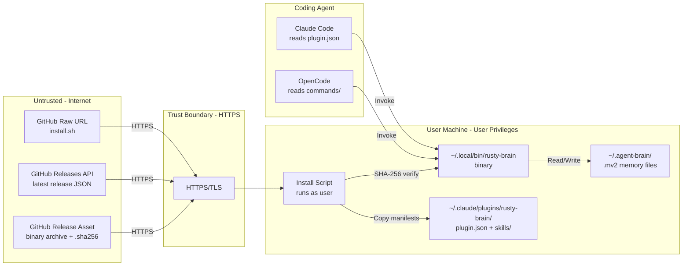
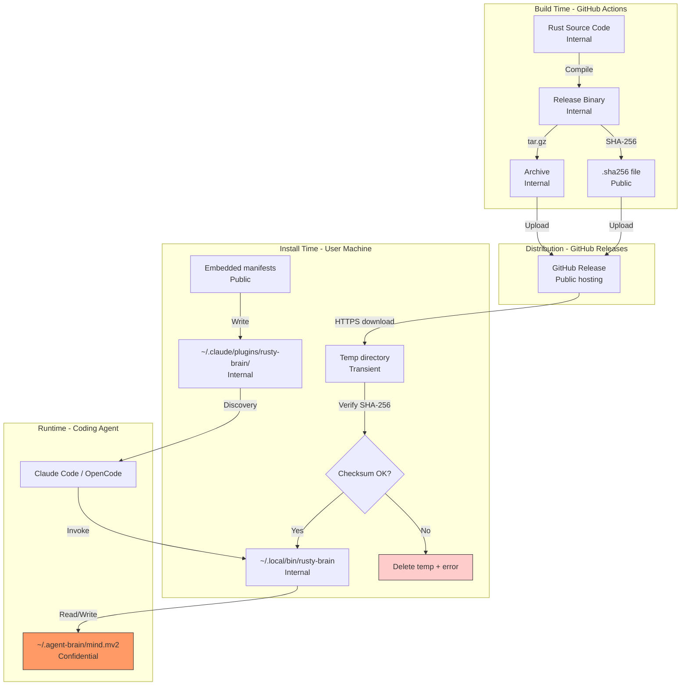
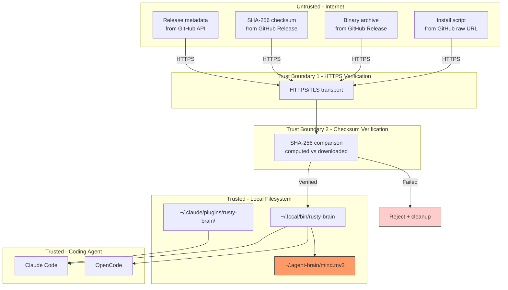

# 009-sec-plugin-packaging

> **Document Type:** Security Review (Lightweight)
> **Audience:** LLM agents, human reviewers
> **Status:** Draft
> **Last Updated:** 2026-03-04 <!-- @auto -->
> **Reviewer:** Brian Luby <!-- @human-required -->
> **Risk Level:** Medium <!-- @human-required -->

---

## Review Tier Legend

| Marker | Tier | Speckit Behavior |
|--------|------|------------------|
| `@human-required` | Human Generated | Prompt human to author; blocks until complete |
| `@human-review` | LLM + Human Review | LLM drafts; prompt human to confirm/edit; blocks until confirmed |
| `@llm-autonomous` | LLM Autonomous | LLM completes; no prompt; logged for audit |
| `@auto` | Auto-generated | System fills (timestamps, links); no prompt |

---

## Severity Definitions

| Level | Label | Definition |
|-------|-------|------------|
| Critical | **Critical** | Immediate exploitation risk; data breach or system compromise likely |
| High | **High** | Significant risk; exploitation possible with moderate effort |
| Medium | **Medium** | Notable risk; exploitation requires specific conditions |
| Low | **Low** | Minor risk; limited impact or unlikely exploitation |

---

## Linkage `@auto`

| Document | ID | Relationship |
|----------|-----|--------------|
| Parent PRD | 009-prd-plugin-packaging.md | Feature being reviewed |
| Architecture Review | 009-ar-plugin-packaging.md | Technical implementation |

---

## Purpose

This is a **lightweight security review** intended to catch obvious security concerns early in the product lifecycle. It is NOT a comprehensive threat model. Full threat modeling should occur during implementation when infrastructure-as-code and concrete implementations exist.

**This review answers three questions:**
1. What does this feature expose to attackers?
2. What data does it touch, and how sensitive is that data?
3. What's the impact if something goes wrong?

**Scope of this review:**
- Attack surface identification
- Data classification
- High-level CIA assessment
- ~~Detailed threat enumeration (deferred to implementation)~~
- ~~Penetration testing (deferred to implementation)~~
- ~~Compliance audit (separate process)~~

---

## Feature Security Summary

### One-line Summary `@human-required`
> This feature adds install scripts that download binaries from the internet and place them on users' machines, plus plugin manifests that register executable paths with coding agents — making the install pipeline and script integrity the primary security concerns.

### Risk Assessment `@human-required`
> **Risk Level:** Medium
> **Justification:** The `curl | sh` install pattern downloads and executes code from the internet. While mitigated by SHA-256 verification and HTTPS, the install script itself is fetched unauthenticated and runs with user privileges. No sensitive user data is exposed, but binary integrity is critical. In the future we'll add brew and other package managers as alternatives.

---

## Attack Surface Analysis

### Exposure Points `@human-review`

| Exposure Type | Details | Authentication | Authorization | Notes |
|---------------|---------|----------------|---------------|-------|
| Install Script Download | `curl -sSf https://raw.githubusercontent.com/.../install.sh \| sh` | No | No | Script fetched over HTTPS but executed without verification |
| Binary Download | GitHub Releases API + asset download | No | No | SHA-256 checksum verified after download |
| GitHub API Query | `GET /repos/.../releases/latest` (unauthenticated) | No | No | Public API; rate limited at 60 req/hr |
| Plugin Manifest | `~/.claude/plugins/rusty-brain/plugin.json` references binary path | N/A | N/A | If manifest is tampered, wrong binary could be invoked |
| Binary Execution | `~/.local/bin/rusty-brain` invoked by coding agents | N/A | User-level | Runs with user's full privileges; reads `.mv2` files |

### Attack Surface Diagram `@llm-autonomous`

### Exposure Checklist `@llm-autonomous`

- [x] **Internet-facing endpoints require authentication** — N/A: no endpoints created; downloads from public GitHub
- [x] **No sensitive data in URL parameters** — Install script queries only public release metadata
- [x] **File uploads validated** — N/A: no file uploads
- [ ] **Rate limiting configured** — GitHub API has default rate limits (60/hr unauthenticated); install script should handle 403 gracefully
- [x] **CORS policy is restrictive** — N/A: no web endpoints
- [x] **No debug/admin endpoints exposed** — N/A: no endpoints
- [x] **Webhooks validate signatures** — N/A: no webhooks

---

## Data Flow Analysis

### Data Inventory `@human-review`

| Data Element | PRD Entity | Classification | Source | Destination | Retention | Encrypted Rest | Encrypted Transit | Residency |
|--------------|------------|----------------|--------|-------------|-----------|----------------|-------------------|-----------|
| Release binary | Release Binary | Internal | GitHub Actions build | `~/.local/bin/rusty-brain` | Indefinite (until upgrade) | No | Yes (HTTPS) | User machine |
| SHA-256 checksum | Release Binary.sha256_checksum | Public | GitHub Actions build | Temp file (deleted after verify) | Transient | No | Yes (HTTPS) | User machine |
| Binary archive | Release Binary.archive_name | Internal | GitHub Release asset | Temp file (deleted after extract) | Transient | No | Yes (HTTPS) | User machine |
| Plugin manifest | Plugin Manifest | Internal | Install script (heredoc/embedded) | `~/.claude/plugins/rusty-brain/plugin.json` | Indefinite | No | N/A (local write) | User machine |
| Skill definitions | Skill Definition | Public | Install script (embedded) | `~/.claude/plugins/rusty-brain/skills/` | Indefinite | No | N/A (local write) | User machine |
| Command definitions | Command Definition | Public | Install script (embedded) | OpenCode commands dir | Indefinite | No | N/A (local write) | User machine |
| Memory files (.mv2) | — (pre-existing) | Confidential | User's prior sessions | `~/.agent-brain/mind.mv2` | User-controlled | No (memvid encoding) | N/A (local only) | User machine |
| GitHub API response | — | Public | GitHub API | Install script memory | Transient | No | Yes (HTTPS) | User machine |

### Data Classification Reference `@llm-autonomous`

| Level | Label | Description | Examples | Handling Requirements |
|-------|-------|-------------|----------|----------------------|
| 1 | **Public** | No impact if disclosed | Checksums, skill definitions, version strings | No special handling |
| 2 | **Internal** | Minor impact if disclosed | Binary contents, plugin manifest paths | Access controls, no public exposure |
| 3 | **Confidential** | Significant impact if disclosed | Memory files (.mv2) containing user observations | Encryption, audit logging, access controls |
| 4 | **Restricted** | Severe impact if disclosed | N/A for this feature | Encryption, strict access, compliance requirements |

### Data Flow Diagram `@llm-autonomous`

### Data Handling Checklist `@llm-autonomous`

- [x] **No Restricted data stored unless absolutely required** — No restricted data in this feature
- [ ] **Confidential data encrypted at rest** — `.mv2` files use memvid encoding but are NOT traditionally encrypted; this is pre-existing and out of scope for this feature
- [x] **All data encrypted in transit (TLS 1.2+)** — All downloads via HTTPS
- [x] **PII has defined retention policy** — No PII collected by this feature
- [x] **Logs do not contain Confidential/Restricted data** — Install script only prints progress/errors, no memory content
- [x] **Secrets are not hardcoded** — No secrets in install scripts or manifests
- [x] **Data minimization applied** — Only download the platform-specific binary, not all platforms
- [x] **Data residency requirements documented** — All data stays on user's machine

---

## Third-Party & Supply Chain `@human-review`

### New External Services

| Service | Purpose | Data Shared | Communication | Approved? |
|---------|---------|-------------|---------------|-----------|
| GitHub Releases API | Query latest release metadata | None (public read) | HTTPS/TLS | Yes (existing dependency) |
| GitHub raw.githubusercontent.com | Host install script | None (public read) | HTTPS/TLS | Yes (existing dependency) |

### New Libraries/Dependencies

| Library | Version | License | Purpose | Security Check |
|---------|---------|---------|---------|----------------|
| cross-rs | latest | MIT | Cross-compilation in CI (Docker-based) | ⚠️ Review — runs Docker containers in CI; pinned action SHA mitigates |
| actions/checkout | v4 (pinned SHA) | MIT | Checkout code in CI | ✅ Approved — GitHub first-party action |
| dtolnay/rust-toolchain | pinned SHA | MIT | Rust toolchain setup in CI | ✅ Approved — widely used, trusted maintainer |
| Swatinem/rust-cache | pinned SHA | MIT | Build cache in CI | ✅ Approved — widely used |

No new Rust crate dependencies are introduced by this feature.

### Supply Chain Checklist

- [x] **All new services use encrypted communication** — HTTPS for all GitHub interactions
- [x] **Service agreements/ToS reviewed** — GitHub ToS already accepted for repo hosting
- [x] **Dependencies have acceptable licenses** — All MIT or Apache-2.0
- [x] **Dependencies are actively maintained** — All are well-maintained with frequent updates
- [x] **No known critical vulnerabilities** — Pinned SHAs prevent tag-swap attacks
- [x] **GitHub Actions workflow uses pinned SHAs** — Must verify all third-party actions use commit SHAs, not mutable tags (AR guardrail)
- [x] **Publish SBOM** — SBOM (Software Bill of Materials) should be published to track dependencies and their licenses

---

## CIA Impact Assessment

### Confidentiality `@human-review`

> **What could be disclosed?**

| Asset at Risk | Classification | Exposure Scenario | Impact | Likelihood |
|---------------|----------------|-------------------|--------|------------|
| Memory files (.mv2) | Confidential | Compromised binary reads and exfiltrates memory content | High | Low — requires supply chain compromise of binary or GitHub release |
| Plugin manifest paths | Internal | Manifest reveals binary location on disk | Low | Low — filesystem paths are not sensitive |
| Install script contents | Public | Script is already public on GitHub | None | N/A |

**Confidentiality Risk Level:** Low — No new confidential data is created. Memory files are pre-existing and only at risk if the binary itself is compromised.

### Integrity `@human-review`

> **What could be modified or corrupted?**

| Asset at Risk | Modification Scenario | Impact | Likelihood |
|---------------|----------------------|--------|------------|
| Install script (in transit) | Man-in-the-middle modifies `curl \| sh` response | High | Low — HTTPS prevents; but `curl \| sh` has inherent TOCTOU risk |
| Release binary | Compromised GitHub account publishes malicious binary | Critical | Very Low — requires GitHub account compromise; SHA-256 doesn't help if attacker controls both archive and checksum |
| Plugin manifest | Local attacker modifies `plugin.json` to point to malicious binary | High | Low — requires local file access with user privileges |
| SHA-256 checksum | Attacker replaces both archive and checksum simultaneously | Critical | Very Low — requires GitHub Release write access |

**Integrity Risk Level:** Medium — The highest risk is supply chain compromise of the GitHub release. SHA-256 verification protects against download corruption but not against a compromised release source.

### Availability `@human-review`

> **What could be disrupted?**

| Service/Function | Disruption Scenario | Impact | Likelihood |
|------------------|---------------------|--------|------------|
| Install script | GitHub raw URL returns 404 or rate limited | Low | Low — GitHub has high availability; rate limiting unlikely for normal usage |
| Binary download | GitHub Releases API returns error | Low | Low — GitHub Releases is highly available |
| Plugin functionality | Binary deleted or corrupted on disk | Medium | Low — requires local access |

**Availability Risk Level:** Low — The feature depends on GitHub's availability, which is high. Local binary corruption is a user-level concern, not a feature design issue.

### CIA Summary `@llm-autonomous`

| Dimension | Risk Level | Primary Concern | Mitigation Priority |
|-----------|------------|-----------------|---------------------|
| **Confidentiality** | Low | Memory file exfiltration via compromised binary | Low — pre-existing risk, not introduced by this feature |
| **Integrity** | Medium | Supply chain compromise of release binary or install script | High — SHA-256 verification, pinned action SHAs, HTTPS enforcement |
| **Availability** | Low | GitHub service disruption | Low — no mitigation needed beyond error handling |

**Overall CIA Risk:** Medium — *Integrity is the primary concern: the install pipeline downloads and executes code from the internet. SHA-256 verification and HTTPS provide reasonable mitigation, but supply chain risk to the GitHub release process remains.*

---

## Trust Boundaries `@human-review`

**Key trust boundaries:**
1. **HTTPS transport** — Protects against network-level interception/modification
2. **SHA-256 checksum verification** — Protects against download corruption (but NOT against compromised source)
3. **Local filesystem permissions** — Protects installed files from other users (user-level only)

**Gap identified:** The install script itself (`curl | sh`) crosses the HTTPS boundary but has no integrity verification — the user trusts whatever GitHub raw serves. This is a well-known limitation of the `curl | sh` pattern, shared by rustup, nvm, and similar tools.

### Trust Boundary Checklist `@llm-autonomous`

- [x] **All input from untrusted sources is validated** — Binary verified via SHA-256; API response parsed defensively
- [ ] **External API responses are validated** — GitHub API JSON should be parsed safely; install script must not `eval` API responses
- [x] **Authorization checked at data access, not just entry point** — N/A: no multi-user authorization
- [x] **Service-to-service calls are authenticated** — N/A: no service-to-service calls

---

## Known Risks & Mitigations `@human-review`

| ID | Risk Description | Severity | Mitigation | Status | Owner |
|----|------------------|----------|------------|--------|-------|
| R1 | `curl \| sh` pattern: install script is not integrity-verified before execution | Medium | HTTPS ensures transport security; script is in public repo (auditable); well-established pattern (rustup, nvm) | Accepted | Feature owner |
| R2 | GitHub account compromise: attacker publishes malicious release with matching checksum | High | Pinned action SHAs in CI; 2FA on GitHub account; monitor release notifications | Accepted | Repo owner |
| R3 | `plugin.json` binary path tampering: local attacker modifies manifest to invoke malicious binary | Medium | File permissions (user-only write); users can verify manifest contents | Accepted | Feature owner |
| R4 | TOCTOU in `curl \| sh`: script content could change between inspection and execution | Low | Inherent to the pattern; documented limitation; users can download-then-inspect as alternative | Accepted | Feature owner |
| R5 | Dependency confusion: cross-rs Docker images could be compromised | Low | Pin cross-rs version in workflow; cross-rs images are official and widely used | Mitigated | Feature owner |
| R6 | Install script command injection: malformed GitHub API response or version string could inject commands | Medium | No `eval` in scripts; use `$()` not backticks; quote all variables; parse JSON safely | Mitigated | Feature owner |

### Risk Acceptance `@human-required`

| Risk ID | Accepted By | Date | Justification | Review Date |
|---------|-------------|------|---------------|-------------|
| R1 | Brian Luby | 2026-03-04 | Industry-standard pattern used by rustup, nvm, starship; HTTPS provides reasonable transport security | 2026-09-04 |
| R3 | Brian Luby | 2026-03-04 | Local file tampering requires pre-existing compromise; standard Unix permission model is sufficient | 2026-09-04 |
| R4 | Brian Luby | 2026-03-04 | Inherent to curl\|sh; documented alternative (download-then-run) available for security-conscious users | 2026-09-04 |

---

## Security Requirements `@human-review`

### Authentication & Authorization

N/A — This feature has no authentication or authorization requirements. All downloads are from public GitHub endpoints. The binary runs with user-level privileges.

### Data Protection

| Req ID | Requirement | PRD AC | Verification Method |
|--------|-------------|--------|---------------------|
| SEC-1 | Install scripts must NOT read, modify, or delete `.mv2` memory files or `~/.agent-brain/` contents | AC-7 | Integration test: install with existing .mv2, verify unchanged |
| SEC-2 | Install scripts must NOT log or display memory file contents | — | Code review of install scripts |
| SEC-3 | Plugin manifests must NOT contain credentials, tokens, or secrets | — | Code review of packaging/ files |

### Input Validation

| Req ID | Requirement | PRD AC | Verification Method |
|--------|-------------|--------|---------------------|
| SEC-4 | Install script must validate GitHub API JSON response structure before extracting URLs | — | Unit test (bats) with malformed JSON input |
| SEC-5 | Install script must reject version strings containing shell metacharacters | — | Unit test (bats) with injection payloads |
| SEC-6 | SHA-256 checksum comparison must be constant-time or use system `sha256sum` comparison (no `eval`) | AC-4 | Code review |
| SEC-7 | Install script must not use `eval`, backtick substitution, or indirect command execution | — | Shellcheck lint + code review |

### Operational Security

| Req ID | Requirement | PRD AC | Verification Method |
|--------|-------------|--------|---------------------|
| SEC-8 | All downloads must use HTTPS; install script must reject HTTP URLs | AC-5 | Code review + unit test |
| SEC-9 | GitHub Actions workflow must use pinned commit SHAs for all third-party actions (no mutable tags) | AC-3 | CI lint check or manual review of release.yml |
| SEC-10 | Install script must clean up all temporary files on both success and failure (trap handler) | AC-9 | Unit test (bats): simulate failure, verify no temp files remain |
| SEC-11 | Install script must verify downloaded file size is non-zero before checksum verification | — | Unit test (bats) |
| SEC-12 | Binary archive extraction must use `tar` with no path traversal (strip components, no absolute paths) | — | Code review + unit test with crafted archive |

---

## Compliance Considerations `@human-review`

| Regulation | Applicable? | Relevant Requirements | N/A Justification |
|------------|-------------|----------------------|-------------------|
| GDPR | N/A | — | No personal data collected, processed, or stored by install scripts or manifests. Memory files are pre-existing and out of scope. |
| CCPA | N/A | — | No personal data collected. No data sharing with third parties. |
| SOC 2 | N/A | — | No hosted service; CLI tool runs entirely on user's machine. |
| HIPAA | N/A | — | No health data involved. |
| PCI-DSS | N/A | — | No payment data involved. |
| Other | N/A | — | Open-source CLI distribution; no regulatory requirements identified. |

---

## Review Findings

### Issues Identified `@human-review`

| ID | Finding | Severity | Category | Recommendation | Status |
|----|---------|----------|----------|----------------|--------|
| F1 | `curl \| sh` has no integrity verification for the install script itself | Medium | Integrity | Document alternative: `curl -o install.sh ... && less install.sh && sh install.sh` for security-conscious users | Open |
| F2 | GitHub account compromise could poison both binary and checksum simultaneously | High | Supply Chain | Enable 2FA, use branch protection rules, consider GPG-signing releases in future | Open |
| F3 | Install script must be hardened against command injection via malformed API responses | Medium | Input Validation | No `eval`, quote all variables, validate URL format before download | Open |
| F4 | `tar` extraction without path validation could allow path traversal | Medium | Input Validation | Use `tar --strip-components=1` or explicit file list; reject archives with `..` paths | Open |

### Positive Observations `@llm-autonomous`

- SHA-256 checksum verification per asset is a strong integrity control for downloaded binaries
- HTTPS enforcement for all downloads prevents network-level attacks
- No new Rust crate dependencies introduced — minimizes supply chain surface
- Install scripts do not require root/sudo privileges — principle of least privilege
- Memory files (`.mv2`) are explicitly protected by the architecture — install never touches them
- Plugin manifests contain no sensitive data — only local file paths and skill references
- Pinned action SHAs in CI workflow prevent tag-swap supply chain attacks on the build pipeline

---

## Open Questions `@human-review`

- [ ] **Q1:** Should the README document an alternative install method for security-conscious users (`download → inspect → execute`)? *(Recommended: yes)*
- [ ] **Q2:** Should GPG signing of release binaries be added as a future enhancement? This would allow users to verify the signer's identity, not just archive integrity. *(Currently in W-3/W-4 scope as future enhancement)*

---

## Changelog `@auto`

| Version | Date | Author | Changes |
|---------|------|--------|---------|
| 0.1 | 2026-03-04 | Claude (LLM) | Initial lightweight security review |

---

## Review Sign-off `@human-required`

| Role | Name | Date | Decision |
|------|------|------|----------|
| Security Reviewer | Brian Luby | 2026-03-04 | Approved with conditions |
| Feature Owner | Brian Luby | 2026-03-04 | Acknowledged |

### Conditions for Approval (if applicable) `@human-required`

- [ ] F3 (command injection hardening) must be addressed in install script implementation
- [ ] F4 (tar path traversal) must be addressed in install script implementation
- [ ] F2 (GitHub account security) confirmed: 2FA enabled, branch protection on main

---

## Security Requirements Traceability `@llm-autonomous`

| SEC Req ID | PRD Req ID | PRD AC ID | Test Type | Test Location |
|------------|------------|-----------|-----------|---------------|
| SEC-1 | M-7 | AC-7 | Integration | Install + verify .mv2 unchanged |
| SEC-2 | — | — | Code Review | install.sh, install.ps1 |
| SEC-3 | — | — | Code Review | packaging/ directory |
| SEC-4 | M-10 | AC-9 | Unit (bats) | tests/install_script_test.bats |
| SEC-5 | M-10 | AC-9 | Unit (bats) | tests/install_script_test.bats |
| SEC-6 | M-4 | AC-4 | Code Review | install.sh checksum function |
| SEC-7 | — | — | Lint (shellcheck) | install.sh |
| SEC-8 | M-5 | AC-5 | Code Review + Unit | install.sh download function |
| SEC-9 | S-2 | AC-12 | Manual Review | .github/workflows/release.yml |
| SEC-10 | M-10 | AC-9 | Unit (bats) | tests/install_script_test.bats |
| SEC-11 | M-4 | AC-4 | Unit (bats) | tests/install_script_test.bats |
| SEC-12 | — | — | Code Review + Unit | install.sh extract function |

---

## Review Checklist `@llm-autonomous`

Before marking as Approved:
- [x] Attack surface documented with auth/authz status for each exposure
- [x] Exposure Points table has no contradictory rows
- [x] All PRD Data Model entities appear in Data Inventory (Release Binary, Plugin Manifest, Skill Definition, Command Definition, Install Script)
- [x] All data elements are classified using the 4-tier model
- [x] Third-party dependencies and services are listed
- [x] CIA impact is assessed with Low/Medium/High ratings
- [x] Trust boundaries are identified
- [x] Security requirements have verification methods specified
- [x] Security requirements trace to PRD ACs where applicable
- [ ] No Critical/High findings remain Open — F2 (High) is Open; requires human decision
- [x] Compliance N/A items have justification
- [ ] Risk acceptance has named approver and review date — Partially complete; R2 not yet accepted
