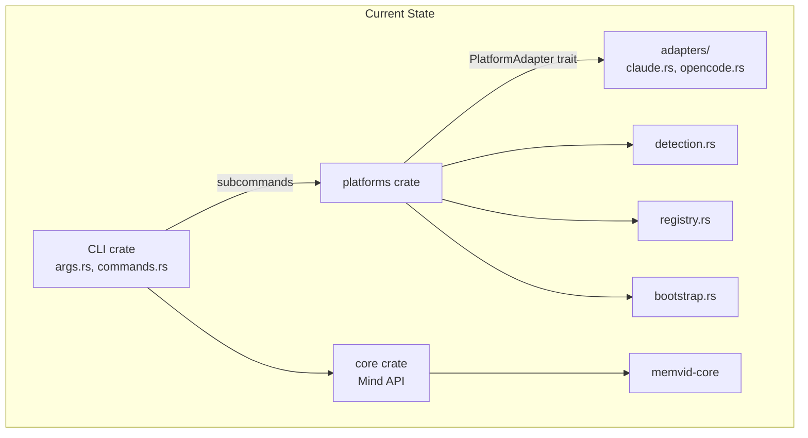
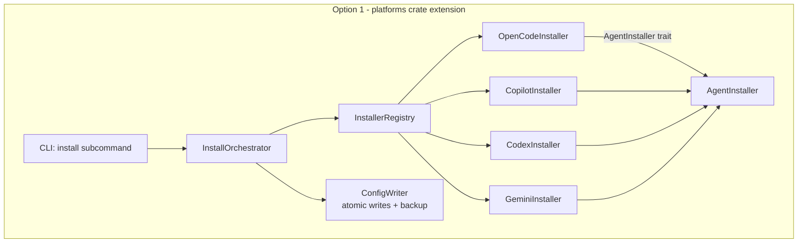
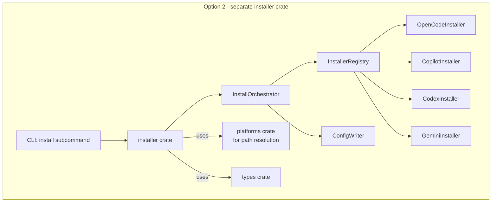
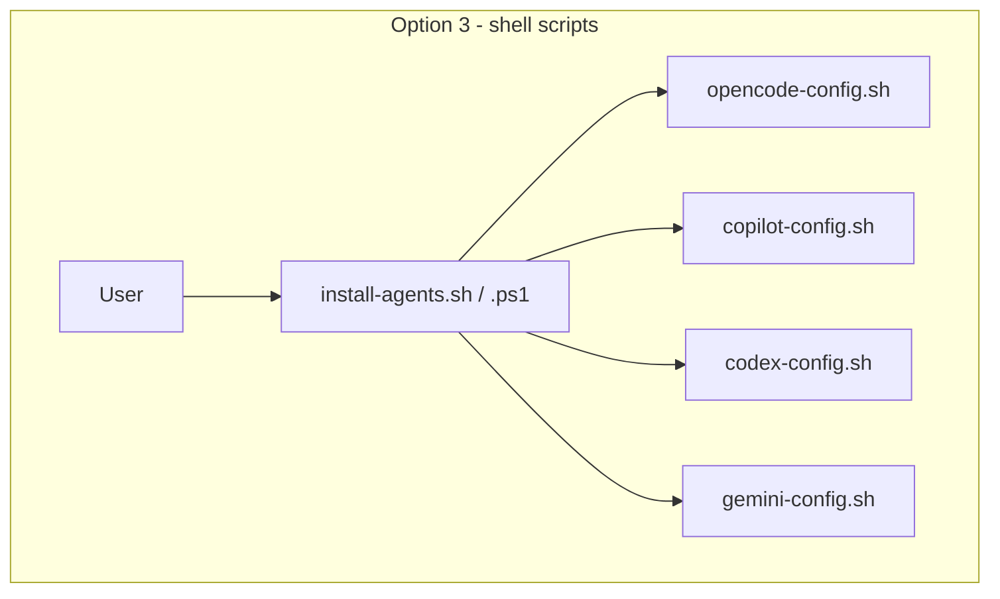
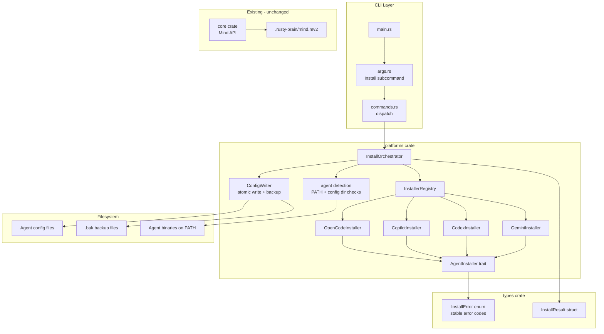
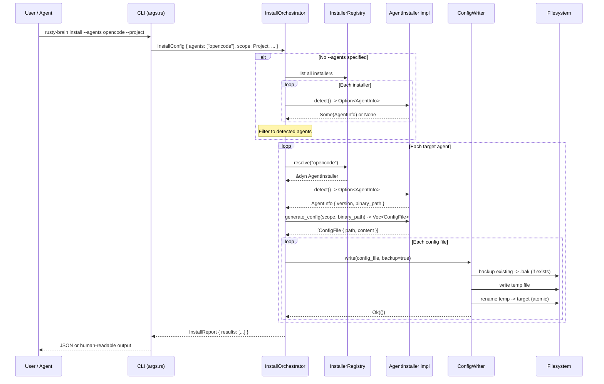
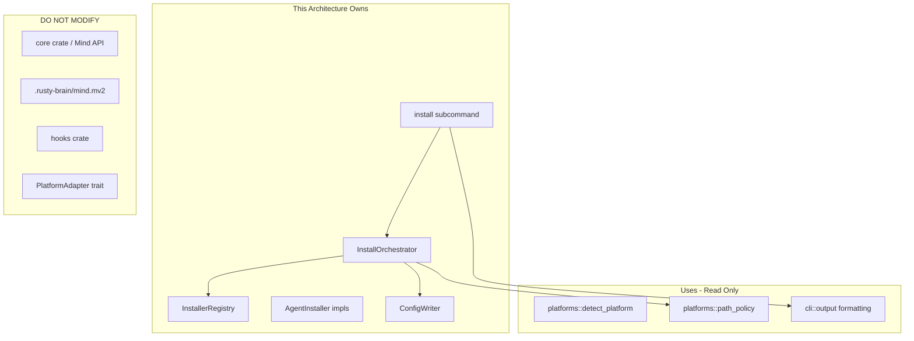

# 011-ar-agent-installs

> **Document Type:** Architecture Review
> **Audience:** LLM agents, human reviewers
> **Status:** Proposed
> **Last Updated:** 2026-03-05
> **Owner:** [name] <!-- @human-required -->
> **Deciders:** [names/roles of decision makers] <!-- @human-required -->

---

## Review Tier Legend

| Marker | Tier | Speckit Behavior |
|--------|------|------------------|
| `@human-required` | Human Generated | Prompt human to author; blocks until complete |
| `@human-review` | LLM + Human Review | LLM drafts; prompt human to confirm/edit; blocks until confirmed |
| `@llm-autonomous` | LLM Autonomous | LLM completes; no prompt; logged for audit |
| `@auto` | Auto-generated | System fills (timestamps, links); no prompt |

---

## Document Completion Order

> Complete sections in this order. Do not fill downstream sections until upstream human-required inputs exist.

1. **Summary (Decision)** -> requires human input first
2. **Context (Problem Space)** -> requires human input
3. **Decision Drivers** -> requires human input (prioritized)
4. **Driving Requirements** -> extract from PRD, human confirms
5. **Options Considered** -> LLM drafts after drivers exist, human reviews
6. **Decision (Selected + Rationale)** -> requires human decision
7. **Implementation Guardrails** -> LLM drafts, human reviews
8. **Everything else** -> can proceed after decision is made

---

## Linkage `@auto`

| Document | ID | Relationship |
|----------|-----|--------------|
| Parent PRD | 011-prd-agent-installs.md | Requirements this architecture satisfies |
| Security Review | 011-sec-agent-installs.md | Security implications of this decision |
| Supersedes | -- | N/A (new feature) |
| Superseded By | -- | (Filled if this AR is deprecated) |

---

## Summary

### Decision `@human-required`
> Extend the existing `platforms` crate with an `AgentInstaller` trait and per-agent installer modules, adding a new `install` subcommand to the CLI that delegates to trait implementations for agent detection, config generation, and atomic file writes.

### TL;DR for Agents `@human-review`
> The `install` subcommand uses a trait-based installer pattern within the existing `platforms` crate. Each agent (OpenCode, Copilot, Codex, Gemini) gets an `AgentInstaller` implementation that handles detection (binary lookup on `$PATH`), config template generation, and atomic writes. No new crates are created. The CLI routes `rusty-brain install [--agents ...] [--project|--global]` to an `InstallOrchestrator` that iterates over requested installers. All output is JSON when `--json` is set or stdin is non-TTY. Never make network calls during install.

---

## Context

### Problem Space `@human-required`

The PRD requires a `rusty-brain install` subcommand that configures rusty-brain for four external AI agents (OpenCode, Copilot CLI, Codex CLI, Gemini CLI). The architectural challenge is: **how to structure multi-agent installation logic within the existing crate layout while keeping each agent's configuration concerns isolated, testable, and extensible**.

Key tensions:
1. **Four agents with different config formats** — each agent has a distinct extension mechanism (plugin manifests, YAML configs, JSON tool registrations). The architecture must isolate these differences behind a common interface.
2. **Detection vs. configuration** — the existing `detect_platform` function detects which agent is *calling* rusty-brain. This feature needs the inverse: detect which agents are *installed on the system* so we can configure them.
3. **Scope modes** — `--project` vs. `--global` determines where config files land. Path resolution must be correct per agent per scope on all three OS platforms.
4. **Atomic writes and backup** — config files must be written atomically and existing files backed up, requiring file system operations more complex than the current read-only memory path resolution.

### Decision Scope `@human-review`

**This AR decides:**
- Where install logic lives in the crate structure
- The trait interface for per-agent installers
- How agent detection works for the install command
- How config file generation, backup, and atomic writes are structured
- CLI subcommand structure for `install`

**This AR does NOT decide:**
- The exact config file content for each agent (requires spike research per PRD Q1-Q3)
- Binary packaging or distribution (handled by 009-plugin-packaging)
- Claude Code installation (already handled by 009)
- Memory store format or location changes

### Current State `@llm-autonomous`

The codebase has a `platforms` crate with:
- `PlatformAdapter` trait — normalizes hook input into platform events (runtime concern)
- `AdapterRegistry` — case-insensitive registry for adapters
- `detect_platform()` — detects which agent is *calling* rusty-brain from env/hook input
- `BuiltinAdapter` — shared implementation for Claude and OpenCode
- `bootstrap` module — builds `MindConfig` and checks legacy paths

The CLI (`crates/cli`) uses clap derive with subcommands: `find`, `ask`, `stats`, `timeline`, `opencode`. No `install` subcommand exists.



### Driving Requirements `@human-review`

| PRD Req ID | Requirement Summary | Architectural Implication |
|------------|---------------------|---------------------------|
| M-1 | `rusty-brain install` subcommand | New clap subcommand + install orchestration logic |
| M-2 | Support 4 agent platforms | Per-agent installer modules behind a common trait |
| M-3 | Auto-detect installed agents | Agent detection logic separate from runtime platform detection |
| M-4 | `--agents` flag for explicit selection | CLI arg parsing + filtering in orchestrator |
| M-5 | Generate agent-specific config files | Template-based config generation per installer |
| M-6 | Shared memory store across agents | Config templates reference common `.rusty-brain/mind.mv2` path |
| M-7 | JSON output in `--json`/non-TTY mode | Output formatting layer (existing pattern in `output.rs`) |
| M-8 | Upgrade without data loss | Backup-before-write logic in installer trait |
| M-9 | Validate agent is installed | Detection method per agent (binary on PATH, config dir check) |
| M-10 | Machine-parseable error codes | Error enum with stable codes in `types` crate |
| M-11 | No interactive prompts in non-TTY | Install logic must never block on stdin |
| M-12 | Create directories if needed | `fs::create_dir_all` in installer write path |
| M-13 | Require `--project` or `--global` | CLI arg validation (mutually exclusive required group) |
| S-1 | `--reconfigure` with `.bak` backup | Backup logic in file write path |
| S-2 | Logging via `RUSTY_BRAIN_LOG` | Use workspace `tracing` (already configured) |
| S-3 | Detect agent version for compat | Version detection method per agent |
| S-4 | `--config-dir` override | CLI arg + path override in installer |

**PRD Constraints inherited:**
- Rust stable, edition 2024, MSRV 1.85.0
- No network calls during install
- Atomic writes (temp file + rename)
- Prefer existing workspace dependencies
- Crate-first: use existing crate layout unless justified
- Agent-friendly: structured JSON output, no interactive prompts

---

## Decision Drivers `@human-required`

1. **Crate-first simplicity:** Avoid new crates; extend existing `platforms` crate *(traces to Constitution principle, PRD Technical Constraints)*
2. **Testability:** Each agent's install logic must be unit-testable in isolation without filesystem side effects *(traces to Constitution test-first principle)*
3. **Extensibility:** Adding a fifth agent should require only a new module + trait impl + registry entry *(traces to PRD M-2)*
4. **Cross-platform correctness:** Path resolution must work on macOS, Linux, Windows *(traces to PRD Technical Constraints)*
5. **No network:** Install must be fully offline *(traces to PRD Technical Constraints)*
6. **Atomic safety:** Config writes must not leave partial files on crash *(traces to PRD Technical Constraints)*

---

## Options Considered `@human-review`

### Option 0: Status Quo / Do Nothing

**Description:** Users manually create agent configuration files by reading documentation and placing files in the correct directories.

| Driver | Rating | Notes |
|--------|--------|-------|
| Crate-first simplicity | N/A | No code changes |
| Testability | N/A | Nothing to test |
| Extensibility | N/A | No framework |
| Cross-platform correctness | N/A | User's problem |
| No network | N/A | No code |
| Atomic safety | N/A | No writes |

**Why not viable:** PRD M-1 explicitly requires an `install` subcommand. Manual configuration is error-prone, undocumented for most agents, and blocks the cross-agent memory vision. All success criteria (SC-001 through SC-007) require automated installation.

---

### Option 1: Trait-Based Installers in `platforms` Crate

**Description:** Add an `installer` module tree to the existing `platforms` crate. Define an `AgentInstaller` trait with methods for detection, version checking, config generation, and validation. Each agent gets a module implementing this trait. An `InstallOrchestrator` coordinates the workflow: parse scope, detect/filter agents, iterate installers, handle backup/write, collect results.



| Driver | Rating | Notes |
|--------|--------|-------|
| Crate-first simplicity | ✅ Good | Extends existing crate, no new Cargo.toml |
| Testability | ✅ Good | Trait returns data (config files as structs), writer is separate and mockable |
| Extensibility | ✅ Good | New agent = new module + trait impl + register in InstallerRegistry |
| Cross-platform correctness | ✅ Good | Path logic centralized in trait methods with platform-specific defaults |
| No network | ✅ Good | Templates embedded as const strings, no external fetches |
| Atomic safety | ✅ Good | ConfigWriter handles temp-file-then-rename for all installers |

**Pros:**
- Follows existing crate patterns (mirrors `PlatformAdapter` / `AdapterRegistry`)
- Separation between config generation (pure, testable) and file I/O (ConfigWriter)
- ConfigWriter is reusable across all agents
- No new workspace dependencies needed

**Cons:**
- `platforms` crate grows larger (but stays cohesive around platform concerns)
- Install logic is conceptually different from runtime adapter logic (detection vs. configuration)

---

### Option 2: New `installer` Crate

**Description:** Create a new `crates/installer` crate dedicated to installation logic. The crate defines the `AgentInstaller` trait, per-agent modules, `InstallerRegistry`, `ConfigWriter`, and `InstallOrchestrator`. The CLI depends on this new crate for the `install` subcommand.



| Driver | Rating | Notes |
|--------|--------|-------|
| Crate-first simplicity | ❌ Poor | Violates crate-first constitution principle; adds new crate without strong justification |
| Testability | ✅ Good | Same trait-based isolation |
| Extensibility | ✅ Good | Same pattern |
| Cross-platform correctness | ✅ Good | Same approach |
| No network | ✅ Good | Same approach |
| Atomic safety | ✅ Good | Same approach |

**Pros:**
- Clean separation: install concerns in their own crate
- `platforms` crate stays focused on runtime adapter logic
- Independent compilation

**Cons:**
- Violates crate-first principle (Constitution): "New features go in existing crate layout unless explicitly justified"
- Duplicates registry pattern already in `platforms`
- Adds workspace dependency management overhead
- Install logic shares concepts with `platforms` (agent detection, path resolution) — splitting creates coupling between crates

---

### Option 3: Shell Script Wrappers

**Description:** Write platform-specific shell scripts (bash/PowerShell) for each agent, similar to the existing 009-plugin-packaging install scripts. The Rust binary is not involved in agent configuration.



| Driver | Rating | Notes |
|--------|--------|-------|
| Crate-first simplicity | N/A | No Rust code involved |
| Testability | ❌ Poor | Shell scripts hard to unit test, no type safety |
| Extensibility | ⚠️ Medium | Copy-paste new script, but no shared logic |
| Cross-platform correctness | ❌ Poor | Must maintain bash + PowerShell versions in parallel |
| No network | ✅ Good | Local file operations |
| Atomic safety | ⚠️ Medium | Possible but requires manual implementation per script |

**Pros:**
- No Rust code changes needed
- Simple for single-agent installs

**Cons:**
- Violates PRD M-7 (structured JSON output from the binary)
- Violates PRD M-1 (install as a *subcommand* of rusty-brain)
- Cannot support agent self-installation (US-6) — agents invoke the binary, not shell scripts
- Duplicated logic across bash and PowerShell
- No type safety, hard to test, error-prone path handling

---

## Decision

### Selected Option `@human-required`
> **Option 1: Trait-Based Installers in `platforms` Crate**

### Rationale `@human-required`

Option 1 best satisfies all decision drivers:
- Follows the crate-first Constitution principle by extending the existing `platforms` crate
- Provides the same testability and extensibility benefits as Option 2 without the overhead of a new crate
- The `platforms` crate is already the home for agent-related concerns (detection, adapters, path resolution), making install logic a natural extension
- Option 3 fails multiple PRD requirements outright

The install concern (detecting agents on the system, generating their configs) is closely related to the existing platform concern (detecting which agent is calling, normalizing events). Both deal with the relationship between rusty-brain and external agent platforms. Keeping them in the same crate is cohesive, not coincidental.

#### Simplest Implementation Comparison `@human-review`

| Aspect | Simplest Possible | Selected Option | Justification for Complexity |
|--------|-------------------|-----------------|------------------------------|
| Structure | Single `install()` function with match on agent name | `AgentInstaller` trait + per-agent modules + `InstallerRegistry` | M-2 requires 4 agents; trait isolates each agent's config format and detection logic for testing |
| Config generation | Hardcoded strings | Template structs returned by trait methods | M-5 requires agent-specific config formats; structured templates enable validation and testing without filesystem |
| File I/O | Direct `fs::write` | `ConfigWriter` with atomic write + backup | PRD requires atomic writes and `.bak` backup (S-1); centralizing prevents per-agent reimplementation |
| Agent detection | Check `which <binary>` | `detect()` method returning `AgentInfo` struct | M-3/M-9 require version detection (S-3) and clear error reporting (M-10); struct carries version + path info |
| Output | `println!` | Reuse existing `output.rs` JSON/table formatting | M-7 requires structured JSON; existing pattern already handles this |

**Complexity justified by:** The trait boundary is the minimum abstraction needed to isolate four different agent config formats while keeping them testable. The `ConfigWriter` prevents reimplementing atomic write + backup four times. These are not speculative — all four agents are PRD Must Have requirements.

### Architecture Diagram `@human-review`



---

## Technical Specification

### Component Overview `@human-review`

| Component | Responsibility | Interface | Dependencies |
|-----------|---------------|-----------|--------------|
| Install subcommand (CLI) | Parse `--agents`, `--project`/`--global`, `--json`, `--reconfigure`, `--config-dir` | clap derive args | `platforms` crate |
| InstallOrchestrator | Coordinate full install workflow: detect/filter agents, iterate installers, collect results | `fn run(config: InstallConfig) -> InstallReport` | InstallerRegistry, ConfigWriter |
| InstallerRegistry | Store and look up `AgentInstaller` implementations | `fn resolve(&self, name: &str) -> Option<&dyn AgentInstaller>` | Per-agent installer modules |
| AgentInstaller trait | Define per-agent detection, config generation, validation | Trait methods: `detect`, `generate_config`, `validate` | types crate |
| OpenCodeInstaller | OpenCode-specific detection and config generation | Implements `AgentInstaller` | None (self-contained) |
| CopilotInstaller | Copilot CLI-specific detection and config generation | Implements `AgentInstaller` | None (self-contained) |
| CodexInstaller | Codex CLI-specific detection and config generation | Implements `AgentInstaller` | None (self-contained) |
| GeminiInstaller | Gemini CLI-specific detection and config generation | Implements `AgentInstaller` | None (self-contained) |
| ConfigWriter | Atomic file writes with `.bak` backup | `fn write(path, content) -> Result`, `fn backup(path) -> Result` | `tempfile`, `std::fs` |
| InstallError | Stable error codes for all install failure modes | Enum with Display | `thiserror` |

### Data Flow `@llm-autonomous`



### Interface Definitions `@human-review`

```rust
// --- AgentInstaller trait (platforms crate) ---

/// Information about a detected agent installation.
pub struct AgentInfo {
    pub name: String,
    pub binary_path: PathBuf,
    pub version: Option<String>,
}

/// A configuration file to write for an agent.
pub struct ConfigFile {
    pub target_path: PathBuf,
    pub content: String,
    pub description: String,
}

/// Scope for installation (project-local or global/user-level).
pub enum InstallScope {
    Project { root: PathBuf },
    Global,
}

/// Trait each agent installer must implement.
pub trait AgentInstaller: Send + Sync {
    /// Canonical agent name (lowercase): "opencode", "copilot", "codex", "gemini"
    fn agent_name(&self) -> &str;

    /// Detect if this agent is installed on the system.
    /// Returns None if not found.
    fn detect(&self) -> Option<AgentInfo>;

    /// Generate configuration files for this agent.
    /// `binary_path` is the path to the rusty-brain binary.
    fn generate_config(
        &self,
        scope: &InstallScope,
        binary_path: &Path,
    ) -> Result<Vec<ConfigFile>, InstallError>;

    /// Validate that the installation is working (post-install check).
    fn validate(&self, scope: &InstallScope) -> Result<(), InstallError>;
}

// --- InstallConfig (CLI -> Orchestrator) ---

pub struct InstallConfig {
    pub agents: Option<Vec<String>>,   // None = auto-detect
    pub scope: InstallScope,
    pub json: bool,
    pub reconfigure: bool,
    pub config_dir: Option<PathBuf>,   // per-agent override
}

// --- InstallReport (Orchestrator -> CLI) ---

pub struct InstallReport {
    pub results: Vec<AgentInstallResult>,
    pub memory_store: PathBuf,
    pub scope: String,
}

pub struct AgentInstallResult {
    pub agent_name: String,
    pub status: InstallStatus,
    pub config_path: Option<PathBuf>,
    pub version_detected: Option<String>,
    pub error: Option<InstallError>,
}

pub enum InstallStatus {
    Configured,
    Upgraded,
    Skipped,
    Failed,
    NotFound,
}

// --- InstallError (types crate) ---

pub enum InstallError {
    AgentNotFound { agent: String },
    PermissionDenied { path: PathBuf, suggestion: String },
    UnsupportedVersion { agent: String, version: String, min_version: String },
    ConfigCorrupted { path: PathBuf },
    IoError { path: PathBuf, source: std::io::Error },
    ScopeRequired,
}
```

### Key Algorithms/Patterns `@human-review`

**Pattern: Atomic Config Write with Backup**
```
1. Check if target file exists
2. If exists AND (reconfigure OR upgrade):
   a. Copy target -> target.bak
   b. Log backup creation
3. Write content to temp file in same directory (same filesystem for rename)
4. Rename temp file -> target (atomic on POSIX; on Windows, use rename with overwrite)
5. If rename fails: clean up temp file, return error
```

**Pattern: Agent Detection**
```
1. Check if agent binary exists on PATH (platform-specific: "opencode" vs "opencode.exe")
2. If found: attempt to get version (run "agent --version" and parse output)
3. If version parse fails: return AgentInfo with version=None (proceed with warning per PRD)
4. If binary not found: check standard config directory exists as fallback
5. Return Some(AgentInfo) or None
```

---

## Constraints & Boundaries

### Technical Constraints `@human-review`

**Inherited from PRD:**
- Rust stable, edition 2024, MSRV 1.85.0
- No network calls during install
- Atomic writes (temp file + rename)
- Prefer existing workspace dependencies (clap, serde, serde_json, tracing)
- Agent-friendly: structured JSON output, no interactive prompts in non-TTY mode
- Must work on macOS, Linux, Windows

**Added by this Architecture:**
- `AgentInstaller` trait implementations must be pure for config generation — filesystem interaction only through `ConfigWriter`
- Agent detection may invoke external processes (e.g., `opencode --version`) but must handle timeouts (2s max)
- Config templates are embedded as Rust const strings, not external files
- Install error codes are stable; adding new variants is non-breaking, removing/renaming is breaking

### Architectural Boundaries `@human-review`



- **Owns:** Install subcommand, `InstallOrchestrator`, `InstallerRegistry`, per-agent `AgentInstaller` impls, `ConfigWriter`
- **Interfaces With:** `platforms::path_policy` (for memory path resolution), `cli::output` (for JSON/table formatting), `types` crate (for error types)
- **Must Not Touch:** `core` crate, `Mind` API, `.mv2` files, `PlatformAdapter` trait, `hooks` crate, existing adapter normalization logic

### Implementation Guardrails `@human-review`

> **Critical for LLM Agents:**

- [ ] **DO NOT** make network calls during install *(from PRD Technical Constraints)*
- [ ] **DO NOT** modify the `PlatformAdapter` trait or existing adapters — install is a separate concern *(from architecture boundary)*
- [ ] **DO NOT** write config files directly — always use `ConfigWriter` for atomic writes *(from PRD atomic write constraint)*
- [ ] **DO NOT** use interactive prompts or stdin reads in install logic *(from PRD M-11)*
- [ ] **DO NOT** create a new crate for install logic *(from crate-first Constitution principle)*
- [ ] **MUST** return structured `InstallError` with stable error codes for all failure modes *(satisfies PRD M-10)*
- [ ] **MUST** require `--project` or `--global` — never silently default to either scope *(satisfies PRD M-13)*
- [ ] **MUST** create `.bak` backup before overwriting existing config files *(satisfies PRD S-1, FR-010)*
- [ ] **MUST** use `tempfile` crate for atomic writes (write to temp, then rename) *(satisfies PRD atomic write constraint)*
- [ ] **MUST** implement `AgentInstaller::generate_config` as a pure function returning `Vec<ConfigFile>` — no filesystem I/O in the trait method itself *(enables unit testing)*
- [ ] **MUST** handle agent version detection timeout (2s max) to prevent hanging *(robustness)*

---

## Consequences `@human-review`

### Positive
- Consistent install experience across all four agents via shared orchestration
- Each agent's install logic is testable in isolation (pure config generation)
- Adding future agents requires only a new module + trait impl + registry entry
- Reuses existing crate patterns (`AdapterRegistry` -> `InstallerRegistry`)
- No new crate dependencies beyond what's already in workspace

### Negative
- `platforms` crate grows in scope (install + runtime), though both concern agent platform interaction
- Agent detection requires running external processes (`--version`), which adds subprocess management complexity
- Config templates are embedded in Rust code — updating a template requires a binary rebuild (but this is intentional for reproducibility)

### Risks & Mitigations

| Risk | Likelihood | Impact | Mitigation |
|------|------------|--------|------------|
| Agent extension APIs are undocumented or change frequently | Medium | High | Spike research (PRD Spike-1 through Spike-4) before implementation; version-gate templates |
| Atomic rename fails on Windows network drives | Low | Medium | Fall back to copy-delete on rename failure; document limitation |
| Agent binary on PATH is not the expected agent (name collision) | Low | Low | Verify identity via `--version` output parsing; warn if unrecognizable |
| `platforms` crate becomes too large | Low | Low | Install modules are in a dedicated `installer/` subdirectory; can extract to crate later if needed |

---

## Implementation Guidance

### Suggested Implementation Order `@llm-autonomous`

1. **Types first:** Add `InstallError`, `InstallStatus`, `AgentInfo`, `ConfigFile`, `InstallConfig`, `InstallReport`, `AgentInstallResult` structs to `types` crate
2. **AgentInstaller trait:** Define trait in `platforms/src/installer/mod.rs`
3. **ConfigWriter:** Implement atomic write + backup in `platforms/src/installer/writer.rs`
4. **InstallerRegistry:** Registry pattern in `platforms/src/installer/registry.rs`
5. **OpenCodeInstaller:** First agent impl (already has adapter support, most understood) in `platforms/src/installer/agents/opencode.rs`
6. **InstallOrchestrator:** Workflow coordinator in `platforms/src/installer/orchestrator.rs`
7. **CLI integration:** Add `Install` variant to `Command` enum in `cli/src/args.rs`, dispatch in `commands.rs`
8. **Remaining agents:** CopilotInstaller, CodexInstaller, GeminiInstaller (after spike research)
9. **Integration tests:** End-to-end install tests with tempdir fixtures

### Testing Strategy `@llm-autonomous`

| Layer | Test Type | Coverage Target | Notes |
|-------|-----------|-----------------|-------|
| Unit | AgentInstaller::generate_config | 90%+ | Pure functions: given scope + binary path, assert config file contents |
| Unit | ConfigWriter | 90%+ | Test atomic write, backup, error paths using tempdir |
| Unit | InstallerRegistry | 90%+ | Registration, lookup, listing (mirrors AdapterRegistry tests) |
| Unit | InstallOrchestrator | 80%+ | Mock installers and writer; test workflow logic |
| Unit | CLI arg parsing | 90%+ | clap parse tests for install subcommand (mirrors existing pattern) |
| Integration | Full install flow | Key paths | Install to tempdir, verify config files exist with correct content |
| Integration | Upgrade flow | Key paths | Install twice, verify `.bak` created, config updated |
| Integration | Error paths | All error codes | Missing agent, permission denied, scope required |

### Reference Implementations `@human-review`

- `crates/platforms/src/adapter.rs` — `PlatformAdapter` trait pattern *(internal)*
- `crates/platforms/src/registry.rs` — `AdapterRegistry` pattern *(internal)*
- `crates/cli/src/args.rs` — clap derive subcommand pattern *(internal)*
- `crates/platforms/src/bootstrap.rs` — platform path resolution pattern *(internal)*

### Anti-patterns to Avoid `@human-review`
- **Don't:** Put filesystem I/O in `AgentInstaller::generate_config`
  - **Why:** Makes unit testing require real filesystem, breaks isolation
  - **Instead:** Return `Vec<ConfigFile>` structs; `ConfigWriter` handles I/O

- **Don't:** Hardcode agent config directory paths as string literals
  - **Why:** Breaks on different OS platforms, non-standard installations
  - **Instead:** Use `dirs` crate or platform-specific path resolution with `--config-dir` override

- **Don't:** Shell out to `which` / `where` for binary detection
  - **Why:** Platform-specific, fragile, potential command injection
  - **Instead:** Use `std::env::split_paths` + `std::path::Path::join` to search PATH safely

- **Don't:** Modify `PlatformAdapter` to add install methods
  - **Why:** Conflates runtime event normalization with one-time installation
  - **Instead:** Separate `AgentInstaller` trait; the two traits address different lifecycle phases

---

## Compliance & Cross-cutting Concerns

### Security Considerations `@human-review`
- **Authentication:** None required — local filesystem operations only
- **Authorization:** Config files written with user's current filesystem permissions; no privilege escalation
- **Data handling:** No secrets in config files. Config templates reference binary paths and memory store paths only
- **Path validation:** `--config-dir` input validated against path traversal (no `..` escapes outside expected directories)
- **Subprocess safety:** Agent version detection must not pass user input to shell; use `Command::new(binary).arg("--version")` directly

### Observability `@llm-autonomous`
- **Logging:** All install actions logged at `INFO` via `tracing`: agent detected, config file written, backup created, agent skipped. Errors at `WARN`/`ERROR`. Controlled by `RUSTY_BRAIN_LOG` env var.
- **Metrics:** Not applicable (CLI tool, not a service)
- **Tracing:** Each agent install operation gets a tracing span with agent name for structured log output

### Error Handling Strategy `@llm-autonomous`
```
Error Category -> Handling Approach
+-- AgentNotFound -> Skip agent, include in report as NotFound, continue to next agent
+-- PermissionDenied -> Report error with suggestion, mark as Failed, continue to next agent
+-- UnsupportedVersion -> Warn but proceed with latest template (per PRD), mark as Configured with warning
+-- ConfigCorrupted -> Backup corrupted file, write fresh config, mark as Configured with note
+-- IoError -> Report error with path context, mark as Failed, continue to next agent
+-- ScopeRequired -> Fail immediately (before any agent processing), return error to CLI
```

Key principle: **Fail per-agent, not per-command.** If one agent fails, continue installing others and report all results.

---

## Migration Plan

### From Current State to Target State

Not applicable — this is a new subcommand added to the existing binary. No migration from an old system is needed.

### Rollback Plan `@human-required`

**Rollback Triggers:**
- Install subcommand corrupts existing agent configurations on upgrade path
- Atomic write implementation causes data loss on a specific OS

**Rollback Decision Authority:** Project maintainer

**Rollback Time Window:** Any time before the feature is released in a tagged version

**Rollback Procedure:**
1. Revert the commit(s) adding the install subcommand
2. Users with corrupted configs can restore from `.bak` files created during install
3. Re-release binary without install subcommand

---

## Open Questions `@human-review`

- [x] **Q1:** ~~Should agent detection run external processes (e.g., `opencode --version`) or only check for binary existence on PATH?~~ **Resolved**: Detection runs `--version` with a 2-second timeout (per SEC-6, tasks T035). Version info enables version-gated template selection (S-3).
- [x] **Q2:** ~~Does the `platforms` crate need a `dirs` or `directories` crate dependency?~~ **Resolved**: No. Use `$HOME`/`$XDG_CONFIG_HOME`/`%APPDATA%` directly via env vars and `cfg!(target_os)` (per research.md R4, tasks T018a-T018b).
- [x] **Q3:** ~~Should `ConfigWriter` use the `tempfile` crate as a regular dependency?~~ **Resolved**: Yes. Promote `tempfile` from dev-dep to regular dep (per research.md R7, task T001).

---

## Changelog `@auto`

| Version | Date | Author | Changes |
|---------|------|--------|---------|
| 0.1 | 2026-03-05 | Claude | Initial proposal |

---

## Decision Record `@auto`

| Date | Event | Details |
|------|-------|---------|
| 2026-03-05 | Proposed | Initial draft created from PRD 011-prd-agent-installs |

---

## Traceability Matrix `@llm-autonomous`

| PRD Req ID | Decision Driver | Option Rating | Component | Notes |
|------------|-----------------|---------------|-----------|-------|
| M-1 | Crate-first simplicity | Option 1: ✅ | Install subcommand (CLI) | New clap subcommand added to existing CLI |
| M-2 | Extensibility | Option 1: ✅ | InstallerRegistry + per-agent impls | 4 agent modules behind common trait |
| M-3 | Extensibility | Option 1: ✅ | InstallOrchestrator + AgentInstaller::detect | Auto-detection via PATH and config dir checks |
| M-4 | Crate-first simplicity | Option 1: ✅ | Install subcommand (CLI) | `--agents` flag parsed by clap |
| M-5 | Testability | Option 1: ✅ | AgentInstaller::generate_config | Pure config generation per agent |
| M-6 | Crate-first simplicity | Option 1: ✅ | Config templates | All templates reference `.rusty-brain/mind.mv2` |
| M-7 | Crate-first simplicity | Option 1: ✅ | CLI output layer | Existing `output.rs` pattern extended |
| M-8 | Atomic safety | Option 1: ✅ | ConfigWriter | Backup + atomic write on upgrade |
| M-9 | Testability | Option 1: ✅ | AgentInstaller::detect | Detection returns structured AgentInfo or None |
| M-10 | Testability | Option 1: ✅ | InstallError enum | Stable error codes with Display impl |
| M-11 | — | Option 1: ✅ | InstallOrchestrator | No stdin reads in install path |
| M-12 | Cross-platform correctness | Option 1: ✅ | ConfigWriter | `create_dir_all` before write |
| M-13 | — | Option 1: ✅ | Install subcommand (CLI) | Required mutually-exclusive arg group |
| S-1 | Atomic safety | Option 1: ✅ | ConfigWriter | `.bak` backup before overwrite |
| S-2 | — | Option 1: ✅ | InstallOrchestrator | Uses workspace `tracing` |
| S-3 | — | Option 1: ✅ | AgentInstaller::detect | Version in AgentInfo struct |
| S-4 | Cross-platform correctness | Option 1: ✅ | Install subcommand (CLI) | `--config-dir` override passed to installer |

---

## Review Checklist `@llm-autonomous`

Before marking as Accepted:
- [x] All PRD Must Have requirements appear in Driving Requirements
- [x] Option 0 (Status Quo) is documented
- [x] Simplest Implementation comparison is completed
- [x] Decision drivers are prioritized and addressed
- [x] At least 2 options were seriously considered (3 options presented)
- [x] Constraints distinguish inherited vs. new
- [x] Component names are consistent across all diagrams and tables
- [x] Implementation guardrails reference specific PRD constraints
- [x] Rollback triggers and authority are defined
- [x] Security review is linked (011-sec-agent-installs.md complete)
- [x] No open questions blocking implementation (Q1-Q3 resolved via research.md)
