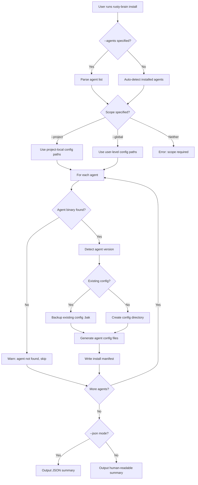
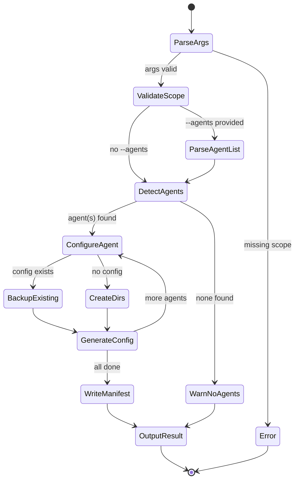
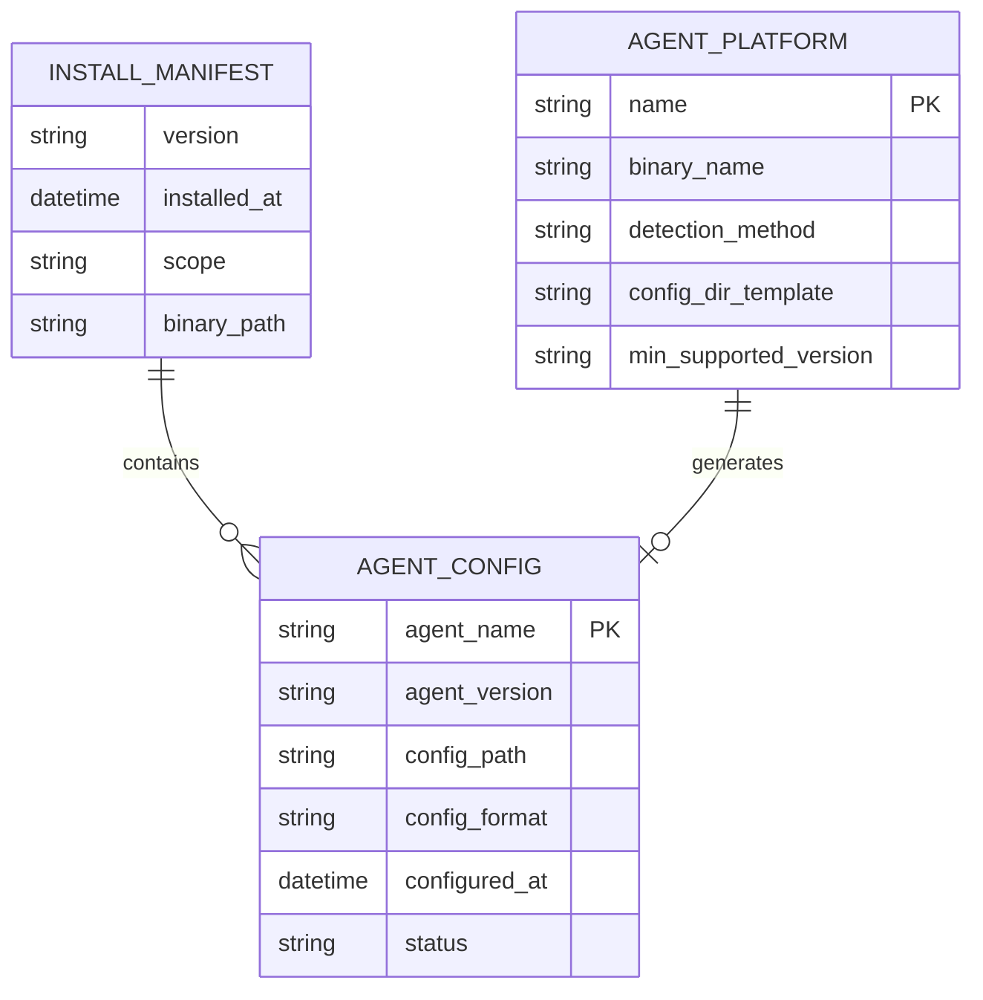
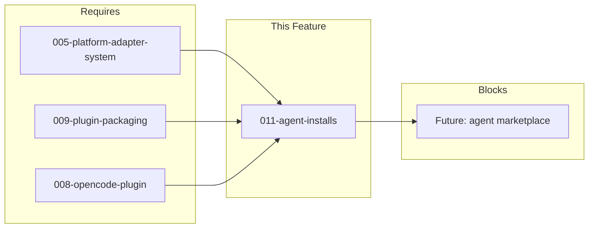

# 011-prd-agent-installs

> **Document Type:** Product Requirements Document
> **Audience:** LLM agents, human reviewers
> **Status:** Draft
> **Last Updated:** 2026-03-05
> **Owner:** [name] <!-- @human-required -->

**Feature Branch**: `011-agent-installs`
**Created**: 2026-03-05
**Status**: Draft
**Input**: User description: "Agentic agent installs for opencode, GitHub Copilot CLI, codex and gemini."

---

## Review Tier Legend

| Marker | Tier | Speckit Behavior |
|--------|------|------------------|
| `@human-required` | Human Generated | Prompt human to author; blocks until complete |
| `@human-review` | LLM + Human Review | LLM drafts; prompt human to confirm/edit; blocks until confirmed |
| `@llm-autonomous` | LLM Autonomous | LLM completes; no prompt; logged for audit |
| `@auto` | Auto-generated | System fills (timestamps, links); no prompt |

---

## Document Completion Order

> Complete sections in this order. Do not fill downstream sections until upstream human-required inputs exist.

1. **Context** (Background, Scope) -> requires human input first
2. **Problem Statement & User Scenarios** -> requires human input
3. **Requirements** (Must/Should/Could/Won't) -> requires human input
4. **Technical Constraints** -> human review
5. **Diagrams, Data Model, Interface** -> LLM can draft after above exist
6. **Acceptance Criteria** -> derived from requirements
7. **Everything else** -> can proceed

---

## Context

### Background `@human-required`

rusty-brain provides persistent memory for AI coding agents via memvid-encoded `.mv2` storage. Currently, only Claude Code has a complete plugin installation path (via 009-plugin-packaging). Users of other popular AI coding agents — OpenCode, GitHub Copilot CLI, OpenAI Codex CLI, and Google Gemini CLI — must manually configure rusty-brain, creating friction that limits adoption. This feature adds an `install` subcommand that auto-detects installed agents and generates the correct configuration files for each, enabling one-command setup across all supported agents.

### Scope Boundaries `@human-review`

**In Scope:**
- `rusty-brain install` subcommand for agent-specific configuration
- Auto-detection of installed agents (OpenCode, Copilot CLI, Codex CLI, Gemini CLI)
- Configuration file generation per agent's extension mechanism
- Unified multi-agent install via `--agents` flag or auto-detection
- Non-interactive (agentic) install mode with JSON output
- Reconfiguration support (`--reconfigure`) for existing installations
- Shared memory store (`.rusty-brain/mind.mv2`) across all agents
- Explicit scope selection (`--project` or `--global`)

**Out of Scope:**
- Binary download and placement — handled by 009-plugin-packaging install scripts
- Claude Code plugin installation — already handled by 009-plugin-packaging
- Auto-update or version management of the agents themselves — separate concern
- Agent-specific memory formats — all agents use the same `.mv2` format
- GUI or web-based installation wizard — CLI-only for now
- Agent marketplace/store submissions — future enhancement
- Custom agent platform support — only the four named agents

### Glossary `@human-review`

| Term | Definition |
|------|------------|
| Agent Platform | A supported AI coding agent (OpenCode, Copilot CLI, Codex CLI, Gemini CLI) |
| Agent Configuration | The set of files needed to register rusty-brain with a specific agent (plugin manifests, command definitions, tool registrations) |
| Install Manifest | A structured record of what was installed: agent name, config path, binary path, timestamp, version |
| Shared Memory Store | The unified `.rusty-brain/mind.mv2` file accessed by all agents |
| Platform Adapter | A rusty-brain module (from 005) that translates between agent-specific protocols and the core memory API |
| Agentic Install | Installation triggered by an AI agent itself (non-interactive, JSON output) |
| Scope | Installation target: `--project` (current directory) or `--global` (user-level directories) |

### Related Documents `@auto`

| Document | Link | Relationship |
|----------|------|--------------|
| Feature Spec | [spec.md](spec.md) | Source specification |
| Architecture Review | ar.md | Defines technical approach |
| Security Review | sec.md | Risk assessment |
| 005-platform-adapter-system | specs/005-platform-adapter-system/ | Foundational adapter architecture |
| 008-opencode-plugin | specs/008-opencode-plugin/ | OpenCode platform adapter |
| 009-plugin-packaging | specs/009-plugin-packaging/ | Binary packaging and Claude Code install |

---

## Problem Statement `@human-required`

AI developers increasingly use multiple coding agents (Claude Code, OpenCode, Copilot CLI, Codex CLI, Gemini CLI) depending on the task. rusty-brain's persistent memory is only automatically configured for Claude Code. Users of other agents must manually discover configuration file formats, create directories, register commands, and wire up the binary — a process that is error-prone, undocumented for most agents, and discourages adoption.

Without this feature, rusty-brain's cross-agent memory vision remains unrealized: memories stored in one agent session are inaccessible from other agents because the other agents simply aren't configured. The cost is fragmented developer context, duplicated work across agent sessions, and a smaller addressable user base for rusty-brain.

---

## User Scenarios & Testing `@human-required`

### User Story 1 — OpenCode Plugin Installation (Priority: P1)

An OpenCode user wants to install rusty-brain as a plugin so their agent has persistent memory across sessions. They run a single install command that detects their platform, places configuration files in the right locations, and registers slash commands (`/ask`, `/search`, `/recent`, `/stats`) so the agent can immediately invoke memory operations.

> As an OpenCode user, I want to run one command to configure rusty-brain so that my agent has persistent memory without manual setup.

**Why this priority**: OpenCode already has platform adapter support (008-opencode-plugin) and command definitions. This story completes the end-to-end install experience for an already-supported platform.

**Independent Test**: Can be fully tested by running the install command in an OpenCode project directory and verifying that all slash commands appear and route to the rusty-brain binary.

**Acceptance Scenarios**:
1. **Given** a machine with OpenCode installed but no rusty-brain configured, **When** the user runs `rusty-brain install --agents opencode --project`, **Then** configuration files are placed in the OpenCode plugin directory and all four slash commands are registered.
2. **Given** rusty-brain is already configured for OpenCode, **When** the user runs the install command again, **Then** the configuration is upgraded without losing existing memory files.
3. **Given** the install completes, **When** the user starts an OpenCode session, **Then** the agent discovers rusty-brain commands and can invoke `/ask "what did I work on?"` successfully.

---

### User Story 2 — GitHub Copilot CLI Agent Installation (Priority: P1)

A GitHub Copilot CLI user wants rusty-brain integrated into their Copilot agent workflow. The install command sets up the necessary extension configuration so Copilot CLI can invoke rusty-brain for memory operations.

> As a Copilot CLI user, I want to install rusty-brain as an agent extension so that I have persistent memory across coding sessions.

**Why this priority**: Copilot CLI has a large user base and supports agent extensions. Enabling memory for Copilot users significantly expands rusty-brain's reach.

**Independent Test**: Can be fully tested by running the install command and verifying that Copilot CLI discovers and can invoke rusty-brain memory operations.

**Acceptance Scenarios**:
1. **Given** a machine with GitHub Copilot CLI installed, **When** the user runs `rusty-brain install --agents copilot --project`, **Then** the appropriate Copilot agent/extension configuration files are created.
2. **Given** the install completes, **When** the user invokes memory operations through Copilot CLI, **Then** queries are routed to rusty-brain and results are returned in the expected format.
3. **Given** Copilot CLI's extension mechanism changes between versions, **When** the install command runs, **Then** it detects the installed Copilot CLI version and generates compatible configuration.

---

### User Story 3 — OpenAI Codex CLI Agent Installation (Priority: P1)

A Codex CLI user wants persistent memory across their coding sessions. The install command configures rusty-brain as a Codex agent extension, enabling the agent to store and retrieve observations, search past work, and maintain continuity.

> As a Codex CLI user, I want to install rusty-brain so that my coding agent remembers context across sessions.

**Why this priority**: Codex CLI is a direct competitor to Claude Code and supports agent extensions. Providing cross-agent memory is a key differentiator for rusty-brain.

**Independent Test**: Can be fully tested by running the install command and verifying Codex CLI can invoke rusty-brain's memory operations.

**Acceptance Scenarios**:
1. **Given** a machine with Codex CLI installed, **When** the user runs `rusty-brain install --agents codex --project`, **Then** Codex-specific configuration files (agent definitions, tool registrations) are created.
2. **Given** the install completes, **When** the Codex agent invokes a memory search, **Then** the query is routed to rusty-brain and results are returned in Codex's expected output format.
3. **Given** memories were previously stored via a different agent (e.g., Claude Code), **When** the Codex agent searches memory, **Then** it can access the same shared memory store.

---

### User Story 4 — Google Gemini CLI Agent Installation (Priority: P2)

A Gemini CLI user wants persistent memory for their agent sessions. The install command sets up rusty-brain as an extension for Gemini CLI.

> As a Gemini CLI user, I want to install rusty-brain so that my agent has memory across sessions.

**Why this priority**: Gemini CLI is newer and its extension mechanism may be less mature. Important for cross-agent coverage but lower priority than the more established platforms.

**Independent Test**: Can be fully tested by running the install command and verifying Gemini CLI can invoke rusty-brain memory operations.

**Acceptance Scenarios**:
1. **Given** a machine with Gemini CLI installed, **When** the user runs `rusty-brain install --agents gemini --project`, **Then** Gemini-specific configuration files are created.
2. **Given** the install completes, **When** the Gemini agent invokes a memory operation, **Then** the query is routed to rusty-brain and results are returned.

---

### User Story 5 — Unified Multi-Agent Install (Priority: P1)

A developer using multiple AI coding agents wants to install rusty-brain for all their agents in one step. A single command with a `--agents` flag (or auto-detection) configures rusty-brain for all detected agents.

> As a developer using multiple AI agents, I want to configure rusty-brain for all my agents in one command so that all agents share the same memory.

**Why this priority**: Users working with multiple agents should not need to run separate install commands. A unified experience reduces friction and ensures consistent configuration.

**Independent Test**: Can be tested by running the unified install on a machine with multiple agents installed and verifying each agent has working memory operations.

**Acceptance Scenarios**:
1. **Given** a machine with OpenCode and Codex CLI installed, **When** the user runs `rusty-brain install --project` without specifying agents, **Then** rusty-brain auto-detects both agents and configures itself for each.
2. **Given** the user specifies `--agents opencode,copilot`, **When** the install runs, **Then** only OpenCode and Copilot configurations are created.
3. **Given** an agent is not found on the system, **When** the install attempts to configure it, **Then** a clear message indicates the agent was not found and the install continues for other detected agents.
4. **Given** the install completes for multiple agents, **When** each agent is started, **Then** all agents share the same memory store (`.rusty-brain/mind.mv2`).

---

### User Story 6 — Agent Self-Installation (Priority: P2)

An AI coding agent is working in a project and discovers rusty-brain is available but not configured. The agent invokes the install command itself, configuring rusty-brain for its own platform without requiring the user to leave the agent session.

> As an AI coding agent, I want to invoke `rusty-brain install` programmatically so that I can set up memory for myself without user intervention.

**Why this priority**: True "agentic" installation means the agents themselves can trigger setup. This removes the last manual step from the adoption flow.

**Independent Test**: Can be tested by simulating an agent invoking the install command via its tool execution mechanism and verifying the plugin is registered without manual intervention.

**Acceptance Scenarios**:
1. **Given** an agent session where rusty-brain binary is available but not configured, **When** the agent runs `rusty-brain install --agents <self> --project --json`, **Then** the configuration is created and the agent can immediately use memory operations.
2. **Given** the agent invokes the install command, **When** no interactive prompts are required, **Then** the install completes with only structured output (JSON status messages suitable for agent consumption).
3. **Given** the install fails (e.g., missing permissions), **When** the agent reads the error output, **Then** it receives a machine-parseable error with a suggested remediation.

---

### Edge Cases

- **EC-1:** Agent extension/plugin mechanism not supported by rusty-brain — install reports a clear error listing supported agents and minimum versions.
- **EC-2:** Agent's config directory does not exist (first-time agent installation) — install creates necessary directory structure.
- **EC-3:** Two agents have conflicting configuration file formats — each agent gets its own config files in agent-specific directories; shared binary and memory store remain unified.
- **EC-4:** Binary installed but agent config becomes stale after agent upgrade — `--reconfigure` regenerates agent config files.
- **EC-5:** Install run in CI/CD with no agents installed — install skips agent configuration, exits with a warning.
- **EC-6:** Agent detected but version cannot be determined — proceed with latest known config format, emit a warning.
- **EC-7:** User has custom agent config directory (non-default location) — *(deferred: S-4 `--config-dir` not implemented in this PR; agents use platform-standard config directories)*.

---

## Assumptions & Risks `@human-review`

### Assumptions
- [A-1] Each target agent's extension/plugin mechanism will be researched and confirmed before building its adapter. Only agents with documented, stable plugin support get full adapters; others get stubs.
- [A-2] All agents with confirmed plugin support receive tool results as structured text (JSON or plain text) from external processes.
- [A-3] The rusty-brain binary is already installed on the system (via 009-plugin-packaging) before `rusty-brain install` is run.
- [A-4] Agent detection relies on checking `$PATH` for known binary names and standard config directory locations.
- [A-5] The existing platform adapter system (005) can be extended to support new agent platforms without major refactoring.

### Risks

| ID | Risk | Likelihood | Impact | Mitigation |
|----|------|------------|--------|------------|
| R-1 | Agent extension mechanisms are undocumented or unstable | Medium | High | Research each agent's plugin API before building; stub unsupported agents |
| R-2 | Agent CLI updates break configuration format | Medium | Medium | Version detection and format-specific generation; `--reconfigure` flag |
| R-3 | Some agents may not support external tool invocation | Low | High | Stub adapter with clear "not yet supported" messaging; track agent roadmaps |
| R-4 | Permission issues on agent config directories | Low | Medium | Clear error messages with remediation guidance; document required permissions |
| R-5 | Auto-detection produces false positives (e.g., similarly-named binaries) | Low | Low | Verify binary identity via version command or config directory structure |

---

## Feature Overview

### Flow Diagram `@human-review`



### State Diagram `@human-review`


---

## Requirements

### Must Have (M) — MVP, launch blockers `@human-required`
- [ ] **M-1:** The system shall provide a `rusty-brain install` subcommand that configures rusty-brain for one or more AI coding agents.
- [ ] **M-2:** The system shall support configuration generation for four agent platforms: OpenCode (`opencode`), GitHub Copilot CLI (`copilot`), OpenAI Codex CLI (`codex`), and Google Gemini CLI (`gemini`).
- [ ] **M-3:** The system shall auto-detect which agents are installed on the system by checking standard binary paths and configuration directories when `--agents` is not specified.
- [ ] **M-4:** The system shall accept an `--agents` flag with a comma-separated list of agent names to configure specific agents.
- [ ] **M-5:** The system shall generate agent-specific configuration files (plugin manifests, command definitions, tool registrations) appropriate to each agent's extension mechanism.
- [ ] **M-6:** The system shall share a single memory store (`.rusty-brain/mind.mv2`) across all configured agents.
- [ ] **M-7:** The system shall produce structured JSON output when invoked with `--json` or when stdin is not a TTY.
- [ ] **M-8:** The system shall support upgrading agent configurations without data loss when re-run on an already-configured system.
- [ ] **M-9:** The system shall validate that the target agent is installed before attempting configuration, providing a clear error if not found.
- [ ] **M-10:** The system shall provide machine-parseable error messages with stable error codes for all failure modes.
- [ ] **M-11:** The system shall not require interactive prompts during installation when in non-TTY mode.
- [ ] **M-12:** The system shall create necessary directory structures if they do not exist.
- [ ] **M-13:** The system shall require explicit scope selection via `--project` or `--global` and refuse to run without one.

### Should Have (S) — High value, not blocking `@human-required`
- [ ] **S-1:** The system shall support a `--reconfigure` flag that regenerates agent configuration files without replacing the binary, creating `.bak` copies of existing files before overwriting. Only the most recent `.bak` is kept per config file (repeated runs overwrite previous `.bak`).
- [ ] **S-2:** The system shall log installation actions and results via the standard `RUSTY_BRAIN_LOG` environment variable.
- [ ] **S-3:** The system shall detect the installed version of each agent and generate version-compatible configuration.
- [ ] **S-4:** *(Deferred)* The system shall support a `--config-dir` override for non-default configuration locations. When multiple agents are being configured, the override applies to all agents (each agent's config files are written into the specified directory).

### Could Have (C) — Nice to have, if time permits `@human-review`
- [ ] **C-1:** The system could provide a `--dry-run` flag that shows what would be installed without making changes.
- [ ] **C-2:** The system could generate a post-install verification report confirming each agent can invoke rusty-brain.
- [ ] **C-3:** The system could provide a `--uninstall` flag that removes agent configuration files (but preserves memory data).

### Won't Have (W) — Explicitly deferred `@human-review`
- [ ] **W-1:** Binary download and placement — *Reason: handled by 009-plugin-packaging install scripts*
- [ ] **W-2:** Claude Code installation — *Reason: already handled by 009-plugin-packaging*
- [ ] **W-3:** Auto-update of agent binaries — *Reason: separate concern, not rusty-brain's responsibility*
- [ ] **W-4:** GUI/web installation wizard — *Reason: CLI-only scope for this feature*
- [ ] **W-5:** Custom/third-party agent platform support — *Reason: only the four named agents for now*

---

## Technical Constraints `@human-review`

- **Language/Framework:** Rust stable, edition 2024, MSRV 1.85.0. Must use existing workspace crates (core, types, platforms).
- **Performance:** Install command shall complete in under 5 seconds for a single agent on local filesystem.
- **Compatibility:** Must work on macOS, Linux, and Windows. Agent detection must handle platform-specific binary paths (e.g., `.exe` on Windows).
- **Dependencies:** Prefer existing workspace dependencies (clap, serde, serde_json, tracing). New dependencies require justification.
- **Constitution:** Must follow contract-first, test-first, agent-friendly (structured JSON output), and crate-first principles per `.specify/memory/constitution.md`.
- **No network:** Install command must not make network calls. All configuration is generated locally from templates.
- **Atomic writes:** Configuration file writes must be atomic (write to temp file, then rename) to prevent partial configurations.

---

## Data Model `@human-review`



---

## Interface Contract `@human-review`

```rust
// CLI Interface
// rusty-brain install [OPTIONS]
//
// Options:
//   --agents <LIST>       Comma-separated agent names: opencode,copilot,codex,gemini
//   --project             Install config relative to current working directory
//   --global              Install config in user-level directories (~/.config/)
//   --json                Force JSON output (auto-enabled in non-TTY mode)
//   --reconfigure         Regenerate config files, backup existing
//   (--config-dir deferred: S-4 not implemented in this PR)

// JSON Output (success)
{
  "status": "success",
  "agents": [
    {
      "name": "opencode",
      "status": "configured",
      "config_path": "/path/to/config",
      "version_detected": "1.2.3"
    }
  ],
  "memory_store": "/path/to/.rusty-brain/mind.mv2",
  "scope": "project"
}

// JSON Output (error)
{
  "status": "error",
  "error_code": "AGENT_NOT_FOUND",
  "message": "Agent 'copilot' not found on this system",
  "suggestion": "Install GitHub Copilot CLI or check your PATH"
}
```

---

## Evaluation Criteria `@human-review`

| Criterion | Weight | Metric | Target | Notes |
|-----------|--------|--------|--------|-------|
| Install speed | Medium | Time to configure single agent | < 5s | Local filesystem only |
| Detection accuracy | High | Correct agent identification | > 95% on standard setups | |
| Cross-agent memory | Critical | Memories accessible across agents | 100% | Shared `.mv2` store |
| Error clarity | High | Machine-parseable errors | 100% of failure modes | Stable error codes |
| Platform coverage | High | Agents with working install | 4/4 (or stubs for unconfirmed) | |

---

## Tool/Approach Candidates `@human-review`

| Option | License | Pros | Cons | Spike Result |
|--------|---------|------|------|--------------|
| Template-based config generation | N/A | Simple, no new deps, easy to test | Templates need updating when agent formats change | Preferred |
| Dynamic config via agent API queries | N/A | Always current format | Requires network, complex, fragile | Not suitable (no-network constraint) |

### Selected Approach `@human-required`
> **Decision:** Template-based configuration generation with embedded templates per agent platform.
> **Rationale:** Aligns with no-network constraint, testable with known inputs/outputs, and easy to extend when agent formats change. Templates are versioned alongside the rusty-brain binary.

---

## Acceptance Criteria `@human-review`

| AC ID | Requirement | User Story | Given | When | Then |
|-------|-------------|------------|-------|------|------|
| AC-1 | M-1 | US-1 | Machine with OpenCode installed | User runs `rusty-brain install --agents opencode --project` | OpenCode config files are created |
| AC-2 | M-2, M-5 | US-2 | Machine with Copilot CLI installed | User runs `rusty-brain install --agents copilot --project` | Copilot-specific config files are generated |
| AC-3 | M-2, M-5 | US-3 | Machine with Codex CLI installed | User runs `rusty-brain install --agents codex --project` | Codex-specific config files are generated |
| AC-4 | M-2, M-5 | US-4 | Machine with Gemini CLI installed | User runs `rusty-brain install --agents gemini --project` | Gemini-specific config files are generated |
| AC-5 | M-3 | US-5 | Machine with multiple agents | User runs `rusty-brain install --project` (no --agents) | All installed agents are auto-detected and configured |
| AC-6 | M-4 | US-5 | User specifies `--agents opencode,copilot` | Install runs | Only OpenCode and Copilot are configured |
| AC-7 | M-6 | US-5 | Multiple agents configured | Agent A stores memory, Agent B searches | Agent B finds Agent A's memories |
| AC-8 | M-7 | US-6 | Agent invokes install with `--json` | Install completes | Output is valid JSON parseable by agent |
| AC-9 | M-8 | US-1 | rusty-brain already configured for OpenCode | User runs install again | Config upgraded, no data loss |
| AC-10 | M-9 | US-5 | Agent not found on system | Install attempts to configure it | Clear error message, install continues for others |
| AC-11 | M-10 | US-6 | Install fails (permissions) | Agent reads error output | Machine-parseable error with remediation |
| AC-12 | M-11 | US-6 | Non-TTY invocation | Install runs | No interactive prompts, completes autonomously |
| AC-13 | M-12 | US-1 | Agent config dir doesn't exist | Install runs | Directory created automatically |
| AC-14 | M-13 | US-1 | User omits --project and --global | Install runs | Error requiring explicit scope selection |
| AC-15 | S-1 | US-1 | Existing config, --reconfigure flag | Install runs | `.bak` created, new config generated |

### Edge Cases `@llm-autonomous`
- [ ] **EC-1:** (M-9) When an agent binary exists but is not a recognized agent, then the install reports "unsupported agent" with supported list.
- [ ] **EC-2:** (M-12) When the parent directory of the config path is read-only, then the install fails with a permission error and remediation suggestion.
- [ ] **EC-3:** (M-3) When auto-detection finds no agents, then the install exits with a warning listing supported agents.
- [ ] **EC-4:** (S-1) When `--reconfigure` is used but no existing config exists, then the install proceeds as a fresh install (no `.bak` created).
- [ ] **EC-5:** (M-8) When upgrading and the existing config is corrupted/unparseable, then the install backs up the corrupted file and creates fresh config.
- [ ] **EC-6:** (S-3) When agent version cannot be determined, then the install uses the latest known config format and emits a warning.

---

## Dependencies `@human-review`



- **Requires:** 005-platform-adapter-system (adapter architecture), 008-opencode-plugin (OpenCode adapter), 009-plugin-packaging (binary packaging)
- **Blocks:** Future agent marketplace submissions
- **External:** Each agent's extension/plugin mechanism documentation

---

## Security Considerations `@human-review`

| Aspect | Assessment | Notes |
|--------|------------|-------|
| Internet Exposure | No | Install is fully offline, no network calls |
| Sensitive Data | No | Config files contain paths and command definitions, no secrets |
| Authentication Required | No | Local filesystem operations only |
| Security Review Required | Yes | Review file permissions on generated configs; validate path components against traversal |

Additional considerations:
- Generated config files should have appropriate permissions (not world-writable)
- Config paths must be validated to prevent path traversal attacks
- Binary path references in config files must point to the actual rusty-brain binary, not be injectable
- `.bak` files should inherit the permissions of the originals

---

## Implementation Guidance `@llm-autonomous`

### Suggested Approach
- Extend the existing platform adapter system (005) with an `Installer` trait per agent platform
- Each agent adapter implements: `detect() -> Option<AgentInfo>`, `generate_config(scope) -> Vec<ConfigFile>`, `validate_install() -> Result`
- Use clap subcommand for `install` with the defined flags
- Agent-specific templates live as const strings or embedded files in each adapter module
- Research each agent's actual extension mechanism before implementing (spike tasks below)

### Anti-patterns to Avoid
- Do not hardcode agent config paths — use platform-appropriate path resolution
- Do not generate config files directly to final paths — use atomic write (temp + rename)
- Do not attempt to modify agent binaries or inject into agent internals
- Do not assume agent config formats are stable — version-gate template selection

### Reference Examples
- 009-plugin-packaging install scripts for Claude Code (existing pattern)
- 008-opencode-plugin for OpenCode adapter pattern

---

## Spike Tasks `@human-review`

- [ ] **Spike-1:** Research GitHub Copilot CLI extension/agent mechanism. Determine: config file format, config directory location, how external tools are registered, minimum supported version. Completion: documented in research.md with example config.
- [ ] **Spike-2:** Research OpenAI Codex CLI extension/agent mechanism. Determine: config file format, config directory location, how external tools are registered, minimum supported version. Completion: documented in research.md with example config.
- [ ] **Spike-3:** Research Google Gemini CLI extension/agent mechanism. Determine: config file format, config directory location, how external tools are registered, minimum supported version. Completion: documented in research.md with example config.
- [ ] **Spike-4:** Verify OpenCode plugin mechanism matches existing 008-opencode-plugin adapter. Confirm install path and command registration format. Completion: documented in research.md.

---

## Success Metrics `@human-required`

| Metric | Baseline | Target | Measurement Method |
|--------|----------|--------|-------------------|
| Single-agent install time | N/A (manual) | < 30 seconds | Timed CLI execution |
| Multi-agent install time | N/A (manual) | < 60 seconds | Timed CLI execution |
| Post-install agent operability | 0% auto-configured | 100% of configured agents work | Integration test: each agent invokes memory op |
| Auto-detection accuracy | N/A | > 95% on standard dev environments | Test across macOS/Linux/Windows defaults |
| Cross-agent memory access | Not possible | 100% of configured agents share store | Test: store from agent A, retrieve from agent B |
| Agentic install success | Not possible | 100% non-interactive completion with JSON | Integration test: non-TTY invocation |
| Upgrade data preservation | N/A | Zero data loss | Test: re-run install, verify memory intact |

### Technical Verification `@llm-autonomous`

| Metric | Target | Verification Method |
|--------|--------|---------------------|
| Test coverage for Must Have ACs | > 90% | CI pipeline |
| No Critical/High security findings | 0 | Security review |
| All error codes documented | 100% | Unit tests for each error path |
| Cross-platform install works | macOS + Linux + Windows | CI matrix |

---

## Definition of Ready `@human-required`

### Readiness Checklist
- [ ] Problem statement reviewed and validated by stakeholder
- [ ] All Must Have requirements have acceptance criteria
- [ ] Technical constraints are explicit and agreed
- [ ] Dependencies identified and owners confirmed
- [ ] Security review completed (or N/A documented with justification)
- [ ] No open questions blocking implementation
- [ ] Spike tasks for agent extension mechanisms completed (Spike-1 through Spike-4)

### Sign-off

| Role | Name | Date | Decision |
|------|------|------|----------|
| Product Owner | [name] | YYYY-MM-DD | [Ready / Not Ready] |

---

## Changelog `@auto`

| Version | Date | Author | Changes |
|---------|------|--------|---------|
| 0.1 | 2026-03-05 | Claude | Initial draft from spec.md |

---

## Decision Log `@human-review`

| Date | Decision | Rationale | Alternatives Considered |
|------|----------|-----------|------------------------|
| 2026-03-05 | Require explicit --project/--global scope | Prevent accidental global or project-scoped installs | Default to --project (rejected: too implicit) |
| 2026-03-05 | Template-based config generation | No-network constraint, testable, simple | Dynamic API queries (rejected: requires network) |
| 2026-03-05 | Research-first for agent mechanisms | Avoid building adapters for unsupported agents | Build all four immediately (rejected: risk of wasted work) |

---

## Open Questions `@human-review`

- [ ] **Q1:** What is the exact extension/agent mechanism for GitHub Copilot CLI? (Blocked on Spike-1)
- [ ] **Q2:** What is the exact extension/agent mechanism for OpenAI Codex CLI? (Blocked on Spike-2)
- [ ] **Q3:** What is the exact extension/agent mechanism for Google Gemini CLI? (Blocked on Spike-3)

---

## Review Checklist `@llm-autonomous`

Before marking as Approved:
- [x] All requirements have unique IDs (M-1 through M-13, S-1 through S-4, C-1 through C-3, W-1 through W-5)
- [x] All Must Have requirements have linked acceptance criteria
- [x] User stories are prioritized and independently testable
- [x] Acceptance criteria reference both requirement IDs and user stories
- [x] Glossary terms are used consistently throughout
- [x] Diagrams use terminology from Glossary
- [x] Security considerations documented
- [ ] Definition of Ready checklist is complete (pending spike tasks)
- [ ] No open questions blocking implementation (Q1-Q3 pending spikes)

---

## Human Review Required

The following sections need human review or input:

- [ ] Background (@human-required) - Verify business context
- [ ] Problem Statement (@human-required) - Validate problem framing
- [ ] User Stories (@human-required) - Confirm priorities and acceptance scenarios
- [ ] Must Have Requirements (@human-required) - Validate MVP scope
- [ ] Should Have Requirements (@human-required) - Confirm priority
- [ ] Selected Approach (@human-required) - Decision needed
- [ ] Success Metrics (@human-required) - Define targets
- [ ] Definition of Ready (@human-required) - Complete readiness checklist
- [ ] All @human-review sections - Review LLM-drafted content
