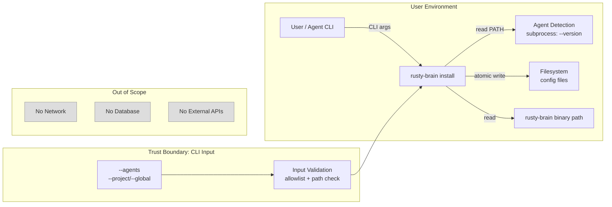
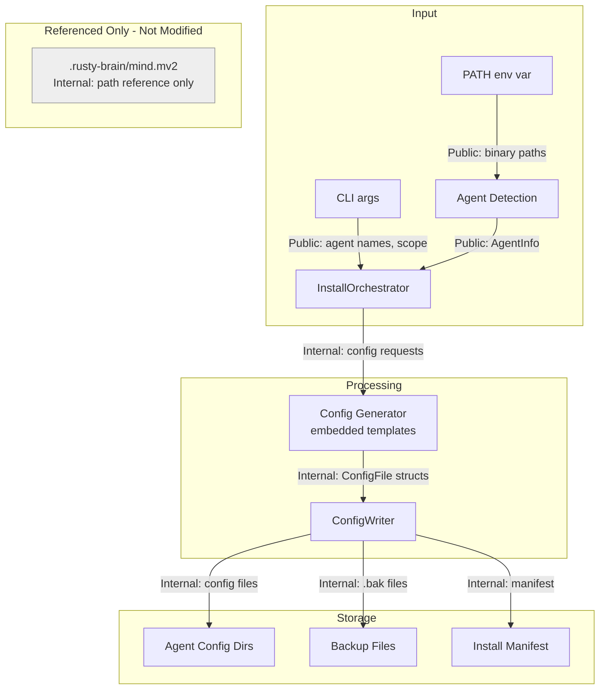
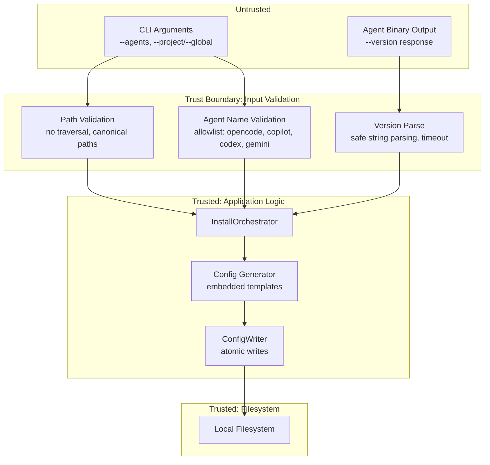

# 011-sec-agent-installs

> **Document Type:** Security Review (Lightweight)
> **Audience:** LLM agents, human reviewers
> **Status:** Draft
> **Last Updated:** 2026-03-05
> **Reviewer:** [name] <!-- @human-required -->
> **Risk Level:** Low <!-- @human-required -->

---

## Review Tier Legend

| Marker | Tier | Speckit Behavior |
|--------|------|------------------|
| `@human-required` | Human Generated | Prompt human to author; blocks until complete |
| `@human-review` | LLM + Human Review | LLM drafts; prompt human to confirm/edit; blocks until confirmed |
| `@llm-autonomous` | LLM Autonomous | LLM completes; no prompt; logged for audit |
| `@auto` | Auto-generated | System fills (timestamps, links); no prompt |

---

## Severity Definitions

| Level | Label | Definition |
|-------|-------|------------|
| **Critical** | Critical | Immediate exploitation risk; data breach or system compromise likely |
| **High** | High | Significant risk; exploitation possible with moderate effort |
| **Medium** | Medium | Notable risk; exploitation requires specific conditions |
| **Low** | Low | Minor risk; limited impact or unlikely exploitation |

---

## Linkage `@auto`

| Document | ID | Relationship |
|----------|-----|--------------|
| Parent PRD | 011-prd-agent-installs.md | Feature being reviewed |
| Architecture Review | 011-ar-agent-installs.md | Technical implementation |

---

## Purpose

This is a **lightweight security review** intended to catch obvious security concerns early in the product lifecycle. It is NOT a comprehensive threat model. Full threat modeling should occur during implementation when infrastructure-as-code and concrete implementations exist.

**This review answers three questions:**
1. What does this feature expose to attackers?
2. What data does it touch, and how sensitive is that data?
3. What's the impact if something goes wrong?

**Scope of this review:**
- Attack surface identification
- Data classification
- High-level CIA assessment
- ~~Detailed threat enumeration~~ (deferred to implementation)
- ~~Penetration testing~~ (deferred to implementation)
- ~~Compliance audit~~ (separate process)

---

## Feature Security Summary

### One-line Summary `@human-required`
> The `rusty-brain install` subcommand writes agent configuration files to local filesystem directories — it has no network exposure, handles no secrets, and operates with the user's existing filesystem permissions.

### Risk Assessment `@human-required`
> **Risk Level:** Low
> **Justification:** Fully offline CLI operation that writes non-sensitive configuration files to local disk; no network endpoints, no authentication, no secret handling, no user data processing.

---

## Attack Surface Analysis

### Exposure Points `@human-review`

| Exposure Type | Details | Authentication | Authorization | Notes |
|---------------|---------|----------------|---------------|-------|
| CLI argument input | `--agents`, `--project`, `--global` flags | -- | -- | Agent names validated against allowlist |
| Subprocess execution | Agent version detection via `<agent> --version` | -- | -- | Binary path from PATH; no user-supplied command strings |
| Filesystem writes | Config files written to agent directories | -- | OS filesystem permissions | Atomic writes via temp+rename |

### Attack Surface Diagram `@llm-autonomous`

### Exposure Checklist `@llm-autonomous`

- [x] **Internet-facing endpoints require authentication** — N/A (no internet-facing endpoints)
- [x] **No sensitive data in URL parameters** — N/A (CLI tool, no URLs)
- [x] **File uploads validated** — N/A (no file uploads)
- [x] **Rate limiting configured** — N/A (local CLI tool)
- [x] **CORS policy is restrictive** — N/A (no HTTP server)
- [x] **No debug/admin endpoints exposed** — N/A (no endpoints)
- [x] **Webhooks validate signatures** — N/A (no webhooks)

---

## Data Flow Analysis

### Data Inventory `@human-review`

| Data Element | PRD Entity | Classification | Source | Destination | Retention | Encrypted Rest | Encrypted Transit | Residency |
|--------------|------------|----------------|--------|-------------|-----------|----------------|-------------------|-----------|
| Agent binary path | AgentInfo.binary_path | Public | PATH env var | Config files | Permanent (in config) | No | N/A (local) | Local |
| Agent version string | AgentInfo.version | Public | Agent `--version` output | Install manifest | Permanent (in manifest) | No | N/A (local) | Local |
| Config file content | Agent Configuration | Internal | Templates (embedded) | Agent config directories | Until uninstall | No | N/A (local) | Local |
| Install manifest | Install Manifest | Internal | Generated at install | `.rusty-brain/` directory | Permanent | No | N/A (local) | Local |
| Memory store path | Shared Memory Store | Internal | Path resolution | Config files | Permanent (in config) | No | N/A (local) | Local |
| Backup files | -- | Internal | Existing config files | Same directory as `.bak` | Until user deletes | No | N/A (local) | Local |
| rusty-brain binary path | AgentConfig.binary_path | Public | System PATH / `which` | Config files | Permanent (in config) | No | N/A (local) | Local |

### Data Classification Reference `@llm-autonomous`

| Level | Label | Description | Examples | Handling Requirements |
|-------|-------|-------------|----------|----------------------|
| 1 | **Public** | No impact if disclosed | Marketing content, public docs | No special handling |
| 2 | **Internal** | Minor impact if disclosed | Internal configs, non-sensitive logs | Access controls, no public exposure |
| 3 | **Confidential** | Significant impact if disclosed | PII, user data, credentials | Encryption, audit logging, access controls |
| 4 | **Restricted** | Severe impact if disclosed | Payment data, health records, secrets | Encryption, strict access, compliance requirements |

### Data Flow Diagram `@llm-autonomous`

### Data Handling Checklist `@llm-autonomous`

- [x] **No Restricted data stored unless absolutely required** — No restricted data involved
- [x] **Confidential data encrypted at rest** — No confidential data involved
- [x] **All data encrypted in transit (TLS 1.2+)** — N/A (no network transit)
- [x] **PII has defined retention policy** — No PII collected
- [x] **Logs do not contain Confidential/Restricted data** — Logs contain only paths and agent names (Public/Internal)
- [x] **Secrets are not hardcoded** — No secrets involved
- [x] **Data minimization applied** — Only paths and version strings collected
- [x] **Data residency requirements documented** — All data is local filesystem

---

## Third-Party & Supply Chain `@human-review`

### New External Services

| Service | Purpose | Data Shared | Communication | Approved? |
|---------|---------|-------------|---------------|-----------|
| **None** | No external services | -- | -- | N/A |

### New Libraries/Dependencies

| Library | Version | License | Purpose | Security Check |
|---------|---------|---------|---------|----------------|
| **None new** | -- | -- | All dependencies already in workspace (clap, serde, tracing, tempfile) | N/A |

Note: `tempfile` is already a workspace dependency (currently dev-only). The AR proposes promoting it to a regular dependency for `ConfigWriter` atomic writes. This crate is well-established (>100M downloads), MIT/Apache licensed, and already trusted in the workspace.

### Supply Chain Checklist

- [x] **All new services use encrypted communication** — N/A (no external services)
- [x] **Service agreements/ToS reviewed** — N/A (no external services)
- [x] **Dependencies have acceptable licenses** — All MIT/Apache
- [x] **Dependencies are actively maintained** — All workspace deps are well-maintained
- [x] **No known critical vulnerabilities** — No new dependencies

---

## CIA Impact Assessment

### Confidentiality `@human-review`

> **What could be disclosed?**

| Asset at Risk | Classification | Exposure Scenario | Impact | Likelihood |
|---------------|----------------|-------------------|--------|------------|
| Agent config file paths | Internal | Config files readable by other local users if permissions too permissive | Low | Low |
| rusty-brain binary path | Public | Embedded in config files | None | N/A |
| Memory store path | Internal | Path (not contents) visible in config files | Low | Low |

**Confidentiality Risk Level:** Low

No confidential or restricted data is handled. Config files contain only paths and command definitions. The memory store (`.mv2` file) is not read, written, or modified by the install command — only its path is referenced.

### Integrity `@human-review`

> **What could be modified or corrupted?**

| Asset at Risk | Modification Scenario | Impact | Likelihood |
|---------------|----------------------|--------|------------|
| Agent config files | Path traversal in internally-resolved config paths writes to unintended location | Medium | Low |
| Agent config files | Malicious binary path injected into config template | Medium | Low |
| Existing config files | Overwritten without backup due to bug in ConfigWriter | Medium | Low |
| .bak backup files | Backup overwritten on repeated `--reconfigure` runs | Low | Medium |

**Integrity Risk Level:** Medium

The primary integrity concern is **path traversal in config paths**: although config directories are now resolved internally (no user-supplied `--config-dir`), the resolved paths are still validated against `..` traversal sequences (SEC-4). Risk is lower than originally assessed since paths are not user-supplied.

A secondary concern is that config files reference the rusty-brain binary path. If an attacker could influence path resolution (e.g., placing a malicious binary earlier on PATH), the config would point to the wrong binary. This is standard PATH-based risk, not specific to this feature.

### Availability `@human-review`

> **What could be disrupted?**

| Service/Function | Disruption Scenario | Impact | Likelihood |
|------------------|---------------------|--------|------------|
| Install command | Agent `--version` subprocess hangs indefinitely | Low | Low |
| Install command | Disk full during atomic write (temp file created, rename fails) | Low | Low |
| Existing agent config | Config corrupted if atomic write partially fails (mitigated by temp+rename) | Medium | Very Low |

**Availability Risk Level:** Low

The install command is a one-time operation, not a service. Disruption to the install command itself has low impact — the user retries. The atomic write pattern (temp file + rename) prevents partial config corruption.

### CIA Summary `@llm-autonomous`

| Dimension | Risk Level | Primary Concern | Mitigation Priority |
|-----------|------------|-----------------|---------------------|
| **Confidentiality** | Low | Config files contain only paths (Public/Internal data) | Low |
| **Integrity** | Medium | Path traversal in config paths; binary path injection | Medium |
| **Availability** | Low | Subprocess timeout; disk-full during write | Low |

**Overall CIA Risk:** Low — *Offline CLI tool writing non-sensitive config files to local disk with no network exposure. Config directories are resolved internally (not user-supplied), further reducing path traversal risk.*

---

## Trust Boundaries `@human-review`

**Trust boundaries identified:**

1. **CLI argument input -> application logic**: Agent names must be validated against an allowlist. Config directories are resolved internally per scope (project root or platform-standard global dir).
2. **Agent subprocess output -> application logic**: Output from `<agent> --version` is untrusted text parsed for version info. Must handle malformed output gracefully without injection risk.

### Trust Boundary Checklist `@llm-autonomous`

- [x] **All input from untrusted sources is validated** — `--agents` validated against allowlist; config paths resolved internally and validated for traversal
- [x] **External API responses are validated** — N/A (no external APIs); subprocess output parsed defensively
- [x] **Authorization checked at data access, not just entry point** — N/A (local filesystem, user's own permissions)
- [x] **Service-to-service calls are authenticated** — N/A (no service calls)

---

## Known Risks & Mitigations `@human-review`

| ID | Risk Description | Severity | Mitigation | Status | Owner |
|----|------------------|----------|------------|--------|-------|
| R1 | Path traversal in resolved config paths could write files outside expected directories | Low | Config dirs are resolved internally (not user-supplied); `validate_config_path()` rejects `..` components | Mitigated | Implementer |
| R2 | Agent binary on PATH could be a malicious impersonator | Low | Verify binary identity via `--version` output pattern matching; warn if unrecognizable. Standard PATH risk, not unique to this feature | Open | Implementer |
| R3 | Config files written with overly permissive permissions (e.g., world-writable) | Low | Write files with user-only permissions (0o644 on Unix); inherit directory permissions | Open | Implementer |
| R4 | `.bak` backup chain lost on repeated `--reconfigure` (only most recent backup kept) | Low | Document that only one `.bak` is kept per config file. Not a security issue per se, but data loss risk | Open | Implementer |
| R5 | Subprocess execution (`agent --version`) could be abused if agent name is user-controlled | Low | Agent names come from hardcoded allowlist (opencode, copilot, codex, gemini), never from user input directly. Binary lookup uses safe PATH resolution, not shell execution | Mitigated | -- |

### Risk Acceptance `@human-required`

| Risk ID | Accepted By | Date | Justification | Review Date |
|---------|-------------|------|---------------|-------------|
| R4 | [name] | YYYY-MM-DD | Single `.bak` is sufficient for config recovery; users can use git for history | YYYY-MM-DD |

---

## Security Requirements `@human-review`

Based on this review, the implementation MUST satisfy:

### Authentication & Authorization

| Req ID | Requirement | PRD AC | Verification Method |
|--------|-------------|--------|---------------------|
| -- | N/A — no authentication or authorization required (local CLI tool) | -- | -- |

### Data Protection

| Req ID | Requirement | PRD AC | Verification Method |
|--------|-------------|--------|---------------------|
| SEC-1 | Config files shall be written with owner read/write and group/other read-only permissions (0o644 on Unix, default ACL on Windows). Note: 0o644 is used instead of 0o600 because agent processes need read access to the config files. | AC-1, AC-2, AC-3, AC-4 | Unit test: verify file permissions after write |
| SEC-2 | Memory contents shall never be logged at any level during install operations | -- | Code review: grep for memory content access in install modules |
| SEC-3 | Install manifest shall not contain any data from the memory store (only paths) | AC-8 | Unit test: verify manifest content |

### Input Validation

| Req ID | Requirement | PRD AC | Verification Method |
|--------|-------------|--------|---------------------|
| SEC-4 | Config paths shall be validated to reject paths containing `..` traversal sequences. Note: `--config-dir` was deferred (S-4); paths are resolved internally, reducing traversal risk | AC-1 | Unit test: test with `../../etc/passwd` path components |
| SEC-5 | `--agents` values shall be validated against a hardcoded allowlist (`opencode`, `copilot`, `codex`, `gemini`) | AC-6, AC-10 | Unit test: reject unknown agent names |
| SEC-6 | Agent `--version` subprocess shall have a 2-second timeout to prevent hanging | -- | Unit test: mock slow subprocess |
| SEC-7 | Agent detection shall use `std::process::Command::new()` with explicit binary name, never shell execution (no `sh -c` or `cmd /c`) | -- | Code review: verify no shell invocations |

### Operational Security

| Req ID | Requirement | PRD AC | Verification Method |
|--------|-------------|--------|---------------------|
| SEC-8 | Existing config files shall be backed up to `.bak` before overwriting | AC-9, AC-15 | Integration test: verify `.bak` creation |
| SEC-9 | Config file writes shall be atomic (write to temp file, then rename) to prevent partial/corrupt configs | AC-1 | Integration test: simulate crash during write |
| SEC-10 | Error messages shall not reveal internal filesystem structure beyond the relevant config path | AC-11 | Unit test: verify error message content |

---

## Compliance Considerations `@human-review`

| Regulation | Applicable? | Relevant Requirements | N/A Justification |
|------------|-------------|----------------------|-------------------|
| GDPR | N/A | -- | No personal data collected, processed, or stored. Config files contain only file paths and command definitions |
| CCPA | N/A | -- | No consumer personal information involved |
| SOC 2 | N/A | -- | Local CLI tool with no cloud services, no customer data, no multi-tenant concerns |
| HIPAA | N/A | -- | No protected health information involved |
| PCI-DSS | N/A | -- | No payment data involved |
| Other | N/A | -- | No regulatory implications identified |

---

## Review Findings

### Issues Identified `@human-review`

| ID | Finding | Severity | Category | Recommendation | Status |
|----|---------|----------|----------|----------------|--------|
| F1 | *(Resolved)* `--config-dir` was removed (S-4 deferred). Config paths are resolved internally and validated via `validate_config_path()` | Low | Input Validation | Path validation implemented (SEC-4) | Mitigated |
| F2 | No specification for config file permissions after write | Low | Data Protection | Explicitly set file permissions in ConfigWriter (SEC-1) | Open |
| F3 | Agent subprocess timeout not specified in AR interface | Low | Availability | Add 2-second timeout to agent detection subprocess (SEC-6) | Open |

### Positive Observations `@llm-autonomous`

- No network exposure eliminates entire classes of attacks (MITM, injection via API, DDoS)
- No secrets or credentials handled — config files contain only paths and command definitions
- Atomic write pattern (temp + rename) prevents partial config corruption
- Agent name allowlist prevents arbitrary subprocess execution
- Existing memory store (`.mv2`) is never read or modified during install — only referenced by path
- JSON output mode for agents avoids rich-text injection concerns

---

## Open Questions `@human-review`

- [x] **Q1:** *(Resolved)* `--config-dir` was deferred (S-4). Config directories are resolved internally per scope, eliminating user-supplied path traversal risk. `validate_config_path()` rejects `..` components as defense-in-depth.
- [ ] **Q2:** Should `.bak` files be created with more restrictive permissions than the original (e.g., read-only) to prevent accidental modification?

---

## Changelog `@auto`

| Version | Date | Author | Changes |
|---------|------|--------|---------|
| 0.1 | 2026-03-05 | Claude | Initial review |

---

## Review Sign-off `@human-required`

| Role | Name | Date | Decision |
|------|------|------|----------|
| Security Reviewer | [name] | YYYY-MM-DD | [Approved / Approved with conditions / Rejected] |
| Feature Owner | [name] | YYYY-MM-DD | [Acknowledged] |

### Conditions for Approval (if applicable) `@human-required`

- [ ] SEC-4 (path traversal validation) must be implemented before merge
- [ ] SEC-7 (no shell execution for subprocesses) must be verified in code review

---

## Security Requirements Traceability `@llm-autonomous`

| SEC Req ID | PRD Req ID | PRD AC ID | Test Type | Test Location |
|------------|------------|-----------|-----------|---------------|
| SEC-1 | M-5 | AC-1, AC-2, AC-3, AC-4 | Unit | tests/installer/writer_permissions_test.rs |
| SEC-2 | -- | -- | Code Review | Manual review of install modules |
| SEC-3 | M-7 | AC-8 | Unit | tests/installer/manifest_test.rs |
| SEC-4 | S-4 | -- | Unit | tests/installer/path_validation_test.rs |
| SEC-5 | M-4 | AC-6 | Unit | tests/cli/install_args_test.rs |
| SEC-6 | M-9 | AC-10 | Unit | tests/installer/detection_timeout_test.rs |
| SEC-7 | M-9 | -- | Code Review | Manual review of detection module |
| SEC-8 | S-1 | AC-9, AC-15 | Integration | tests/installer/backup_test.rs |
| SEC-9 | M-8 | AC-1 | Integration | tests/installer/atomic_write_test.rs |
| SEC-10 | M-10 | AC-11 | Unit | tests/installer/error_messages_test.rs |

---

## Review Checklist `@llm-autonomous`

Before marking as Approved:
- [x] Attack surface documented with auth/authz status for each exposure
- [x] Exposure Points table has no contradictory rows
- [x] All PRD Data Model entities appear in Data Inventory (Install Manifest, Agent Configuration, Agent Platform, Shared Memory Store)
- [x] All data elements are classified using the 4-tier model
- [x] Third-party dependencies and services are listed (none new)
- [x] CIA impact is assessed with Low/Medium/High ratings
- [x] Trust boundaries are identified
- [x] Security requirements have verification methods specified
- [x] Security requirements trace to PRD ACs where applicable
- [x] No Critical/High findings remain Open (all findings are Medium or Low)
- [x] Compliance N/A items have justification
- [ ] Risk acceptance has named approver and review date (pending human)
